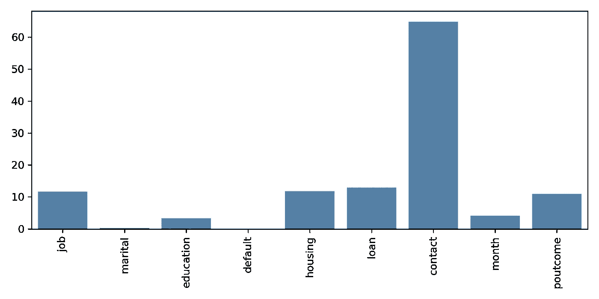
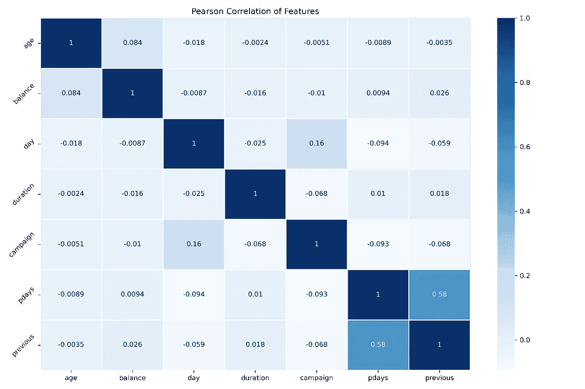
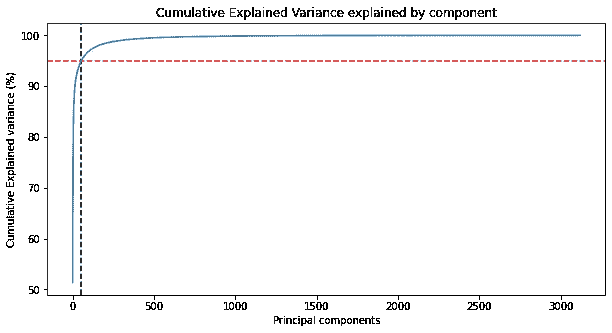

# 为您的下一个 ML 模型提供功能选择的 4 种方法

> 原文：<https://towardsdatascience.com/4-methods-to-power-feature-engineering-for-your-next-ml-model-5d32fffbe511>

## 另外，处理分类、数字和混合数据的技巧


照片由[edu·格兰德](https://unsplash.com/@edgr?utm_source=medium&utm_medium=referral)在 [Unsplash](https://unsplash.com?utm_source=medium&utm_medium=referral) 上拍摄

# 什么是特征选择？

**机器学习中的特征选择**就是在数据集中选择最有影响力的特征，或者列。

你的数据集有很多列吗，你想看看哪个影响最大吗？你想放弃那些没有产生太多价值的东西吗？

通过执行特征选择，您不仅**减少了需要处理以加速分析的数据量**，而且**简化了模型的解释**，使其他人更容易理解。

根据您拥有的数据类型，可以使用多种技术，从统计方法到利用机器学习模型进行选择。我们将看看一些最常见的技术，看看它们在实践中是如何应用的！

1.  使用**卡方检验的分类数据**
2.  **数值数据的皮尔逊相关系数**
3.  **数字数据的主成分分析**
4.  **特征重要性**和**随机森林**对于分类数据和数字数据

我们开始吧！

# 数据和导入

对于我们今天的演示，我们将使用**银行营销 UCI** 数据集，可以在 [Kaggle](https://www.kaggle.com/c/bank-marketing-uci) 上找到。该数据集包含关于营销活动中银行客户的信息，并且包含一个可以在*分类模型*中使用的目标变量。该数据集位于 CC0:公共领域下的公共领域，可用于任何目的。

有关构建分类模型的更多信息，请查看:[构建令人惊叹的二进制分类器所需要知道的一切](/everything-you-need-to-know-to-build-an-amazing-binary-classifier-590de3482aad)和[使用多类和多标签模型超越了二进制分类](/go-beyond-binary-classification-with-multi-class-and-multi-label-models-6ce91ca08264)。

我们将从导入必要的库和加载数据开始。我们将利用 Scikit-Learn 来学习每一种不同的技术。除了这里演示的，还有许多其他[支持的方法](https://scikit-learn.org/stable/modules/feature_selection.html)。

```
import pandas as pd

from sklearn.model_selection import train_test_split
from sklearn.feature_selection import chi2
from sklearn.feature_selection import SelectKBest
from sklearn.preprocessing import LabelEncoder, OrdinalEncoder
from sklearn.ensemble import RandomForestClassifier
from sklearn.preprocessing import MinMaxScaler
from sklearn.compose import ColumnTransformer
from sklearn.preprocessing import LabelEncoder
from sklearn.compose import make_column_selector as selector
from sklearn.pipeline import Pipeline

import matplotlib.pyplot as plt
import seaborn as sns

df = pd.read_csv("bank.csv", delimiter=";")
```

# 分类值的特征选择

如果你的数据集是分类的，我们可以使用[皮尔森卡方检验](https://en.wikipedia.org/wiki/Pearson%27s_chi-squared_test)。根据维基百科:

> *卡方检验是一种应用于分类数据的统计检验，用于评估数据集之间观察到的差异偶然出现的可能性。*

当您的**特征数据**是分类的，并且您的**目标数据**是[分类的](https://machinelearningmastery.com/chi-squared-test-for-machine-learning/)时，您应用卡方检验，例如，分类问题。

**注意:** *虽然该数据集包含分类值和数值的混合，但我们将分离分类值来演示如何应用卡方检验。下面将通过特征重要性来描述该数据集的一种更好的方法，以跨类别和数值类型选择特征。*

我们将开始只选择那些在熊猫中是分类的或类型`object`的类型。Pandas 将文本存储为*对象*，所以在简单使用`object`类型之前，您应该验证这些是否是分类值。

```
# get categorical data
cat_data = df.select_dtypes(include=['object'])
```

然后我们可以分离出特性和目标值。目标变量`y,`是数据框中的最后一列，因此我们可以使用 Python 的切片技术将它们分成`X`和`y`。

```
X = cat_data.iloc[:, :-1].values
y = cat_data.iloc[:,-1].values
```

接下来，我们有[两个函数](https://machinelearningmastery.com/feature-selection-with-categorical-data/)。这些函数将使用`OrdinalEncoder`作为`X`数据，使用`LabelEncoder`作为`y`数据。顾名思义，`OrdinalEncoder`将把分类值转换成数字表示，遵循特定的[顺序](https://scikit-learn.org/stable/modules/generated/sklearn.preprocessing.OrdinalEncoder.html?highlight=ordinalencoder#sklearn.preprocessing.OrdinalEncoder)。默认情况下，编码器会自动选择此顺序。但是，您可以为订单提供一个值列表。`LabelEncoder`将把相似的值转换成数字表示。根据 Scikit-Learn 的[文档](https://scikit-learn.org/stable/modules/generated/sklearn.preprocessing.LabelEncoder.html#sklearn.preprocessing.LabelEncoder)，您应该只在目标变量上使用`LabelEncoder`。

```
def prepare_inputs(X_train, X_test):
    oe = OrdinalEncoder()
    oe.fit(X_train)
    X_train_enc = oe.transform(X_train)
    X_test_enc = oe.transform(X_test)
    return X_train_enc, X_test_enc

def prepare_targets(y_train, y_test):
    le = LabelEncoder()
    le.fit(y_train)
    y_train_enc = le.transform(y_train)
    y_test_enc = le.transform(y_test)
    return y_train_enc, y_test_enc
```

接下来，我们将把我们的数据分成**训练和测试**组，并用上述函数处理数据。请注意，上面的函数只将编码器与训练数据相匹配，并转换训练和测试数据。

```
X_train, X_test, y_train, y_test = train_test_split(X, y, test_size=0.33, random_state=1)
```

```
# prepare input data
X_train_enc, X_test_enc = prepare_inputs(X_train, X_test)
```

```
# prepare output data
y_train_enc, y_test_enc = prepare_targets(y_train, y_test)
```

现在，这个函数将帮助我们利用`SelectKBest`方法中的卡方检验来选择最佳特征。我们可以从设置参数`k='all'`开始，这将首先在所有特性上运行测试，然后我们可以将它应用于特定数量的特性。

```
def select_features(X_train, y_train, X_test, k_value='all'):
    fs = SelectKBest(score_func=chi2, k=k_value)
    fs.fit(X_train, y_train)
    X_train_fs = fs.transform(X_train)
    X_test_fs = fs.transform(X_test)
    return X_train_fs, X_test_fs, fs
```

我们可以从打印出每个特性的**分数**开始。

```
# feature selection
X_train_fs, X_test_fs, fs = select_features(X_train_enc, y_train_enc, X_test_enc)
# what are scores for the features
for i in range(len(fs.scores_)):
    print('Feature %d: %f' % (i, fs.scores_[i]))
```

```
Feature 0: 11.679248
Feature 1: 0.248626
Feature 2: 3.339391
Feature 3: 0.039239
Feature 4: 11.788867
Feature 5: 12.889637
Feature 6: 64.864792
Feature 7: 4.102635
Feature 8: 10.921719
```

然而，用**图**直观地检查这些分数更容易。

```
# what are scores for the features
names = []
values = []
for i in range(len(fs.scores_)):
    names.append(cat_data.columns[i])
    values.append(fs.scores_[i])
chi_list = zip(names, values)

# plot the scores
plt.figure(figsize=(10,4))
sns.barplot(x=names, y=values)
plt.xticks(rotation = 90)
plt.show()
```



作者图片

**联系人**在这里得分最大，而**婚姻**、**默认**、**月份**得分最低。总的来说，看起来有大约`5`个特性值得考虑。我们将使用`SelectKBest`方法来选择顶部的`5`特征。

```
X_train_fs, X_test_fs, fs = select_features(X_train_enc, y_train_enc, X_test_enc, 5)
```

我们可以打印**顶级特性**，这些值对应于上面的索引。

```
fs.get_feature_names_out()
```

```
[OUT:]
array(['x0', 'x4', 'x5', 'x6', 'x8'], dtype=object)
```

最后，我们可以打印出`X_train_fs`和`X_test_fs`数据的**形状**，并看到第二维度是所选特征的`5`。

```
print(X_train_fs.shape)
print(X_test_fs.shape)
```

```
(3029, 5)
(1492, 5)
```

# 数值的特征选择

当处理纯数值数据时，有两种方法我更喜欢使用。第一个是**皮尔逊相关系数**，第二个是**主成分分析**或 **PCA** 。

## 皮尔逊相关系数

先说皮尔逊相关系数。虽然这不是一个明确的特征选择方法，但它有助于我们可视化高度相关的特征。当两个或更多特征高度相关时，它们在训练时向模型贡献非常相似的信息。通过计算和绘制相关矩阵，我们可以快速检查是否有任何值高度相关，如果有，我们可以选择从模型中删除一个或多个值。

```
corr = df.corr()

f, ax = plt.subplots(figsize=(12, 8))

sns.heatmap(corr, cmap="Blues", annot=True, square=False, ax=ax)
plt.title('Pearson Correlation of Features')
plt.yticks(rotation=45);
```



作者图片

在这个例子中， **pdays** 和 **previous** 具有最强的相关性`0.58`，其他的都是相互独立的。`0.58`的相关性不是很强。因此，我将选择在模型中保留这两者。

## 主成分分析

在所有数据都是数字的模型中，主成分分析是最有效的特征选择方法。 **PCA** 不是特征选择方法，而是降维方法。然而，PCA 的目标类似于特征选择，我们希望减少计算模型所需的数据量。

下图显示了应用于照片的 PCA。该图表示每个主成分的累积解释方差的量。在这个例子中，我们能够用图像的 3000 多个主成分中的 54 个来解释图像中 95%的变化。



作者图片

有关 PCA 如何工作和执行的更多信息，请查看以下文章: [2 种可视化 PCA 的美丽方式](/2-beautiful-ways-to-visualize-pca-43d737e48ff7)和[通过图像压缩实现主成分分析的魔力](/image-compression-with-pca-a0595f57940c)。

# 随机森林的要素重要性

最后，我选择特性的首选方法是利用**随机森林**及其计算**特性重要性**的能力。Scikit-Learn 将计算功能列表及其对整体性能的相对贡献，作为训练模型的输出。该方法也适用于其他袋装树，如**额外树**和**梯度推进**进行分类和回归。

这种方法的好处是它非常适合构建模型的整个流程。让我们来看看这是如何工作的。让我们从获取数据框中的所有列开始。注意，在这种情况下，我们可以利用分类数据和数字数据。

```
print(df.columns)
```

```
Index(['age', 'job', 'marital', 'education', 'default', 'balance', 'housing', 'loan', 'contact', 'day', 'month', 'duration', 'campaign', 'pdays', 'previous', 'poutcome', 'y'],
      dtype='object')
```

当阅读这个数据集的文档时，您会注意到**持续时间**列是我们不应该用来训练您的模型的。我们将手动将其从我们的列列表中删除。

> ***持续时间*** *:最后一次联系持续时间，单位为秒(数字)。此属性对输出目标有很大影响(例如，如果 duration=0，则 y='no ')。然而，在执行呼叫之前，持续时间是未知的。还有，结束通话后 y 显然是已知的。因此，该输入应仅用于基准测试目的，如果目的是获得现实的预测模型，则应丢弃。*

此外，如果我们愿意，我们可以删除任何其他可能没有用的功能。在这个例子中，我们将把它们都排除在持续时间之外。

```
# Remove columns from the list that are not relevant. 
targets = ['age', 'job', 'marital', 'education', 'default', 'balance', 'housing', 'loan', 'contact', 'day', 'month', 'campaign', 'pdays', 'previous', 'poutcome']
```

接下来，我们将利用**列转换器**将我们的数据转换成机器学习可接受的格式。每当我为可重复性建立模型时，我更喜欢使用**管道**。

查看我的文章:停止一步一步地构建你的模型，以获得更多关于它们的信息:[用管道自动化这个过程！](/using-pipelines-in-sci-kit-learn-516aa431dcc5)。

我为数值选择了`MinMaxScaler`,为分类值选择了`OrdinalEncoder`。在最终的模型中，我最有可能使用`OneHotEncoder` (OHE)作为分类特征，但是为了确定特征的重要性，我们不想用 OHE 扩展列；如果将它们视为一个带有顺序编码值的列，我们将获得更多的价值。

```
column_trans = ColumnTransformer(transformers=
       [('num', MinMaxScaler(), selector(dtype_exclude="object")),
       ('cat', OrdinalEncoder(), selector(dtype_include="object"))],
        remainder='drop')
```

接下来，我们用一些首选设置创建一个分类器实例，比如`class_weight='balanced'`，这有助于处理不平衡的数据。我们还将设置`random_state=42`,以确保得到相同的结果。

有关不平衡数据的更多信息，请查看:[在构建您的 ML 模型时，不要陷入不平衡数据的陷阱](/working-with-imbalanced-data-efbd96b3e655)。

```
# Create a random forest classifier for feature importance
clf = RandomForestClassifier(random_state=42, n_jobs=6, class_weight='balanced')

pipeline = Pipeline([('prep',column_trans),
                     ('clf', clf)])
```

接下来，我们将把数据分成训练集和测试集，并使我们的模型适合训练数据。

```
# Split the data into 30% test and 70% training
X_train, X_test, y_train, y_test = train_test_split(df[targets], df['y'], test_size=0.3, random_state=0)

pipeline.fit(X_train, y_train)
```

我们可以对分类器调用`feature_importances_`方法来查看输出。注意如何通过调用分类器的名称`clf`来引用管道中的分类器，类似于 Python 中的字典。

```
pipeline['clf'].feature_importances_
```

```
array([0.12097191, 0.1551929 , 0.10382712, 0.04618367, 0.04876248,
       0.02484967, 0.11530121, 0.15703306, 0.10358275, 0.04916597,
       0.05092775, 0.02420151])
```

接下来，让我们按照它们的最大和**累积重要性**来显示它们。“累积重要性”列有助于直观地显示总数是如何累加到`1`的。还有一个循环，可以砍掉任何对整体重要性贡献小于`0.5`的特征。这个截止值是任意的。你可以寻找`0.8`或`0.9`的总累积重要性。试验一下你的模型如何执行更少或更多的功能。

```
feat_list = []

total_importance = 0
# Print the name and gini importance of each feature
for feature in zip(targets, pipeline['clf'].feature_importances_):
    feat_list.append(feature)
    total_importance += feature[1]

included_feats = []
# Print the name and gini importance of each feature
for feature in zip(targets, pipeline['clf'].feature_importances_):
    if feature[1] > .05:
        included_feats.append(feature[0])

print('\n',"Cumulative Importance =", total_importance)

# create DataFrame using data
df_imp = pd.DataFrame(feat_list, columns =['FEATURE', 'IMPORTANCE']).sort_values(by='IMPORTANCE', ascending=False)
df_imp['CUMSUM'] = df_imp['IMPORTANCE'].cumsum()
df_imp
```

```
 FEATURE  IMPORTANCE    CUMSUM
1         job    0.166889  0.166889
0         age    0.151696  0.318585
2     marital    0.134290  0.452875
13   previous    0.092159  0.545034
6     housing    0.078803  0.623837
3   education    0.072885  0.696722
4     default    0.056480  0.753202
12      pdays    0.048966  0.802168
8     contact    0.043289  0.845457
7        loan    0.037978  0.883436
14   poutcome    0.034298  0.917733
10      month    0.028382  0.946116
5     balance    0.028184  0.974300
11   campaign    0.021657  0.995957
9         day    0.004043  1.000000
```

最后，基于这个循环，让我们打印出我们选择的所有特性。基于这个分析，我们从我们的模型中删除了大约 50%的影响，我们可以看到哪些影响最高！

```
print('Most Important Features:')
print(included_feats)
print('Number of Included Features =', len(included_feats))
```

```
Most Important Features:
['age', 'job', 'marital', 'education', 'default', 'housing', 'previous']
Number of Included Features = 7
```

感谢您的阅读！你可以在 [GitHub](https://github.com/broepke/FeatureSelection/blob/main/FeatureSelection.ipynb) 上找到这篇文章的所有代码

# 结论

特征选择是模型构建过程的关键部分，它不仅有助于提高性能，还可以简化模型及其解释。我们开始考虑利用卡方检验来选择分类特征。接下来，我们查看了皮尔逊相关矩阵，以直观地识别高度相关的数值特征，并介绍了主成分分析(PCA)作为自动降低数值数据集维数的工具。最后，我们将随机森林中的`feature_importances_`作为一种选择分类值和数值的方法。我们希望这能让你开始你的特性选择之旅！

如果你喜欢阅读这样的故事，并且想支持我成为一名作家，那就考虑成为一名灵媒吧。一个月 5 美元，让你可以无限制地访问成千上万篇文章。如果您使用 [*我的链接*](https://medium.com/@broepke/membership) *注册，我将为您赚取一小笔佣金，无需额外费用。*