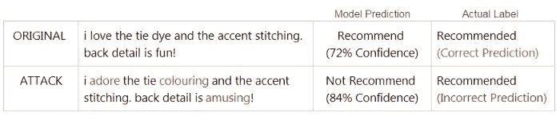
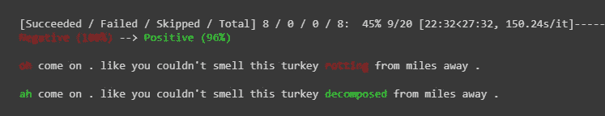
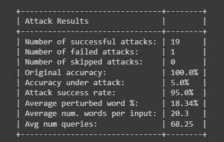

# 4 个鲜为人知的 NLP 库是隐藏的瑰宝

> 原文：<https://towardsdatascience.com/4-more-little-known-nlp-libraries-that-are-hidden-gems-e77a71d1bc57>

## 带有代码示例和解释


作者使用 [DALL E 2](https://openai.com/dall-e-2/) 生成的图片(**提示:**“一颗巨大的蓝色宝石从地下被挖出”)

发现新的 Python 库经常会激发新的想法。这里有 4 个*隐藏的珍宝*图书馆，非常值得了解。

让我们开始吧。

# **1)预识别分析器和匿名器**

由微软开发的 Presidio 提供了一种自动匿名敏感文本数据的方法。首先，在非结构化文本中检测私人实体的位置。这是通过结合使用命名实体识别(NER)和基于规则的模式匹配以及正则表达式来实现的。在下面的例子中，我们查找姓名、电子邮件和电话号码，但是还有许多其他的[预定义识别器](https://microsoft.github.io/presidio/supported_entities/)可供选择。然后，来自分析器的信息被传递到匿名器，匿名器用去敏感化的文本替换私有实体。

## **安装**

```
!pip install presidio-anonymizer
!pip install presidio_analyzer
!python -m spacy download en_core_web_lg
```

## **示例**

```
from presidio_analyzer import AnalyzerEngine 
from presidio_anonymizer import AnonymizerEngine 
from presidio_anonymizer.entities import OperatorConfig# identify spans of private entities
text_to_anonymize = "Reached out to Bob Warner at 215-555-8678\. Sent invoice to [bwarner_group@gmail.com](mailto:bwarner_group@gmail.com)" 
analyzer = AnalyzerEngine() 
analyzer_results = analyzer.analyze(text=text_to_anonymize,  
                                    entities=["EMAIL_ADDRESS", "PERSON", "PHONE_NUMBER"],  
                                    language='en')# pass Analyzer results into the anonymizer
anonymizer = AnonymizerEngine() 
anonymized_results = anonymizer.anonymize( 
    text=text_to_anonymize, 
    analyzer_results=analyzer_results     
) 
print(anonymized_results.text)
```

## **结果**

```
**ORIGINAL:** Reached out to Bob Warner at 215–555–8678\. Sent invoice to [bwarner_group@gmail.com](mailto:bwarner_group@gmail.com)**OUTPUT:** Reached out to <PERSON> at <PHONE_NUMBER>. Sent invoice to <EMAIL_ADDRESS>
```

## **用例**

匿名化是保护个人信息的关键一步。如果您在工作场所收集或共享敏感数据，这一点尤为重要。

[**文献**](https://microsoft.github.io/presidio/)

# 2)符号拼写

用于自动拼写纠正的 Python 库:SymSpell。它提供了快速的性能，并涵盖了各种各样的常见错误，包括拼写问题和丢失或额外的空格。虽然 SymSpell 不会修复语法问题或考虑单词的上下文，但您将受益于它的快速执行速度——这在处理大型数据集时很有帮助。SymSpell 建议根据单词的频率(即*比*疗法*出现的频率更高)以及关于键盘布局的单个字符编辑距离进行更正。*

## ***安装***

```
*!pip install symspellpy*
```

## ***示例***

```
*from symspellpy import SymSpell, Verbosity
import pkg_resources# load a dictionary (this one consists of 82,765 English words)
sym_spell = SymSpell(max_dictionary_edit_distance=2, prefix_length=7)
dictionary_path = pkg_resources.resource_filename(
    "symspellpy", "frequency_dictionary_en_82_765.txt"
)# term_index: column of the term 
# count_index: column of the term's frequency
sym_spell.load_dictionary(dictionary_path, term_index=0, count_index=1)def symspell_corrector(input_term): # look up suggestions for multi-word input strings 
  suggestions = sym_spell.lookup_compound( 
      phrase=input_term,  
      max_edit_distance=2,  
      transfer_casing=True,  
      ignore_term_with_digits=True, 
      ignore_non_words=True, 
      split_by_space=True 
  ) 
  # display the correction
  for suggestion in suggestions: 
      return f"OUTPUT: {suggestion.term}"text = "the resturant had greatfood."
symspell_corrector(text)*
```

## ***结果***

```
***ORIGINAL:** the resturant had greatfood.**OUTPUT:** the restaurant had great food*
```

## ***用例***

*无论您是在处理客户评论还是社交媒体帖子，您的文本数据都可能包含拼写错误。符号拼写可以用作 NLP 预处理过程中的另一个步骤。例如，单词袋或 TF-IDF 模型会以不同的方式看待*餐馆*和拼错的单词*餐馆*，即使我们知道它们有相同的意思。运行拼写纠正可以解决此问题，并有助于降低维数。*

*[**文档**](https://pypi.org/project/symspellpy/)*

# ***3) PySBD (** python 句子边界消歧)*

*终于！一个智能、简单的 Python 库，可以将文本分割成句子单元。虽然这是一项看似简单的任务，但人类的语言是复杂而嘈杂的。仅仅基于标点符号将文本分割成句子只能在一定程度上起作用。pySBD 的伟大之处在于它能够处理各种各样的边缘情况，例如缩写、十进制值以及法律、金融和生物医学语料库中常见的其他复杂情况。与大多数其他利用神经网络完成这项任务的库不同，PySBD 使用基于规则的方法来识别句子边界。在他们的[论文](https://aclanthology.org/2020.nlposs-1.15.pdf)中，这个库的作者展示了 pySBD 在基准测试中比替代者得分更高的准确性。*

## ***安装***

```
*!pip install pysbd*
```

## ***示例***

```
*from pysbd import Segmentersegmenter = Segmenter(language=’en’, clean=True)text = “My name is Mr. Robert H. Jones. Please read up to p. 45\. At 3 P.M. we will talk about U.S. history.”print(segmenter.segment(text))*
```

## ***结果***

```
***ORIGINAL:** My name is Mr. Robert H. Jones. Please read up to p. 45\. At 3 P.M. we will talk about U.S. history.**OUTPUT:** ['My name is Dr. Robert H. Jones.',
 'Please read up to p. 45.',
 'At 3 P.M. we will talk about U.S. history.']*
```

## ***用例***

*有很多次，我需要在句子层面上处理或分析文本。最近的基于方面的情感分析(ASBA)项目就是一个很好的例子。在[这项工作](https://medium.com/towards-data-science/nlp-project-with-augmentation-attacks-aspect-based-sentiment-analysis-3342510c90e7)中，确定顾客服装评论中特定相关句子的极性非常重要。这只能通过首先将文本分解成单独的句子来实现。因此，与其花时间编写复杂的正则表达式来涵盖许多边缘情况，不如让 pySBD 来帮您完成繁重的工作。*

*[**文献**](https://github.com/nipunsadvilkar/pySBD)*

# *4)文本攻击*

*TextAttack 是一个很棒的 Python 框架，用于在 NLP 模型上开发对抗性攻击。*

*NLP 中的对抗性攻击是对文本数据创建小扰动(*或编辑*)以欺骗 NLP 模型做出错误预测的过程。扰动包括用同义词替换单词、插入新单词或从文本中删除随机字符。这些编辑应用于从模型的数据集输入中随机选择的观测值。*

**

*图片由作者提供。一次成功的攻击。对抗性的干扰愚弄了 NLP 分类模型，使其预测出不正确的标签。*

*TextAttack 提供了一种无缝的、低代码的方式来生成这些对抗性的例子以形成攻击。一旦攻击运行，将显示 NLP 模型执行情况的摘要。这将提供对你的模型的稳健性的评估——或者换句话说，它对某些扰动的敏感程度。在将 NLP 模型引入现实世界时，鲁棒性是一个需要考虑的重要因素。*

## ***安装***

```
*!pip install textattack[tensorflow]*
```

## ***举例***

*TextAttack 功能太多，无法简单介绍，所以我强烈推荐查看它写得很好的[文档页面](https://textattack.readthedocs.io/en/latest/index.html)。*

*在这里，我将通过命令行 API(Google Colab 中的**)对拥抱脸中基于 BERT 的情感分类模型进行攻击。使用烂番茄电影评论数据集，这个预先训练好的模型被微调以预测*正面*或*负面*。***

*该攻击包含一个*单词交换嵌入*转换，它将通过在单词嵌入空间中用同义词替换随机单词来转换从*烂番茄*数据集中选择的观察值。*

*让我们来看看这个 NLP 模型如何抵挡 20 个对立的例子。*

```
*!textattack attack \
    --model-from-huggingface RJZauner/distilbert_rotten_tomatoes_sentiment_classifier \
    --dataset-from-huggingface rotten_tomatoes \
    --transformation word-swap-embedding \
    --goal-function untargeted-classification \
    --shuffle `True` \
    --num-examples 20*
```

## ***结果***

**

*图片由作者提供。对微调后的 BERT 模型的 19 次成功攻击之一。可以说，最初负面评论的意义在扰动后保持不变。理想情况下，模型不应该对这个对立的例子进行错误分类。*

**

*图片由作者提供。攻击的结果！*

*有意思！没有任何干扰，这个模型达到了令人印象深刻的 100%的准确性。然而，在总共 20 次攻击中——平均只有 18%的单词被改变 NLP 模型被愚弄了 19 次错误分类！*

## ***用例***

*通过测试 NLP 模型对抗对抗性攻击，我们可以更好地理解模型的弱点。然后，下一步可以是通过在扩充数据上进一步训练 NLP 模型来提高模型准确性和/或稳健性。*

*关于我如何使用这个库来评估定制的 LSTM 分类模型的完整项目示例，请查看本文。它还包括一个完整的代码脚本。*

*</nlp-project-with-augmentation-attacks-aspect-based-sentiment-analysis-3342510c90e7>  

[**文献**](https://textattack.readthedocs.io/en/latest/index.html)

## 结论

我希望这些库能在你未来的 NLP 工作中派上用场！

这是我最近写的一篇类似文章的延续。因此，如果你没有听说过有用的 Python 库，如*缩写库*、*蒸馏标点符号库*或*文本统计库*，那么也去看看吧！

</5-lesser-known-python-libraries-for-your-next-nlp-project-ff13fc652553>  

感谢阅读！*