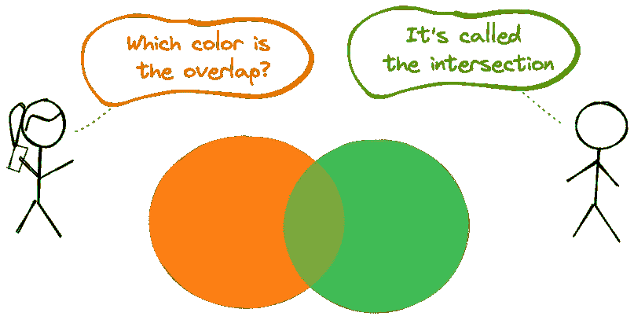
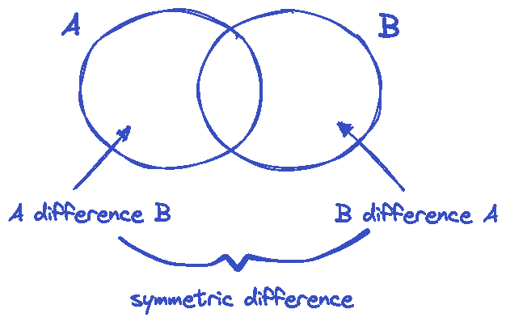
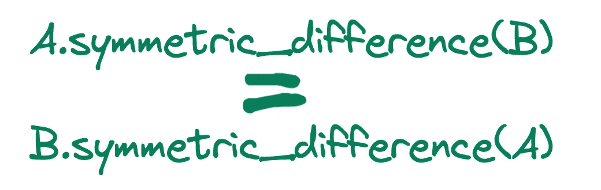
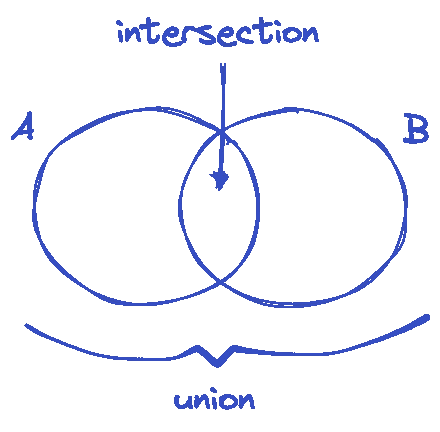

# Python 集合比较的 4 个必备方法

> 原文：<https://towardsdatascience.com/4-must-know-methods-for-python-set-comparison-f5b612bef62e>

## 实用指南



(图片由作者提供)

Set 是 Python 中 4 种内置数据结构之一。其他的是字典、列表和元组。

根据官方文档，*集合*是不同可散列对象的无序集合。因此，器械包的两个特征是:

*   它们不包含重复的元素
*   元素必须是可散列的(即不可变的)。虽然集合是可变的，但是集合中的元素是不可变的。

在这篇文章中，我们将讨论 4 个必须知道的比较集合的方法。让我们从创建一个 set 对象开始。

```
myset = {1, 2, 3, 4, 5}type(myset)
**# Output**
set
```

我们将介绍的方法有:

*   交集
*   差异
*   联盟
*   对称差

## 差分和对称差分

差分法寻找存在于一个集合中而不存在于另一个集合中的元素。



(图片由作者提供)

如上图所示，集合 A 与集合 B 的区别包括集合 A 中存在但集合 B 中不存在的所有元素。

让我们做一些例子来看看这些方法是如何使用的。

```
A = {1, 2, 3, 4, 5}
B = {3, 4, 5, 6, 7} A.difference(B)
**# Output**
{1, 2} B.difference(A)
**# Output**
{6, 7}
```

集合 A 包含 1 和 2，而集合 B 不包含。因此，差值 B 返回 1 和 2。

差值法可用于两个以上的集合。例如，“A.difference(B，C)”查找存在于 A 中但不存在于 B 或 C 中的元素。让我们看看它的实际应用:

```
A = {1, 2, 3, 4}
B = {3, 4, 10, 11}
C = {2, 4, 20, 21}A.difference(B, C)
**# Output**
{1}
```

对称差分法寻找仅存在于集合 A 或仅存在于集合 B 中的元素。因此，它返回“A 差 B”和“B 差 A”的并集。下面是这种方法的使用方法:

```
A.symmetric_difference(B)
**# Output**
{1, 2, 6, 7}
```

由于对称差覆盖了“A 差 B”和“B 差 A ”,我们可以交换 A 和 B 的位置:



(图片由作者提供)

## 交集和并集

两个集合的交集包含两个集合中都存在的元素。并集包含存在于任何集合中的元素。



(图片由作者提供)

```
A = {1, 2, 3, 4, 5}
B = {3, 4, 5, 6, 7} A.intersection(B)
**# Output**
{3, 4, 5}
```

**注:**“A .交集(B)”与“B .交集(A)”相同。

让我们也找到 A 和 B 的并集:

```
A.union(B)
**# Output**
{1, 2, 3, 4, 5, 6, 7}
```

union 方法获取集合的并集。尽管 3、4 和 5 在两个集合中都存在，但结果集合中每一个都只包含一个。重复项将被删除。

并集和交集方法可用于两个以上的集合。

```
A = {1, 2, 3, 4}
B = {3, 4, 10, 11}
C = {2, 4, 20, 21} A.union(B, C)
**# Output**
{1, 2, 3, 4, 10, 11, 20, 21} A.intersection(B, C)
**# Output** {4}
```

我们已经介绍了用于比较两组或更多组的 4 种不同方法。如果你想了解更多关于集合的知识，这里有一篇我以前写的更详细的文章:

[](/12-examples-to-master-python-sets-71802ea56de3)  

*你可以成为* [*媒介会员*](https://sonery.medium.com/membership) *解锁我的全部写作权限，外加其余媒介。如果你已经是了，别忘了订阅*[](https://sonery.medium.com/subscribe)**如果你想在我发表新文章时收到电子邮件。**

*[](https://sonery.medium.com/membership)  

感谢您的阅读。如果您有任何反馈，请告诉我。*