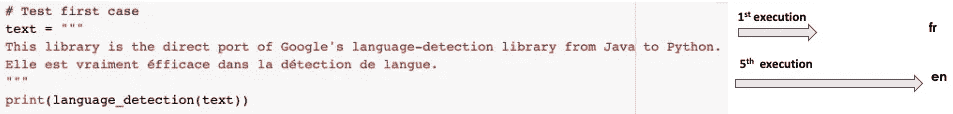
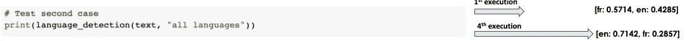

# 4 个 NLP 库，用于 Python 中文本数据的自动语言识别

> 原文：<https://towardsdatascience.com/4-nlp-libraries-for-automatic-language-identification-of-text-data-in-python-cbc6bf664774>

## 自动语言检测开源库综述


图片来自 [Unsplash](https://unsplash.com/photos/jhtPCeQ2mMU) 上的 [Soner Eker](https://unsplash.com/@sonereker)

# 介绍

大多数处理文本数据的行业更注重使用数字功能，因为这是处理这些文档的最快方式。在国际层面上，在任何进一步处理之前自动识别文档的基础语言可能是有益的。一个简单的用例可能是公司检测传入文本信息的语言，以便将其路由到相关部门进行处理。

本文旨在提供四个可以执行此类任务的 python 库的概述。

# 语言检测库

本节的目标是向您介绍一些用于文本语言检测的库及其实现。所有的源代码都在我的 [Google colab](https://colab.research.google.com/drive/1ca3IOMXUIlBTMi5KEjAv5hrpgg4zCsA3?usp=sharing) 上。

## 1.LangDetect

这个库是 Google 的语言检测库从 Java 到 Python 的直接端口，可以识别 50 多种语言。由 Cybozu Labs，Inc .的 Nakatani Shuyo 开发的`lang_detect`有两个主要功能，都将文本作为输入进行分析:

*   `detect`输出对应于所识别语言代码的双字母 ISO 693。
*   `detect_langs`输出检测到的所有候选顶级语言及其相应概率得分的列表。

lang_detect.py

在`text`变量中，为了加噪音，我故意用法语加了最后一句。

```
text = """This library is the direct port of Google's language-detection library from Java to Python. **Elle est vraiment éfficace dans la détection de langue**."""
```



第一次案例测试，第一次和第五次执行语言检测(图片由作者提供)



第二次案例测试，第一次和第四次执行语言检测(图片由作者提供)

*   **测试第一种情况** ( `detect`):第一次执行( **fr** 为法语)和第五次执行( **en** 为英语)中确定的语言不相同。
*   测试第二种情况 ( `detect_langs`):我们得到两种候选语言法语和英语。在第一次执行中，语言是法语的概率得分高。第 4 次执行后，英语的概率变高了。

所有这些结果中的不一致都是因为遮光罩下的算法是非确定性的，文本中的噪声越高，不一致性就越高。通过在运行语言检测指令之前将种子设置为:

fix_non_deterministic.py

由于使用了`DetectorFactor`，前面代码的结果总是相同的。这个库即使易于使用，也可能与简单的用例有关。

## 2.Spacy-langdetect

Spacy 是一个 NLP 库，其功能包括从标记化、命名实体识别到预训练模型的所有内容。Spacy 提出`spacy-langdetect` 是为了给它的文本处理管道增加语言检测的味道。

spacy_langdetect.py

*   `model`可以是任何定制的语言检测器，意味着你自己的预训练模型或来自 [Spacy 模型中心](https://spacy.io/models/en)的模型。
*   `LanguageDetector`是执行语言检测并在幕后使用`detect_langs`功能的类。
*   `name`参数设置为`language_detector`可以访问管道中的语言检测功能。
*   `._.language`属性对应于包含在文档中检测到的候选语言信息的字典。

下面是关于英文和法文文本都 ***免执照*** 的结果，分别摘自[actuia.com](https://www.actuia.com/english/africa-launch-of-the-initiative-for-the-development-of-artificial-intelligence-in-french-speaking-african-countries/)和[jeuneafrique.com](https://www.jeuneafrique.com/1208966/economie/intelligence-artificielle-la-solution-pour-ameliorer-lacces-au-credit-en-afrique/?utm_source=facebook.com&utm_medium=social&utm_content=jeune_afrique&utm_campaign=post_articles_facebook_28_07_2021&fbclid=IwAR1m5pzxtVZz9uakocmhDaHjVHJ-4ZeSx_HVXX5sk3d40l-NwSYf1ZNULts)。

spacy_langdetect_examples.py

*   ***第 14 行*** 显示{'language': 'en '，' score': 0.9999963977276909}，几乎 100%确信文本是英文。
*   ***第 17 行*** 显示{'language': 'fr '，' score': 0.9999963767662121}，几乎 100%确信文本是法语。

## 3.快速文本

这个库是由脸书人工智能研究实验室开发的。它是为工业化用例而不是研究而构建的，这使它成为一个快速、准确、轻便的工具，内存不到 1MB，能够识别 170 多种语言。它带有以下两个版本的预训练模型。

*   这个更快，也更精确，但是可能有点大(大小= 126MB)
*   [lid.176.ftz](https://dl.fbaipublicfiles.com/fasttext/supervised-models/lid.176.ftz) :这是模型的压缩版本，文件大小为 917kB

让我们关注第一个模型(`lid.176.bin`)，因为它是最准确的。

fasttext_lang_detect.py

*   `ft_model`是从我的***pretrained _ model***文件夹中加载的 **fasttext** 预训练模型的实例。
*   `.replace("\n", " ")`习惯于`fasttext`不抛出错误。

下面是 ***第 16 行*** 和 ***第 17 行*** 中先前打印语句的输出。['__label__en']表示第一个文本被预测为 89%可信的英文文本。['__label__fr']表示以 99%的置信度检测到第二个是法语。

```
([['__label__en']], [array([0.8957091], dtype=float32)])
([['__label__fr']], [array([0.99077034], dtype=float32)])
```

## 4.gcld3

这是 Google Compact 语言检测器 v3，是 Google 开发的神经网络语言识别库。在撰写本文时，这个预先训练的模型支持 107 种语言，并具有两个主要的语言识别功能。

*   `FindLanguage`对应 ***第一特征*** ，并连同置信度得分一起返回被检测语言对应的 [BCP-47 风格码](https://github.com/google/cld3#supported-languages)。
*   `FindTopNMostFreqLangs`对应于 ***第二特征*** ，其替代地生成顶级候选语言(使用`num_langs`参数)及其置信度得分。

在使用这些特性之前， ***我们需要*** ***来实例化一个检测器*** ，在推理过程中需要以下两个参数。

*   `min_num_bytes`最小字节数。
*   `max_num_bytes`最大字节数。

**注意**:请记住，强烈建议在实现这个库时使用虚拟环境。

下面是这两个特性的实现。

gcld3_lang_detect.py

*   **第一个特征的结果**

功能 _1.py

```
{'language': 'en', 'probability': 0.9998331069946289}
{'language': 'fr', 'probability': 0.9999961853027344}
```

*   **第二个特征的结果**

我将`num_langs`初始化为两个，因为我想为每个文本确定前两种语言。

功能 _2.py

```
[{'language': 'en', 'probability': 0.9998331069946289}, {'language': 'und', 'probability': 0.0}]
[{'language': 'fr', 'probability': 0.9999961853027344}, {'language': 'und', 'probability': 0.0}]
```

我们注意到结果中的`und`语言类型，因为没有发现第二种语言，尽管我们想要前 2 种。当第一语言被确定为具有非常高的置信度得分时，这种情况经常发生，在我们的例子中几乎是 100%。

## 感谢阅读！

祝贺您走到这一步，我希望您喜欢阅读这篇文章，并且它让您清楚地看到了使用预训练模型进行自动语言检测的好处。请在下面找到更多资源来帮助您进一步学习。

不要犹豫在 LinkedIn[上添加我或者在 YouTube](https://www.linkedin.com/in/zoumana-keita/)[和 Twitter](https://www.youtube.com/channel/UC9xKdy8cz6ZuJU5FTNtM_pQ) 上关注我。讨论人工智能，人工智能，数据科学，自然语言处理的东西总是令人愉快的！

[Google colab 上文章的源代码](https://colab.research.google.com/drive/1ca3IOMXUIlBTMi5KEjAv5hrpgg4zCsA3?usp=sharing)

[空间-语言检测](https://spacy.io/universe/project/spacy-langdetect)

谷歌的 langdetect

[快速文本语言识别](https://fasttext.cc/blog/2017/10/02/blog-post.html)

[python 中 Google 的紧凑型语言检测器 v3 介绍](/introduction-to-googles-compact-language-detector-v3-in-python-b6887101ae47)

再见🏃🏾