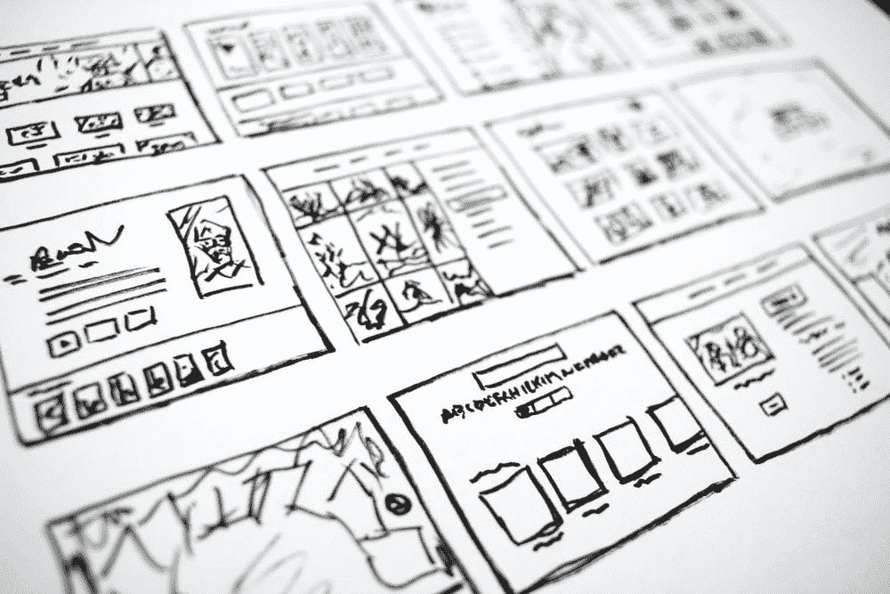

# 4 数据科学家的项目管理技能和框架

> 原文：<https://towardsdatascience.com/4-project-management-skills-and-frameworks-for-data-scientists-77141196239b>

## 在本帖中，我们将学习 3 个项目管理框架和 1 个帮助数据科学家将项目引向成功的技巧

照片由 [@halacious](https://unsplash.com/@halacious) @unsplash.com 拍摄

M ost 数据科学项目是时间固定、预算有限的项目。尽管数据科学项目由于其科学性而拥有一些宽松的“自由时间”是有益的，但资源(时间、金钱或人员)有限的事实证明，必须仔细规划数据科学项目。最后，你想让涉众高兴，好的计划设定期望并控制项目的执行。

这一点与咨询活动特别相关，因为在咨询活动中，偏离最初的计划可能是灾难性的。财务激励必须与项目实施相一致，任何超出预算或不完整的项目通常都是由糟糕的规划造成的。

**虽然数据科学项目确实有失败的可能性，但失败的原因应该是统计假设，而不是缺乏规划。**

是的，从上到下管理项目不是数据科学家的主要职责，但学习一些框架肯定会有助于理解某些项目决策，并建设性地参与指导项目走向成功。另一个好处是，学习一些项目管理技能和框架将有助于你在职业生涯中晋升到高级职位，因为随着你责任的增加，这些技能变得更加重要。

在本帖中，我们将学习一些相关的项目管理框架或数据科学家的技能。因此，让我们进入一些概念，这些概念可能对您作为数据科学家或数据世界中的管理者的日常工作有用！

*顺便提一下:由于它们的特殊性，大多数数据科学项目都包含大量的不确定性(因此有了科学的名称)，并且这些框架应该总是有所保留，不能盲目应用。*

# IPECC —框架

**IPECC 代表启动—计划—执行—控制—结束。这是一个由项目经理使用的通用框架，用于跟踪项目并了解项目是如何展开的。**

虽然 IPECC 框架在每个阶段都有一些标准任务，但我将解释如何在典型的数据科学项目环境中使用它们。让我们探索每个阶段。

## 开始

初始阶段是项目框架中最相关的阶段之一。这是项目范围界定发生的地方，也是您定义重要涉众的地方。**在数据科学背景下，此阶段涉及的一些常见任务:**

*   了解项目的**主要利益相关者；**
*   了解哪些**数据源可用于项目**；
*   **评估数据集成的复杂性**和预期的时间工作量；
*   **定义问题**并绘制可用解决方案的计划；
*   **确定项目的到期日**；

## 规划

**在规划阶段，在整个启动阶段收集的所有英特尔信息将被推广到高级计划中，该计划应得到所有利益相关方的批准。**

规划阶段也有助于两个要点:在团队成员之间划分任务，并绘制项目的整体流程。**与数据科学项目相关的一些规划任务有:**

*   **制定模型开发的时间表** —包括关键检查点和利益相关者会议的召开地点。
*   **制定数据整合、基线模型开发和模型改进的时间表。**
*   **评估项目开发的可用约束**(例如，模型的可解释性、合理的培训时间等。);

给“创造性任务”留些空间也很重要。在项目开发过程中会出现新的想法是很常见的，计划好时间进行一些实验将是设定利益相关者期望的关键。

## 执行和控制

这两个阶段通常同时发生，是项目开发的支柱。执行是项目的发展，控制是对执行和原始计划的不断评估。

两个阶段的共同任务:

*   跟踪时间表和计划。比较是否有项目延期或评估项目风险。
*   保持对商业利益相关者管理的跟踪——特别是当最初的需求得到满足的时候。
*   技术团队和商业利益相关者之间的定期交流。
*   当然还有**车型本身的开发。**

## 关闭

在收尾阶段，项目被提交，主要结论与业务涉众进行讨论。对于数据科学项目，以下是最重要的任务:

*   **了解业务目标是否已经实现。**
*   讨论项目结果——在假设失败的情况下，讨论从新发现的知识中获得的收益。**一个失败的假设可能和一个被验证的假设一样有价值，这取决于商业环境。**
*   **封装相关文档并将项目移交给最终利益相关方** —每个数据科学家都必须关注两个角度:1)将来需要维护解决方案的其他开发人员/数据科学家— 2)将在特定用例中使用输出的业务用户。

# 风险管理—框架

风险管理框架有助于为不确定性做好计划，并围绕可能破坏您的数据科学项目的事件更好地构建概率。

识别和评估这些风险是制定逃生路线和计划以避免混乱的关键。**项目的每个阶段都涉及风险** — **对于数据科学项目来说，最常见的风险围绕着资源和数据。**

以下是项目生命周期中可能与 map 相关的一些风险示例:

*   **如果我的一名数据科学家离开团队会怎么样**(由于生病、自愿离职等原因)。)?
*   如果**我们无法使用训练模型所需的数据源**会发生什么？
*   **我的数据源中包含的任何数据是否存在监管风险**？

思考风险会迫使你制定一个计划来减轻风险。风险管理框架将有助于针对项目固有的不确定性进行规划和计划。

如果你想了解更多关于风险和处理风险的 6 步框架，请查看这篇博文。

# 史诗和用户故事—框架

*史诗*和*用户故事*对于在敏捷团队中工作的数据科学家来说并不陌生。

*史诗*是可能代表几个用户故事的高层次任务的集合——**编写一个好的*史诗*是符合利益相关者期望的关键。**设想一个数据科学项目，构建一个*“预测系统，为一家冰淇淋公司预测销售额”——*两个*史诗*的一个例子是:

*   "*作为一名销售经理，我需要根据销售预测了解哪些地区是我需要重点拓展的"*
*   *“作为一名物流经理，我需要评估需求，以便相应地准备我们的生产”*

对于数据科学， *Epics* 有助于绘制模型结果，并为项目定义正确的利益相关者。

基于上面的例子，我们会立即知道我们应该在项目循环中包括后勤和销售团队。这有什么关系？假设您后来发现物流经理需要每日预测，而销售经理更喜欢每周预测— **这将立即改变您整个开发的工作方式，改变您组织数据管道的方式，因为您需要每日粒度。**

*用户故事*是更小的*史诗块，*包含了对特定需求的更细粒度的描述——拿我们的*后勤团队的例子来说:*

*   *“作为物流经理，我需要在我的生产仪表板上看到预测”；*
*   *“作为一名物流经理，我需要模拟天气预测如何改变预测”；*

这些低级的*故事*可能会改变你的可交付成果，并帮助你将工作分成具体的块。正如你所想象的，*史诗*和*用户故事*与项目计划有着内在的联系。

集成在敏捷框架中，这些概念与涉众管理高度相关，并且**它们旨在避免项目中两个最常见的错误:**

*   建造错误的东西；
*   构建只适合组织一小部分的东西；

# 持续沟通——技巧

项目经理发展的另一项技能是持续的沟通和有价值的反馈。

为什么这对数据科学家很重要？数据科学家需要能够**以清晰的方式传达他们的结果，并为业务利益相关方解释数据科学模型的复杂性**。特别是，数据科学家应该避免成为“象牙塔工程师”——培养良好的沟通技能是与同事和利益相关者建立更牢固关系的良好步骤。

持续的沟通和清晰的反馈是一项非常特殊的技能，可以在项目的多个阶段使用，例如:

*   **沟通模式的改进；**
*   征求利益相关者的反馈；
*   **将新信息**纳入项目开发；
*   向其他开发人员反馈他们的代码；

总而言之，持续的沟通是一种防止项目开发中保护利益相关者的方法，提高了项目成功的可能性。

感谢你花时间阅读这篇文章！这些是我一直在努力提高的一些技能，也是我为了成为更好的数据科学家而尝试应用的一些框架。正如我所说的，应用它们并不是数据科学家的强制要求——截至目前，数据科学家的主要目标仍然是开发良好的模型——但我真的相信它们是一个很好的附加物，可以提高良好项目结果的可能性，最终，我们都希望引导我们的项目走向成功。

想补充点什么？写在下面的评论里！

***我在 R 从零开始在***[***Udemy***](https://www.udemy.com/course/r-for-data-science-first-step-data-scientist/?referralCode=MEDIUMREADERS)***上开设了一门学习数据科学的课程——这门课程是为初学者设计的，包含 100 多个练习，我希望您能在身边！***