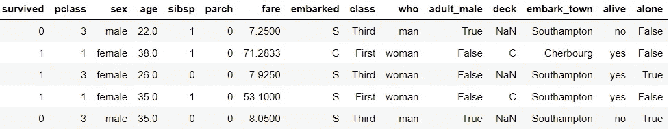
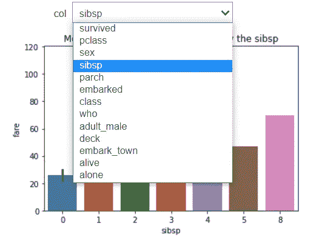
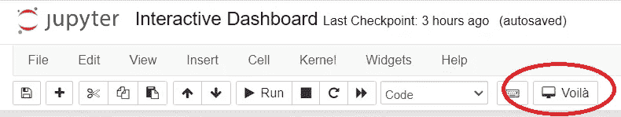
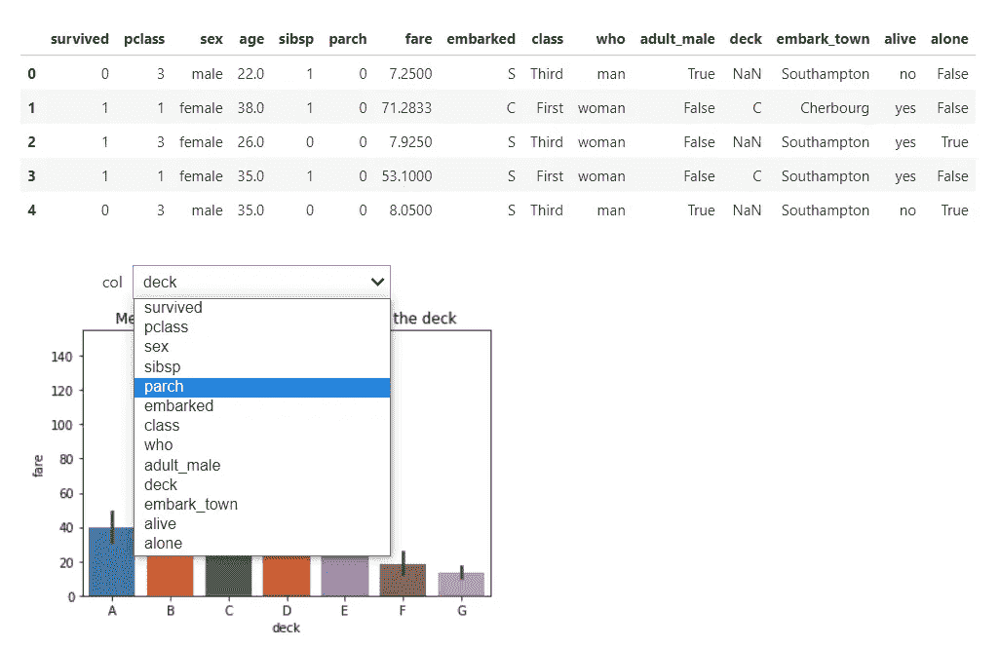
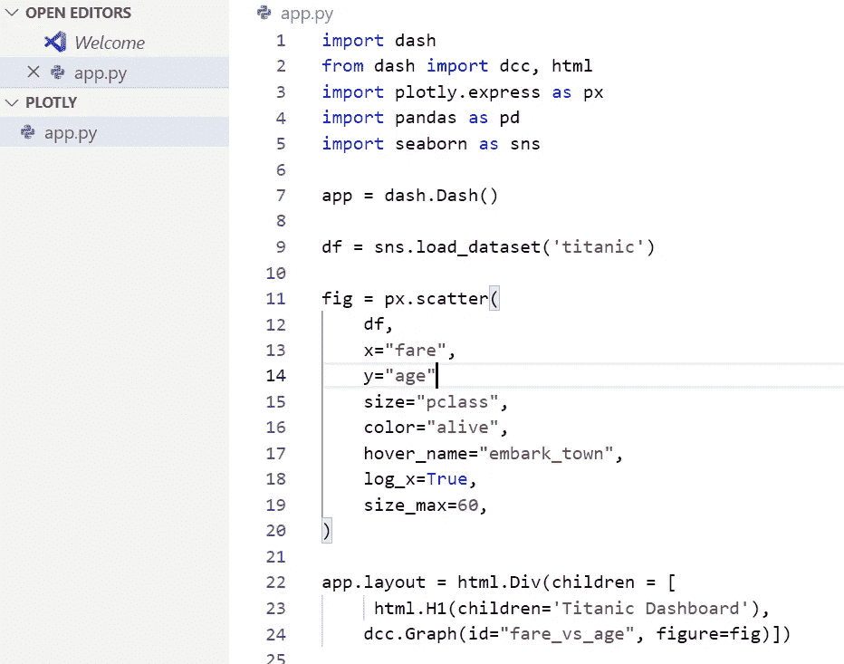
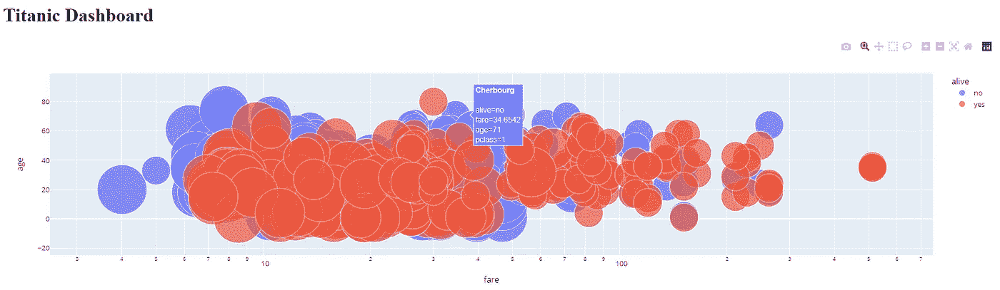
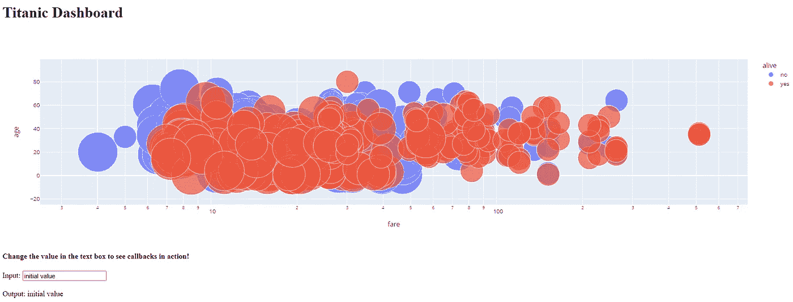
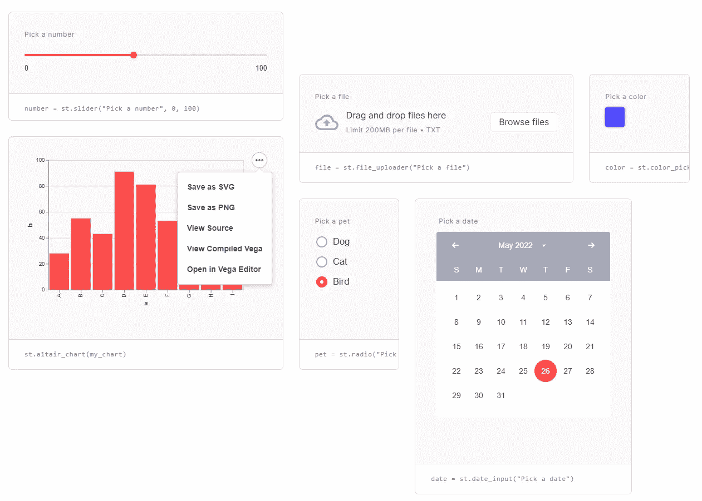
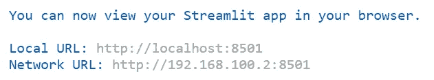
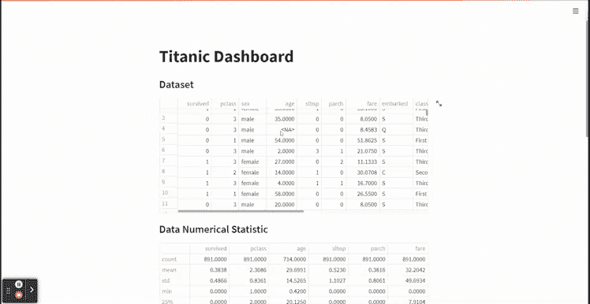

# 4 个 Python 包来创建交互式仪表盘

> 原文：<https://towardsdatascience.com/4-python-packages-to-create-interactive-dashboards-d50861d1117e>

## 使用这些包来改进您的数据科学项目


卢克·切瑟在 Unsplash[上的照片](https://unsplash.com?utm_source=medium&utm_medium=referral)

数据科学项目本质上是一个为观众讲述故事的项目。你的项目有多好并不重要；如果对方不理解你的数据洞察和发现，就无法采取行动。

向观众展示项目的一种方法是创建交互式仪表板。为什么要互动？因为动作比静态的洞察力更能让观众记住。这就是为什么，如果可能的话，创建一个数据科学项目到一个交互式仪表板中是明智的。

在本文中，我想概述 4 个 Python 包，您可以使用它们为您的数据科学项目创建一个交互式仪表盘。这些包裹是什么？让我们开始吧。

# 1.小工具

Ipywidgets(通常简称为 widgets)是一个交互式包，为 Jupyter 笔记本中的 GUI 提供 HTML 架构。该软件包允许我们直接在 Jupyter 笔记本单元中创建一个交互式仪表板。我会在下面的 GIF 中展示这个例子。


作者 GIF

通过几行代码，您可以将您的 Jupyter 笔记本改进为一个仪表板。让我用几行代码展示一下我们是如何做到的。

首先，我们需要安装所需的软件包。

```
pip install ipywidgets
```

然后我们需要在 Jupyter 笔记本中启用 Ipywidgets。要启用它，请在命令提示符下传递以下代码。

```
jupyter nbextension enable --py widgetsnbextension
```

我们可以在我们的 Jupyter 笔记本中创建我们的交互式仪表板，所有必要的包都在适当的位置。对于我们的例子，我会使用泰坦尼克号样本数据。

```
import seaborn as snstitanic = sns.load_dataset('titanic')
titanic.head()
```



作者图片

准备好数据集后，我们将创建交互式仪表板。例如，我想创建一个交互式仪表板，在那里我可以得到按分类变量分组的泰坦尼克号票价平均值。在这种情况下，我会使用下面的代码。

```
#Creating the interactive dashboard
from ipywidgets import interact@interact
def create_fare_plot(col = titanic.drop(['fare', 'age'], axis =1).columns):
    sns.barplot(data = titanic, x = col, y ='fare')
    plt.title(f'Mean Bar Plot of the Fare grouped by the {col}')
```



作者图片

通过添加`@interact`代码，我们启动了交互过程。在下面的代码中，您将通过创建一个过滤函数来启动仪表板。

代码简单直观；然而，它可能无法回答您需要的所有过程，因为 Ipywidgest 只限于您的 Jupyter 笔记本。让我们看看其他的包裹。

# 2.瞧

这是一个简单的 Python 包，可以将一个简单的 Jupyter 笔记本变成一个像样的 web 应用仪表板。只需一行安装代码，我们就可以快速呈现我们的 Jupyter 笔记本。让我们试着安装一下仪表盘。

```
pip install voila
```

当您完成安装 Voila 软件包后，刷新您的 Jupyter 笔记本并查看笔记本选项卡。在那里你会发现一个新的 Voila 按钮。



作者图片

现在试着按下按钮，你会自动被带到另一个网页，这就是瞧仪表板。



作者图片

还记得之前我用 Jupyter 笔记本中的 Piywidgets 创建泰坦尼克号仪表盘的交互代码吗？现在，它们被转化成了笔记本之外的交互式仪表盘。此外，我们输入的所有代码并没有显示在 Voila 仪表板上。这很好，因为我们只想关注结果。

瞧，仪表板对于一个简单的 Jupyter 笔记本仪表板来说已经足够了，但是如果我们想要更多的灵活性呢？让我们进入下一个包裹。

# 3.神秘地闪过

[Dash by Plotly](https://dash.plotly.com/) 是一个开源的 Python 包，它使用 Python 语言提供了一个交互式仪表盘，并提供了创建 web 应用程序的灵活性。

如果你不熟悉 Plotly，它是一个交互式可视化软件包。Dash 是一个低代码框架包，用于开发基于 Plotly 可视化的 web 应用程序。

要试用 Dash，让我们先安装这个包。

```
pip install dash
```

安装完成后，我将使用下面的代码创建一个简单的 Titanic 仪表板。

```
import dash
from dash import dcc, html
import plotly.express as px
import pandas as pd
import seaborn as snsapp = dash.Dash()df = sns.load_dataset('titanic')fig = px.scatter(
df,
x="fare",
y="age",
size="pclass",
color="alive",
hover_name="embark_town",
log_x=True,
size_max=60
)app.layout = html.Div(children = [
html.H1(children='Titanic Dashboard'),
dcc.Graph(id="fare_vs_age", figure=fig)]) if __name__ == "__main__":
    app.run_server(debug=True)
```

我用 Visual Studio 代码运行上面的代码，并将脚本保存为 app.py。



作者图片

运行上面的代码后，我们将以默认的( [http://127.0.0.1:8050/](http://127.0.0.1:8050/) )方式启动仪表板，您可以在以后更改它。



作者图片

通过额外的代码，我们可以添加一个回调函数，使用户的输入具有一定的输出。

```
import dash
from dash import dcc, html, Input, Output
import plotly.express as px
import pandas as pd
import seaborn as snsapp = dash.Dash()df = sns.load_dataset('titanic')fig = px.scatter(
df,
x="fare",
y="age",
size="pclass",
color="alive",
hover_name="embark_town",
log_x=True,
size_max=60
)app.layout = html.Div(children = [
html.H1(children='Titanic Dashboard'),
dcc.Graph(id="fare_vs_age", figure=fig),#Add interactive callback here
html.H4("Change the value in the text box to see callbacks in action"),
html.Div([
"Input: ",
dcc.Input(id='my-input', value='initial value', type='text')
]),
html.Br(),
html.Div(id='my-output'),
])@app.callback(
Output(component_id='my-output', component_property='children'),
Input(component_id='my-input', component_property='value')
)def update_output_div(input_value):
    return f'Output: {input_value}'if __name__ == "__main__":
   app.run_server(debug=True)
```



作者图片

通过一些调整，我们可以改进我们的交互过程。

Dash by Plotly 在创建仪表板方面非常方便，因为它提供了许多有用的 APIs 然而，有时代码结构很难阅读，因为使用的语言是低级的。我们将使用另一个包来创建我们的交互式仪表板来解决这个问题。

# 4.细流

什么是 Streamlit？ [Streamlit](https://www.streamlit.io/) 是一个开源 Python 包，旨在为数据科学家和机器学习项目创建一个 web 应用。下面是一个你可以用 Streamlit 制作的数据应用的例子。



作者图片

Streamlit 提供的 API 对任何初学者来说都很容易使用，对任何想要交互式构建数据组合的人来说都是完美的。此外，Streamlit 提供了一个免费的应用程序部署，我们可以利用它来在线传播我们的项目。让我们先安装 Streamlit 包。

```
pip install streamlit
```

安装过程完成后，我们可以创建我们的交互式仪表板。让我给你下面的代码示例。

```
import streamlit as st
import pandas as pd
import plotly.express as px
import seaborn as snsdf = sns.load_dataset('titanic')st.title('Titanic Dashboard')st.subheader('Dataset')
st.dataframe(df)st.subheader('Data Numerical Statistic')
st.dataframe(df.describe())st.subheader('Data Visualization with respect to Survived')left_column, right_column = st.columns(2)with left_column: 'Numerical Plot'
    num_feat = st.selectbox(
   'Select Numerical Feature', df.select_dtypes('number').columns) fig = px.histogram(df, x = num_feat, color = 'survived') st.plotly_chart(fig, use_container_width=True)with right_column: 'Categorical column'
    cat_feat = st.selectbox(
    'Select Categorical Feature', df.select_dtypes(exclude =   'number').columns)
    fig = px.histogram(df, x =cat_feat, color = 'survived' )st.plotly_chart(fig, use_container_width=True)
```

使用 Visual Studio 代码，我将文件保存为 titanic_st.py，并使用以下代码在终端中运行该文件。

```
streamlit run titanic_st.py
```



作者图片

Streamlit 应用程序现在运行在上述地址上，您可以选择任何一个，我们可以访问我们的仪表板。



作者 GIF

通过上面的简单代码，我们已经创建了一个交互式仪表板 web 应用程序，它直观并且可以在我们的浏览器中流畅地运行。API 不难理解，因为我们只使用了最少的代码。

Streamlit 还提供免费的应用部署，您可以将其用作您的数据科学产品组合。

# *结论*

当您展示您的数据科学项目时，交互式仪表板将改善观众体验。我介绍了 4 个 Python 包，您可以使用它们来创建交互式仪表板，使之变得更容易。它们是:

1.  小工具
2.  瞧
3.  神秘地闪过
4.  细流

希望有帮助！

> *访问我的* [***社交媒体***](https://bio.link/cornelli)**进行更深入的交谈或有任何问题。**

> **如果您没有订阅为中等会员，请考虑通过* [*我的推荐*](https://cornelliusyudhawijaya.medium.com/membership) *订阅。**