# 学习因果分析的 4 个 Python 包

> 原文：<https://towardsdatascience.com/4-python-packages-to-learn-causal-analysis-9a8eaab9fdab>

## 通过这些包学习因果分析


由[法比奥](https://unsplash.com/@fabioha?utm_source=medium&utm_medium=referral)在 [Unsplash](https://unsplash.com?utm_source=medium&utm_medium=referral) 拍摄的照片

因果分析是实验统计学中证明和建立因果关系的一个领域。在统计学中，利用统计算法在严格假设下推断数据集内的因果关系，称为**探索性因果分析** ( **ECA** )。

反过来，ECA 是一种用更可控的实验证明因果关系的方法，而不仅仅是基于相关性。我们经常需要证明**反事实**——其他情况下的不同条件。问题是我们只能近似因果效应，而不能近似反事实。

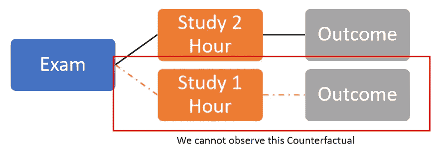

图片作者。

因果分析已经是数据科学中一个不同的学习领域，因为它与机器学习建模的预测有着内在的不同。我们可以从现有数据中预测最大似然结果，但无法预测现有数据之外的结果。

为了学习更多关于因果分析的知识，本文将向您展示 4 个 Python 包，您可以使用它们作为学习材料。让我们开始吧。

# 1.因果关系

[Causalinference](https://causalinferenceinpython.org/) 是一个 Python 包，提供了各种用于因果分析的统计方法。这是一个简单的包，用于基本的因果分析学习。这些软件包的主要功能包括:

*   倾向得分估计和子类化
*   通过修整改善协变量平衡
*   治疗效果评估
*   协变量分布中重叠的评估

我们可以在他们的[网页](https://github.com/laurencium/causalinference/blob/master/docs/tex/vignette.pdf)上找到关于每个术语的更长的解释。

让我们试试 Causalinference 包。首先，我们需要安装软件包。

```
pip install causalinference
```

安装完成后，我们将尝试实现一个因果模型来进行因果分析。我们将使用来自因果参考包的随机数据。

```
from causalinference import CausalModel
from causalinference.utils import random_data#Y is the outcome, D is treatment status, and X is the independent variableY, D, X = random_data()
causal = CausalModel(Y, D, X)
```

CausalModel 类将分析数据。我们需要再做一些步骤来从模型中获取重要的信息。首先，让我们得到统计摘要。

```
print(causal.summary_stats)
```

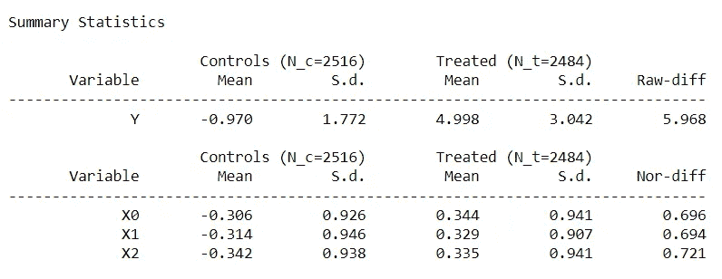

作者图片

通过使用`summary_stats`属性，我们将获得数据集的所有基本信息。

因果分析的主要部分是获取治疗效果信息。最简单的方法是使用普通的最小二乘法。

```
causal.est_via_ols()
print(causal.estimates)
```

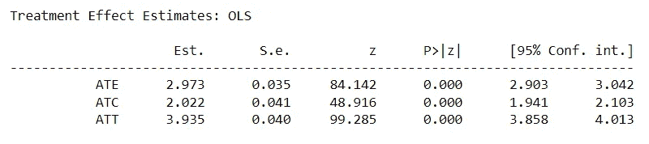

作者图片

ATE、ATC 和 ATT 分别代表平均治疗效果、对照的平均治疗效果和治疗的平均治疗效果。利用这些信息，我们可以评估与对照组相比，治疗是否有效果。

使用倾向评分法，我们也可以获得关于独立变量的治疗概率的信息。

```
causal.est_propensity_s()
print(causal.propensity)
```


作者图片

使用倾向评分法，我们可以评估给定独立变量的治疗概率。

仍然有许多方法你可以探索和学习。建议大家访问 causalinference 网页，进一步了解。

# 2.考萨利布

[Causallib](https://github.com/IBM/causallib) 是 IBM 开发的用于因果分析的 Python 包。该包提供了与 Scikit-Learn API 统一的因果分析 API，这允许使用拟合和预测方法的复杂学习模型。

Causallib 软件包的好处是我们可以在学习过程中使用的[示例笔记本](https://github.com/IBM/causallib/tree/master/examples)的数量。

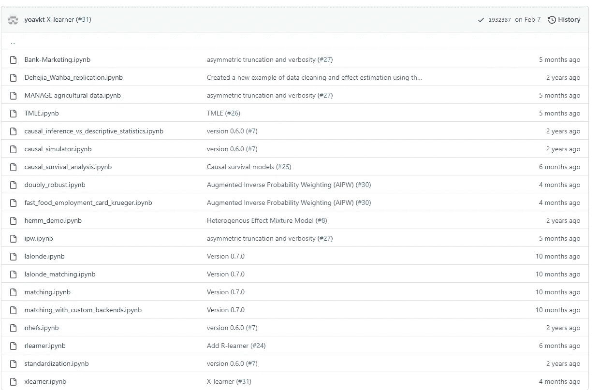

作者图片

然后，让我们尝试使用 causallib 包进行学习。首先，我们需要安装软件包。

```
pip install causallib
```

之后，我们将使用 causallib 包中的一个示例数据集，并使用 Scikit-Learn 中的模型估计因果分析。

```
from sklearn.linear_model import LogisticRegression
from causallib.estimation import IPW 
from causallib.datasets import load_nhefsdata = load_nhefs()
ipw = IPW(LogisticRegression())
ipw.fit(data.X, data.a)
potential_outcomes = ipw.estimate_population_outcome(data.X, data.a, data.y)
effect = ipw.estimate_effect(potential_outcomes[1], potential_outcomes[0])
```

上述代码将加载一项关于吸烟对健康影响的跟踪研究。我们使用逻辑回归模型作为因果模型来建立和评估因果效应。

让我们检查一下治疗的潜在结果和效果。

```
print(potential_outcomes)
```

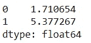

作者图片

检查潜在的结果，我们可以看到，如果每个人都戒烟(1)的平均体重差异是 5.38 公斤，而如果每个人都一直吸烟(0)的平均体重差异是 1.71 公斤。

这意味着我们的平均体重相差约 3.67 公斤。因此，我们可以得出结论，吸烟治疗将减少体重增加约 3.67 公斤。

如需更多信息和学习材料，请访问 Causallib 页面上的笔记本。

# 3.因果影响

[Causalimpact](https://github.com/jamalsenouci/causalimpact) 是一个用于因果分析的 Python 包，用于估计时间序列干预的因果效应。该分析试图看出事实发生之前和之后的处理之间的差异。

Causalimpact 将分析响应时间序列(例如，点击、药物效应等)。)和一个控制时间序列(你的反应，但在一个更受控制的环境中)与贝叶斯结构时间序列模型。这个模型预测反事实(如果干预从未发生会发生什么)，然后我们可以比较结果。

让我们通过安装软件包来开始使用它。

```
pip install causalimpact
```

完成安装包后，让我们创建模拟数据。我们将创建一个具有 100 个观察值的示例数据集，其中在时间点 71 之后将有一个干预效应。

```
import numpy as np
from statsmodels.tsa.arima_process import arma_generate_sample
from causalimpact import CausalImpactnp.random.seed(1)x1 = arma_generate_sample(ar=[0.999], ma=[0.9], nsample=100) + 100
y = 1.2 * x1 + np.random.randn(100)y[71:100] = y[71:100] + 10
data = pd.DataFrame(np.array([y, x1]).T, columns=["y","x1"])
pre_period = [0,69]
post_period = [71,99]
```

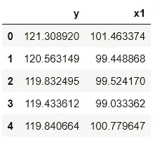

作者图片

上面，我们获得了一个因变量(y)和一个自变量(x1)。通常，我们会有不止一个独立的，但让我们坚持使用当前的数据。让我们用这些数据进行分析。我们需要具体说明干预之前和之后的时间。

```
impact = CausalImpact(data, pre_period, post_period)
impact.run()
impact.plot()
```

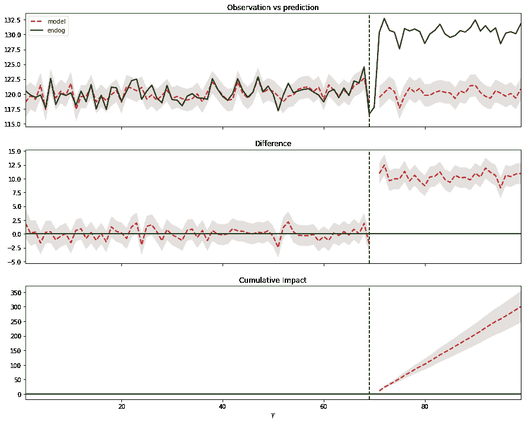

作者图片

上面的图给了我们三组信息。上图显示了治疗后时期的实际数据和反事实预测。中间的面板显示了实际数据和反事实预测之间的差异，这是逐点的因果效应。底部面板是干预的累积效果图，其中我们累积了中间面板的逐点贡献。

如果我们想从每个数据点获得信息，我们可以使用下面的代码。

```
impact.inferences
```

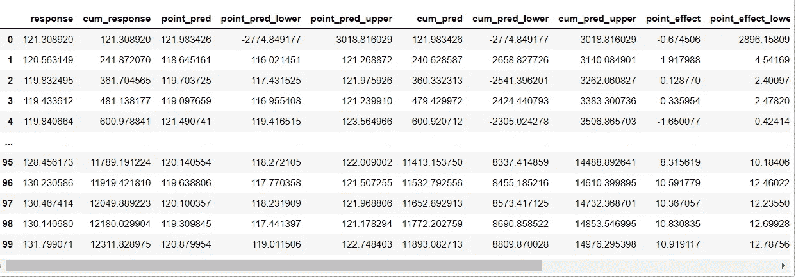

作者图片

此外，通过下面的代码获得一个汇总结果。

```
impact.summary()
```

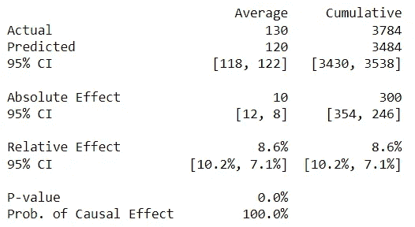

作者图片

该总结允许我们评估干预的发生是否有因果关系。如果您想要更详细的报告，您可以使用下面的代码。

```
impact.summary(output = 'report')
```

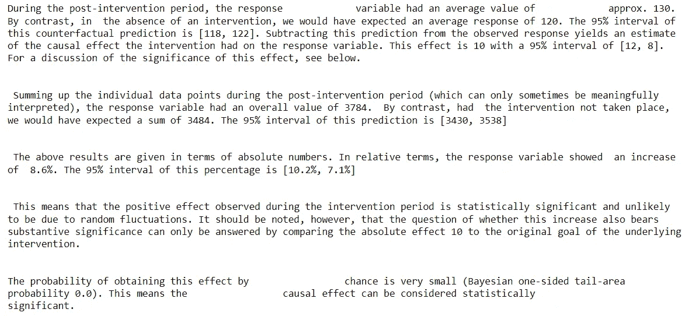

作者图片

如果你想了解更多关于时间干预因果分析的知识，请查看他们的[文档页面](https://nbviewer.org/github/jamalsenouci/causalimpact/blob/master/GettingStarted.ipynb)。

# 4.为什么

DoWhy 是一个 Python 包，它用一个简单的 API 和完整的文档提供了最先进的因果分析。

如果我们访问文档页面，为什么通过 4 个步骤进行因果分析:

1.  使用我们创建的假设对因果推理问题建模，
2.  确定假设下因果效应的表达式，
3.  使用统计方法估计表达式，
4.  验证评估的有效性。

让我们试着用 DoWhy 包开始一个因果分析。首先，我们必须通过运行下面的代码来安装 DoWhy 包。

```
pip install dowhy
```

之后，作为样本数据集，我们将使用来自 DoWhy 包的随机数据集。

```
from dowhy import CausalModel
import dowhy.datasets# Load some sample data
data = dowhy.datasets.linear_dataset(
    beta=10,
    num_common_causes=5,
    num_instruments=2,
    num_samples=10000,
    treatment_is_binary=True)
```

首先，给定我们创建的图表和假设，我们可以将其发展成因果模型。

```
Create a causal model from the data and given graph.
model = CausalModel(
    data=data["df"],
    treatment=data["treatment_name"],
    outcome=data["outcome_name"],
    graph=data["gml_graph"])model.view_model()
```


作者图片

接下来，我们需要用下面的代码来确定因果关系。

```
#Identify the causal effect
estimands = model.identify_effect()
```

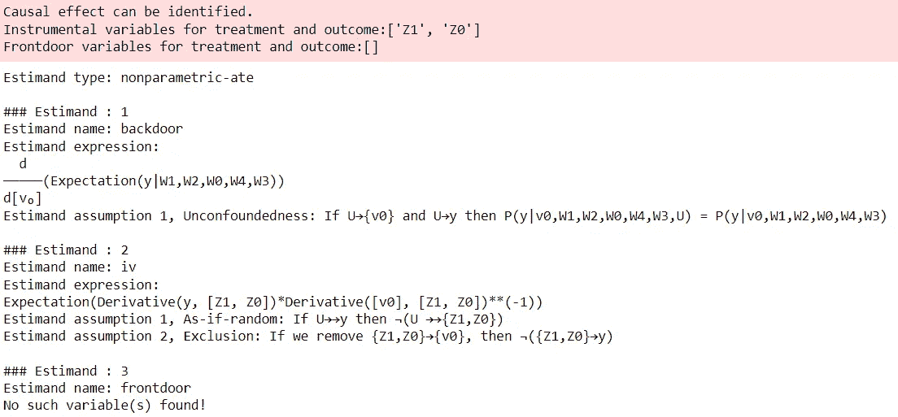

作者图片

我们确定一个因果效应，然后我们需要从统计上估计这个效应有多强。

```
estimate = model.estimate_effect(identified_estimand,                              method_name="backdoor.propensity_score_matching")
```

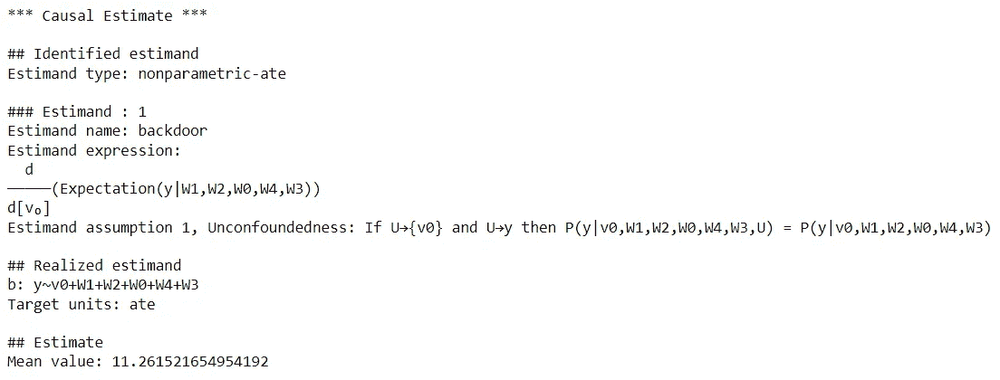

作者图片

最后，因果效应估计是基于数据的统计估计，但因果关系本身并不基于数据；相反，它是基于我们以前的假设。我们需要用健壮性检查来检查假设的有效性。

```
refute_results = model.refute_estimate(identified_estimand, estimate,                                     method_name="random_common_cause")
```

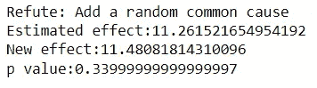

作者图片

这样，我们就完成了因果分析，并可以利用这些信息来决定治疗是否有因果影响。

DoWhy 文档提供了大量的学习材料；您应该访问网页以了解更多信息。

# **结论**

因果分析是实验统计学中证明和建立因果关系的一个领域。这是数据科学中的一个不同领域，需要它的学习材料。

在本文中，我概述了 4 个 Python 包，您可以用它们来学习因果分析。它们是:

1.  因果关系
2.  考萨利布
3.  因果影响
4.  为什么

希望有帮助！

> *访问我的* [***社交媒体***](https://bio.link/cornelli)**进行更深入的交谈或有任何问题。**

> **如果您没有订阅为中等会员，请考虑通过我的推荐订阅。**