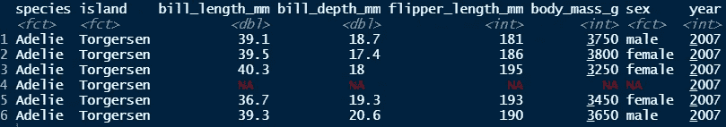
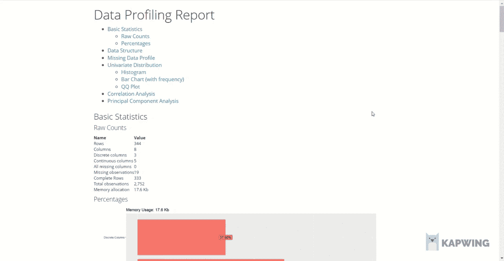

# 自动化 EDA 报告的 4 R 库

> 原文：<https://towardsdatascience.com/4-r-libraries-for-automated-eda-report-a42f139c5b6b>

## 介绍几种不需要大量编码的有效自动化 EDA 报告


安德烈·本兹在 [Unsplash](https://unsplash.com?utm_source=medium&utm_medium=referral) 上拍摄的照片

# 介绍

在我的文章中分享了一些非常酷的有效 EDA 库之后，*[***3 个你可能错过的有效 EDA Python 库***](/3-python-libraries-for-effective-eda-that-you-might-have-missed-3320f48ff070)*几周前，我想和你分享一些更酷的项目，比如这些不过，这次在 r .希望这些库能对您有所帮助。**

**现在，让我们开始吧！**

# **数据集**

**在本文中，我将使用来自 R、 ***企鹅的公共数据集*** 来自***palmerpenguins****包的数据。***

```
*****## Install & load data.table**install.packages("palmerpenguins")
library(palmerpenguins)
df = penguins***
```

***以下是该数据集的快照:***

******

***图 1:数据集——作者图片***

******数据来源:*** *瓦斯科姆，m .等人，2017。mwaskom/seaborn:v 0 . 8 . 1(2017 年 9 月)，芝诺多。可在:*[*https://doi.org/10.5281/zenodo.883859.*](https://doi.org/10.5281/zenodo.883859.)以 BSD-3 许可证发布。***

# **数据浏览器包**

****DataExplorer** 只需一行代码，就能通过自动化 EDA 快速获得数据集的概况。**

```
****## Install package**
install.packages("DataExplorer")**## Import library**
library(DataExplorer)**## Create report**
create_report(df)**
```

****

**图 2:作者的 DataExplorer 包— GIF**

**基本上，该软件包将总结理解数据所需的所有信息，包括:**

*   **数据结构、变量类型等。(`plot_str(),` `introduce(),` `plot_intro()`)**
*   **缺失值轮廓-缺失数据的百分比，每个要素缺失行的绘图(`plot_missing(),` `set_missing()`)**
*   **直方图中数值变量的分布和柱状图形式的分类变量的频率(`plot_bar(),` `plot_histogram(),` `update_columns(data,"column_name", as.factor)`)**
*   **变量之间的相关性分析(`plot_correlation(na.omit(data)`)**
*   **检验偏离特定概率分布的 QQ plot(`plot_qq()`)**
*   **一个热编码(`dummify()`)**

**如果您想单独调查上述信息，但不想自动创建完整的报告，**数据浏览器**为您提供不同的相应功能。如上所述，你可以在括号内引用一些函数，并在这里找到更多细节[。](https://cran.r-project.org/web/packages/DataExplorer/vignettes/dataexplorer-intro.html)**

# ****SmartEDA 包****

**另一个我认为已经成功完成基本 EDA 关键职责的自动化 EDA 包是 **SmartEDA** 。与 DataExplorer 不同，此包不包含任何用于修改现有变量的函数。相反，SmartEDA 专注于使用可视化和描述性统计来提供数据理解。**

**要在 SmartEDA 中创建自动报告，我们只需要一行简单的代码，如下所示:**

```
****## Install package**
install.packages("ExPanDaR") **## Import library**
library(ExPanDaR)**## Create report** ExPanD(df)**
```

**图 3:按作者展开报告 GIF**

**如您所见，总体而言，该报告与 **DataExplorer** 包非常相似。它包括数据集摘要的基本信息，例如变量类型、数据框大小、描述性统计数据、缺失值或不同变量的分布。 **SmartEDA** 的一个 **DataExplore** 没有显示的特性是目标变量和其他变量之间的相关性。**

**此外，该软件包还支持通过提供列联表和平行坐标图的相关数据来发现数据，从而实现多变量可视化。有关报告中每个组件如何工作的更多信息，您可以通过此[链接](https://cran.r-project.org/web/packages/SmartEDA/vignettes/SmartEDA.html#parallel-co-ordinate-plots)阅读更多信息。**

# **DataMaid 包**

**DataMaid 可以生成 PDF、DOCX 或 HTML 格式的报告。简而言之，具有检查和汇总结构的 DataMaid 报告简单明了，如图 4 所示。所有的问题都在报告中逐一进行了总结。因此，很容易定义数据质量问题，并了解下一步如何进行数据清理。**

```
****## Install package**
install.packages("dataMaid")**## Import library**
library(dataMaid)**## Create report**
makeDataReport(df, output = "html", replace = TRUE)**
```

**图 4: DataMAid 报告——作者 GIF**

# **Dlookr 包**

**从视觉上看，最后一个是我最喜欢的创建报告的包。它支持不同的分析，如数据诊断和探索性数据分析。**

**正如您在图 5 中看到的，诊断报告有助于通知变量类型以及缺失值和唯一值的计数。此外，还会识别重复项和异常值。还显示了剔除异常值前后的曲线图，以便于数据可视化。**

**另一方面，图 6 中的 EDA 报告显示了单变量、双变量和多变量分析统计数据。请注意，报告中给出的每个摘要也可以手动完成。**

```
****## Install package**
install.packages('dlookr')**## Load library** library(dlookr)**## Create diagnostic report**
diagnose_web_report(df, output_format = "html")**## Create EDA report** eda_web_report(df,output_format = "html")**
```

**图 5:诊断报告——作者的 GIF**

**图 6:描述性分析——作者 GIF**

# **结论**

**以上是我对自动化 EDA 报告包的一些建议。总的来说，它们有些相似，因为它们提供了一个大画面，并帮助我们掌握对数据集的总体理解。根据不同的用途，可以选择合适的包来应用。例如， **SmartEDA** 包有一种显示多元关系的方法——平行坐标图。同时， **DataMaid** 是检测数据错误的优秀工具。检查和汇总功能结果格式允许适当地处理问题。**

**如果你有任何令人兴奋的有效 EDA 库，请与我分享任何令人兴奋的有效 EDA 库。感谢阅读。**

# **参考**

**Staniak，m .，& Biecek，P. (2019 年)。自动化探索性数据分析的 R 包前景。*《R 日报》*， *11* (2)，347 页。[https://doi.org/10.32614/rj-2019-033](https://doi.org/10.32614/rj-2019-033)**