# 供应链描述性分析的 4 种智能可视化

> 原文：<https://towardsdatascience.com/4-smart-visualizations-for-supply-chain-descriptive-analytics-fda4dfc2829a>

## 使用 Python 构建可视化，提供关键供应链指标的可见性

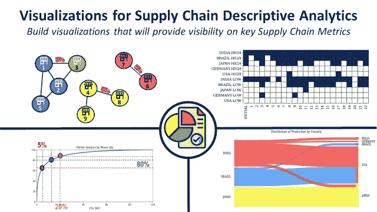

(图片由作者提供)

供应链分析可以定义为一套工具和技术，您的组织应该使用这些工具和技术从数据中获得供应链运营洞察。

在[之前的一篇文章](https://www.samirsaci.com/what-is-supply-chain-analytics-2/)中，我定义了回答不同类型运营问题的四种供应链分析。

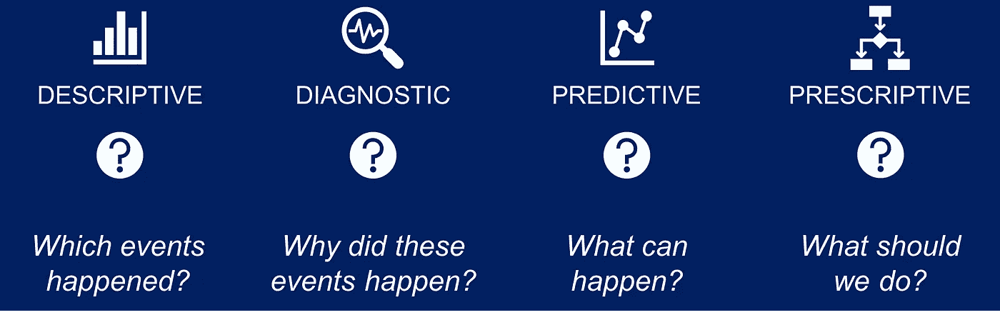

供应链分析的 4 个问题—(图片由作者提供)

它从建立**描述性分析**的基础开始，以监控现在和分析过去。

在这篇文章中，我将分享**四种用于描述性分析的 python 智能可视化**，它们提供了理解供应链的关键见解。

💌新文章直接免费放入你的收件箱:[时事通讯](https://www.samirsaci.com/#/portal/signup)

如果你更喜欢看，查看我的 Youtube 教程！

# 供应链网络

供应链可以定义为一个为向客户提供服务和商品而构建的流程和库存地点网络。

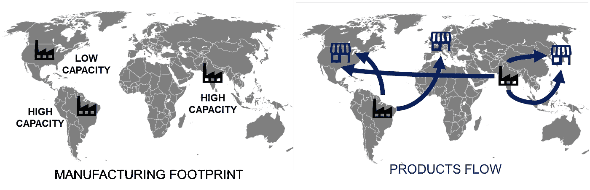

供应链网络—(图片由作者提供)

网络优化的主要驱动因素是制造地点的位置和流程的优化。

## 供应链流程

```
**❓ QUESTION 1**
Which factory is producing for Market XYZ?
```

你想通过画出**生产区**和**市场**之间的流动来了解你的网络的效率。

```
📊 **CHART 1**
Sankey Chart
```

在这张图表中，您可以看到所有不同的流程。左边是生产设施，右边是市场。

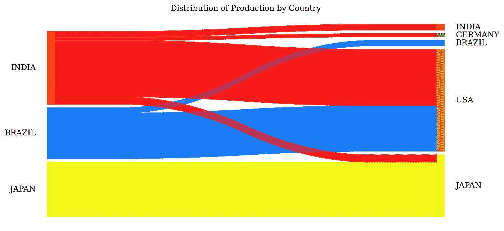

[生产流程桑基图](https://youtu.be/yUncQ6aFEBU)——(图片由作者提供)

```
**💡 INSIGHTS** - India is the biggest country for production output- Japan market demand is mainly supplied locally- USA and Germany do not have local production facilities📈 **DATA** 
You need to prepare a DataFrame with three columns: 
- Source: the production facility name
- Target: the market supplied
- Units: the number of items flowing
📚 **LIBRARY**
You can use pySankey
```

更多详情可以在我的[**GitHub 资源库**](https://github.com/samirsaci/visuals_analysis) 中找到源代码，以及本视频中的详细教程。

## 电力网设计

供应链网络优化充分利用数据分析，找到工厂和配送中心的最佳组合，以最低成本生产和交付产品。

```
**❓ QUESTION 2**
Which factories should I open to get an optimal network?
```

如果您的需求不稳定，您可以运行不同场景的模拟，并要求您的模型(基于线性规划)为每个场景提供最佳解决方案。

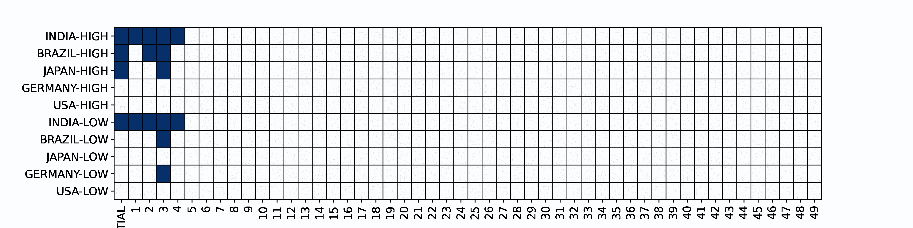

[动画剧情](https://youtu.be/VLv_Lbv07ms)不同场景——(图片由作者提供)

解决方案基本上是一组列出所有潜在位置的布尔决策变量:如果您打开位置 0 否则它们的值为 1。

```
📊 **CHART 2**
Boolean Plot
```

在此图表中，您可以看到 50 种不同场景的结果:

*   x 轴:场景的名称
*   y 轴:与设施相关的决策变量(深蓝色:开放，白色:关闭)

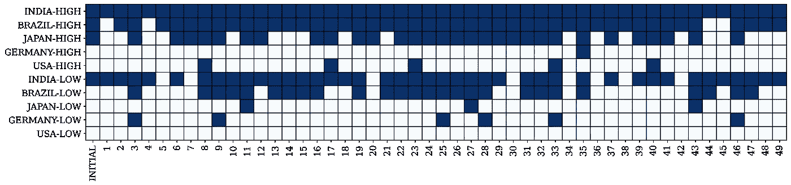

[供应链网络解决方案的布尔图](https://youtu.be/VLv_Lbv07ms)——(图片由作者提供)

```
**💡 INSIGHTS** - Initial solution with (Indian, Brazil and Japan High + India Low) is repeated in more than 5 five scenarios- Some extreme scenarios need only two factories in India
📈 **DATA** 
You need to prepare a DataFrame with the output of your optimization model (vectors with boolean parameters).
📚 **LIBRARY**
You can use matplotlib.pyplot.pcolor
```

更多详情可以在我的[**GitHub 资源库**](https://github.com/samirsaci/visuals_analysis) 中找到源代码，以及本视频中的详细教程。

# 产品轮换

在供应链管理中，**产品细分**是指**将具有相似**物流特征(如轮换)的产品分组的活动。

## 帕累托图

对产品进行分类非常重要，这样才能将精力分配到库存管理、优化仓库运营或设计货架布局上。

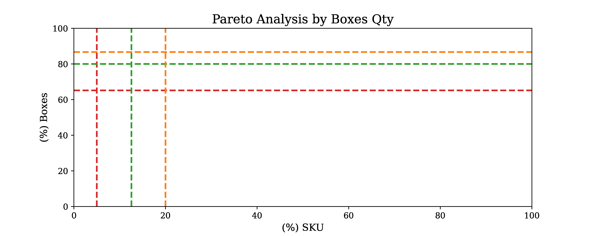

[帕累托图](https://youtu.be/d3J_sikm-Ns) &产品轮换—(图片由作者提供)

```
**❓ QUESTION 3**
How many references make 80% of my total turnover?
```

这种方法的基础是帕累托原则，也称为 80-20 法则。

大多数时候，你的少数产品(通常在 20%左右)创造了你的大部分出口量(通常在 80%左右)。

```
📊 **CHART 3**
Pareto Chart
```

该图可以显示您的产品轮换与帕累托定律的对比情况:

*   x 轴:投资组合的参考百分比(%SKU)
*   y 轴:它们所代表的出站量的百分比(%框数)

在这个特殊的例子中，你可以很快看到你的投资组合不到总投资的 20%,却贡献了 80%的对外交易量。

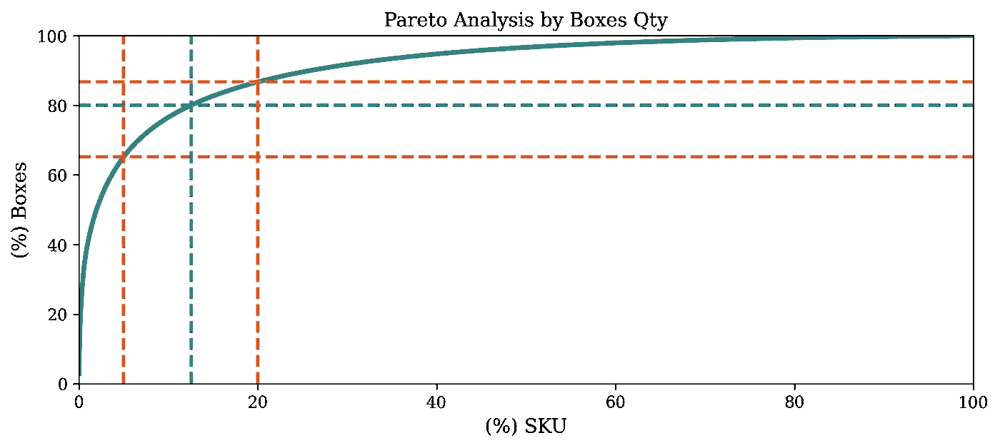

[排列图](https://youtu.be/d3J_sikm-Ns)——(图片由作者提供)

```
**💡 INSIGHTS** - Very high rotations (top 5%) make more than 60% of the volume- 20% of the portofolio represent 84% of the outbound volume📈 **DATA** 
You need to prepare a DataFrame with the outbound volume of each SKU, their contribution in the total volume and then calculate a cumulative sum.📚 **LIBRARY**
You can use matplotlib.pyplot for a simple plot.
```

更多详情，可以在我的[**GitHub 资源库**](https://github.com/samirsaci/visuals_analysis) 和**中找到源代码，详细教程见本视频。**

## **需求可变性的 ABC 分析**

帕累托图回答了这个问题:推动你大部分销售的参考是什么？

需求可变性
然而，如果你想知道如何将你的努力分配给库存管理，你需要包括另一个参数:需求可变性。

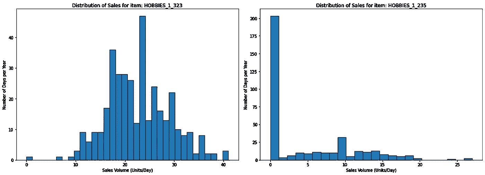

需求分布的两个不同例子—(图片由作者提供)

事实上，如果一个产品有稳定的需求，它需要的关注和优化会比一个需求非常不稳定的产品少。

因此，您希望在产品分类中结合销售分布和需求可变性。

*   平均销售额:
*   标准偏差:
*   变异系数:CV = σ/

对于 CV 值**高的 SKU，您可能会面临**不稳定的客户需求**，这将导致工作量高峰、预测复杂性和缺货。**

**Plot CV = f(%Sales)** 为了了解哪些产品会带来计划和分销方面的挑战，我们将计算每个参考的销售年度分布的变异系数。

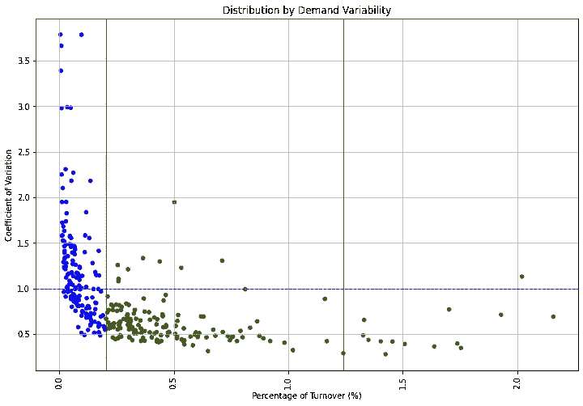

CV = f(%销售额)对于爱好 SKU —(图片由作者提供)

A 类产品(红色):前 5%

*   CV>1 的项目:高资源分配以管理其库存，因为它们代表了需求非常不稳定的大部分收入

B 类产品(绿色):15%以下

*   CV <1: you can manage them with generic rules
*   Items with CV> 1 的项目:分配适度的努力和资源以最小化缺货

C 级产品(蓝色):80%剩余慢速跑步者

*   为这些跑得慢的人分配最少的努力和资源

# 物流绩效

您的分销网络的表现可以用一句话来概括

> 您是否完全按时交付您的最终客户？

这是通过分析、运营审查和持续改进计划推动绩效管理的核心问题。

## 装运跟踪

供应链描述性分析使用分销链中不同系统生成的数据来跟踪货物经过的每个步骤的时间戳。

在战术层面上，您拥有跟踪最近创建的订单状态的分销计划团队。

```
**❓ QUESTION 4**
Where are my shipments?
```

从订单创建到商店交付，您的货件经历了不同的步骤:

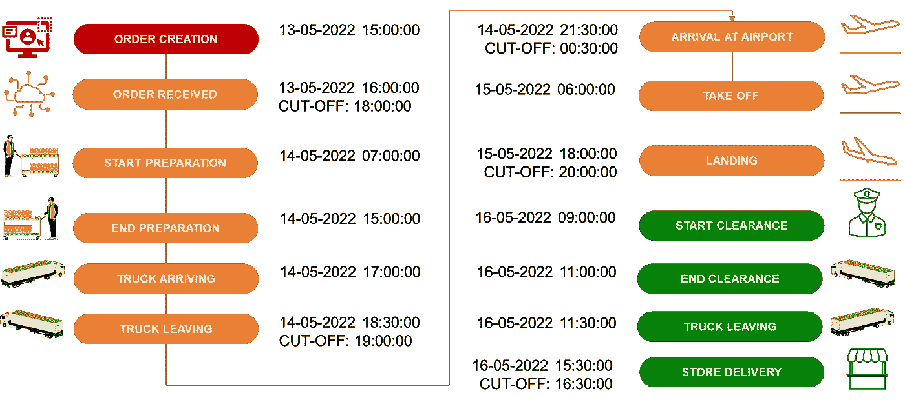

商店送货示例—(图片由作者提供)

对于每一步，您的系统会在流程开始和结束时记录时间戳。

```
📊 **CHART 3**
Stacked Bar Plot
```

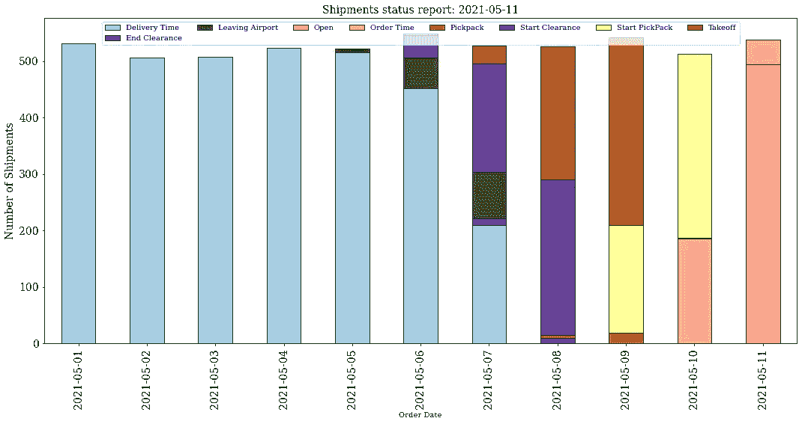

装运状态的堆积条形图—(图片由作者提供)

在时间 t，此图表显示了按当前状态划分的装运:

*   x 轴:订单按订单创建日期分组
*   y 轴:装运数量
*   图例:您的货件从订单创建到商店交付的当前状态

```
**💡 INSIGHTS** - 100% of the orders created before 05th May are delivered
- A majority of the shipments created the 8th are blocked in the clearance📈 **DATA** 
You need to prepare a DataFrame by grouping orders by creation date and current status and count them.📚 **LIBRARY**
You can use matplotlib.pyplot for a bar plot selecting stacked=true
```

更多详情可以在我的[**GitHub 资源库**](https://github.com/samirsaci/visuals_analysis) 中找到源代码。

# 结论

*关注我的媒体，获取更多与数据分析和供应链管理相关的文章。*

## 物流绩效管理

这些非常简单的图表可以为供应链设计、优化和监控提供非常有价值的见解。

连接不同的系统后，您可以详细了解补货订单创建和商店交付之间的每个步骤。

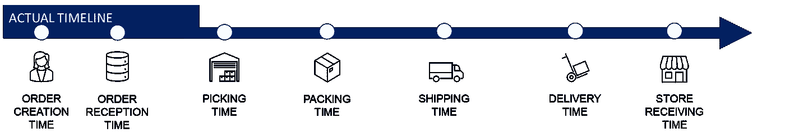

带有时间戳的端到端分发流程—(图片由作者提供)

*   **订单接收时间**:订单在 WMS**接收**并准备入库时的时间戳
*   **仓库操作** : [**拣货**，**装箱**，**出货**](https://youtu.be/XejgbF2m_8g) 由 WMS 跟踪
*   **运输**:订单从**出货**到**交货**的跟踪
*   **门店收货**:当**门店团队**正在**接收**ERP 中的出货时的时间戳

在订单创建过程中，计划员会添加一个**要求交付日期**，该日期可用于计算每个流程的目标时间。

这可用于计算可用于管理物流绩效的全部准时(OTIF) KPI

*   构建视觉效果来衡量每个流程的 OTIF 和交付周期
*   进行延迟交付的根本原因分析，以确定流程故障
*   实施持续改进计划来解决这些问题

欲知详情，

[](https://www.samirsaci.com/logistic-performance-management-using-data-analytics/)  

# 关于我

让我们连接上 [Linkedin](https://www.linkedin.com/in/samir-saci/) 和 [Twitter](https://twitter.com/Samir_Saci_) ，我是一名供应链工程师，正在使用数据分析来改善物流运营和降低成本。

如果你对数据分析和供应链感兴趣，可以看看我的网站

[](https://samirsaci.com) 