# 4 个 SQL 过滤概念，改善您的数据争论游戏

> 原文：<https://towardsdatascience.com/4-sql-filtering-concepts-to-improve-your-data-wrangling-game-91284393356c>

## 让我们了解一些常见的 SQL 过滤技巧，数据科学家可以用它们来加快查询速度


照片由贾费尔·尼扎米@unsplash.com 拍摄

作为数据科学家，我们大多数人习惯于使用 *pandas* (在 Python 上)或 *dplyr* (在 R 上)*来过滤表格。*事实上，在两个库中，以及在我们用来编写算法的语言环境中，都有一些更方便的争论操作。

但是，如果您的数据源位于某个数据库中(并且您可能使用一些 SQL 接口来访问它)，那么使用 SQL 代码并在服务器端执行这些操作，一些过滤器和表操作会更有效。

**过滤表格是使用 SQL 时最常见的操作之一。从表面上看，它们似乎很简单，你只要加上一个子句就行了。但是..过滤器不只是看起来那么简单，而且会很快变得复杂。**

学习如何应用不同的过滤方法并利用带有`IN`、`AND`、`OR`、优先级和通配符的`WHERE`子句将极大地改进您的 SQL 游戏。在本帖中，我们将探索在从表中过滤行时可以应用的那些额外的技巧。**在这篇文章结束时，你应该能够理解大多数 SQL 查询中最复杂的** `WHERE` **语句。**

我将使用一个包含学校学生数据的示例表——该表完全是虚构的，所有姓名和信息都是虚构的。我正在一个`sandbox`数据库中创建这个表:

```
create table sandbox.students (
 student_id integer auto_increment primary key,
    student_full_name varchar(30),
    favorite_classes varchar(150),
    student_age integer,
    birth_date date,
    degree varchar(30)
    );

insert into sandbox.students (
 student_full_name, favorite_classes, student_age, birth_date, degree
) values ('John Smith', 'Mathematics, Political Science, Biology', 23, '1999-03-01', 'Engineering'),
 ('Amy Smith', 'History, Political Science, Biology', 23, '1999-03-01', 'History'),
    ('Joe Adams', 'History, Mathematics', 23, '1999-06-01', 'History'),
    ('Joe Williams', 'Biology, Chemistry', 22, '2000-03-01', 'Chemistry'),
    ('Anne Williams', 'Mathematics, Arts', 22, '2000-03-16', 'Mathematics'),
    ('May Taylor', 'History, Geography', 22, '2000-05-19', 'History'),
    ('Zoe Brown', 'Physical Education, History', 21, '2001-02-18', 'Physical Education'),
    ('Jennifer Davies', 'Biology, Chemistry', 21, '2001-03-19', 'Chemistry'),
    ('Robert Jones', 'Chemistry, Biology, Mathematics', 21, '2001-06-02', 'Chemistry');
```

我们的学生表包含 9 名大学生的数据——虽然样本很少，但这应该足以理解我们将探讨的过滤概念之间的主要差异。

让我们改进我们的 SQL 游戏！

# 和/或

这两个子句之间的区别——`AND`、`OR`——在过滤器中非常重要，并且考虑到了其他编程语言中常用的逻辑操作。

想象一下，从我们的*学生*表中，我们想要对“化学”专业的所有学生进行分组。使用标准的`WHERE`子句很容易做到，比如:

```
select * from sandbox.students
where degree = 'Chemistry'
```

这将输出所有的*化学*学生，在本例中为 3:

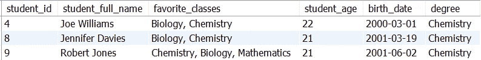

返回数据-化学专业学生-作者图片

但是，如果我们只是想对 21 岁的化学系学生进行分组呢？我们可以用一个`AND`子句做到这一点:

```
select * from sandbox.students
where degree = 'Chemistry' AND student_age = 21;
```

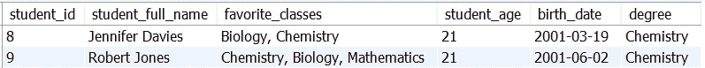

返回数据—21 岁的化学专业学生—图片由作者提供

`AND`子句使我们能够选择两个条件**并且只选择**与两个条件完全匹配的行。在这种情况下，我们只选择`degree = 'Chemistry'` **和** `student_age = 21` —这两个条件都必须与输出集中要返回的行相匹配。

很自然，一个问题出现了。如果我们只想匹配其中一个条件呢？这意味着我们希望选择匹配第一个条件**或第二个条件**的行——这在 SQL 中也非常简单，使用`OR`子句:

```
select * from sandbox.students
where degree = 'Chemistry' OR student_age = 21;
```

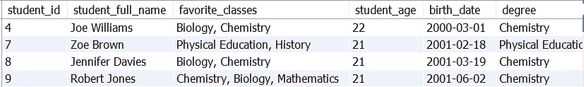

返回数据—化学或 21 岁学生—作者图片

请注意，我们在这个结果中有 4 名学生，这是因为我们选择了有`degree = 'Chemistry'` **或** `student_age = 21`的学生。在这种情况下，学生只能匹配`WHERE`子句中的一个条件。

这就是为什么我们有一个体育生在那里，那个学生 21 岁，只符合那个条件。

这是 SQL 过滤器中最简单有效的概念之一。然而，您会注意到，当您开始使用多个`AND`和`OR`子句时，事情会变得相当混乱。这就是过滤优先级进入画面的地方。

# 运算符优先级

SQL 允许在同一个`WHERE`中组合多个`AND`和`OR`条件。这真的很酷，但是也增加了我们查询的复杂性。

幸运的是，通过学习过滤优先级，我们能够浏览更复杂的过滤器背后的逻辑。运算符优先逻辑模仿了我们从数学方程中了解到的内容，例如，想象以下 SQL 查询与我们的学生表:

```
select * from sandbox.students
where degree = 'Chemistry' OR student_age = 23 AND favorite_classes = 'History, Mathematics';
```

这个查询的输出是什么？

如果您直接阅读该查询，您认为 SQL 会选择所有拥有化学学位或 23 岁但同时他们最喜欢的课程是历史和数学的学生吗？

哇，这句话真让人费解。让我们把它拆开。

极其重要— `AND`优先于`OR`！这意味着与`AND`相关的子句将作为一个子句连接在一起，因此我们正在搜索:

*   23 岁的学生最喜欢的课是“历史、数学”；

由于`AND`这两个子句是同时处理的，我们姑且把这个**子句称为 1** 。

好的，那么`degree = 'Chemistry'`会从哪里进入画面呢？这个子句是我们在搜索中包含的另一个子句:

*   每个有`degree = 'Chemistry'`的学生

姑且称之为**第二条款。**

继续，我们正在搜索所有符合条款 1 `OR`条款 2 的学生。**这意味着一个不是 23 岁的学生，如果他最喜欢的学位是化学，那么在我们的查询中仍然可以选择他最喜欢的课程是历史和数学。**

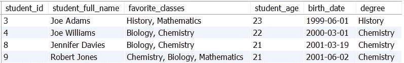

返回数据-喜欢历史和数学的化学系学生+ 23 岁-图片由作者提供

底线是，SQL 过滤的第一条戒律是:`AND`优先于`OR`。第二条戒律是，我们可以使用括号来覆盖这些规则，就像我们在数学方程中所做的那样:

```
select * from sandbox.students
where (degree = 'Chemistry' OR student_age = 23) AND favorite_classes = 'History, Mathematics';
```

在这种情况下，操作略有不同— **条款 1** 将是:

*   拥有化学学位或 23 岁的学生。

而**第二条**是:

*   喜欢历史和数学课的学生。

在这种情况下，我们希望:“每个有历史和数学课的学生，无论是化学还是 23 岁。**在这种情况下，只有一个学生符合条件:**

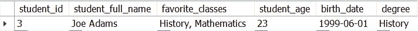

返回数据-喜欢历史和数学的 23 岁或化学专业的学生-图片由作者提供

注意一个括号是如何改变整个查询结果的！运算符优先级非常重要，会完全改变返回数据的结果。总之:

*   `AND`优先于`OR`
*   括号改变了优先级，并人为地为括号内的代码创建了一个优先级。

不错！让我们继续另一个概念，用多个`OR`条件减少我们代码的重要部分。

# 在/不在

`IN`和`NOT IN`操作符是编写需要同时匹配多个元素的条件的非常酷的方式。例如，假设我要求您从表中筛选出以下学生:“乔·亚当斯”、“约翰·史密斯”和“艾米·亚当斯”。

知道了`OR`条件，您可以立即编写以下查询:

```
select * from sandbox.students
where student_full_name = 'Joe Adams' or student_full_name = 'John Smith' or student_full_name = 'Amy Smith';
```

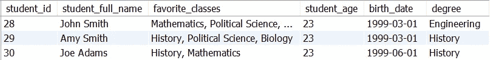

返回数据-约翰·史密斯、艾米·史密斯或乔·亚当斯-作者图片

这似乎是一个合理的结果，但是..假设你想从 20 个名字中挑选一个？真的要把`OR`条件写 20 遍吗？我觉得不是！

幸运的是，我们有`IN`操作员来帮助我们！

```
select * from sandbox.students
where student_full_name IN ('Joe Adams','John Smith','Amy Smith');
```

`IN`操作符作为一个多重`OR`条件，但是以一种更优雅的方式编写。在`IN`内部，我们可以添加多个元素进行匹配，而无需多次重复`"or student_full_name ="`。

`NOT IN`的工作方式完全相同，但它不包括括号内的元素:

```
select * from sandbox.students
where student_full_name NOT IN ('Joe Adams','John Smith','Amy Smith');
```

这将选择所有学生**，除了**在`IN`子句中的学生:

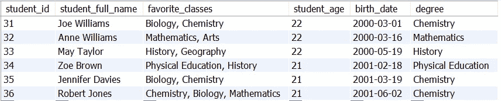

返回数据-约翰·史密斯、艾米·史密斯或乔·亚当斯-作者图片

`IN`子句非常酷和方便——我们可以用它来避免编写非常长的 SQL 语句。

# 通配符

我们最后的 SQL 过滤概念是通配符。通配符对于基于“子集”条件过滤非常有用。

例如，假设我们希望选择姓氏为“Smith”的所有学生—当然，我们可以拆分列来实现这一点，但是，如果我们知道如何应用通配符，这将是不需要的额外代码。

通配符以三个不同的元素为中心:

*   `LIKE`条款；
*   `%`人物；
*   `_`字符；

从我们的示例开始—选择姓氏为“Smith”的所有学生:

```
select * from sandbox.students
where student_full_name LIKE '%Smith';
```

在这个通配符选择中，`%`的作用是“不管 Smith 之前是什么”。将这个查询转换成一个句子，我们选择“全名以“Smith”结尾的每一行，不管前面是什么”。

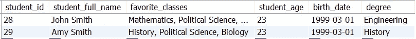

返回数据-所有姓“Smith”的学生-图片由作者提供

如果我们想从表中选择所有的“Joe ”,该怎么办？那很简单！我们只是将通配符`%`放在我们正在搜索的元素的末尾:

```
select * from sandbox.students
where student_full_name LIKE 'Joe%';
```

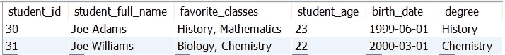

返回数据-名字为“Joe”的所有学生-作者图片

酷！所以`%`总是以这种方式工作——它使得我们的查询不知道我们正在搜索的字符串之前或之后是什么。我们也可以使用双面`%`:

```
select * from sandbox.students
where student_full_name LIKE '%am%';
```

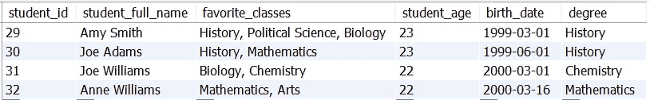

返回数据-姓名中带有“am”的所有学生-按作者分类的图片

最后一个查询将搜索姓名中包含“am”的所有学生。 **Am** y Smith，Joe Ad **am** s，Joe Willi **am** s，Anne Willi **am** s，双面`%`不关心我们同时搜索的字符串之前或之后的内容。

最后，我们来检查一下`_`人物:

```
select * from sandbox.students
where student_full_name LIKE '_o%';
```

`_`明确指出了我们搜索特定字母或字符串的位置。例如，这里我们搜索第二个位置包含“o”的所有名称，这将产生:

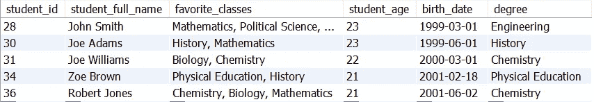

返回数据-姓名第二个字母为“o”的所有学生-作者图片

所有这些学生的第二个字母都是“o”。如果我们只想要名字的第三个字母有“e”的学生呢？有了`_`这个角色也很容易！

```
select * from sandbox.students
where student_full_name LIKE '__e%';
```

因为我们现在想要“名字”的第三个位置——我们添加了两个下划线:`__`。该查询产生:

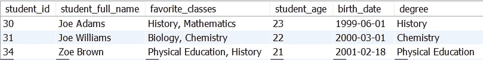

返回数据-姓名第三个字母为“e”的所有学生-作者图片

通配符是非常酷的过滤元素！掌握通配符将简化您的查询，并使它们真正高效。

我们完事了。感谢你花时间阅读这篇文章。SQL 是一种非常酷的语言，可以为我们的数据争论游戏打气。

作为一名数据科学家，很有可能最终会使用存储在数据库中的数据——掌握其中一些概念将会提高您的生产率和代码效率。

***我在***[***Udemy***](https://www.udemy.com/course/sql-for-absolute-beginners/?referralCode=23E560A160F7202E026F)***上开设了一门关于从零开始学习 SQL 的课程，我在其中深入探讨了这些概念以及更多内容——这门课程适合绝对的初学者，我希望你能在我身边！***

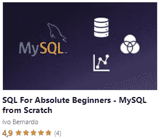

[SQL 绝对初学者](https://www.udemy.com/course/sql-for-absolute-beginners/?referralCode=23E560A160F7202E026F) —图片由作者提供

[](https://ivopbernardo.medium.com/membership) [## 通过我的推荐链接加入 Medium-Ivo Bernardo

### 作为一个媒体会员，你的会员费的一部分会给你阅读的作家，你可以完全接触到每一个故事…

ivopbernardo.medium.com](https://ivopbernardo.medium.com/membership)