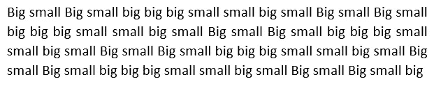
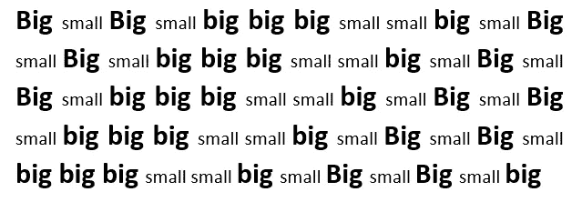
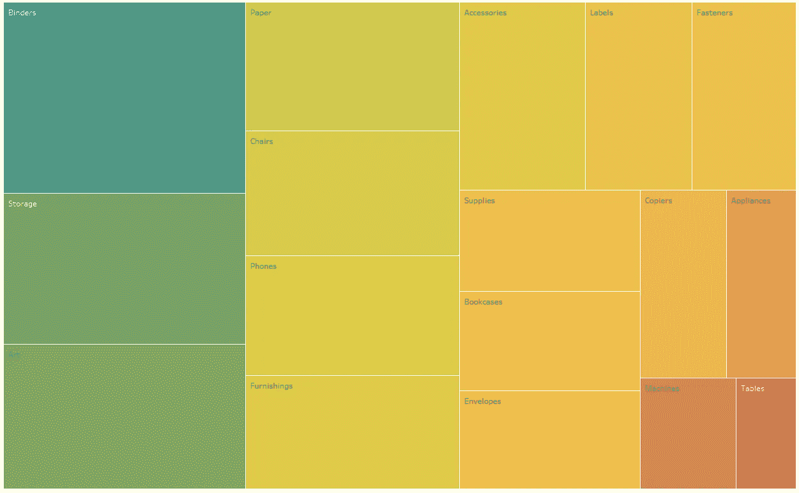
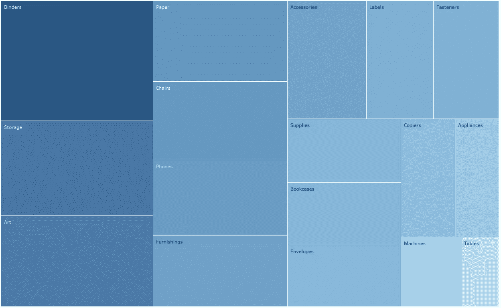
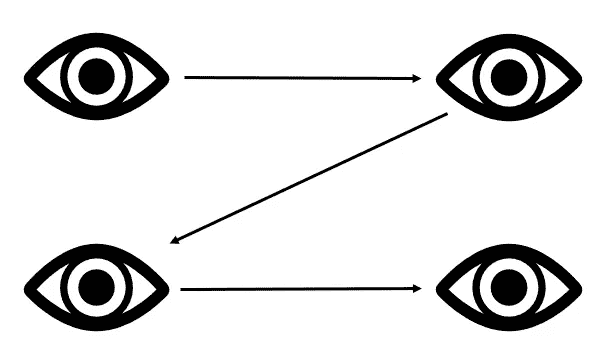
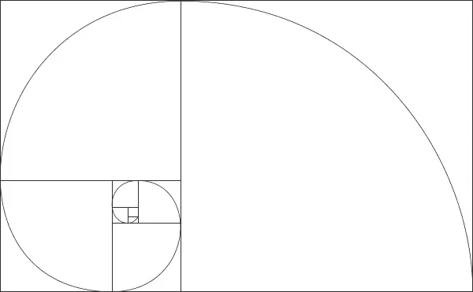
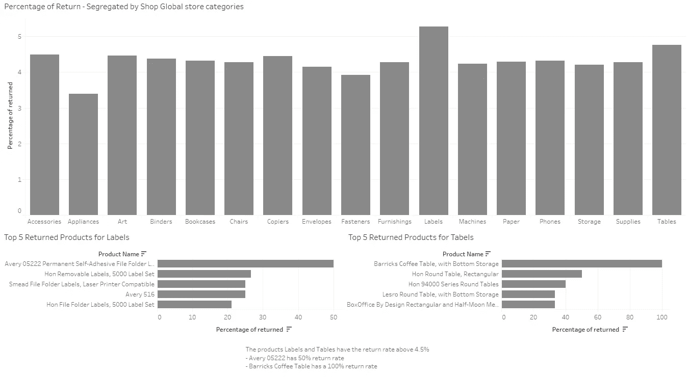
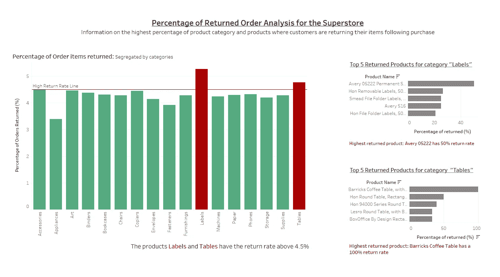

# 利用大脑进行数据可视化的 4 个步骤

> 原文：<https://towardsdatascience.com/4-steps-to-leverage-the-brain-for-your-data-visualisations-6b02c2baafc4>

## 数据可视化

## 预先注意的属性以及为什么你必须使用它们

作者创建的图片|使用了来自[canva.com](http://canva.com/)的免费内容许可元素

作为数据爱好者，我们需要制作可视化产品来适应所有利益相关者。让我们用一点科学来得出我们可视化的结论。我们每天都会接收大量的数据，但是我们的大脑能够通过过滤掉我们所看到的大部分内容，以惊人的速度处理这些数据。我们通过一个叫做*前注意处理*的过程做到这一点，这是当我们无意识地和自动地注意到我们环境中的某些视觉刺激时。这一切发生得如此之快，以至于我们甚至没有意识到我们正在这样做。这就是为什么某些视觉元素可以如此容易地抓住我们的注意力。这些视觉元素被称为 ***前注意属性*** ，它们包括大小、颜色和在页面上的位置等。

# 我们的记忆类型

要理解这是为什么，我们必须首先解释记忆是如何工作的。

## 标志性记忆

你有没有过这样的经历:用眼角看到一样东西，当你转头去看的时候，它不见了？那是你的大脑超速运转，快速有效地处理信息。这种能力被称为形象记忆，它是我们作为一个物种早期的残余，当时捕食者一直是一种威胁。我们的大脑已经进化到能够非常迅速地感知环境的微小变化，这帮助我们生存下来。今天，我们可以用同样的能力来创造有效的视觉交流，抓住人们的注意力并与他们保持联系。所以下次你看到稍纵即逝的东西，不要担心，这只是你的大脑在做它的工作。

## 短期记忆

任何心理学家都会告诉你，短期记忆是出了名的不可靠。事实上，最近的研究表明，在任何给定的时间，人们在短期记忆中只能保留大约四块视觉信息。这意味着，如果我们试图在一张图中塞进太多的信息，我们的观众很可能会不知所措，并放弃试图破译它。因此，为了避免让我们的观众的短期记忆超载，我们需要注意在每个图表中包含多少信息。当有疑问时，少就是多。

## 长期记忆

还记得那次你忘了你演示的数据可视化吗？然后你不得不用你在网上找到的随机饼图即兴发挥？我们都经历过。好消息是，有一个科学理由，数据可视化比纯语言数据更有可能帮助我们回忆信息。这都与长期记忆有关。长期记忆是视觉记忆和言语记忆的总和，两者作用不同。语言记忆是通过神经网络获得的，在神经网络中，路径对于识别或回忆变得很重要。另一方面，视觉记忆有专门的结构。这对我们的数据可视化意味着，通过结合视觉和语言，我们为自己的成功做好了准备

## 这是什么意思？

我们可以利用图标记忆、短时记忆和长时记忆与前注意属性的组合来创建既有粘性又有信息的数据可视化。图标记忆是这样一种记忆，它让我们只需要一些线索就能回忆起一幅图像。例如，可口可乐的标志是一个很容易识别的图像。短期记忆更多的是关于记忆模式，而不是回忆一幅图像。例如，如果我们看到数据可视化使用对比色来突出重要的数据点，我们很可能会记住这种模式，并能够将其应用于其他数据集。长期记忆使我们能够长时间回忆起信息，包括视觉和语言。我们可以用前注意属性来优化这一点。

# 我们为什么想要这个？

使用前注意属性主要有两种方式:引导注意力和创造视觉层次。

## 引导注意力:

预先注意属性可以用来引导你的观众的注意力到你希望他们关注的地方。例如，如果你想让你的观众把注意力集中在某个数据点上，你可以让那个数据点的尺寸更大或者颜色更饱和。

## 创建视觉层次结构:

前注意属性也可以用来创建元素的可视化层次结构。这意味着有些元素会比其他元素更重要，会首先吸引我们的注意力。例如，如果您想让读者先阅读某段文本，您可以将该文本放大或靠近页面中央。

# 前注意属性——4 个步骤

对于这一点，为了更好地解释特性，最好向您展示。

## 1.尺寸:

元素的大小是最重要的预先注意属性之一。尺寸较大的元素会比尺寸较小的元素更容易吸引我们的注意力。相对大小表示相对重要性。在创建视觉传达时，请记住这一点。如果你要展示多个具有同等重要性的物品，那么让它们的尺寸都一样。或者，如果只有一个真正重要的部分，用大来表示:让它变得明显！

我们来做个快速练习，数数下面写了多少次大这个词。

要计数的大小单词的图片—由作者创建

对于真正尝试过的人来说，正确答案是 33。或者是 34…现在我怀疑自己…这很难做到！

用 size 的前注意属性再试一次。

要计算的大小单词的图片—由作者创建的图像

容易多了，对吧？现在我确定是 33 岁。有了它，我们能够:

*   a)请注意“大”这个词
*   b)创建一个层次结构，大是更重要的词。

## 2.颜色:

颜色是另一个重要的前注意属性。饱和度较高、较亮的颜色会比饱和度较低、较暗的颜色更容易吸引我们的注意力。

尽管如此，不要对色彩着迷！

注意，当使用太多的颜色时，我们会失去原有的价值。它就变成了一道彩虹:

热图示例 1:作者生成的图像和数据

上面是一个有着广泛光谱的热图，在上面的例子中，它在正确的上下文中几乎没有问题。例如，它显示代表温暖程度的颜色；红色是最热的，蓝色是最冷的。因为颜色是有序的，所以会更好。但是想象一下，你有一张随机排列的不同颜色的热图，这对眼睛来说就不那么容易了。所以做一些更微妙的事情，像下面这样:

热图示例 2:作者生成的图像和数据

如上所述，简单大方是最好的方法。

**确保颜色一致**

当你有一系列充满数据可视化的幻灯片时，确保每一页都有相同的颜色代表相同的东西。例如，在您的第一个图表中，红色代表订单退货，但在下一张幻灯片中，您选择了绿色。观众将不得不重新连接他们的大脑来联想这个；精神疲劳是真实存在的！保持颜色一致。

**想起色彩的基调**

许多颜色代表一些东西。在大多数社会中，红色意味着坏，绿色意味着好。橙色/红色表示热，蓝色表示冷。如果观众可以很容易地将这些颜色与他们从以前的经验中已经知道的联系起来，这将导致观众立即更好地理解。

## 3.页面上的位置:

元素在页面上的位置也很重要。靠近页面中心的元素比靠近页面边缘的元素更容易吸引我们的注意力。但是有更多的科学依据，所以让我们来评估一下:

**空格**

空白是你的朋友，不要害怕留下很多空白。空白导致简单。这使得大脑更容易在页面上的元素之间得出结论。杂乱是你的敌人，让事情尽可能简单！

**之字形法则**

在当今的大多数社会中，我们从左到右阅读页面。自然地，当看数据可视化时，我们的眼睛仍然遵循之字形模式。如果在演示时，你先告诉观众看页面的底部，然后再看顶部，这是非常尴尬的。对大多数人来说这是不自然的。将作品展示给你的观众，按照从上到下，从左到右的顺序进行。

之字形原则:由作者生成的图像

**黄金螺旋**

黄金螺旋是一个数学概念，可以应用于数据可视化，以使它们更和谐，更具视觉吸引力。螺旋是从圆心的一点开始，然后围绕它画一系列同心圆而生成的。每个圆圈比前一个稍大，形成一个螺旋形状。通过确保将最重要的数据点放置在可视化的中心，将不太重要的数据点放置在远离中心的位置，可以将相同的原理应用于数据可视化。这将创建一个更具视觉吸引力的数据可视化，使人们更容易理解。

下面是黄金螺旋的描述。

黄金螺旋——摄于 freepik.com

你可以把最重要的观想/订书钉作为焦点。一个人的眼睛会自然地移向那里，使观想更加吸引人。有关这方面的更多信息，请参见以下内容:

 [## 设计师黄金比例指南

### 自从我们开始创造以来，好的设计就一直是争论的话题。有无止境的论坛，社交媒体线程…

medium.com](https://medium.com/inside-design/a-guide-to-the-golden-ratio-for-designers-b727ce1739ca) 

## 4.其他前注意属性

预先注意的属性不仅仅局限于大小、颜色和位置，你可以添加许多更多的特征来帮助你的可视化。这可能意味着箭头，趋势线，参考线等。在下面的例子中，我在图表中添加了一条参考线来显示重要性和背景。

# 示例:改进图表

现在我们已经概述了所有的功能和步骤。让我们使用一个示例图表，并通过引入前注意属性来改进它。

## 前思想

请记住，我们的目标是:

*   引导观众去理解什么是重要的
*   创建一个视觉层次。

不要忘记在实现属性之前，记住以下关于内存的内容:

*   图标记忆:一定要用视觉刺激来触发这种记忆
*   短期记忆:少即是多！整理和简化
*   长期记忆:结合视觉和语言，创造模式

## 这个例子

下面是一个形象化的例子，告诉我们一个关于全球超市产品退货率的故事。

一些背景:

*   作为分析师，我们希望向利益相关者展示哪一类产品的退货率较高(客户在购买后会退回产品)。
*   公司指南说，任何大于 4.5%的百分比都被归类为高回报率的子类别。

空白超市图表示例—作者生成的图表和数据

正如你从上面看到的，这是我们需要告诉观众超市退货情况的所有信息。如果你不知道发生了什么，不要担心，这应该代表一种糟糕的观想。这里有几个问题:

*   文本大小没有区别——因此没有视觉层次，也没有提示告诉我往哪里看；我不知道先看什么。
*   这些标题看起来不够重要，我无法理解。
*   颜色是灰色的，这对我的视觉效果没有任何帮助。
*   这张图表太乱了。难以破译
*   我必须努力寻找回报率高于 4.5%的类别。对于我来说，没有明确的界限或线来快速找出哪个棒线高于 4.5%
*   我不知道为什么底部的两个图表只显示了类别“标签”和“表”的前 5 个返回产品，是因为这两个类别的返回最高吗？在这一点上，我没有线索，除非我适当地研究这一页。

## 改进

让我们将前注意属性的概念应用到这个图表中。

改进的前注意属性图表——图表和数据由作者生成

在各种预先注意属性改进之后，图表现在在绘制层次结构和关注需要关注的领域方面更加清晰。请参见下文，重点介绍各种特性和改进。

*   页面上的位置:空白；有了更多的空白，图表看起来更容易，结论也更容易得出
*   页面上的位置:黄金螺旋；如果你回头看看黄金螺旋，我把信息中最重要的部分(主要回报百分比图)放在了左下角，覆盖了屏幕的大部分。观众会很自然地将他们的目光转向这个信息中最重要的部分。
*   页面上的位置:之字形规则；从信息量的角度来说，一个观众会先看标题，看图表，看右侧的信息，只有看完主绿/红图表才能理解。我们讲述了它是什么、主要信息和进一步的细节(例如，返回次数最多的前 5 种产品)
*   尺寸；我们在这里使用大小来区分信息的重要性，并把观众吸引到最重要的元素上。每个图表的大小突出了哪个图表是最重要的。一些文本标题有较大的文本来描述信息的重要部分。如果观众选择寻找更多的细节，标题的较小部分只是更多的信息。
*   颜色:图表颜色；前面我提到了色调以及它们所代表的含义。在这种情况下，红色代表不好，用于区分回报率高于 4.5%的类别。观众可以立即看到这两个类别是他们关注的焦点。
*   其他特征:参考线；现在有一条红色参考线，让观众知道 4.5%在哪里，哪个类别超过了这个百分比。
*   颜色:红色文本；我还使用红色文本来突出从图表中得出的重要结论/特征，以使观众更容易理解。

总之:我使用了前注意功能来关注信息的某些部分，并从观众那里引出一个故事。立刻，用一个加粗的标题，我们告诉观众这个页面是什么。然后，从主图表中，他们可以清楚地看到类别“标签”和“表格”的销售具有 4.5%以上的“高回报率”。从这里，他们可以看到这些类别中排名前 5 位的产品，这些产品恰好是 Avery 0522 和 Barrick 的咖啡桌。

# 一锤定音

正确使用时，前注意属性可以成为数据可视化的有力工具。通过理解人们是如何看待的，并利用这些知识为你创造优势，你可以创造出更有效、更容易让你的观众理解的视觉效果。下一次观想时，不要忘记记忆的类型和属性；尺寸、颜色、位置以及其他有助于得出结论的信息。我们让观众不用想太多！

> 如果你喜欢这篇文章，请留下掌声和关注支持！

或者，如果您有兴趣加入 Medium 社区，这里有一个推荐链接:

 [## 通过我的推荐链接加入 Medium-Adrian caus by

medium.com](https://medium.com/@adrian.causby15/membership) 

## **参考书目**

我在数据可视化方面实践的许多原则来自这本被强烈推荐的书:“用数据讲故事；Cole Nussbaumer Knaflic 的《商业专业人员数据可视化指南》