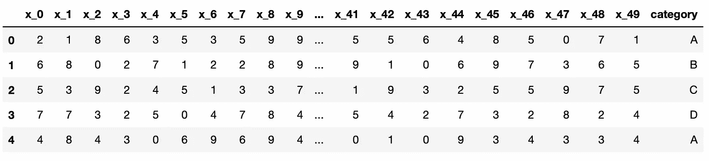
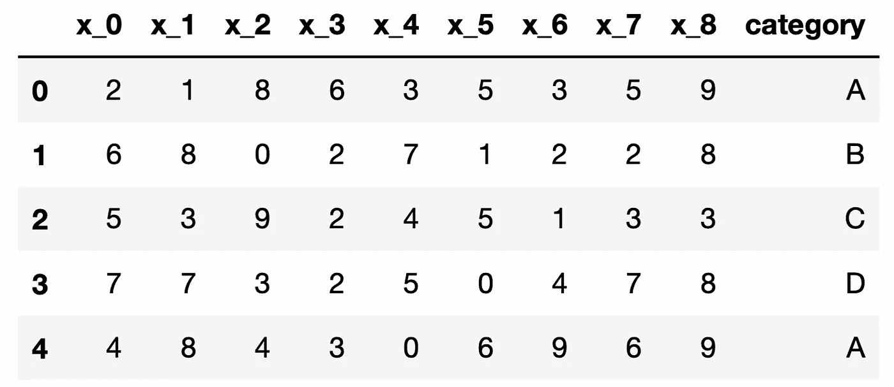

# 将熊猫扩展到大型数据集的 4 种技术

> 原文：<https://towardsdatascience.com/4-techniques-for-scaling-pandas-to-large-datasets-acf8805d30eb>

## 提高效率的技巧


S. Tsuchiya 在 [Unsplash](https://unsplash.com/s/photos/large?utm_source=unsplash&utm_medium=referral&utm_content=creditCopyText) 上拍摄的照片

Pandas 是数据科学生态系统中最常用的工具之一。它通过提供大量具有易于理解的语法的函数，使得操纵和分析表格数据变得非常容易。

虽然 Pandas 在数据分析和操作方面处于领先地位，但当数据变得非常大时，它的性能开始下降。

# 是什么让熊猫跑得更慢

主要原因是 Pandas 做内存分析，所以如果数据集大于内存，使用 Pandas 就变得非常困难，或者不可能。

此外，即使数据集有足够的内存，使用 Pandas 也是一个挑战，因为一些操作会产生中间副本。为了对熊猫有流畅的体验，数据集应该相对小于内存。

既然我们在谈论性能，就不可避免地提到熊猫使用单个 CPU 核心来执行操作。在非常大的数据集上，这使得 Pandas 比提供分布式计算的工具要慢。

在本文中，我们将介绍 4 种技术，它们有助于 Pandas 在处理非常大的数据集时更加高效。

值得注意的是，对于 Dask、Vaex、Modin 和 Datatable 等非常大的数据集，还有其他工具和库是更好的选择。

我们不会在本文中讨论这些工具。相反，我们的重点是如何让熊猫更适用，表现更好。

# 1.你真的需要所有的数据集吗？

数据是数据科学中最有价值的资产，因此我们倾向于收集尽可能多的数据。然而，我们并不需要所有任务的所有数据。

数据集可能包含冗余的列，或者对于特定的任务，我们可能只需要几列。

与其读取整个数据集，然后过滤所需的列，不如只读取我们需要的列。

让我们首先生成一个数据集。下面的代码片段创建了一个有 51 列和 1000 万行的 Pandas DataFrame。50 列用 0 到 10 之间的随机整数填充，另一列包含 A、B、C 和 d 的字符串值。我的计算机花了大约 1 分钟来生成这个数据集。

```
import pandas as pd
import numpy as np

df = pd.DataFrame(np.random.randint(0, 100, size=(10000000, 50)))
df = df.rename(columns={i:f"x_{i}" for i in range(50)})
df["category"] = ["A", "B", "C", "D"] * 2500000
```



df 的前 5 行(图片由作者提供)

该数据帧的内存使用量约为 4 GB。

```
np.round(df.memory_usage().sum() / 10**9, 2)

# output
4.08
```

在现实生活中，我们可能有比这个大得多的数据集，但这足以证明我们的情况。

我想做一个简单的过滤操作，并衡量它需要多长时间。

```
%time df[df["category"]=="A"]

# output
CPU times: user 519 ms, sys: 911 ms, total: 1.43 s
Wall time: 2.43 s
```

大概花了半秒钟。我们还可以测量根据一列或多列中的值对行进行排序需要多长时间。

```
%time df.sort_values(by=["x_0", "x_1"])

# output
CPU times: user 2.84 s, sys: 1.19 s, total: 4.03 s
Wall time: 4.52 s
```

按 x_0 和 x_1 列对行进行排序用了 2.84 秒。

让我们将这个数据帧保存为 CSV 文件。

```
df.to_csv("very_large_dataset.csv", index=False)
```

考虑这样一种情况，我们只需要这个数据集中的前 10 列。我们可以使用 read_csv 函数的 usecols 参数选择要读取的列列表。

```
cols = ["category", "x_0", "x_1", "x_2", "x_3", "x_4", "x_5", "x_6", "x_7", "x_8"]

df = pd.read_csv("very_large_dataset.csv", usecols=cols)

df.head()
```



df 的前 5 行(图片由作者提供)

内存使用量从 4 GB 下降到 0.8 GB。

```
np.round(df.memory_usage().sum() / 10**9, 2)

# output
0.8
```

让我们进行与整个数据集相同的过滤操作。

```
%time df[df["category"]=="A"]

# output
CPU times: user 389 ms, sys: 147 ms, total: 535 ms
Wall time: 629 ms
```

耗时 389 毫秒，这意味着与处理整个数据集相比，速度快了 25%。排序操作的速度增益更大。

```
%time df.sort_values(by=["x_0", "x_1"])

# output
CPU times: user 919 ms, sys: 298 ms, total: 1.22 s
Wall time: 1.33 s
```

耗时 919 毫秒，这意味着与整个数据集的 2.84 秒相比，速度快了 67%。

仅仅节省 1 秒钟可能看起来不是一个显著的改进，但是当你对一个典型的数据清理或数据分析任务进行大量操作时，它会累加起来。更重要的一点是，内存使用量从 4.8 GB 降至 0.8 GB。

# 2.分类数据的更有效的数据类型

DataFrame 中的每一列都有一种数据类型。有效地选择数据类型可能会减少内存消耗，从而有助于将 Pandas 扩展到更大的数据集。

如果我们有一个基数较低的分类特性，那么使用 category 数据类型而不是 object 或 string 可以节省大量内存。

低基数意味着与值的总数相比，不同的值非常少。例如，我们的数据框架中的 category 列只有 4 个不同的值，而总共有 1000 万个值。

```
df["category"].unique()
# output
array(['A', 'B', 'C', 'D'], dtype=object)

len(df["category"])
# output
10000000
```

它当前以对象数据类型存储。让我们检查一下它的内存使用情况。

```
df["category"].dtypes
# output
dtype('O')

np.round(df["category"].memory_usage() / 10**6, 2)
# output
80.0
```

类别列的内存使用量是 80 MB。让我们将它的数据类型改为 category，并再次检查内存使用情况。

```
df["category"] = df["category"].astype("category")

np.round(df["category"].memory_usage() / 10**6, 2)
# output
10.0
```

它从 80 MB 降到了 10 MB，这意味着内存使用量减少了 87.5%。

# 3.向下转换数字列

数字列的数据类型可能会导致不必要的内存使用。例如，Pandas 中默认的整数数据类型是“int64”，它可以存储介于-9，223，372，036，854，775，808 和 9，223，372，036，854，775，807 之间的数字。在大多数情况下，我们不需要如此大范围的整数值。

我们可以将整数列向下转换为 int16 或 int8，以减少内存使用。更实际的方法是使用 to_numeric 函数，它可以为我们进行适当的向下转换。

让我们首先检查一个整数列的内存消耗。

```
df["x_0"].dtypes
# output
dtype('int64')

np.round(df["x_0"].memory_usage() / 10**6, 2)
# output
80.0
```

是 80 MB。让我们向下转换该列的数据类型，并再次检查内存使用情况。

```
df["x_0"] = pd.to_numeric(df["x_0"], downcast="unsigned")

df["x_0"].dtypes
# output
dtype('uint8')

np.round(df["x_0"].memory_usage() / 10**6, 2)
# output
10.0
```

新的数据类型是无符号整数 8，这导致 10 MB 的内存使用量。这也意味着内存使用减少了 87.5%。

我们可以在任何数字列上这样做，无论是整型还是浮点型。在使用 float 的情况下，我们可以将向下转换参数的值设置为“float”。

# 4.对稀疏数据使用特殊的数据结构

我们可以使用稀疏对象来有效地存储稀疏数据。假设我们有主要包含零的数字列。通过将这些列转换为稀疏数据类型，可以大大减少内存消耗。

它不一定是“大部分为零”。它可以是 NaN 或任何其他值。稀疏对象可以被视为被“压缩”，其中任何匹配特定值(0、NaN 或任何其他值)的数据都被忽略。压缩后的值实际上并不存储在数组中。

让我们看一个例子来说明这个情况。

```
df_new = df[["x_6", "x_7", "x_8"]].replace(
  {2: 0, 3: 0, 4: 0, 5: 0, 6: 0, 7: 0, 8: 0, 9: 0}
)

df_new["x_6"].value_counts()
# output
0    8999426
1    1000574
Name: x_6, dtype: int64
```

上面的数据帧(df_new)包含 3 列，主要由零组成(大约。90%).其他值为 1。让我们检查每一列的数据类型和内存消耗。

```
df_new.dtypes
# output
x_6    int64
x_7    int64
x_8    int64
dtype: object

np.round(df_new.memory_usage() / 10**6, 2)
# output
Index     0.0
x_6      80.0
x_7      80.0
x_8      80.0
```

数据类型是 int64，每列消耗 80 MB 内存。如果我们将数据类型转换为 unsigned int8，每列将占用 10 MB 的内存。

```
df_new = df_new.astype("uint8")

np.round(df_new.memory_usage() / 10**6, 2)
# output
Index     0.0
x_6      10.0
x_7      10.0
x_8      10.0
```

让我们使用稀疏数据类型来进一步提高内存使用率。

```
sdf = df_new.astype(pd.SparseDtype("uint8", 0))

np.round(sdf.memory_usage() / 10**6, 2)
# output
Index    0.00
x_6      5.00
x_7      4.99
x_8      5.00
```

它降到了 5 MB，这也是一个显著的改进。

## 结论

我们已经介绍了 4 种不同的技术，使熊猫更适合处理大型数据集。重要的是要注意，有其他的选择，但如果你想继续与熊猫合作，你可以使用这些技术来提高效率。

*你可以成为* [*媒介会员*](https://sonery.medium.com/membership) *解锁我的全部写作权限，外加其余媒介。如果你已经是了，别忘了订阅*<https://sonery.medium.com/subscribe>**如果你想在我发表新文章时收到电子邮件。**

*感谢您的阅读。如果您有任何反馈，请告诉我。*