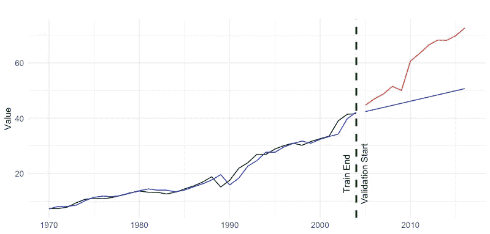
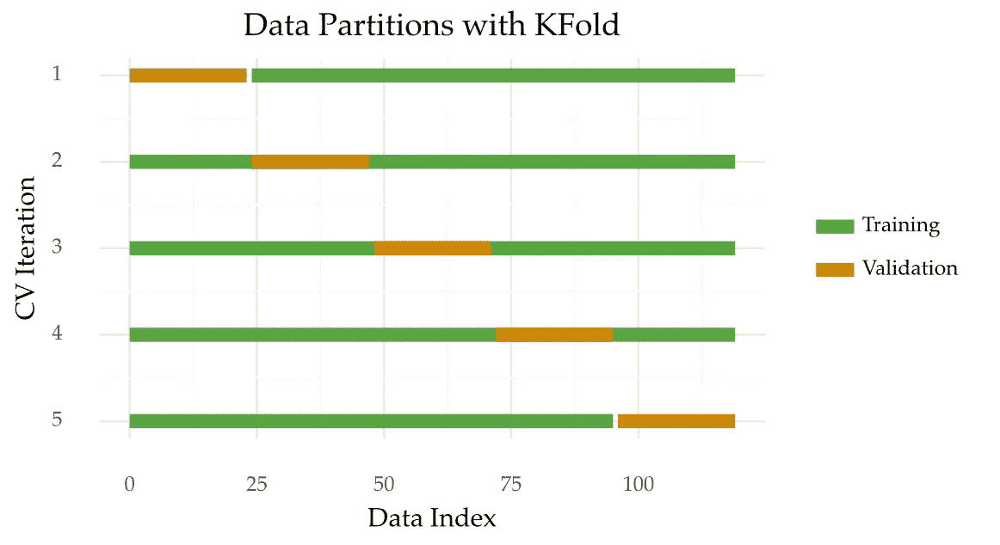
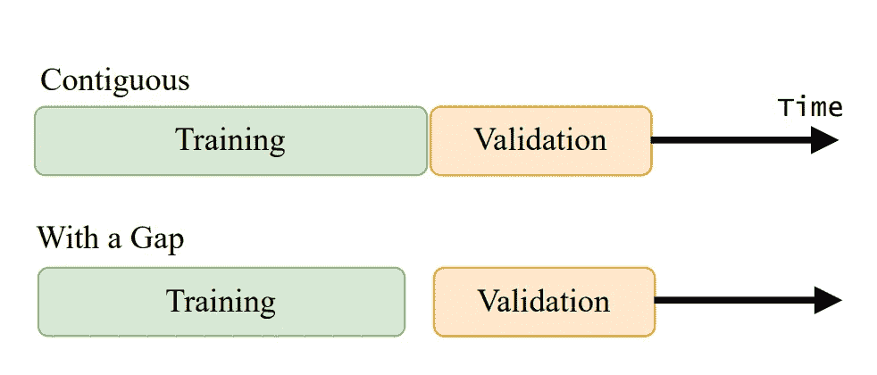
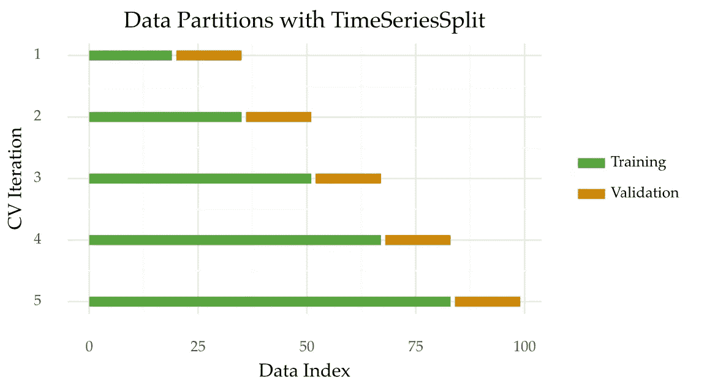

# 对时间序列应用交叉验证时要做的 4 件事

> 原文：<https://towardsdatascience.com/4-things-to-do-when-applying-cross-validation-with-time-series-c6a5674ebf3a>

## 获得更好的预测性能估计的一些实用建议

照片由[思想目录](https://unsplash.com/@thoughtcatalog?utm_source=medium&utm_medium=referral)在 [Unsplash](https://unsplash.com?utm_source=medium&utm_medium=referral) 上拍摄

这篇文章是关于使用交叉验证评估预测模型的。您将学习一些应用时间序列交叉验证的良好实践。

## 交叉验证入门

你不应该使用相同的数据来训练和测试一个模型。

这是为什么呢？

一个模型学习尽可能多的模式。一些模式抓住了过去和未来观察之间的真实关系。但是，该模型也学习训练集中的固有噪声。在未来的观测中不能很好概括的侥幸模式。

因此，在相同的数据上训练和测试模型会产生乐观的结果。我们从 1931 年就知道了(**！！**)【1】。

图 1:过度拟合训练数据的预测模型的示例应用。预测(蓝色)与训练数据(黑色)非常匹配，但与验证数据(红色)不匹配。图片作者。

交叉验证就是为了解决这个问题而开发的。

交叉验证是多次拆分数据的过程。在每次拆分时，部分数据用于训练模型(训练集)。剩下的部分(验证集)用于评估模型的性能。

交叉验证背后的想法是复制一个现实的场景。训练数据充当可用于创建模型的数据。验证集充当您在部署该模型后会遇到的数据。

最终，交叉验证的目标是提供一个可靠的性能评估。评估模型在部署后的表现。

# 时间序列的交叉验证

## k 倍交叉验证

有许多方法可以对数据集进行交叉验证。K-fold 交叉验证是最流行的方法之一。它的工作原理是将数据随机分成 K 份。每个折叠包含相同数量的观察值。然后，每个文件夹被迭代地用于验证。最后，将模型在所有折叠中的性能进行平均，以估计其性能。如果你测试几个模型，你选择一个平均性能最好的。

下图说明了 5 重交叉验证的分割标准。

图 1: K 倍交叉验证(K=5)数据分区。图片作者。

K-fold 交叉验证可以以不同的方式扩展。

*   您可以多次重复该过程，以获得更可靠的结果。这被称为[重复 K 倍交叉验证](https://scikit-learn.org/stable/modules/generated/sklearn.model_selection.RepeatedKFold.html)；
*   [分层 K 折叠交叉验证](https://scikit-learn.org/stable/modules/generated/sklearn.model_selection.StratifiedKFold.html)确保每个折叠保持原始类别分布；
*   您可以使用[组 K 折叠交叉验证](https://scikit-learn.org/stable/modules/generated/sklearn.model_selection.GroupKFold.html)来跨不同折叠拆分不同的组。

k 倍交叉验证之所以有吸引力，有两个主要原因。一个是它的简单分裂启发式。另一个是它的数据效率。在某些时候，所有可用的观察结果都用于训练和测试。

## 为什么 K 重交叉验证不适用于时间序列

交叉验证是在假设观察是独立的情况下进行的。但是，对于时间序列来说，这是不正确的。

时间序列是有序序列。每个观察都多少取决于之前发生的事情。这种依赖性通过诸如自相关的统计来量化。

## 实用建议

那么，我们应该如何评估预测模型呢？

这个故事的其余部分提供了四个实用的建议来做到这一点。

## 1.保留时间顺序

保持观察值的顺序是获得可靠估计值的关键。可以说，这是对时间序列应用交叉验证的黄金法则。

如果你打乱观察会发生什么？该模型从未来中学习过去未曾暴露的细微差别。这导致了乐观的估计。

## 2.在培训和验证之间制造差距

训练集和验证集通常是连续的(见图 2)。因此，验证集的初始部分与训练集的最后部分高度相关。

因此，删除验证集附近的训练观察值是个好主意。这增加了培训和验证之间的独立性。这个过程也称为清洗。

图 2:连续的训练/验证分割(上图)和有间隙的训练/验证分割(下图)。图片作者。

## 3.创建几个拆分

对所有类型的数据(包括时间序列)进行多次分割通常是一种好的做法。

由于所选原点的特殊性，单个分割可能会有偏差。许多分割将涵盖时间序列的不同部分。例如，不同趋势或季节性模式。

然而，如果你的时间序列很大(比如说，成千上万次观察)，那么多次分割就不那么重要了。

# 时间序列

那么，哪种方法遵循这些准则呢？

一个例子是 TimeSeriesSplits，scikit-learn 中提供的一个方法[。这种方法有不同的名称。这些方法包括时序交叉验证、前推验证或块中的前序验证。](https://scikit-learn.org/stable/modules/generated/sklearn.model_selection.TimeSeriesSplit.html)

这个想法是将时间序列分割成 K 个连续的块。然后，每个块用于首先测试一个模型，然后重新训练它。

这里有一个图表可以帮助你想象这个过程。

图 3:时间序列分成 5 个部分。图片作者。

现在，训练集和验证集之间存在差距:

图 5:时间序列分成 5 个部分，在训练和验证之间有一个间隔。图片作者。

TimeSeriesSplits 实现与其他 *scikit-learn* 函数兼容，例如 GridSearchCV。下面是一个优化随机森林的示例:

# 多个时间序列或组

由[马雷克·斯图津斯基](https://unsplash.com/es/@jccards?utm_source=medium&utm_medium=referral)在 [Unsplash](https://unsplash.com?utm_source=medium&utm_medium=referral) 上拍摄的照片

## 4.将每个时间序列放在不同的文件夹中

有时你不得不处理许多时间序列，而不仅仅是一个。例如，不同零售产品的每日销售额。每个产品代表一个时间序列。

通常，数据集中的时间序列在某种程度上是相互关联的。因此，您可能希望将每个系列保存在特定文件夹中，以防止信息泄漏。这导致训练集和验证集之间更大的独立性。

在这些情况下可以使用 [GroupTimeSeriesSplit 方法](http://rasbt.github.io/mlxtend/user_guide/evaluate/GroupTimeSeriesSplit/)。

# 外卖

在本文中，您了解了在对时间序列应用交叉验证时要考虑的四个方面。

1.  保持观察的时间顺序；
2.  在培训和验证之间制造差距；
3.  制造许多裂缝或褶皱；
4.  对于有许多时间序列的数据集，将每个时间序列放在不同的文件夹中。

感谢阅读，下一个故事再见！

## 进一步阅读

[1]拉尔森，S. C. (1931 年)。多重相关系数的收缩。伊迪克。心理学。, 22:45–55.

[2]阿洛、西尔万和阿兰·塞利塞。“模型选择交叉验证程序的调查。”*统计调查*4(2010):40–79。