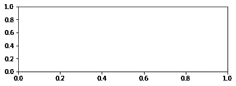
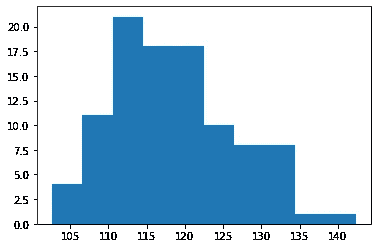
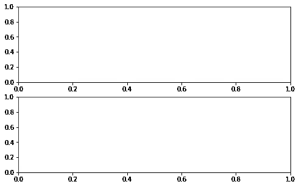
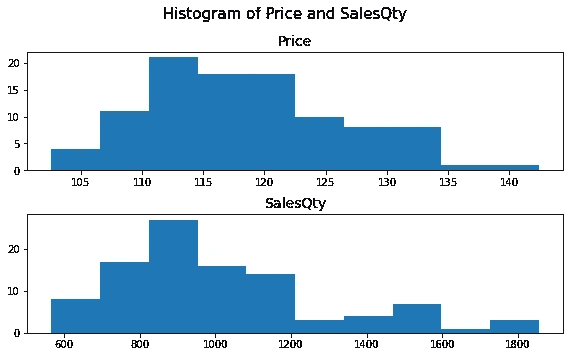

# 更好地理解 Matplotlib 需要知道的 4 件事

> 原文：<https://towardsdatascience.com/4-things-to-know-to-have-a-better-understanding-of-matplotlib-a84ed54b3b2c>

## 熟悉一个原始的 Python 数据可视化库


托尔加·乌尔坎在 [Unsplash](https://unsplash.com/s/photos/detailed?utm_source=unsplash&utm_medium=referral&utm_content=creditCopyText) 上拍摄的照片

Matplotlib 是我在数据科学之旅中了解的第一批工具之一。我惊讶于它如何允许定制数据可视化的几乎每一个小部分。

另一方面，它的语法似乎很复杂，很难理解。我知道我可以做一些事情，但需要一段时间来找出如何去做。一旦我了解了 Matplotlib 的结构和情节是如何创建的，我就觉得使用它更舒服了。

在本文中，我们将学习四件事，帮助您更好地理解 Matplotlib。

# 1.图形和轴

由于 Python 是一种面向对象的编程语言，所以我们在 Matplotlib 图上看到的一切都是具有类型的对象就不足为奇了。

图形和轴是主要的对象类型，是绘图的基础。它们也被称为复合对象类型。需要注意的是，Axes 不是 Axis 的复数形式。因此，轴对象与 x 轴或 y 轴没有任何关系。

图形可以被认为是容纳所有东西的最外层容器。所有其他对象在该容器中保持活动状态。一个图形可以有一个或多个轴对象。事实上，我们需要一个 Axes 对象来绘制一些东西。

可以使用 matplotlib.pyplot 接口的 Figure 方法创建图形。

```
import matplotlib.pyplot as pltplt.figure()
plt.show()**# output**
<Figure size 432x288 with 0 Axes>
```

我们已经创建了一个默认大小的人物对象。因为它没有任何轴对象，所以没有显示任何内容。

让我们也给 Figure 对象添加一个轴，看看它看起来怎么样。我们还将使用 figsize 参数来自定义人物对象的大小。

```
fig = plt.figure(figsize=(8,5))
ax1 = fig.add_axes([0.1, 0.1, 0.6, 0.3])
plt.show()
```



(图片由作者提供)

add_axes 方法中使用的参数定义了 axes 对象的位置和大小。

# 2.有些事情可以是含蓄的

在前面的例子中，我们使用 add_axes 方法向一个图形对象添加一个轴。您不必在每次需要添加轴时都这样做。事实上，您很少会看到使用 add_axes 方法。

像创建一个图形对象或添加一个轴这样的事情有时是显而易见的。不要让这个迷惑你。例如，在下面的例子中，我们将创建一个 DataFrame 的 price 列的直方图。

```
plt.hist(df["Price"])
plt.show()
```



(图片由作者提供)

我们刚刚使用 hist 函数创建了上面的直方图。我们不必显式创建图形和轴，因为一旦调用绘图功能(如 hist，plot ),这些会自动完成。

当然，我们可以先创造一个人物，然后才是情节。假设我们想要更改该直方图的图形大小:

```
plt.figure(figsize=(8,4))
plt.hist(df["Price"])
plt.show()
```


(图片由作者提供)

# 3.图形和轴上的标签

没有标题和轴标签的图是没有用的。我们应该在不增加阅读难度的前提下，尽可能地增加情节的信息量。但是，标题和标签是必备的。

在 Matplotlib 中，可以使用不同的方法为图形和轴对象添加标题和标签。

在处理 Figure 对象时，我们可以使用 title、xlabel 和 ylabel 方法。

```
# create a Figure
plt.figure(figsize=(8,4))plt.hist(df["Price"])plt.title("Histogram of Price", fontsize=15)
plt.xlabel("Value", fontsize=14)
plt.ylabel("Frequency", fontsize=14)plt.show()
```


(图片由作者提供)

当处理 Axes 对象时，相应的方法是 set_ti

```
# create a Figure with an Axes
fig, ax = plt.subplots(figsize=(8,4))ax.hist(df["Price"])ax.set_title("Histogram of Price", fontsize=15)
ax.set_xlabel("Value", fontsize=14)
ax.set_ylabel("Frequency", fontsize=14)plt.show()
```


(图片由作者提供)

尽管我们使用不同的方法添加标题和标签，但输出是相同的。因为我们做了一个只有一个轴的图形。我们可以在一个有多个轴的图形上观察到不同。我们将在下一节讨论这个问题。

# 4.多轴图形

一个图形对象可以包含多个轴对象。我们可以使用支线剧情功能来安排图上的布局。例如，下面的代码片段创建了一个图形，其中 2 个 Axes 对象作为行放置。

```
fig, (ax1, ax2) = plt.subplots(nrows=2, figsize=(8,5))plt.show()
```



(图片由作者提供)

它是空的，因为我们没有绘制任何内容。让我们绘制直方图，并设置图形和轴对象的标题。

```
fig, (ax1, ax2) = plt.subplots(nrows=2, figsize=(8,5))# figure title
fig.suptitle("Histogram of Price and SalesQty", fontsize=15)# plot on the first Axes
ax1.hist(df["Price"])
ax1.set_title("Price", fontsize=14)# plot on the second Axes
ax2.hist(df["SalesQty"])
ax2.set_title("SalesQty", fontsize=14)# adjust the spacing between subplots
fig.tight_layout(pad=1)plt.show()
```



(图片由作者提供)

当处理带有支线剧情的人物时，我们使用 suptitle 方法给整个人物添加一个标题(不是 title 方法)。

与 Seaborn 和 Plotly 等其他流行的替代库相比，Matplotlib 是一个低级库。因此，我们应该编写更多的代码来创建数据可视化，这样做的好处是可以完全控制我们绘制的内容。

了解图的结构以及 Matplotlib 如何处理这些定制是充分利用这个惊人的库的必要步骤。

我们在本文中介绍的内容将帮助您更好地理解 Matplotlib 的工作原理。

*你可以成为* [*媒介会员*](https://sonery.medium.com/membership) *解锁我的全部写作权限，外加其余媒介。如果你已经是了，别忘了订阅*[](https://sonery.medium.com/subscribe)**如果你想在我发表新文章时收到电子邮件。**

*感谢您的阅读。如果您有任何反馈，请告诉我。*