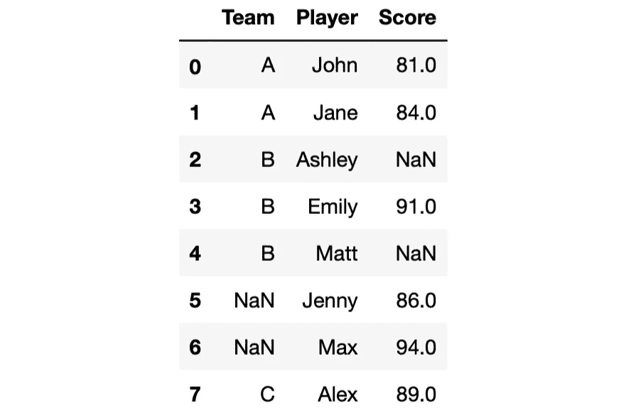
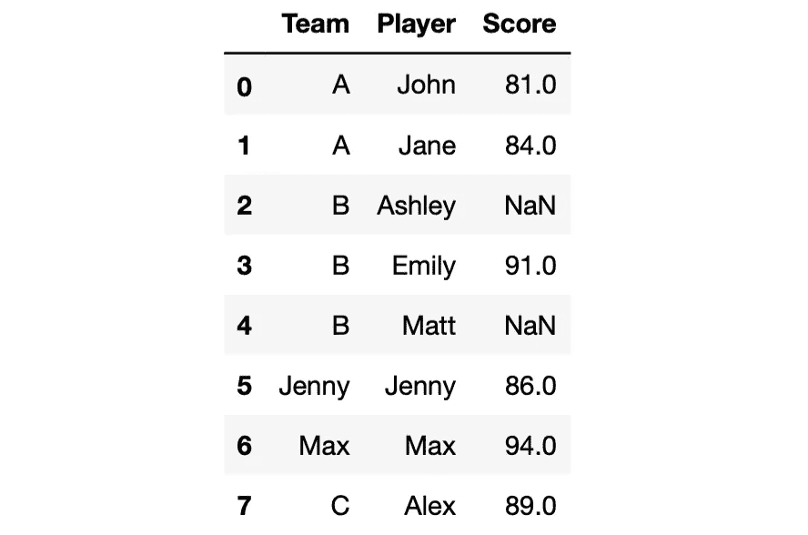
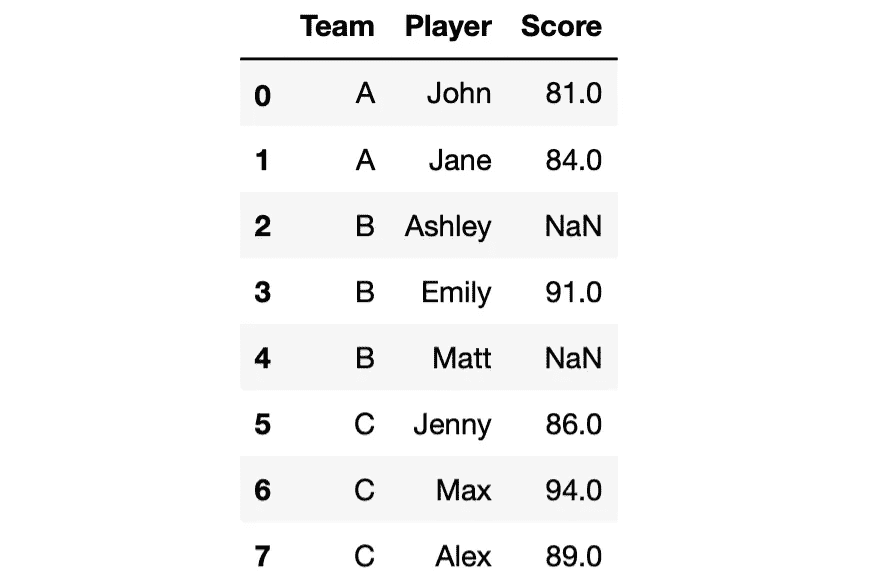
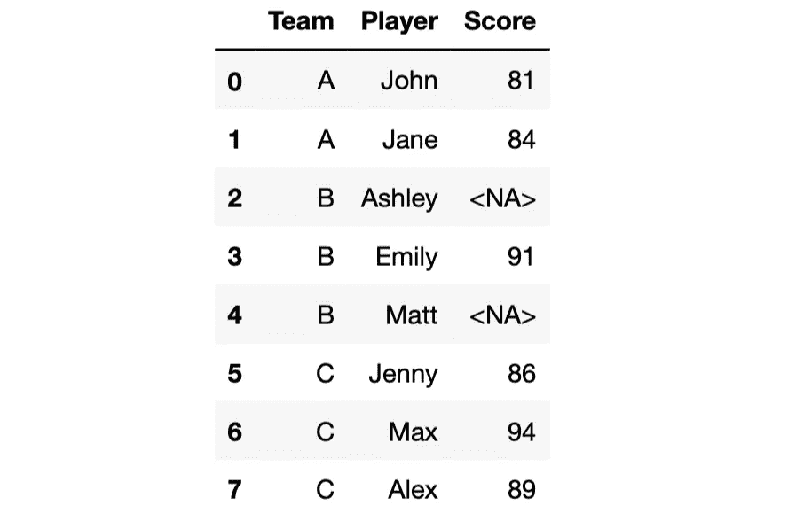

# 更有效地使用 Python 熊猫的 4 个技巧

> 原文：<https://towardsdatascience.com/4-tips-for-using-python-pandas-more-efficiently-8dd9a850b979>

## 简单而实用的指南


照片由[西蒙孙](https://unsplash.com/@simonsun2017?utm_source=unsplash&utm_medium=referral&utm_content=creditCopyText)在 [Unsplash](https://unsplash.com/s/photos/tips?utm_source=unsplash&utm_medium=referral&utm_content=creditCopyText)

Pandas 是一个非常实用的功能库，用于数据分析和操作任务。自 2019 年以来，我一直在使用熊猫，它一直能够为我的任务提供解决方案。

在使用熊猫大约 3 年后，我意识到我一开始并没有非常有效地使用它。在某些情况下，我解决某个特定问题的方法比最优解要长。我也没有非常有效和准确地使用一些功能。

我仍然能够完成任务。然而，当我发现更好更实用的做事方法时，我的整个工作流程都得到了改善。

在这篇文章中，我将分享 4 个小贴士，帮助你充分利用熊猫。让我们从创建示例中使用的样本数据帧开始。

```
import numpy as np
import pandas as pddf = pd.DataFrame({
    "Team": ["A","A","B","B","B",np.nan,np.nan,"C"],
    "Player": [
       "John","Jane","Ashley","Emily","Matt","Jenny","Max","Alex"
    ],
    "Score": [81, 84, np.nan, 91, np.nan, 86, 94, 89]
})df
```



df(作者图片)

我们有一个 3 列 8 行的数据框架，在 team 和 score 列中有一些缺失值。

## 1.具有空值的 value_counts 函数

value_counts 函数是最常用的 Pandas 函数之一。它计算一列中每个不同值的出现次数。默认情况下，它不考虑空值(即缺失值)。这可能会产生误导，尤其是当我们处理大文件的时候。

```
df["Team"].value_counts()**# output**
B    3
A    2
C    1
Name: Team, dtype: int64
```

team 列中有空值，但是我们在 value_counts 函数的输出中看不到它们。我们可以通过使用 dropna 参数让它计算空值，如下所示。

```
df["Team"].value_counts(dropna=False)**# output**
B      3
A      2
NaN    2
C      1
Name: Team, dtype: int64
```

现在输出更准确了。

## 2.使用其他列填充缺失值

现实生活中的数据集通常包含无法忽略的缺失值。我们需要正确处理它们，以产生准确可靠的输出。

我们有不同的选项来填充缺失的值。最佳方案取决于数据和任务的特征。例如，我们可以使用列平均值来填充缺失的值。处理时间序列数据时，上一个或下一个值可能是更好的选择。

另一种选择是使用其他列中的数据。在我们的数据框架中，我们可以使用球员列来填充球队列中缺少的值。我将向您展示完成这项任务的两种不同技术。第一种方法是使用 loc 方法手动选择缺失的值。

```
df.loc[df["Team"].isna()==True, "Team"] = df["Player"]
```

左侧选择“团队”列中缺少的值。右侧将 player 列中的值分配给这些值。

第二种是直接使用 fillna 函数。

```
df["Team"].fillna(df["Player"], inplace=True)df
```



df(作者图片)

## 3.使用 Python 字典

Dictionary 是 Python 内置的数据结构。它对于数据分析和处理中的各种任务来说非常方便。我们也可以将它们与熊猫功能一起使用，使它们更有用。

例如，replace 函数用于替换列或数据帧中的值。假设我们有一个包含每个球员的球队数据的球队字典。

```
teams = {
    "John":"A",
    "Jane":"A",
    "Ashley":"B",
    "Emily":"B",
    "Matt":"B",
    "Jenny":"C",
    "Max":"C",
    "Alex":"C"
}
```

我们可以使用这个字典将球队列中的球员姓名替换为他们的球队名称。

```
df["Team"] = df["Team"].replace(teams)df
```



df(作者图片)

我们也可以这样做:

```
df["Team"] = df["Team"].replace("Jenny","C")
df["Team"] = df["Team"].replace("Max","C")
```

这肯定不如用字典方便。此外，我们可能需要替换几个值。在这种情况下，使用字典只用一行代码就可以完成任务，而不是编写几行代码。

您可以用 Python 字典增强其他一些 Pandas 函数。这里有一篇我写的关于这个话题的更详细的文章。

[](/4-python-pandas-functions-that-serve-better-with-dictionaries-bbfcc6c39fa5)  

## 4.缺少值的整数列

分数列中的值是整数，但它们显示为浮点数。原因是该列中缺少值。

整数的默认数据类型不支持空值，因此数据类型被强制转换为浮点型。如果将这些值表示为整数很重要，可以使用可空整数数据类型。

```
df["Score"] = df["Score"].astype(pd.Int64Dtype())df
```



df(作者图片)

现在分数显示为整数。

数据清理和操作是任何面向数据的产品的重要组成部分。Pandas 提供了一些功能和方法来加快和简化您的工作流程。为了最大限度地利用熊猫，你应该尝试发现任何功能的全部潜力。

*你可以成为* [*媒介会员*](https://sonery.medium.com/membership) *解锁我的全部写作权限，外加其余媒介。如果你已经是了，别忘了订阅*[](https://sonery.medium.com/subscribe)**如果你想在我发表新文章时收到电子邮件。**

*[](https://sonery.medium.com/membership)  

感谢您的阅读。如果您有任何反馈，请告诉我。*