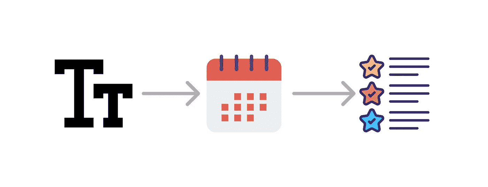
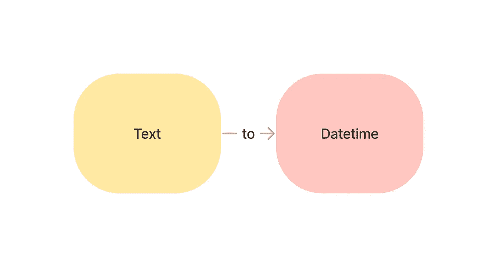
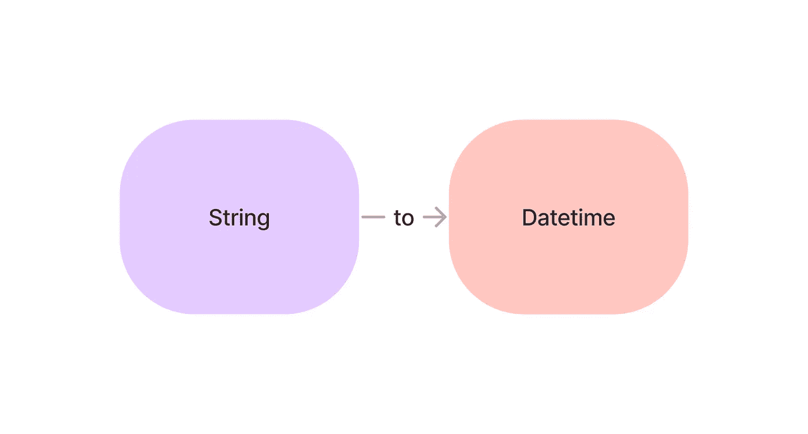
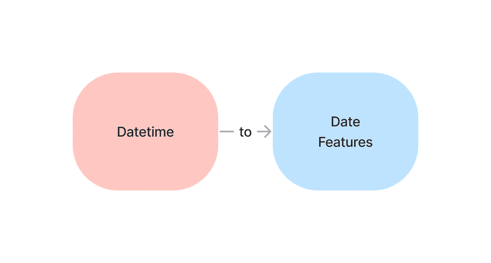
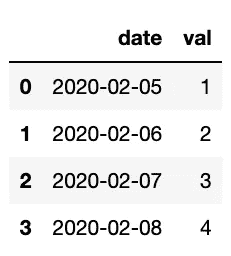
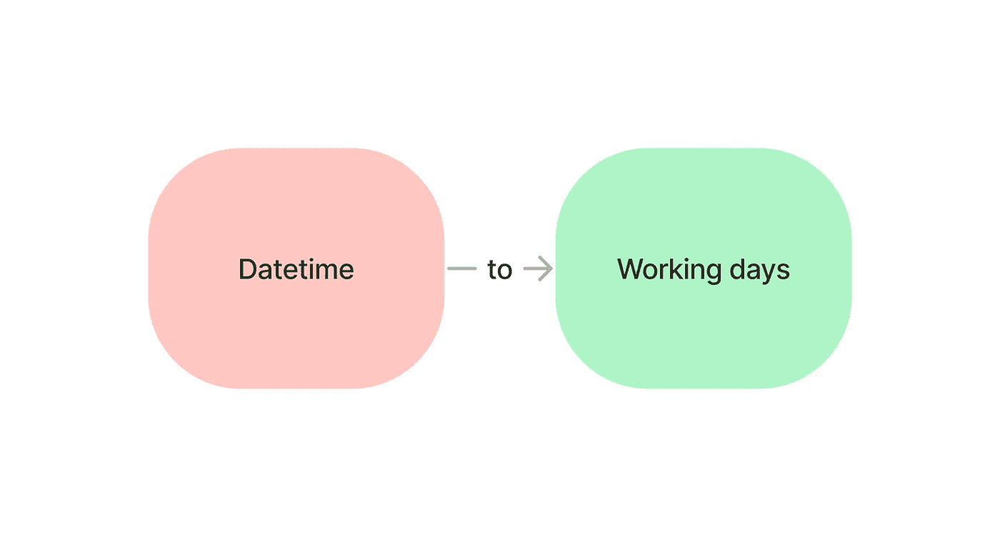

# 用 Python 从日期时间中自动提取数据的 4 个工具

> 原文：<https://towardsdatascience.com/4-tools-to-automatically-extract-data-from-datetime-in-python-9ecf44943f89>

## 如何从文本中提取日期时间，从日期时间中提取数据

# 动机

日期时间功能对于时间序列和预测非常重要。然而，您并不总是有干净的日期时间特性可以使用。

如果能自动从文本中提取 datetime，从 datetime 中提取数据，岂不是很好？



作者图片

在这篇文章中，你将学习 4 种工具来做到这一点。

# datefinder:自动查找 Python 字符串中的日期和时间

作者提供的视频

您是否曾经想从非结构化的文本中提取日期和时间，但是发现很难做到？ [datefinder](https://github.com/akoumjian/datefinder) 允许你在 Python 字符串中自动查找不同格式的日期和时间。



作者图片

输出:

```
Date and time: 2021-05-17 09:00:00
Only day: 17
Date and time: 2021-05-18 10:00:00
Only day: 18
```

要安装 datefinder，请键入:

```
pip install datefinder
```

# Maya:自动将字符串转化为日期时间

如果要将字符串类型转换为日期时间类型，常见的方法是使用`strptime(date_string, format)`。但是指定你的 datetime 字符串的结构是相当不方便的，比如`%Y-%m-%d %H:%M:%S.%f%z`。

```
datetime.datetime(2016, 12, 16, 18, 23, 45, 423992, tzinfo=datetime.timezone.utc)
```

[maya](https://github.com/timofurrer/maya) 帮助您自动将字符串转换为日期时间。你只需要解析字符串，maya 就会计算出你的字符串的结构。



作者图片

```
datetime.datetime(2016, 12, 16, 18, 23, 45, 423992, tzinfo=<UTC>)
```

maya 还允许您轻松地将一个时区转换为另一个时区:

```
datetime.datetime(2016, 12, 16, 12, 23, 45, 423992, tzinfo=<DstTzInfo 'US/Central' CST-1 day, 18:00:00 STD>)
```

要安装 maya，请键入:

```
pip install maya
```

# Fastai 的 add_datepart:在一行代码中添加相关的 DateTime 特性

在处理时间序列时，年、月、周、一周中的某一天和一年中的某一天等其他特征对于预测未来事件非常有帮助。

有没有一种方法可以在一行代码中获得所有这些特性？

Fastai 的`add_datepart`方法可以让你做到这一点。



作者图片

为了了解这种方法是如何工作的，让我们从创建一个简单的数据帧开始。



作者图片

接下来，我们将使用`add_datepart`向 DataFrame 添加日期特性。

我们将看到以下新列:

这是新数据帧的外观:

要安装 Fastai，请键入:

```
pip install fastai
```

# Workalendar:用 Python 处理工作日计算

如果您想用 Python 处理日历、假期和工作日相关的计算，请使用 [Workalendar](https://github.com/workalendar/workalendar) 。



作者图片

Workalendar 支持全球近 100 个国家。让我们看看在美国有什么假期。

输出:

在日本度假:

我们还可以使用 Workalendar 来检查特定日期是否是工作日:

```
False
```

```
False
```

计算两个指定日期之间的工作日:

```
81
```

很方便，不是吗？

要安装 Workalendar，请键入:

```
pip install workalendar
```

# 结论

恭喜你！您刚刚学习了如何使用 4 种不同的工具自动提取日期时间及其特征。我希望本文能为您提供从日期时间数据中获取更多信息所需的知识。

随意发挥，并在这里叉这篇文章的源代码:

[](https://github.com/khuyentran1401/Data-science/blob/master/time_series/extract_date_features.ipynb) [## 数据科学/extract _ date _ features . ipynb at master khuyentran 1401/数据科学

### 收集有用的数据科学主题以及代码和文章-Data-science/extract _ date _ features . ipynb，网址为…

github.com](https://github.com/khuyentran1401/Data-science/blob/master/time_series/extract_date_features.ipynb) 

我喜欢写一些基本的数据科学概念，并尝试不同的数据科学工具。你可以在 LinkedIn 和 T2 Twitter 上与我联系。

星[这个回购](https://github.com/khuyentran1401/Data-science)如果你想检查我写的所有文章的代码。在 Medium 上关注我，了解我的最新数据科学文章，例如:

[](/3-tools-to-track-and-visualize-the-execution-of-your-python-code-666a153e435e) [## 3 个跟踪和可视化 Python 代码执行的工具

towardsdatascience.com](/3-tools-to-track-and-visualize-the-execution-of-your-python-code-666a153e435e) [](/kats-a-generalizable-framework-to-analyze-time-series-data-in-python-3c8d21efe057) [## kats:Python 中分析时间序列数据的通用框架

### 预测、检测变化点、异常，并获得时间序列中的关键统计数据

towardsdatascience.com](/kats-a-generalizable-framework-to-analyze-time-series-data-in-python-3c8d21efe057) [](/similarity-encoding-for-dirty-categories-using-dirty-cat-d9f0b581a552) [## 使用 dirty_cat 对脏类别进行相似性编码

towardsdatascience.com](/similarity-encoding-for-dirty-categories-using-dirty-cat-d9f0b581a552) [](/introduction-to-yellowbrick-a-python-library-to-explain-the-prediction-of-your-machine-learning-d63ecee10ecc) [## Yellowbrick 简介:可视化机器学习预测的 Python 库…

### 您将 f1 分数提高到了 98%！但这是否意味着你的模型表现更好呢？

towardsdatascience.com](/introduction-to-yellowbrick-a-python-library-to-explain-the-prediction-of-your-machine-learning-d63ecee10ecc)