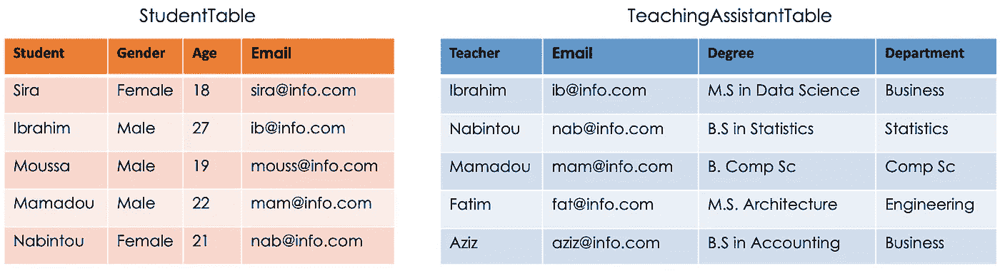
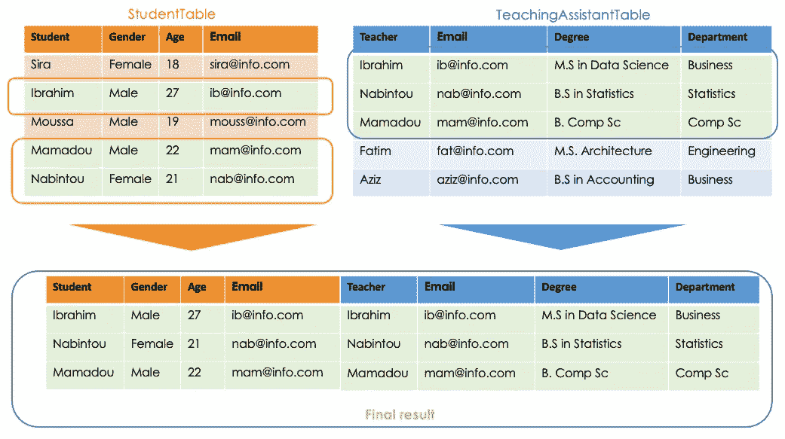
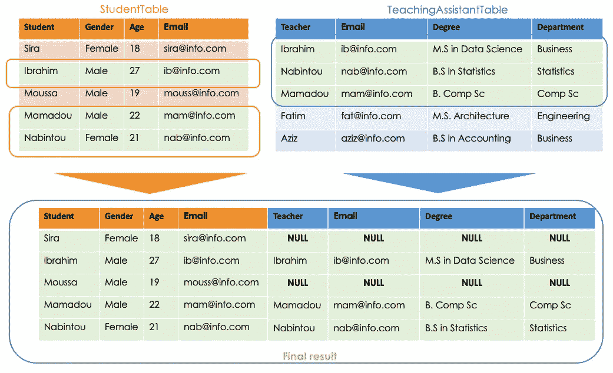
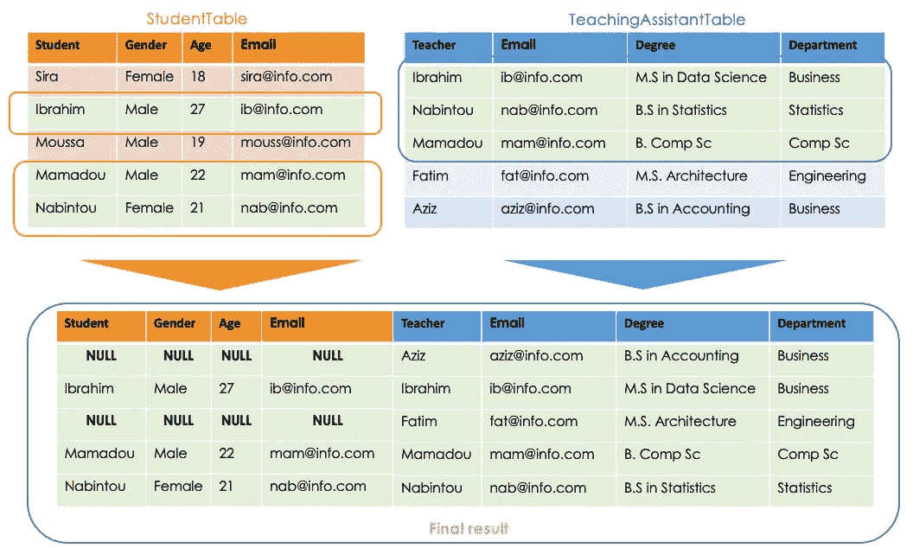
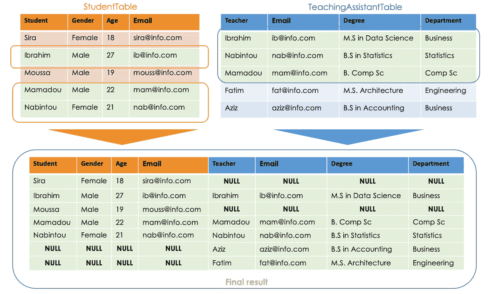
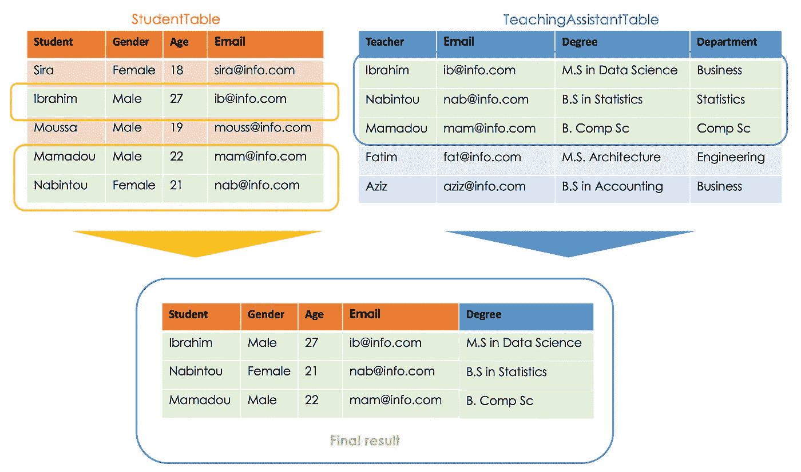

# 每个数据科学家都应该知道的 4 种 SQL 连接类型:可视化表示

> 原文：<https://towardsdatascience.com/4-types-of-sql-join-any-data-scientists-should-know-hands-on-practice-4a1d119c00ad>

## 创建表和运行所有四种 SQL 连接的完整指南。


卡斯帕·卡米尔·鲁宾在 [Unsplash](https://unsplash.com/photos/fPkvU7RDmCo) 上的照片

# 动机

关系数据库试图对现实生活中的实体及其关系进行建模。但是，作为一名数据从业者，在与这些数据库交互时，您将会处理不止一个表。与这些表的有效交互需要对联合语句有更好的理解，因为每个表给出不同的结果。

本文将首先帮助您理解每个`**JOIN**`条款，然后带您进行实际操作。在此之前，我们将从头开始创建相关的表。

# 输入数据

为了更好地理解这个过程，我们需要下面两个表:`**StudentTable**`和`**TeachingAssistantTable.**`本节的目的是创建这些表，并用一些示例数据填充它们。

## 创建表格

创建一个表很简单，在我们的数据库中，两个表都是按如下方式创建的。这一部分对于理解本文的其余部分不是强制性的。

→ **学生桌**

*   每一行`**StudentTable**`将代表单个学生的信息。

创建学生表的 SQL 脚本

→ **助教表**

`**TeachingAssistantTable**`的每一行将代表一个教师的信息。

创建教学助理表的 SQL 脚本

## 填充表格

现在我们的表已经创建好了，我们最终可以使用 INSERT INTO [table name] VALUES 语句用新数据填充它们。

→ **学生桌**

将数据上传到学生表的 SQL 脚本

→ **助教表**

下面是这两个表的最终表示。



学生(学生表格)和助教(助教表格)表格(图片由作者提供)

# 我们为什么要连接表

如果您已经踏上了 SQL 之旅，您可能已经听说过联接，但是我们为什么要使用它们呢？`**JOIN**`语句是 Oracle、Microsoft SQL、MySQL、PostgreSQL 等关系数据库中的重要子句。它用于创建单个表，该表是两个或多个表的组合，基于这些表之间的一些逻辑关系。

# 联接有哪些不同的类型？

现在您已经知道了它的用途，让我们来探索一下[X]类型的连接。

## 1.内部连接

让我们从这个简单的例子开始。我们想知道哪些学生也是老师。换句话说，学生表和教师表中匹配的行在哪里，这意味着它们的交集。我们可以看到我们的两个表都包含 **Ibrahim** 、 **Mamadou** 和 **Fatim** 。

这就是`**INNER JOIN**`派上用场的地方。它只查看基于在`**ON**`子句中指定的列的两个表之间的交集。例如，下面的指令根据 Email 列获取所有相交的行。

```
**SELECT** * 
**FROM** StudentTable st 
**JOIN** TeachingAssistantTable tat **ON** st.Email = tat.Email;
```

*   `**SELECT**` ***** 表示从所有表中“获取所有列”。
*   `**FROM** StudentTable st`创建 st 作为 StudentTable 的别名，这意味着无论何时我们想要使用 TeacherTable，都可以使用`st`来代替。这同样适用于`TeachingAssistantTable tat`
*   `**JOIN** TeachingAssistantTable tat **ON st.Email = tat.Email**`表示仅从两个表中获取具有相同电子邮件的行。

这是我们从前面的 SQL 命令中得到的图形结果。



应用于 StudentTable 和教学辅助表的内部连接(图片由作者提供)

该连接不仅适用于电子邮件中的关键列，还适用于用户决定在`**ON**`子句中使用的任何列。例如，它可能是:`**ON st.Student = tat.Teacher**`，这将生成表**，其中学生姓名等于教师姓名**。

## **2*2。左外连接*** /左连接

这种类型的连接处理两种类型的表的连接:主表和辅助表。**主表是等号左边**的表。它是这样工作的:

*   识别在条款的**中指定的列。**
*   从主表中取出所有行，没有任何区别。
*   基于 on 子句中的列，二级表中与主表**不匹配的所有行都被丢弃(替换为 NULL)。**

```
**SELECT** * 
**FROM** StudentTable st **LEFT JOIN** TeachingAssistantTable tat 
**ON** st.Email = tat.Email;
```

这是我们从左连接得到的图形结果。



左连接应用于 StudentTable 和教学辅助表(图片由作者提供)

## ***3。*右外连接/**右外连接

这个连接与上一个非常相似。唯一的区别是，它认为右边的表是主表，左边的表是次表。

```
**SELECT** * 
**FROM** StudentTable st **RIGHT JOIN** TeachingAssistantTable tat 
**ON** st.Email = tat.Email;
```

这是我们从正确的连接中得到的图形结果。



应用于学生表和教学辅助表的右连接(图片由作者提供)

## ***4。全外连接***

完全外连接是左连接和右连接的组合。在该语句中，没有丢弃两个表中任何一个表的行的余地，它们都被考虑在内。它的工作原理如下:

*   对原始表执行右外连接，并将结果视为临时表 1。
*   对原始表运行左外连接，并将结果视为临时表 2。
*   连接临时表 1 和 2 作为最终结果。

```
**SELECT** * 
**FROM** StudentTable st **FULL OUTER JOIN** TeachingAssistantTable tat 
**ON** st.Email = tat.Email;
```



应用于 StudentTable 和 TeachingAssistantTable 的完全外部连接(图片由作者提供)

从前面所有的最终结果中，我们注意到我们选择了所有表中的所有列，这为诸如 Email、Student 和 Teacher 等列创建了重复的值。然而，我们可以在`**SELECT**`子句中指定我们希望在最终结果中出现的列。例如，以下指令返回学生姓名、电子邮件、性别、年龄和学位中的所有列。

```
**SELECT** st.Student, st.Gender, st.Email, st.Age, tat.Degree
**FROM** StudentTable st **INNER** **JOIN** TeachingAssistantTable tat 
**ON** st.Email = tat.Email;
```



内部联接应用于 StudentTable 和带列选择的教学辅助表(图片由作者提供)

# 结论

本文介绍了 SQL 中的四种主要连接情况。SQL 的多功能性可以为您提供帮助企业分析数据和做出明智决策的技能。

如果你喜欢阅读我的故事，并希望支持我的写作，考虑[成为一个媒体成员](https://zoumanakeita.medium.com/membership)解锁无限制访问媒体上的故事。

在 [Medium](https://zoumanakeita.medium.com/) 、 [Twitter](https://twitter.com/zoumana_keita_) 和 [YouTube](https://www.youtube.com/channel/UC9xKdy8cz6ZuJU5FTNtM_pQ) 上随意关注我，或者在 [LinkedIn](https://www.linkedin.com/in/zoumana-keita/) 上问好。讨论人工智能、人工智能、数据科学、自然语言处理和人工智能是一种乐趣！