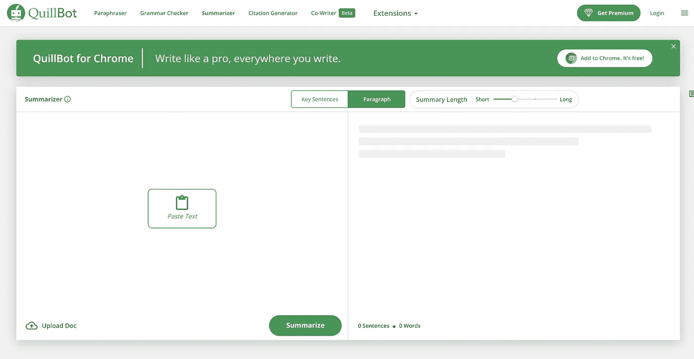
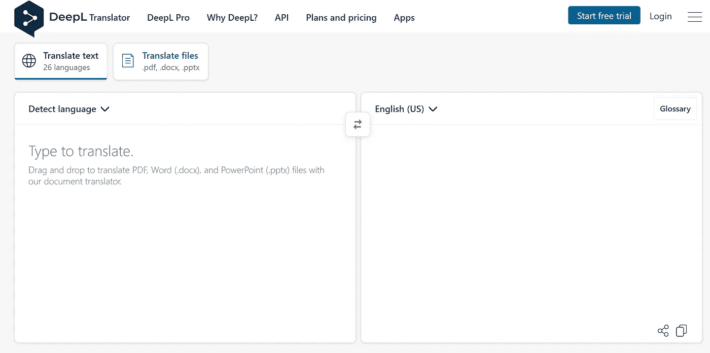
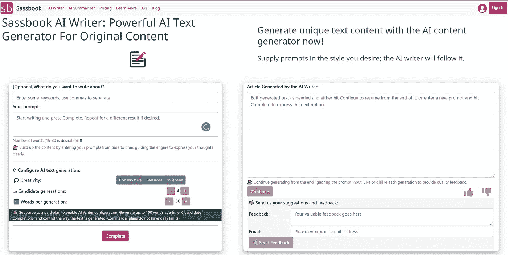
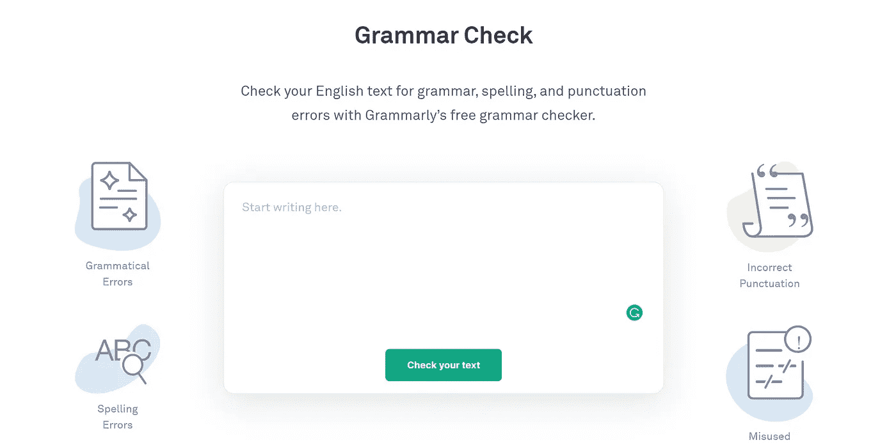

# 人工智能提高生产力的 4 种方式

> 原文：<https://towardsdatascience.com/4-ways-ai-can-improve-your-productivity-bfa239de5535>

## 帮助您提高写作效率的工具集

凯文·巴加特在 [Unsplash](https://unsplash.com/s/photos/productivity?utm_source=unsplash&utm_medium=referral&utm_content=creditCopyText) 上的照片

使用人工智能或机器学习进行工作，听起来你需要成为一名拥有多年编码经验的高端程序员。但这只是部分正确。有几个无代码工具可以帮助您提高工作效率，并拥有一个易于使用的图形界面。

然而，它们使用专用的机器学习算法来执行任务，这使得它们比其他可比工具好得多。这里有一些我最喜欢的工具，可以帮助你们大多数人节省时间。

 [## 学习编码:13 个免费网站帮助你开始

### 一旦你决定要学习编码，你会被众多的在线工具宠坏，这些工具可以帮助你…

towardsdatascience.com](/learn-coding-13-free-sites-to-help-you-do-it-9b2c1b92e573) 

# 文本摘要

每当你需要深入新的主题时，就会有成千上万的有趣的文章或论文可供你阅读。大多数时候，你只有时间去深入阅读两到三篇文章，但是有十篇甚至更多的文章你应该去读完。

所以，下次就让人工智能帮助你决定哪些文本是最重要的，并专注于阅读它们。有几个在线工具，你可以导入你的文本，并获得文本的机器学习摘要。

QuillBot 界面|图片:[截图 Quillbot](https://quillbot.com/summarize)

有几个选项可供您使用。您可以直接粘贴您想要总结的文本，也可以上传一个文本文档来使用这些段落。此外，还有一个将摘要长度从短设置为长的选项。所以，下次不要浪费时间去读每一篇你应该读的文章，让它先被总结。基于此，你可以决定阅读是否有助于解决你的任务。

# 翻译服务

在全球化的世界中，我们经常面临这样的情况:我们需要用另一种语言写电子邮件、发短信或做演示。但是如果你需要用一种非你母语的语言来写任何一种文本，这可能比仅仅用你的母语来写要花费你更多的时间。

让人工智能在这些情况下通过接管翻译来支持你，这样你就可以专注于内容的质量。这样，你可以用任何你觉得舒服的语言创建一个文本，然后把它翻译成你需要的语言。

DeepL 翻译器界面|图片:[截图 DeepL](https://www.deepl.com/en/translator)

对于大多数语言和文本来说，这些工具可以给你很好的翻译，几乎不需要修改。

# 自动化文本创建

在我们开始翻译文本之前，我们首先要写它。在大多数情况下，这是一项非常耗时的任务，即使我们已经对主题有了概念和基本结构。

通常，文本越多越好，无论是产品描述文本还是其他种类的营销描述。对于这个用例，市场上也有不同的工具，可以帮助您增加已经开始的短文本的字数。

Sassbook AI 作家界面|图片:[截图 Sassbook](https://sassbook.com/ai-writer)

使用这个人工智能工具，你可以开始输入一个大约 20-30 个单词的文本，并从这个初始句子中生成 50 多个单词。这可能是你进一步写作的良好基础，也许只需要一两处修改。

# 校对

最后但同样重要的是，我们要确保我们的文章或文本在语法和拼写方面是准确无误的。这可能是一项耗时耗力的工作，因为你必须注意每一个单词或检查每一个逗号，如果你不是用母语写作，这就特别复杂。

从这篇文章到目前为止，你可以想象，人工智能是我们的后盾。Grammarly 提供了一个高端的语法、拼写和标点符号检查工具，非常适合英语。

语法|图片:[截图语法](https://www.grammarly.com/grammar-check)

这样，你就可以开始写了，并且可以确保所有的错误都被自动标记出来。你可以在图片下方链接的网站上使用这个工具，或者使用大多数互联网浏览器提供的浏览器插件，它会自动检查你写在里面的所有内容。

# 结论

人工智能和机器学习可以在很多方面支持你的日常写作。有多种工具可以让你在无代码环境中使用人工智能模型的力量。因此，即使没有任何编码或人工智能的知识，你也可以从这个领域取得的巨大进步中受益。

享受使用它们的乐趣！

*如果你喜欢我的作品，请在这里订阅***或者查看我的网站* [*数据大本营*](http://www.databasecamp.de/en/homepage) *！还有，medium 允许你每月免费阅读* ***3 篇*** *。如果你希望有****无限制的*** *访问我的文章和数以千计的精彩文章，不要犹豫，点击我的推荐链接:*[【https://medium.com/@niklas_lang/membership】](https://medium.com/@niklas_lang/membership)每月花$***5****获得会员资格**

* [## 什么是 deepfakes，怎么识别？

### Deepfakes 是使用深度学习模型人工创建的视频、图像或音频文件。比如说…

medium.com](https://medium.com/@niklas_lang/what-are-deepfakes-and-how-do-you-recognize-them-f9ab1a143456)  [## 六大大数据工作

### 通过职位描述、技能和薪水，审查大数据中需求最高的职位

medium.com](https://medium.com/illumination/top-6-big-data-jobs-b5af240e8b44)*