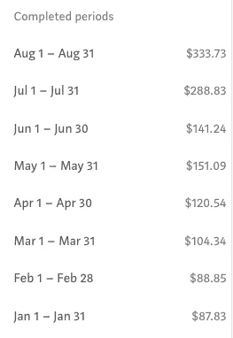
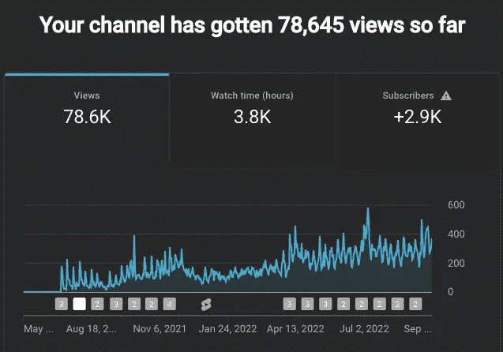
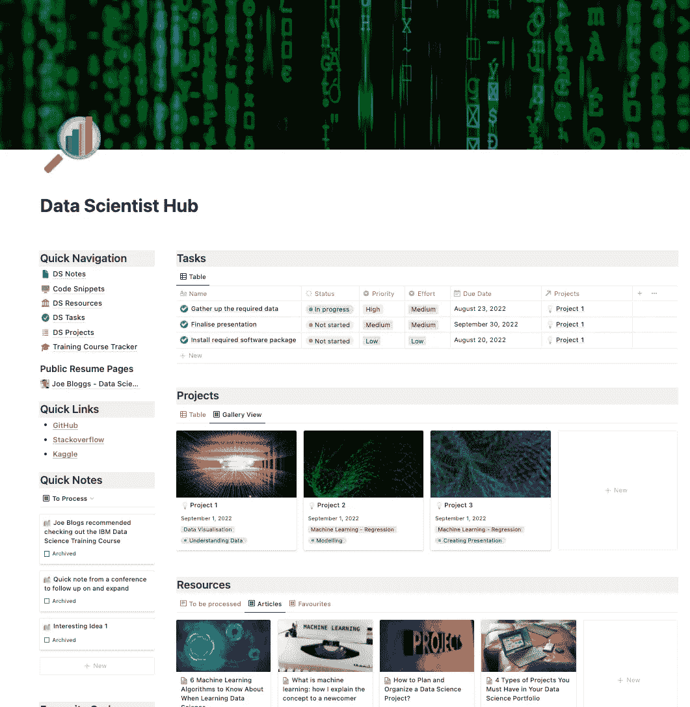
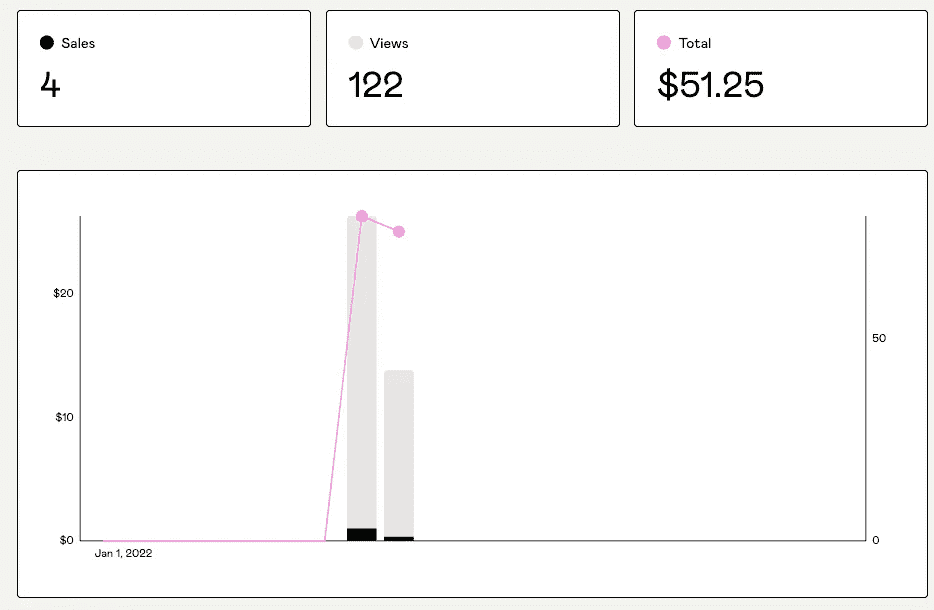
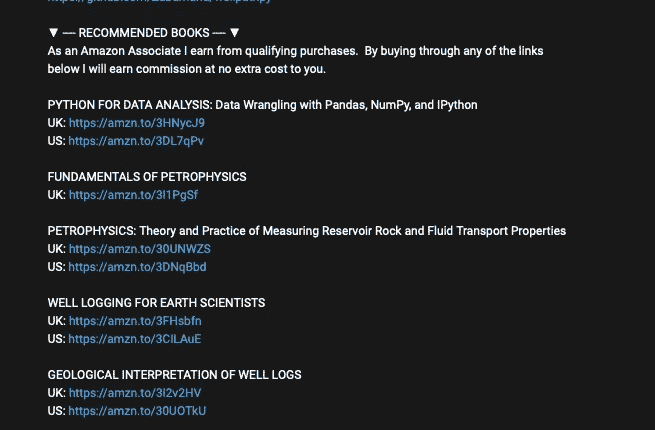
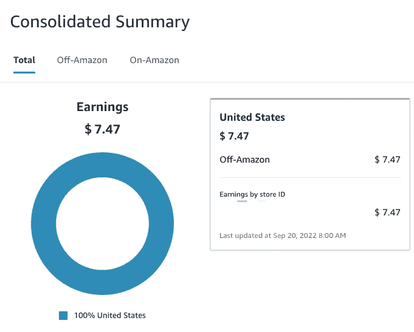

# 我使用数据科学技能从副业中创收的 4 种方式

> 原文：<https://towardsdatascience.com/4-ways-im-using-data-science-skills-to-generate-income-from-side-hustles-638fffc0bbca>

## 用你的热情建立多种收入来源

在 [Unsplash](https://unsplash.com?utm_source=medium&utm_medium=referral) 上由 [Garrhet Sampson](https://unsplash.com/@garrhetsampson?utm_source=medium&utm_medium=referral) 拍摄的照片

在过去的几年里，在保持一份朝九晚五的全职工作的同时在线赚钱的流行程度有了相当大的增长，尤其是在疫情时代。一些幸运的少数人已经成功地让他们的团队在达到某个目标后忙于他们的全职工作。一个很好的例子是[阿里·阿卜达尔](https://aliabdaal.com/)，一个从给医学院学生提供学习建议开始的[YouTube，现在是 YouTube 的全职明星，拥有超过 300 万订户和超过 100 万美元的总广告收入](https://www.youtube.com/watch?v=7P6RArpBwDk)。

这是很多人想要开始他们的侧推时所渴望的。然而，对于大多数人来说，这是一个漫长的过程，可能需要几年时间。

在过去的一两年里，我已经利用我的数据科学、岩石物理学和机器学习知识建立了一些额外的收入来源。

在本文中，我将与您分享利用这些技能的四个流，以及它们目前为我带来的好处。这是为了向您展示什么是可能的，并为您提供思路，开始自己的一面，并利用您的数据科学技能和知识。

# 在媒体上写文章

[超级抓拍者](https://unsplash.com/@supersnapper27?utm_source=medium&utm_medium=referral)在 [Unsplash](https://unsplash.com?utm_source=medium&utm_medium=referral) 上的照片

学习新的事物和技能是一个终生的过程，我们永远学不完。许多人喜欢自己学习，把知识留给自己，这很好。但是，如果你真的想巩固你的知识，并找出你所知道的任何潜在的差距，那么分享你所学到的是一个很好的方法。

写文章和博客是一个很好的方式来分享那些你希望 6 个月前就知道的小技巧和窍门。不仅如此，它可以让你建立个人品牌，开始在网络社区中获得一些认可，当然也可以为你写的东西赚钱。

像 Medium 这样的平台使得开始分享你所知道的东西变得很容易。在达到 100 个关注者并发布至少一个故事后，你将能够参加[媒体合作伙伴计划](https://help.medium.com/hc/en-us/articles/115011694187-Join-the-Partner-Program)，该计划允许你从你的文章的浏览量和阅读量中赚钱。

通过正确的搜索引擎优化，你可以很容易地将你的文章放在谷歌搜索结果的第一页，这可以带来持续的有机流量。假设人们正在搜索这个话题。

自 2021 年 1 月以来，我一直是中型合作伙伴计划的一部分，我在第一个月获得了 3.68 英镑。2021 年，我的发帖时间表与发表的文章数量不一致，从 0 到 4 不等。这导致每月有少量收入(3-100 美元)。

自 2022 年 3 月以来，我一直在稳步增加我在这个平台上分享的内容量(每月 5 至 8 篇文章)，并在 8 月达到了我的最大支出 333.73 美元。

中等合作伙伴计划收入 2022。图片由作者提供。

数据科学领域的一些中型作者一个月可以赚几千美元。例如，[的吉姆·克莱德·蒙赫](https://medium.com/u/819323b399ac?source=post_page-----638fffc0bbca--------------------------------)在今年 7 月和 8 月赚了 2000 多美元。如果你想得到启发，可以点击下面的链接查看他的总结:

 [## 2022 年 8 月统计和收益报告

### 我迄今为止最大的增长和收益:)

medium.com](https://medium.com/illumination/august-2022-stats-and-earnings-report-6cbdf1f7ea52) 

> 如果你想尝试在媒体上写作，并想获得所有文章，那么你可以使用 [**我的链接**](https://andymcdonaldgeo.medium.com/membership) 这里**注册。**

# 开始 YouTube 频道

照片由[诺德伍德主题](https://unsplash.com/@nordwood?utm_source=medium&utm_medium=referral)在 [Unsplash](https://unsplash.com?utm_source=medium&utm_medium=referral) 上拍摄

为 YouTube 制作内容是一种吸引观众和获得额外收入的流行方式，然而，这并不是最容易的途径，但却是一种有利可图的创收方式。据估计，每天有 720，000 小时的视频内容上传到这个平台。

有了 YouTube，你可以通过多种方式获得收入。其中包括:

*   在视频上播放的广告
*   公司和产品赞助交易
*   在描述中包含附属链接
*   链接到您自己的课程和产品

要获得在您的渠道投放广告的资格，您需要达到特定的里程碑:

*   1000 名订户
*   4000 个观察小时
*   没有社区指导方针罢工

即使你达到了这些里程碑，你的账户也必须接受审查，并经过几个步骤才能开始投放广告。一旦它被审查和批准，你就可以通过谷歌 Adsense 在你的视频中添加广告。

开始时，你可以选择多种内容，包括教育性、娱乐性或提供评论。如果你已经为 Medium 或者你自己的博客写了东西，你可以把你的内容放到 YouTube 上去。在这些文章中，你可以包含你的视频链接，以增加你的频道的流量。

## 我的 YouTube 体验

我在 2021 年 7 月左右创建了 YouTube，从那以后，我一直在慢慢积累我的观众、浏览量和观看时间。我现在拥有大约 2900 名用户，这远远超出了我最初的预期。

正如你在下面看到的，我仍然没有达到在我的频道上投放广告的资格标准，但是，我离它不远了。从 2021 年 11 月到 2022 年 4 月，我暂停了内容制作，这可能会推迟制作过程。

目前为止我对我的 YouTube 频道的看法。图片由作者提供。

如果你想在 YouTube 上起步，并担心在设备上花费大量金钱，那么不用担心。你很可能会在附近有一个手机形式的摄像头，并且有免费软件(例如 [OBS Studio](https://obsproject.com/) )来记录你的屏幕。

我很幸运地从一台 DSLR 相机开始，它过去是，现在仍然是我摄影的主要相机。从那以后，我逐渐购买了更多的物品，这些物品逐渐改善了我的内容。

要想了解更多关于如何在 YouTube 上起步的信息，我强烈推荐你去看看阿里·阿布达尔关于这个主题的视频:

# 创造数字产品

直到最近，我才开始深入研究创造和销售数字产品的世界。今年年初，我看到几个 Twitter 账户在推广一款名为 opinion 的软件的模板。

在过去的几年里，我一直热衷于使用 ideal 作为我的一体化工作空间。我用它来记录任务、内容规划、项目管理等等。所以我想我应该试着做一些模板。

使用 idea 构建管理数据科学项目和资源的单一场所。图片由作者提供。

现在，这并没有完全利用我的数据科学技能，但我最近创建的一个模板是[数据科学中心](https://andysnotion.gumroad.com/l/datascience)。这是一个一体化的仪表板，我可以在其中管理数据科学项目、任务、代码片段等。

整个概念是为了帮助我的数据科学之旅，但是，我重新包装了它，并开始将其作为模板出售，供任何人购买。自从它上市以来，我已经卖出了 4 台。不多，但它在两个月内带来了 51.25 美元的额外收入。

如果你想了解数据科学中心，你可以在下面的文章中找到它的详细信息。

 [## 使用数据科学的概念

### 我如何在单个概念控制面板中管理数据科学任务、项目和资源

medium.com](https://medium.com/illumination/using-notion-for-data-science-777bd04870fe) 

# 联盟营销

另一个领域，许多人可以通过联盟营销赚大钱。

这是一个通过链接，在你的博客和/或视频描述上推广他人产品的过程。作为回报，当有人点击其中一个链接并购买该产品时，你会获得一小笔佣金。

亚马逊联盟是最受欢迎的，也可能是最大的联盟计划之一。注册是免费的，当你注册后，你就可以获得亚马逊出售的大量产品。

正如你在下面看到的，我通常会在我的 YouTube 描述中包含一些我读过的书籍的链接，并强烈推荐给其他人。

推广 YouTube 视频描述中的附属链接。图片由作者提供。

这并不是我收入的主要来源。我报名参加了英国和美国的课程，由于英国课程缺乏销售，我被取消了。至于美国方面，我总共赚了 7.47 美元。

亚马逊联盟计划结果。图片由作者提供。

当推广你的链接时，重要的是要声明这些链接是附属链接，你可以从中赚取一小笔佣金。我强烈推荐阅读下面的文章来理解在 Medium 上使用联盟链接的一些复杂性。

 [## 你能在你的媒体文章中使用亚马逊联盟链接吗？

### 涉入亚马逊联盟政策的浑水

medium.com](https://medium.com/feedium/can-you-use-amazon-affiliate-links-in-your-medium-articles-7334f5212046) 

# 未来领域

我目前正在探索一些可能有额外收入潜力的领域。其中包括在 python 和数据科学领域创建在线课程和更具针对性的数字产品。

因为总是有一个以上的收入流是首选。这样，如果其中一家倒闭，你仍有其他收入来源带来一些收入。

*感谢阅读。在你走之前，你一定要订阅我的内容，把我的文章放到你的收件箱里。* [***你可以在这里做！***](https://andymcdonaldgeo.medium.com/subscribe)**或者，您也可以* [***注册我的简讯***](https://fabulous-founder-2965.ck.page/2ca286e572) *免费将更多内容直接发送到您的收件箱。**

*其次，你可以通过注册成为会员来获得完整的媒介体验，并支持我和成千上万的其他作家。每月只需花费你 5 美元，你就可以接触到所有精彩的媒体文章，也有机会通过写作赚钱。*

**如果你用* [***我的链接***](https://andymcdonaldgeo.medium.com/membership)**报名，你直接用你的一部分费用支持我，不会多花你多少钱。如果你这样做了，非常感谢你的支持！***