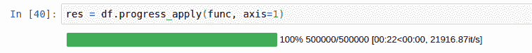
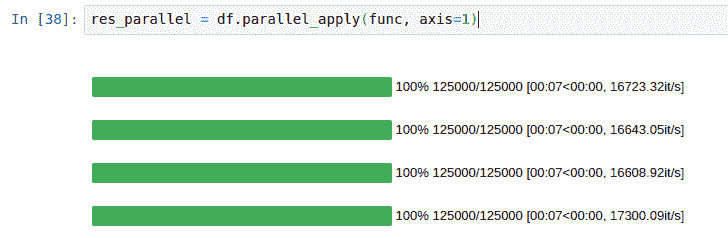
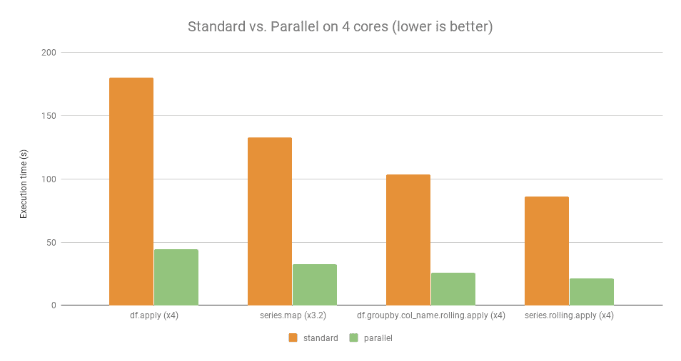
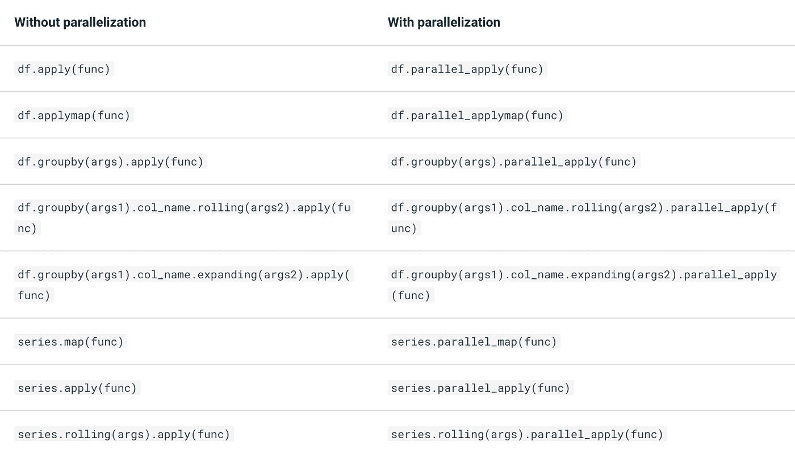

# Pandas 操作速度提高 4 倍，代码更改最少

> 原文：<https://towardsdatascience.com/4x-faster-pandas-operations-with-minimal-code-change-bc7079792184>

## 停止等待熊猫行动。将它们并行化。

Pandas 的一个主要限制是在处理大型数据集时速度会很慢，尤其是在运行复杂的操作时。这可能会让需要在工作中处理和分析大型数据集的数据科学家和分析师感到沮丧。

有几种方法可以解决这个问题。一种方法是使用并行处理。


一起运行多个熊猫操作！通过稳定扩散成像。

# 输入 Pandarallel

Pandarallel 是一个开源 Python 库，支持使用多个 CPU 并行执行 Pandas 操作，从而显著提高了速度。

它建立在流行的 Pandas 库之上，只需要很少的代码修改就可以使用。

> 声明:我不隶属于 pandarallel。

# 利用 Pandarallel 实现显著的速度提升

你可以亲眼看看熊猫与熊猫的速度相比有多快。在这里，pandarallel 将工作负载分布在 4 个内核上。



来源: [Pandarallel 的文档](https://nalepae.github.io/pandarallel/)

更具体地说，从下面的图表中可以明显看出速度的提高。



加速 4 倍。来源: [Pandarallel 的文档](https://nalepae.github.io/pandarallel/)

# Pandarallel 入门

要安装 Pandarallel，您可以使用 pip 软件包管理器:

```
pip install pandarallel
```

您可以将包导入 Python 代码并初始化它。

```
from pandarallel import pandarallel

# Initialize pandarallel
pandarallel.initialize()
```

完成后，您就可以使用下面提供的函数了。



# 如何使用 pandarallel 的代码示例

让我们首先创建一个模拟数据框架，其中包含从电子商务网站购买的商品。每行对应于在每个日期购买的一种产品。这些列是:

*   `date`
*   `product_id`
*   `quantity`

```
import pandas as pd
import numpy as np

# Generate a dataframe.
df = pd.DataFrame()

# Generate a column of random dates from 2019-01-01 to 2019-12-31
df['date'] = pd.date_range('2019-01-01', '2019-12-31', periods=10000)

# Seed numpy random 
np.random.seed(0)

# Generate a column of random product_id from 1 to 5
df['product_id'] = np.random.randint(1, 5, 10000)

# Generate a column of quantity bought from 1 to 100
df['quantity'] = np.random.randint(1, 100, 10000) 
```

这是前五行。

```
|    | date                | product_id | quantity |
|---:|:--------------------|-----------:|---------:|
|  0 | 2019-01-01 00:00:00 |          1 |       10 |
|  1 | 2019-01-01 00:52:25 |          4 |       36 |
|  2 | 2019-01-01 01:44:50 |          2 |       79 |
|  3 | 2019-01-01 02:37:15 |          1 |       33 |
|  4 | 2019-01-01 03:29:41 |          4 |       59 |
```

接下来，让我们使用`pandarallel`来加快我们的工作流程。为此，让我们初始化我们的 pandarallel。

```
from pandarallel import pandarallel

# Initialize pandarallel
pandarallel.initialize()
```

请注意，您有几个初始化 pandarallel 的选项。

```
# Initialize pandarallel with a progress bar
pandarallel.initialize(progress_bar = True)

# Set the number of workers for parallelization. 
# By default, this is the number of cores available.
pandarallel.initialize(nb_workers = 4) 

# Initialize pandarallel with all logs printed.
# By default, this is 2 (display all logs), while 0 display n ologs.
pandarallel.initialize(verbose = 2)
```

## 使用 parallel_apply 对列应用函数。

让我们从`date`列中提取月份。例如，一月是 1，二月是 2。为此，我们可以使用`parallel_apply`函数。

```
# Group date by month using parallel_apply
df['month'] = df['date'].parallel_apply(lambda x: x.month)
```

```
 |    | date                | product_id | quantity | month |
|---:|:--------------------|-----------:|---------:|------:|
|  0 | 2019-01-01 00:00:00 |          1 |       10 |     1 |
|  1 | 2019-01-01 00:52:25 |          4 |       36 |     1 |
|  2 | 2019-01-01 01:44:50 |          2 |       79 |     1 |
|  3 | 2019-01-01 02:37:15 |          1 |       33 |     1 |
|  4 | 2019-01-01 03:29:41 |          4 |       59 |     1 |
```

我们也可以在`parallel_apply`中使用一个`lambda`函数。让我们为每个`product_id`指定一个价格。然后，我们可以计算每笔交易的`revenue`。

```
# Assign a price to each product_id 
df['price'] = df['product_id'].parallel_apply(lambda x: 5.59 if x == 1 else 1.29 if x == 2 else 3.49 if x == 3 else 6.99)

# Get the revenue
df['revenue'] = df.parallel_apply(lambda x: x['quantity']* x['price'], axis=1) 
```

```
|   | date                |product_id |quantity |month |price |revenue |
|--:|:--------------------|----------:|--------:|-----:|-----:|-------:|
| 0 | 2019-01-01 00:00:00 |         1 |      10 |    1 | 5.59 |  55.9  |
| 1 | 2019-01-01 00:52:25 |         4 |      36 |    1 | 6.99 | 251.64 |
| 2 | 2019-01-01 01:44:50 |         2 |      79 |    1 | 1.29 | 101.91 |
| 3 | 2019-01-01 02:37:15 |         1 |      33 |    1 | 5.59 | 184.47 |
| 4 | 2019-01-01 03:29:41 |         4 |      59 |    1 | 6.99 | 412.41 |
```

## 使用 parallel_apply 对组应用函数。

您也可以在应用`parallel_apply`之前按特定列分组。在下面的例子中，我们可以按特定的月份分组，并获得每个月的总收入。

```
# Get the sum of revenue for every month
monthly_revenue_df = df.groupby('month').parallel_apply(np.sum)[['revenue']]
```

更好的是，我们也可以使用`parallel_apply` 执行滚动求和。

```
# Generate 3-month rolling revenue by month
monthly_revenue_df['rolling_3_mth_rev'] = monthly_revenue_df['revenue'].rolling(3, min_periods=3).parallel_apply(np.sum)
```

```
|   month |   revenue |   rolling_3_mth_rev |
|--------:|----------:|--------------------:|
|       1 |    188268 |                 nan |
|       2 |    164251 |                 nan |
|       3 |    176198 |              528717 |
|       4 |    178021 |              518470 |
|       5 |    188940 |              543159 |
```

## 使用 parallel_applymap 将函数应用于整个数据帧

如果有一个函数适用于整个数据帧，`applymap`是理想的函数。例如，要将`df`的所有元素转换成一个字符串，我们可以使用这个函数。

```
# Convert every element of df to a string
df.parallel_applymap(lambda x: str(x))
```

# 完整的代码

```
import pandas as pd
import numpy as np
from pandarallel import pandarallel

# Generate a dataframe.
df = pd.DataFrame()

# Generate a column of random dates from 2019-01-01 to 2019-12-31
df['date'] = pd.date_range('2019-01-01', '2019-12-31', periods=10000)

# Seed numpy random 
np.random.seed(0)

# Generate a column of random product_id from 1 to 5
df['product_id'] = np.random.randint(1, 5, 10000)

# Generate a column of quantity bought from 1 to 100
df['quantity'] = np.random.randint(1, 100, 10000)

# Initialize pandarallel
pandarallel.initialize()

# Group date by month using parallel_apply
df['month'] = df['date'].parallel_apply(lambda x: x.month)

# Assign a price to each product_id 
df['price'] = df['product_id'].parallel_apply(lambda x: 5.59 if x == 1 else 1.29 if x == 2 else 3.49 if x == 3 else 6.99)

# Get the revenue
df['revenue'] = df.parallel_apply(lambda x: x['quantity']* x['price'], axis=1)

# print(df.head().to_markdown())

# Get the sum of revenue for every month
monthly_revenue_df = df.groupby('month').parallel_apply(np.sum)[['revenue']]

# Generate 3-month rolling revenue by month
monthly_revenue_df['rolling_3_mth_rev'] = monthly_revenue_df['revenue'].rolling(3, min_periods=3).parallel_apply(np.sum)

# print(monthly_revenue_df.head().to_markdown())
```

# 何时不使用 pandarallel

当数据不适合存储时，我们不应该使用 Pandarallel。在这种情况下，使用`spark`或`pyspark`或`vaex`。

阅读我关于使用 [**Vaex 每秒处理 90 亿行**](https://medium.com/p/a272d3485b24) 的文章。

也就是说，pandarallel 有多种用例可以让数据科学家受益。停止等待您的 pandas 操作，将它们并行化。

# 和我联系。

我是 Travis Tang，技术领域的数据科学家。我在 Medium 和 LinkedIn 上定期分享数据分析和数据科学的技巧。与我联系，获取更多类似的提示。