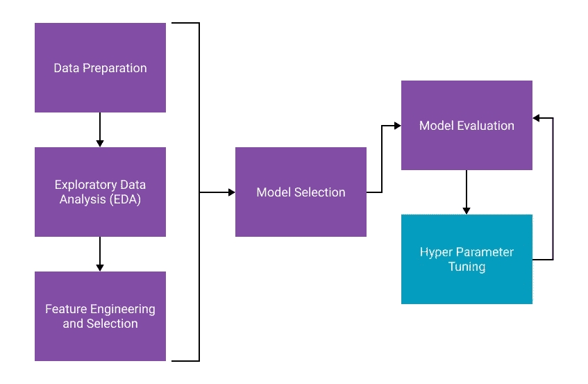
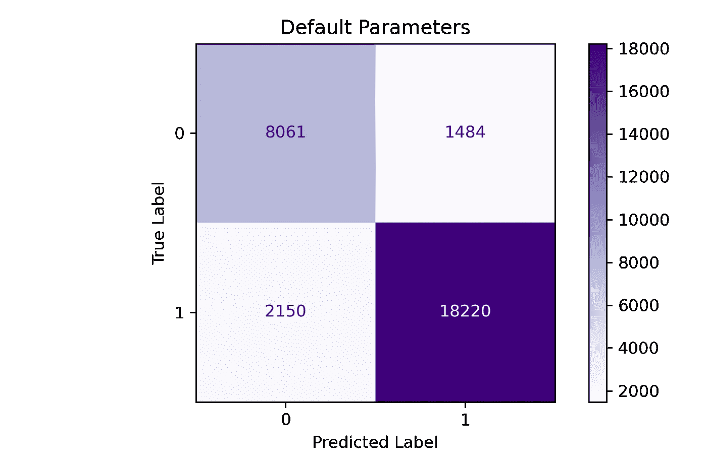
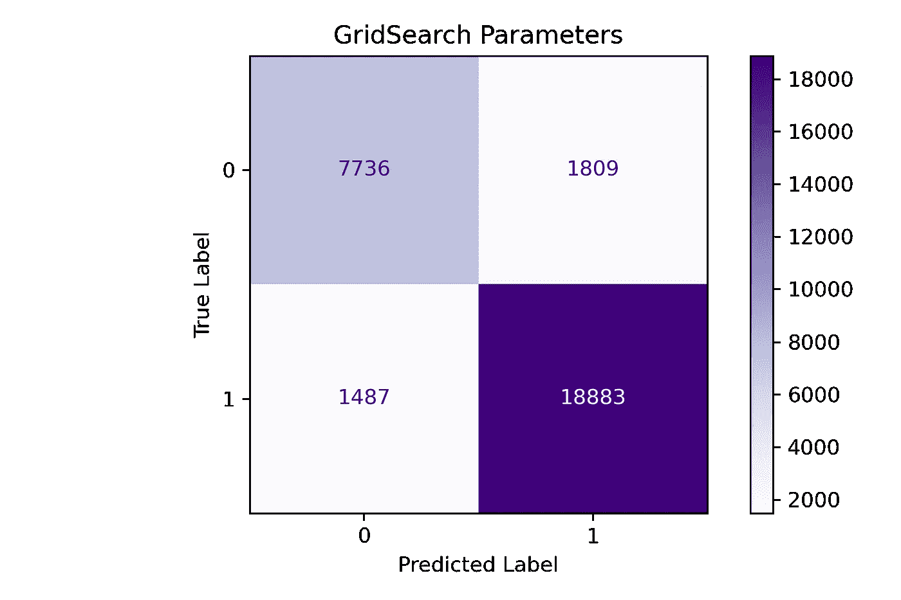
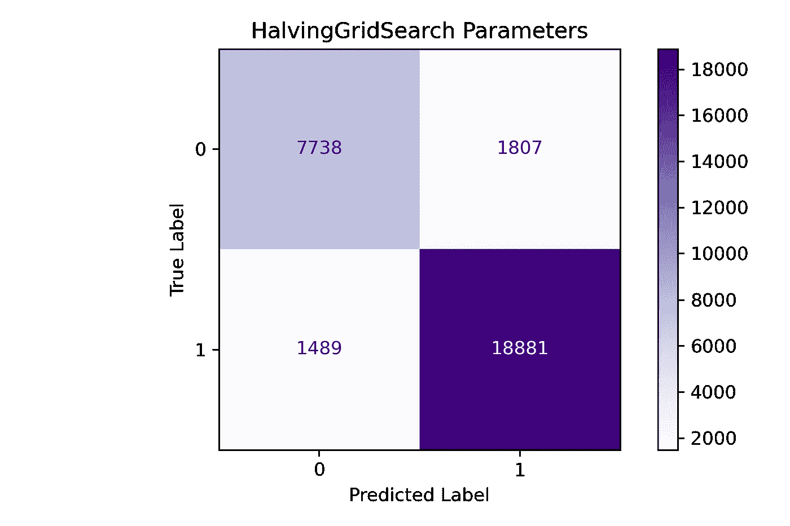

# HalvingGridSearch 将超参数调谐速度提高了 5-10 倍

> 原文：<https://towardsdatascience.com/5-10x-faster-hyperparameter-tuning-with-halvinggridsearch-1a874c1994d>

## 如何优化机器学习模型的超参数以及如何加速该过程


照片由[德鲁·帕特里克·米勒](https://unsplash.com/@drewpatrickmiller?utm_source=medium&utm_medium=referral)在 [Unsplash](https://unsplash.com?utm_source=medium&utm_medium=referral) 上拍摄

# 什么是超参数调谐？

**超参数调整**是一种微调机器学习模型的方法。超参数**不是在训练过程中专门学习的**，但是可以调整以优化模型的性能。以下是我在进行超参数调整时喜欢考虑的一些技巧:

1.  超参数调整通常是构建模型时的最后一步**，就在最终评估之前。**
2.  **您不会从调整参数中得到明显不同的结果。对模型性能影响最大的是特征选择和模型选择。**
3.  **超参数调整可以帮助模型的**一般化，减少过度拟合。****

**也就是说，调整您的模型是工作流程中的一个重要步骤。这里有一个快速的视觉效果，可以帮助你理解这个过程。**

****

1.  ****数据准备**:即[清理](/text-cleaning-for-nlp-in-python-2716be301d5d)你的数据并为机器学习做准备的过程。**
2.  ****探索性数据分析**:这是你应该经常执行的一个步骤。探索新数据集和理解数据分布、相关性等的过程。见[这篇文章](/exploratory-data-analysis-with-python-1b8ae98a61c5)一步一步的指导。**
3.  ****特性工程和选择**:从您的数据中创建*新特性*(列)并根据它们对模型性能的贡献选择*最佳特性*的过程。**
4.  ****模型选择**:利用交叉验证来选择基于评估度量的最佳算法。**
5.  ****Hyper Parameter Tuning** :本帖描述的过程。**
6.  ****模型评估**:选择正确的[性能指标](/evaluating-ml-models-with-a-confusion-matrix-3fd9c3ab07dd)并评估结果。**

# **超参数示例**

**超参数的一些例子有:**

*   **在逻辑回归模型中，我应该使用哪个**解算器**？**
*   ****C** 或正则化常数的最佳值是什么？**
*   **应该用什么正则化**罚**？**
*   **我的决策树允许的最大深度**应该是多少？****
*   **我应该在我的随机森林中包含多少棵树？**

**你自己很难搞清楚其中的大部分内容。好消息是，您可以应用各种技术来搜索最佳的参数集。现在，您已经对它们是什么以及它们如何适应流程有了基本的了解，让我们看看它是如何工作的。**

# **型号选择**

**为简洁起见，我们将跳过初始清理和功能选择。GitHub 上的这个[笔记本](https://github.com/broepke/Tuning/blob/main/Tuning.ipynb)里有这个代码。我们将获取特征选择的结果，并创建我们的`X`和`y`变量。**

```
X = df[['categories', 'postal_code', 'text_len', 'review_count', 'text_clean']]
y = df['target']
```

**接下来，我们有一个函数允许我们重复地创建一个[管道](/using-pipelines-in-sci-kit-learn-516aa431dcc5)以及一个分类器的实例。**

```
def create_pipe(clf, ngrams=(1,1)):

    column_trans = ColumnTransformer(
        [('Text', TfidfVectorizer(stop_words='english', ngram_range=ngrams), 'text_clean'),
         ('Categories', TfidfVectorizer(), 'categories'), 
         ('OHE', OneHotEncoder(dtype='int', handle_unknown='ignore'),['postal_code']),
         ('Numbers', MinMaxScaler(), ['review_count', 'text_len'])],
        remainder='drop') 

    pipeline = Pipeline([('prep',column_trans),
                         ('over', SMOTE(random_state=42)),
                         ('under', RandomUnderSampler(random_state=42)),
                         ('clf', clf)])

    return pipeline
```

**[管道](/using-pipelines-in-sci-kit-learn-516aa431dcc5)包含所有需要的预处理步骤。接下来，我们可以执行经典的**交叉验证**来找到最佳模型。**

```
models = {'RandForest' : RandomForestClassifier(random_state=42),
          'LogReg' : LogisticRegression(random_state=42)
          }

for name, model, in models.items():
    clf = model
    pipeline = create_pipe(clf)
    scores = cross_val_score(pipeline, 
                             X, 
                             y, 
                             scoring='f1_macro', 
                             cv=3, 
                             n_jobs=1, 
                             error_score='raise')
    print(name, ': Mean f1 Macro: %.3f and Standard Deviation: (%.3f)' % (np.mean(scores), np.std(scores)))
```

```
[OUT]
RandForest : Mean f1 Macro: 0.785 and Standard Deviation: (0.003)
LogReg : Mean f1 Macro: 0.854 and Standard Deviation: (0.001)
```

**总的来说，我们可以看到`LogisticRegression`分类器在这个数据上比`RandomForestClassifier`表现得更好。如上所述，*特征工程*、*特征选择*、*模型选择*在训练你的模型时会给你最大的收获，所以我们总是从这里开始。**

# **访问管线中的模型参数**

**我想指出的第一件事是如何在[管道](/using-pipelines-in-sci-kit-learn-516aa431dcc5)中访问模型的参数。通常，当你有一个评估者(模型)实例时，你调用`estimator.get_params()`，你可以看到它们。管道中的过程是相同的；但是，最终的输出略有不同。**

**当直接从估算器访问参数时，输出将是一个值，如`C`。相比之下，在管道中，输出将首先具有您给估算器的名称以及*双下划线*，最后是类似`clf__C`的参数名称；知道如何访问参数很重要，因为您需要这些名称来构建参数网格进行搜索。**

**以下是我的管道的输出，为了简洁起见被截断了。您可以在列表的末尾看到分类器参数，所有这些参数都是当前的默认值。**

```
pipeline.get_params()
```

```
{'memory': None,
 'steps': [('prep',
   ColumnTransformer(transformers=[('Text', TfidfVectorizer(stop_words='english'),
                                    'text_clean'),
                                   ('Categories', TfidfVectorizer(), 'categories'),
                                   ('OHE',
                                    OneHotEncoder(dtype='int',
                                                  handle_unknown='ignore'),
                                    ['postal_code']),
                                   ('Numbers', MinMaxScaler(),
                                    ['review_count', 'text_len'])])),

... truncated for brevity ...

 'clf__C': 1.0,
 'clf__class_weight': None,
 'clf__dual': False,
 'clf__fit_intercept': True,
 'clf__intercept_scaling': 1,
 'clf__l1_ratio': None,
 'clf__max_iter': 500,
 'clf__multi_class': 'auto',
 'clf__n_jobs': None,
 'clf__penalty': 'l2',
 'clf__random_state': 42,
 'clf__solver': 'lbfgs',
 'clf__tol': 0.0001,
 'clf__verbose': 0,
 'clf__warm_start': False}
```

# **网格搜索**

**我们将探索的第一种方法是[网格搜索交叉验证](https://scikit-learn.org/stable/modules/grid_search.html#grid-search) n，它采用了与我们用于模型选择的常规交叉验证相同的逻辑。然而，网格搜索遍历每个参数组合，执行交叉验证，并返回最佳模型。这里的第一步是创建一个参数网格，我们通过为 GridSearch 构建一个字典列表来迭代完成。**

```
parameters = [{'clf__solver' : ['newton-cg', 'lbfgs', 'sag', 'liblinear'],'clf__C' : [.1, 1, 10, 100, 1000], 'prep__Text__ngram_range': [(1, 1), (2, 2), (1, 2)]}]
```

**或者，您可以向列表中添加多个词典。它将独立地遍历每个字典的*组合；如果您有一些与其他参数不兼容的参数，这很有用。例如，在`LogisticRegression`中，某些惩罚值只对某些解算器有效。***

```
parameters = [
  {'clf__penalty': ['l1', 'l2'], 'clf__solver' : ['liblinear']},
  {'clf__penalty': ['l1', 'none'], 'clf__solver' : ['newton-cg']},
  ]
```

**现在我们有了参数网格，我们可以首先创建一个基本分类器的实例，并将其传递给管道函数。**

```
clf = LogisticRegression(random_state=42, max_iter=500)
pipeline = create_pipe(clf)
```

**接下来，我们将使用`GridSearchCV`运行网格搜索。**

```
%time grid = GridSearchCV(pipeline, 
                          parameters, 
                          scoring='f1_macro', 
                          cv=3,
                          random_state=0).fit(X_train, y_train)

print("Best cross-validation accuracy: {:.3f}".format(grid.best_score_))
print("Test set score: {:.3f}".format(grid.score(X_test, y_test))) 
print("Best parameters: {}".format(grid.best_params_))

log_C = grid.best_params_['clf__C']
log_solver = grid.best_params_['clf__solver']
log_ngram = grid.best_params_['prep__Text__ngram_range']
```

```
58m 3s

Best cross-validation accuracy: 0.867
Test set score: 0.872
Best parameters: {'clf__C': 100, 'clf__solver': 'newton-cg', 
'prep__Text__ngram_range': (1, 2)}
```

**我们的网格搜索用`58m 3s`来运行，为每一个产生最佳参数。**

**在查看上面的列表时，您可能会想到的一件事是，在我们的参数网格中有相当多的潜在组合。上例中有**4x**T3、**5x**T4、**3x**T5，合计为`4 x 5 x 3 = 60`。因为训练我们的模型需要大约一分钟，所以遍历一次网格需要大约一个小时。**

****注意**:可以用参数`n_jobs=-1`并行化网格搜索；然而，我没有展示这个例子的相对性能。**

**接下来，我们来看一个提高整体性能的方法。**

# **减半搜索**

**然而，有一种方法可以加快网格搜索的速度，并在更短的时间内返回非常相似的结果。这种方法被称为[连续减半](https://scikit-learn.org/stable/modules/generated/sklearn.model_selection.HalvingGridSearchCV.html)。它将在过程的早期利用数据的子集来找到一些性能最佳的参数组合，并随着最佳组合的缩小而逐渐增加所使用的数据量。**

**您可以将`GridSearchCV`调用与 HalvingGridSearchCV `调用交换，以利用对半网格搜索。就这么简单。让我们用这个新方法重新运行上面的搜索，看看它的表现如何。**

```
%time grid = HalvingGridSearchCV(pipeline, 
                                 parameters, 
                                 scoring='f1_macro', 
                                 cv=3, 
                                 random_state=0).fit(X_train, y_train)

print("Best cross-validation accuracy: {:.3f}".format(grid.best_score_))
print("Test set score: {:.3f}".format(grid.score(X_test, y_test))) 
print("Best parameters: {}".format(grid.best_params_))

log_C_b = grid.best_params_['clf__C']
log_solver_b = grid.best_params_['clf__solver']
log_ngram_b = grid.best_params_['prep__Text__ngram_range']
```

```
14m 28s

Best cross-validation accuracy: 0.867
Test set score: 0.872
Best parameters: {'clf__C': 100, 'clf__solver': 'lbfgs', 
'prep__Text__ngram_range': (1, 2)}
```

**相当可观！从一小时缩短到 15 分钟！在某些情况下，我看到它的表现甚至更快。我们也可以看到结果相当相似。这次选择的解决方案是`lbfgs`对`newton-cg`。我们现在可以对比一下两者的表现。**

# **评估结果**

**我们有一个简单的函数，它将采用一个管道，将数据拟合到一个训练和测试集，并使用一个*分类报告*和一个*混淆矩阵*评估结果。让我们依次经历**未调模型**、**网格搜索调模型**，最后是**减半网格搜索调模型**。首先是原始模型。**

****注意**:我们这里使用的评估指标是**F1-宏**；我们正在寻找平衡*精度*和*召回*。**

```
def fit_and_print(pipeline, name):

    pipeline.fit(X_train, y_train)
    y_pred = pipeline.predict(X_test)
    score = metrics.f1_score(y_test, y_pred, average='macro')

    print(metrics.classification_report(y_test, y_pred, digits=3))

    ConfusionMatrixDisplay.from_predictions(y_test, 
                                            y_pred, 
                                            cmap=plt.cm.Greys)

    plt.tight_layout()
    plt.title(name)
    plt.ylabel('True Label')
    plt.xlabel('Predicted Label')
    plt.tight_layout()
    plt.savefig(name + '.png', dpi=300) 
    plt.show;
```

```
clf = LogisticRegression(random_state=42, max_iter=500)
pipeline = create_pipe(clf)
fit_and_print(pipeline, 'Default Parameters')
```

```
precision    recall  f1-score   support

           0      0.789     0.845     0.816      9545
           1      0.925     0.894     0.909     20370

    accuracy                          0.879     29915
   macro avg      0.857     0.869     0.863     29915
weighted avg      0.882     0.879     0.880     29915
```

****

**作者图片**

**我们这里的 **F1-Macro** 分数是`0.863`。接下来，让我们尝试一下网格搜索调优模型。**

```
clf = LogisticRegression(C=log_C, solver=log_solver, random_state=42, max_iter=500)
pipeline = create_pipe(clf, log_ngram)
fit_and_print(pipeline, 'GridSearch Parameters')
```

```
precision    recall  f1-score   support

           0      0.839     0.810     0.824      9545
           1      0.913     0.927     0.920     20370

    accuracy                          0.890     29915
   macro avg      0.876     0.869     0.872     29915
weighted avg      0.889     0.890     0.889     29915
```

****

**作者图片**

**我们这里的 **F1-Macro** 分数是`0.872`。我们的调优过程改进了该模式的整体结果，并且我们将 F1 宏分数增加了`0.09`。接下来，让我们尝试一下减半网格搜索调优模型。**

```
clf = LogisticRegression(C=log_C_b, solver=log_solver_b, random_state=42, max_iter=500)
pipeline = create_pipe(clf, log_ngram_b)
fit_and_print(pipeline, 'HalvingGridSearch Parameters')
```

```
precision    recall  f1-score   support

           0      0.839     0.811     0.824      9545
           1      0.913     0.927     0.920     20370

    accuracy                          0.890     29915
   macro avg      0.876     0.869     0.872     29915
weighted avg      0.889     0.890     0.889     29915
```

****

**作者图片**

**最后，我们看到了减半网格搜索模型的结果。**F1-宏**分数与网格搜索模型相同。我们在不牺牲调优结果的情况下，将调优时间从 60 分钟缩短到 15 分钟。每次使用这些方法时，您的结果可能会有所不同，但这是一种无需花费大量时间就能调优模型的极好方法。**

# **结论**

**超参数调整是一种在精细执行特征选择和模型选择后调整模型的方法。超参数不是在训练过程中学习到的参数，而是经过调整以提高模型整体性能的参数。我们看到了如何访问管道中的参数，并执行网格搜索来选择最佳参数。最后，您看到了如何利用对半网格搜索方法来减少搜索最佳参数所需的时间。我希望你喜欢这篇文章。快乐模型建筑！**

**如果你想重新创建它，所有这些代码都可以在 GitHub 上的[笔记本](https://github.com/broepke/Tuning/blob/main/Tuning.ipynb)中找到。**

**如果你喜欢阅读这样的故事，并想支持我成为一名作家，考虑注册成为一名媒体会员。一个月 5 美元，让你可以无限制地访问成千上万篇文章。如果您使用 [*【我的链接】*](https://medium.com/@broepke/membership) *注册，我会为您赚取一小笔佣金，无需额外费用。***