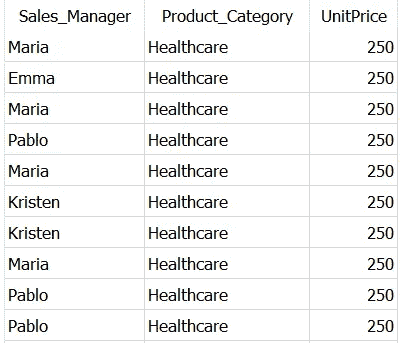
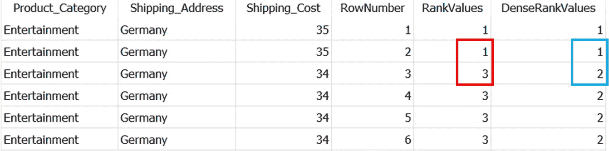
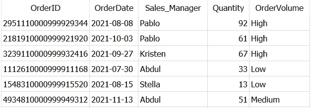
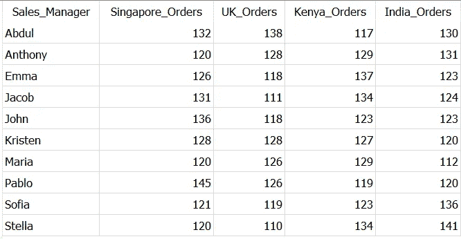
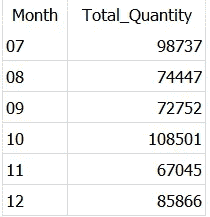
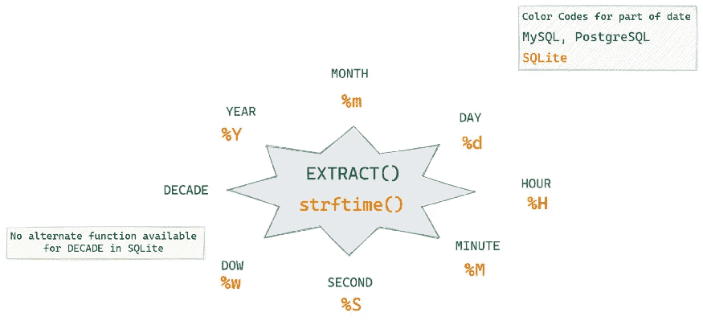
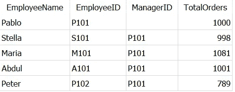
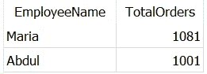

# 2022 年你应该知道的 5 个高级 SQL 概念

> 原文：<https://towardsdatascience.com/5-advanced-sql-concepts-you-should-know-in-2022-b50efe6c99>

## 数据科学

## 立即掌握这些节省时间的高级 SQL 查询


乔恩·泰森在 [Unsplash](https://unsplash.com/?utm_source=unsplash&utm_medium=referral&utm_content=creditCopyText) 上的照片

**做 SQL 高手！**🏆

SQL 或结构化查询语言是任何处理数据的人的必备工具。

随着数据量的增加，对熟练数据专业人员的需求也在增加。仅有高级 SQL 概念的知识是不够的，但是您应该能够在工作中高效地实施它们*,这也是数据科学职位的求职面试所需要的！*

因此，我在这里列出了 2022 年你应该知道的 5 个高级 SQL 概念及其解释和查询示例。

我把这篇文章写得很短，这样你就可以很快地完成它，掌握那些必须知道的、赢得面试的 SQL 技巧。🏆

您可以使用此索引快速导航到您最喜欢的部分。

```
**·** [**Common Table Expressions (CTEs)**](#e85d) **·** [**ROW_NUMBER() vs RANK() vs DENSE_RANK()**](#9f01) **·** [**CASE WHEN Statement**](#2f01) **·** [**Extract Data From Date — Time Columns**](#1c8a) **·** [**SELF JOIN**](#3ad5)
```

> 📍注意:我使用的是 SQLite DB 浏览器和一个使用 [Faker](/faker-an-amazing-and-insanely-useful-python-library-b313a60bdabf) 创建的自己创建的 [Dummy_Sales_Data](https://github.com/17rsuraj/data-curious/blob/master/TowardsDataScience/Dummy_Sales_Data_v1.csv) ，你可以在我的 [**Github**](https://github.com/17rsuraj/data-curious/blob/master/TowardsDataScience/Dummy_Sales_Data_v1.csv) repo 上免费获得！

好了，我们开始吧…🚀

# 公共表表达式(cte)

在处理真实世界的数据时，有时您需要查询另一个查询的结果。实现这一点的简单方法是使用子查询。

然而，随着复杂性的增加，计算子查询变得难以阅读和调试。

这时，cte 开始出现，让你的生活更轻松。cte 使得编写和维护复杂的查询变得容易。✅

例如，考虑以下使用子查询的数据提取

```
SELECT Sales_Manager, Product_Category, UnitPrice
FROM Dummy_Sales_Data_v1
WHERE Sales_Manager IN (**SELECT DISTINCT Sales_Manager
                        FROM Dummy_Sales_Data_v1
                        WHERE Shipping_Address = 'Germany'
                        AND UnitPrice > 150**)
AND Product_Category IN (**SELECT DISTINCT Product_Category
                         FROM Dummy_Sales_Data_v1
                         WHERE Product_Category = 'Healthcare'
                         AND UnitPrice > 150**)
ORDER BY UnitPrice DESC
```

这里我只使用了两个子查询，代码简单易懂。

这仍然很难理解，当您在子查询中添加更多的计算或者甚至添加更少的子查询时会怎么样— ***复杂性增加*** 使得代码可读性更差并且难以维护。

现在，让我们看看上面带有 CTE 的子查询的简化版本，如下所示。

```
WITH SM AS
**(
SELECT DISTINCT Sales_Manager
FROM Dummy_Sales_Data_v1
WHERE Shipping_Address = 'Germany'
AND UnitPrice > 150
)**,PC AS
**(
SELECT DISTINCT Product_Category
FROM Dummy_Sales_Data_v1
WHERE Product_Category = 'Healthcare'
AND UnitPrice > 150
)**SELECT Sales_Manager, Product_Category, UnitPrice
FROM Dummy_Sales_Data_v1
WHERE Product_Category IN (**SELECT Product_Category FROM PC**)
AND Sales_Manager IN (**SELECT Sales_Manager FROM SM**)
ORDER BY UnitPrice DESC
```

复杂的子查询被分解成要使用的更简单的代码块。

这样，复杂的子查询被重写为两个更容易理解和修改的 cte`SM`和`PC`。🎯

上面的两个查询，用了相同的时间执行，产生了如下相同的输出。



CTE vs 子查询|作者图片

cte 本质上允许您从查询结果中创建一个临时表。这提高了代码的可读性和可维护性。✅

真实世界的数据集可能有数百万或数十亿行，占据数千 GB 的存储空间。使用这些表中的数据进行计算，特别是将它们与其他表直接连接，将会非常昂贵。

这类任务的最终解决方案是使用 cte。💯

接下来，让我们看看如何使用窗口函数给数据集中的每一行分配一个整数“等级”。

# ROW _ NUMBER()vs RANK()vs DENSE _ RANK()

在处理真实数据集时，另一个常用的概念是记录的排序。公司在不同的场景中使用它，例如—

1.  根据销量对畅销品牌进行排名
2.  根据订单数量或产生的收入对顶级垂直产品进行排名
3.  获得观看次数最高的每种类型的电影名称

`ROW_NUMBER`、`RANK()`和`DENSE_RANK()`主要用于在结果集的上述分区内给每个记录分配连续的整数。

> 当你在某些记录上有联系时，它们之间的差别是显而易见的。

当结果表中存在重复行时，整数被分配给每条记录的行为和方式会发生变化。✅

让我们来看一个 [*虚拟销售数据集*](https://github.com/17rsuraj/data-curious/blob/master/TowardsDataScience/Dummy_Sales_Data_v1.csv) 的快速示例，按运费降序列出所有产品类别、送货地址。

```
SELECT Product_Category,
  Shipping_Address,
  Shipping_Cost,
  **ROW_NUMBER()** OVER
              (PARTITION BY Product_Category,
                            Shipping_Address
               ORDER BY Shipping_Cost DESC) as RowNumber,
  **RANK()** OVER 
        (PARTITION BY Product_Category,
                      Shipping_Address
         ORDER BY Shipping_Cost DESC) as RankValues,
  **DENSE_RANK()** OVER 
              (PARTITION BY Product_Category,
                            Shipping_Address 
               ORDER BY Shipping_Cost DESC) as DenseRankValues
FROM Dummy_Sales_Data_v1
WHERE Product_Category IS NOT NULL
AND Shipping_Address IN ('Germany','India')
AND Status IN ('Delivered')
```

正如您所看到的，三者的语法是相同的，但是，它会产生如下不同的输出:



ROW_NUMBER()、RANK()和 DENSE_RANK()之间的差异

`**RANK()**`是根据`ORDER BY`子句的条件检索已排序的行。如您所见，前两行之间有一个平局，即前两行在 *Shipping_Cost* 列中有相同的值(*在* `*ORDER BY*` *条款*中提到)。

`RANK`给两行分配相同的整数。但是，它会将重复的行数添加到重复的排名中，以获得下一行的排名。这就是为什么，第三行(*用红色标记*)，`RANK`分配等级`**3**` ( *2 个重复行+ 1 个重复等级*)

`**DENSE_RANK**`类似于`RANK`，但是它不会跳过任何数字，即使两行之间有平局。这可以在上图的*蓝框*中看到。

与上面两个不同，`**ROW_NUMBER**`只是从 1 开始给分区中的每个记录分配序列号。如果它在同一个分区中检测到两个相同的值，它会为这两个值分配不同的等级号。

**对于产品类别的下一个分区**—发货地址→ *娱乐—印度*,**通过所有三个函数**对**进行排序，从 1** 重新开始，如下图所示。


不同分区中的行号、等级、密度等级|按作者分类的图像

最终，如果在`ORDER BY`子句中使用的列中没有重复的值，这些函数将返回相同的输出。💯

接下来，下一个概念将讲述更多关于如何实现条件语句和使用它透视数据。

# CASE WHEN 语句

CASE 语句将允许您在 SQL 中实现`if-else`，因此您可以使用它来有条件地运行查询。

`**CASE**`语句主要测试`**WHEN**`子句中提到的条件，并返回`**THEN**`子句中提到的值。当不满足任何条件时，它将返回`**ELSE**`子句中提到的值。✅

在处理真实数据项目时，CASE 语句通常用于根据其他列中的值对数据进行分类。它也可以与聚合函数一起使用。

例如，让我们再次使用 [*虚拟销售数据*](https://github.com/17rsuraj/data-curious/blob/master/TowardsDataScience/Dummy_Sales_Data_v1.csv) 根据数量将销售订单分为高、中、低三种数量。

```
SELECT OrderID,
       OrderDate,
       Sales_Manager,
       Quantity,
       **CASE WHEN Quantity > 51 THEN 'High'
            WHEN Quantity < 51 THEN 'Low'
            ELSE 'Medium' 
       END AS OrderVolume**
FROM Dummy_Sales_Data_v1
```



CASE WHEN 语句按作者对 SQL | Image 中的记录进行分类

简单地说，它创建了一个新的列 *OrderVolume* ，并根据列 *Quantity* 中的值添加了值“高”、“低”、“中”。

📌您可以包含多个 WHEN..THEN 子句并跳过 ELSE 子句，因为它是可选的。

📌如果您没有提到 ELSE 子句，并且没有满足任何条件，查询将为该特定记录返回`**NULL**`。

case 语句的另一个常用但鲜为人知的用例是— **数据透视**。

> 数据透视是重新排列结果集中的列和行的过程，以便您可以从不同的角度查看数据。

有时您处理的数据是长格式的(行数>列数)，您需要得到宽格式的数据(列数>行数)。

在这种情况下，CASE 语句非常有用。💯

例如，让我们找出新加坡、英国、肯尼亚和印度的每个销售经理处理了多少订单。

```
SELECT Sales_Manager,
       **COUNT(CASE WHEN Shipping_Address = 'Singapore' THEN OrderID
             END) AS Singapore_Orders,

       COUNT(CASE WHEN Shipping_Address = 'UK' THEN OrderID
             END) AS UK_Orders,

       COUNT(CASE WHEN Shipping_Address = 'Kenya' THEN OrderID
             END) AS Kenya_Orders,

       COUNT(CASE WHEN Shipping_Address = 'India' THEN OrderID
             END) AS India_Orders**
FROM Dummy_Sales_Data_v1
GROUP BY Sales_Manager
```

使用案例..当...的时候..然后，我们为每个送货地址创建单独的列，以获得预期的输出，如下所示。



使用 SQL 中的 CASE 语句按作者透视数据|图像

根据您的用例，您还可以在 case 语句中使用不同的聚合，如 SUM、AVG、MAX、MIN。

接下来，在处理真实世界的数据时，它通常包含日期时间值。因此，了解如何提取日期时间值的不同部分(如月、周、年)非常重要。

# 从日期-时间列中提取数据

在大多数访谈中，您会被要求按月汇总数据或计算特定月份的特定指标。

当数据集中没有单独的月份列时，您需要从数据中的日期时间变量中提取所需的日期部分。

不同的 SQL 环境有不同的函数来提取日期的各个部分。总的来说，在 MySQL 中你应该知道—

```
**EXTRACT**(part_of_date FROM date_time_column_name)**YEAR**(date_time_column_name)**MONTH**(date_time_column_name)**MONTHNAME**(date_time_column_name)**DATE_FORMAT**(date_time_column_name)
```

例如，让我们从 [*虚拟销售数据集*](https://github.com/17rsuraj/data-curious/blob/master/TowardsDataScience/Dummy_Sales_Data_v1.csv) 中找出每个月的订单总量。

```
SELECT **strftime('%m', OrderDate)** as Month,
       SUM(Quantity) as Total_Quantity
from Dummy_Sales_Data_v1
GROUP BY strftime('%m', OrderDate)
```

如果你也像我一样使用 SQLite DB 浏览器，你必须使用函数`**strftime()**`来提取日期部分，如下所示。您需要使用`strftime()`中的`**‘%m’**` 来提取月份。



按作者从 SQL | Image 中的日期提取月份

下图显示了大多数通常提取的日期部分，以及你应该在`**EXTRACT**`函数中使用的关键字。



按作者提取 PostgreSQL、MySQL 和 SQLite |图片中的部分日期

在这篇快速阅读中，我解释了几乎所有类型的日期部分提取。看一看它就能对它有一个完整的了解。

<https://python.plainenglish.io/5-must-know-sql-functions-for-data-analysis-1f1a6ca53974>  

最后但同样重要的是，

在现实世界中，您会经常看到数据存储在一个大表中，而不是多个小表中。这时，在处理这些数据集时，自连接就可以解决一些有趣的问题了。

# 自连接

这些与 SQL 中的其他连接完全相同，唯一的区别是——在`SELF JOIN`中，您将一个表与其自身连接起来。

记住，这里没有`SELF JOIN`关键字，所以在连接中涉及的两个表是同一个表的情况下，只需使用`**JOIN**`。因为两个表名相同，所以在自连接的情况下使用表别名是很重要的。✅

> 编写一个 SQL 查询，找出收入高于其经理的雇员
> *——这是* `*SELF JOIN*`中最常被问到的面试问题之一

让我们以此为例，创建如下所示的 Dummy_Employees 数据集。



虚拟员工数据集|作者图片

并尝试使用该查询找出哪些员工处理的订单比他们的经理多，

```
SELECT t1.EmployeeName, t1.TotalOrders
**FROM Dummy_Employees AS t1
JOIN Dummy_Employees AS t2
ON t1.ManagerID = t2.EmployeeID**
WHERE t1.TotalOrders > t2.TotalOrders
```



结果集|作者图片

不出所料，员工 Abdul 和 Maria 比他们的经理 Pablo 处理了更多的订单。

在我面对的几乎 80%的面试中，我都会遇到这个问题。所以，这是`SELF JOIN`的经典用例。

仅此而已！

我希望你很快完成这篇文章，并发现它对提高 SQL 技能很有用。

我在过去 3 年里一直在使用 SQL，我发现这些概念经常成为数据分析师和数据科学家职位的面试问题。这些概念在实际项目中非常有用。

> *对阅读介质上的无限故事感兴趣？？*

💡考虑 [**成为媒体会员**](https://medium.com/@17.rsuraj/membership)**访问媒体上无限的**故事和每日有趣的媒体文摘。我会得到你的费用的一小部分，没有额外的费用给你。

💡请务必 [**注册我的电子邮件列表**](https://medium.com/subscribe/@17.rsuraj) 以免错过另一篇关于数据科学指南、技巧和提示、SQL 和 Python 的文章。

**感谢您的阅读！**