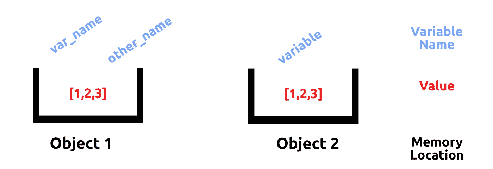

# 关于 Python 对象的 5 个高级技巧

> 原文：<https://towardsdatascience.com/5-advanced-tips-on-python-objects-689de0f055d6>

## Python 是一种面向对象的编程语言，但是它的行为很奇怪。如果你来自其他 OOP 语言，这篇文章可能对你有益


由[迈克·丹勒](https://unsplash.com/@howlingred16?utm_source=medium&utm_medium=referral)在 [Unsplash](https://unsplash.com?utm_source=medium&utm_medium=referral) 上拍摄的照片

在《流畅的 Python》的第 8 章中，卢西亚诺·拉马尔霍讨论了 Python 如何在幕后处理对象。这里将定义 python 中变量存储背后的基本概念，并探讨一些相关的注意事项。

事不宜迟，我们开始吧。

# 1-Python 变量不是盒子

**提示:python 变量是值的标签。**

在编程 101 中，我们经常被告知变量是存储值的盒子。例如，盒子`a`存储列表`[1,2,3]`。然而，在 python 中，情况并非如此。



图 python 变量的图示。蓝色是变量名，红色是值，黑色是存储它们的盒子。图片作者。

在图 1 中，**变量名(蓝色)是内存中某个位置的“标签”。**注意每个对象可以有多个变量名，如左图所示。内存中的位置(黑色)是“盒子”，而不是名称本身。那些盒子储存数值(红色)。让我们看一个例子。

```
var_name = 1var_name         # 1
id(var_name)     # 4443642160
```

在上面的代码片段中，变量`var_name`被赋值为`1`。存储值的“盒子”是内存 id `4443642160`。

现在，让我们将另一个变量添加到内存中的**相同的**位置…

```
another_var_name = var_nameid(var_name)                            # 4443642160
var_name                                # 1
id(var_name) == id(another_var_name)    # True
```

正如我们所看到的，我们有两个引用同一个对象的 python 变量。然而，一旦我们改变了第二个变量，例如通过运行`y += 1`，我们的内存位置就变成了`4443642192`，使得对象变得不同。

在 python 中，更直观的概念是将**变量名分配给内存中的位置。**内存中的那些位置存储值。

# 2-对象相等

**提示:使用** `**==**` **判断两个变量是否有相等的值，使用** `**is**` **判断两个变量是否共享内存中的位置。**

根据第 1 节中的设置，本节将会很简短。

`==`确定变量是否有相同的值——这就像 java 中的`.equals()`函数。然而，如果你真的想确定变量是否是同一个对象，你应该使用 T2 来测试内存 id。

```
a = 1
b = 1
c = aa == b == c      # True
a is c           # True
```

这里有一个有趣的旁注。我们期望`a is b`评估为`False`。但是，有时候是`True`。

令人惊讶的是，为了节省空间，如果对象值相同，python 有时会将变量分配给同一个对象。这节省了内存，因为在我们的例子中，您不需要创建整数`1`的单独实例——您可以引用同一个对象。

现在只要我们改变这些变量中的任何一个，它就会在内存中找到自己的位置。

# 3 —拷贝与深层拷贝

**提示:如果你不知道自己在做什么，使用** `**deepcopy()**` **。**

如果你和熊猫一起工作过，你可能见过和/或用过`df.copy()`。使用`copy`与`deepcopy`只会在处理复合对象(包含其他对象的对象，如列表或类实例)时对您产生影响。但是对于一些编程范例，复合对象是常见的。

下面是**深层拷贝**和**浅层拷贝**的区别

*   深度副本构造一个新的复合对象，然后递归地将在原始对象中找到的对象的副本*插入其中。*
*   *一个* **浅拷贝**构造一个新的复合对象，然后(尽可能地)将*引用*插入到原始对象中。

一个例子应该有助于澄清这一点…

`Bus`类创建一个乘客列表，从而使每个类实例成为一个复合对象。

正如我们所见，`bus2`是`bus1`的浅层拷贝，而`bus3`是深层拷贝。当`bus1`中的对象改变时，会影响`bus2`。但是，`bus3`完全不受影响。

这就是为什么使用`deepcopy` — **更安全的原因，你将得到一个对象值的全新副本。**

# 4 —功能参数

**提示:如果你设置一个空的可变变量作为 python 函数的默认值，要小心。**

Python 参数通过共享使用一个名为*的系统调用来传递，这意味着传递的值是浅拷贝。*

如果你默认传递一个空列表，例如`def my_func(x=[]):`，然后改变`x`，你将编辑内置的`list()`功能，而不是变量`x`。

书中推荐的方法是通过 case 逻辑在函数的开头指定默认值…

```
def my_func(x):
  if x is None:
    x = []
```

就我个人而言，我认为上述方法有些矫枉过正，对风格也不好，不过这是你的选择。

# 5 —垃圾收集

**提示:python 变量在引用用完时会被“垃圾收集”。**

对于我们的最后一个技巧，让我们来谈谈 python 垃圾收集是如何工作的。

每次我们给一个对象赋一个变量名，我们就给它一个引用。所以`a=1; b=a`意味着存储`1`的存储单元的引用计数为 2。

现在假设我们将`a`和`b`都分配给`None`，例如`a=None; b=None`。现在，因为没有变量引用值为`1`的对象，所以可以对该内存位置进行垃圾收集。

**如果参考计数为 0，存储器位置将被擦除，以便重新使用。**

很简单，对吧？

现在，为了结束这个话题，让我们也来谈谈关键字`del`。`**del**` **是用来删除变量名，而不是对象本身**。通过删除变量的名称，它释放了这个名称供以后使用，从而避免了潜在的名称冲突。然而，在后端，如果`del`导致引用计数为 0，那么对象也将被删除。

*感谢阅读！我会再写 16 篇文章，把学术研究带到 DS 行业。查看我的评论，链接到这篇文章的主要来源和一些有用的资源。*