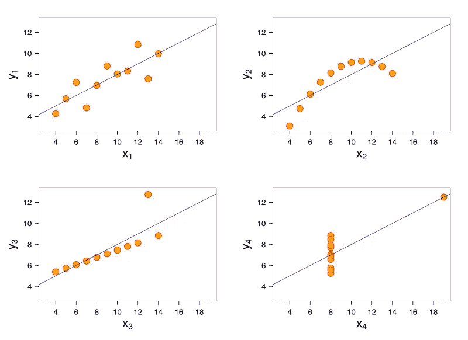

# 数据科学家应该警惕的 5 种偏见和谬误(以及如何避免它们)

> 原文：<https://towardsdatascience.com/5-biases-fallacies-data-scientists-should-beware-of-and-how-to-avoid-them-9b567174d2c1>

## 职业生涯中常见的错误

Photo by [愚木混株 cdd20](https://unsplash.com/@cdd20?utm_source=unsplash&utm_medium=referral&utm_content=creditCopyText) on [Unsplash](https://unsplash.com/s/photos/confused?utm_source=unsplash&utm_medium=referral&utm_content=creditCopyText)

# 介绍

处理数据最困难的事情之一是处理困扰数据本身以及我们如何解释数据的谬误和偏见。由于存在数百种偏见和谬误，我们大多数人都犯有做出错误结论和创建有偏见模型的错误。

在这篇文章中，我想谈谈所有数据科学家都应该注意的 5 种最常见的偏见和谬误，以及如何**实际上**避免它们。

说了这么多，让我们开始吧！

> 请**务必** [***订阅此处***](https://terenceshin.medium.com/membership) **千万不要错过另一篇关于数据科学指南、技巧和提示、生活经验等的文章！**

# 1.新奇偏见

## 这是什么？

新鲜感偏见是指顾客参与一项新功能或产品是因为它是新的，但不一定是因为他们喜欢它或因为它有价值。例如，如果一个新按钮出现在 YouTube 主页上，最初很可能会有很多点击，因为用户很好奇这个按钮是做什么的。当存在新鲜感偏见时，在开始时，治疗组很可能比对照组获得更多的参与，但这不是真正的效果。

## 如何解决它

您可以根据客户被分配到治疗组的时间进行群组分析，看看这种影响是否会随着时间的推移而减弱，而不是分析同一时间段(开始和结束时间)的所有客户。如果是的话，那么很可能这个实验存在新奇偏见。

# 2.数据挖掘

## 这是什么？

数据挖掘是指错误地进行数据分析，对同一组数据进行许多统计测试，并只报告那些有重大结果的数据。通过在多个统计测试中重复使用相同的数据，增加了测试偶然出现统计显著性的可能性(如果 alpha 为 0.05，则有 5%的可能性出现 1 型错误)。

## 如何解决它

没有完美的方法来解决这个问题，但最简单的解决方案是进行随机样本外测试，也称为交叉验证。就像验证机器学习模型一样，您会在测试假设之前拆分数据。然后，你可以用前半部分创建假设，用后半部分验证你的假设。

> 请**务必** [***点击此处订阅***](https://terenceshin.medium.com/membership) **千万不要错过另一篇关于数据科学指南、诀窍和技巧、生活经验等的文章！**

# 3.采摘樱桃

## 这是什么？

统计学中的挑选是指选择或“挑选”支持你立场的信息，即使有明确的证据与你的立场相矛盾。

当决策者想要推出一项功能或产品时，这种情况非常普遍。他们通常会选择任何看起来积极的见解来支持他们的决策，这违反了统计测试的原则。

## 如何解决它

**在测试你的任何假设**之前，无论是产品特性还是其他，决定一到三个核心指标，你将使用它们来确定它是否成功。请注意，我强调您应该在测试您的假设之前决定这些度量标准。

不要仅仅因为你想推进你的议程而移动目标。如果你看到一些有趣的事情，调查它，把它当作一个新的假设，不要基于一个意想不到的变化做出你的决定。

# 4.汇总指标的危险

[图片经许可取自维基媒体](https://en.wikipedia.org/wiki/File:Anscombe%27s_quartet_3.svg)

20 世纪 70 年代，统计学家弗朗西斯·安斯科姆(Francis Anscombe)收集了四组具有相同均值、方差和相关性的数据。然而，当你看上面的图表时，很明显它们是完全不同的。这意味着显示仅仅依赖汇总指标的危险性。

## 如何解决它

养成通过百分位数或十分位数而不是平均值来查看数据的习惯。同样，如果可能的话，试着通过图表(直方图、散点图)来查看你的数据。

# 4.虚假因果关系

## 这是什么？

当一个人认为因果关系的存在是因为相关性的存在时，就会产生虚假的因果关系。一个错误的因果关系的例子是，如果我假设我每天早上穿着鞋睡觉都会头疼。事实上，无论何时我喝多了，我都会忘记脱鞋，然后带着宿醉醒来。

## 如何解决它

为了解决这个问题，永远不要假设相关性意味着因果关系。相反，你需要用控制实验来进一步验证你的假设。

> **一定要** [***订阅此处***](https://terenceshin.medium.com/membership) **千万不要错过另一篇关于数据科学指南、技巧和提示、生活经验等的文章！**

# 5.辛普森悖论

## 这是什么？

辛普森悖论是一种趋势出现在不同的数据子集中，但在子集合并时消失或逆转的现象。

举个例子，伯克利大学在 20 世纪 70 年代被指控性别歧视，因为女性申请者的录取率低于男性。但是，在深入研究之后，他们发现，就单个受试者而言，女性的接受率实际上高于男性。造成这种矛盾的原因是，大部分女性申请者申请的是竞争激烈的学科，而这些学科的男女录取率都要低得多。

## 如何解决它

将您的所有指标分解成它们的组成元素。例如，如果你在看公司收入，你应该按来源分解收入，并把它与相关成本联系起来。这样，你就降低了对你的业务表现做出错误结论的风险。

# 感谢阅读！

> ***务必*** [***订阅此处***](https://terenceshin.medium.com/membership) ***千万不要错过另一篇关于数据科学指南、诀窍和技巧、生活经验等的文章！***

不确定接下来要读什么？我为你挑选了另一篇文章:

</five-advanced-data-visualizations-all-data-scientists-should-know-e042d5e1f532>  

**还有一个:**

</over-100-data-scientist-interview-questions-and-answers-c5a66186769a>  

# 特伦斯·申

*   ***如果您喜欢这个，*** [***订阅我的媒介***](https://terenceshin.medium.com/membership) ***获取独家内容！***
*   ***同样，你也可以*** [***关注我上媒***](https://medium.com/@terenceshin)
*   ***跟我上***[***LinkedIn***](https://www.linkedin.com/in/terenceshin/)***其他内容***