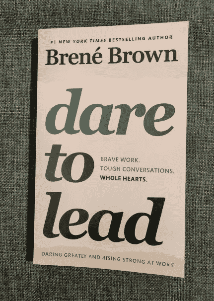
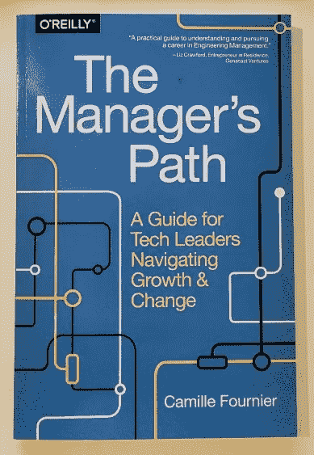
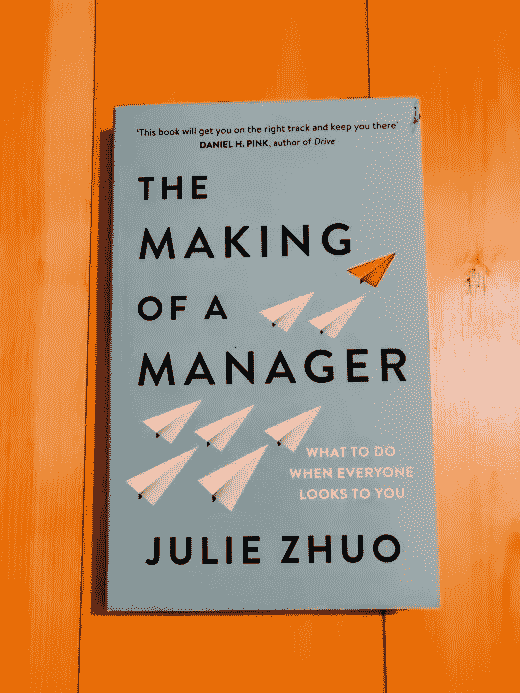
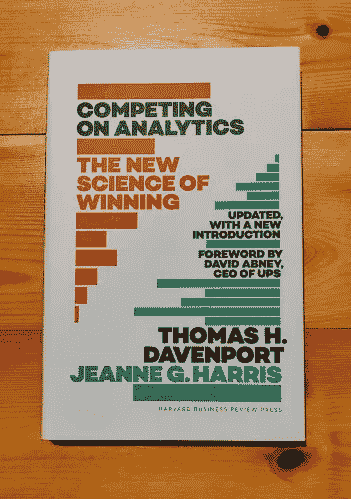
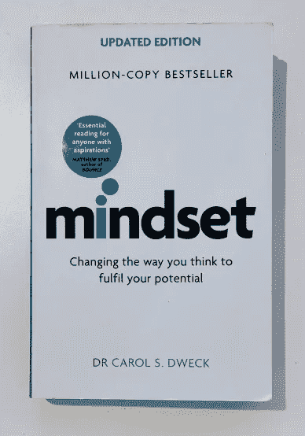

# 成为数据分析领域领导者的 5 本书

> 原文：<https://towardsdatascience.com/5-books-to-grow-as-a-leader-in-data-analytics-e16b31a5925a>

# 成为数据分析领域领导者的 5 本书

埃里克·范·迪克在 [Unsplash](https://unsplash.com?utm_source=medium&utm_medium=referral) 上的照片

你是一个正在走向管理岗位的高级分析师，一个新的分析经理，还是一个有经验的？如果是这样，领导技能是成功的关键，这些书将帮助你实现这一目标。

成为领导者是一条漫长的路，读五本书不会改变一切。然而，这些书正在帮助我理解一些支持我走向管理的关键概念，我相信它们能帮助你。

我将在下面展示的书籍选择是以成为一名分析型领导者为导向的，但它们也可能适合其他角色。这个角度的第一个原因是，分析是我的领域；因此，我更明白我们可以面对的挑战。其次，与许多技术领域一样，分析领域的经理过去是高级个人贡献者，这种转变需要适应。

以下是我建议阅读的培养你的领导技能的书籍的主题。我特别推荐读第一本书，因为在我看来，脆弱远非弱点，而是成为伟大领袖的必备技能。

1.  理解同情、恐惧和勇气
2.  技术领导者的导航指南
3.  在新的管理岗位上取得成果
4.  建立分析策略
5.  固定思维与增长思维

## [敢于领导—布伦·布朗](https://www.awin1.com/cread.php?awinmid=16829&awinaffid=1007489&ued=https%3A%2F%2Fwww.bookdepository.com%2FDare-to-Lead%2F9781785042140)

作者照片

你曾经遇到过需要进行艰难对话的情况吗？在那里，你害怕**冲突**并最终避免了**的强硬谈话**，保留了诚实和富有成效的反馈？那么这本书很可能会启发你，并给出可操作的行动项目。

研究人员和领导力教练布伦·布朗将在本书中指导你寻找内心的勇气，消除我们建立的人为障碍，并能够以最佳状态领导。

笔者将通过调研和亲身经历，探讨如何**找到领导的勇气，去除对失败的恐惧，管理好自己的情绪。**

如果你想与你的团队建立更深层次的联系，学习如何给予和接受反馈，在工作场所建立信任，失败如何让我们变得勇敢，…

## [**管理者之路——卡米尔·福涅尔**](https://www.awin1.com/cread.php?awinmid=16829&awinaffid=1007489&ued=https%3A%2F%2Fwww.bookdepository.com%2FManager-s-Path-Camille-Fournier%2F9781491973899%3Fref%3Dgrid-view%26qid%3D1642596331548%26sr%3D1-1)

作者照片

您应该安排常规的一对一吗？应该每周一次吗？会不会太多了？它带来了什么？我们肯定会问自己这些相关的问题，谢天谢地我们不是第一个。

如果你正准备开始一个管理职位，这是一本好书。它有你作为一名经理需要学习的所有技巧和诀窍。这是我读过的最好的管理“指南”书；它给出了高层次的方向和具体的建议。

作者正在经历一个技术环境下的所有管理阶段，如何做一个导师，管理一个团队还是管理多个团队。

我强烈推荐**根据需要多读几遍这本书**。然后，当一个挑战出现时，回到相关的章节，以获得灵感或答案。

## [一个经理人的成功之路——朱莉·卓](https://www.awin1.com/cread.php?awinmid=16829&awinaffid=1007489&ued=https%3A%2F%2Fwww.bookdepository.com%2FMaking-Manager-Julie-Zhuo%2F9780753552896%3Fref%3Dgrid-view%26qid%3D1642596378462%26sr%3D1-1)

作者照片

您将开始一个新的经理职位；你将领导哪种类型的团队？

*   你正在成长的团队中担任管理职位吗？
*   你会接替离职的经理吗？
*   你正在组建一个新的团队吗？
*   你在管理一个现有的团队吗？

所有这些职位将产生非常不同的挑战。这本书将帮助你了解如何在新工作的旅程中导航。

> *“伟大的管理者是造就的，不是天生的”*

这个概念是本书的开篇，**我们从未准备好，我们不是天生的管理者，**我们还有**一切要学。** Julie Zhuo 撰写了这本现代指南，讲述了作为一名经理意味着什么，如何在团队中建立信任、主持会议、招聘人员……你将能够在轻松清新的写作中了解或重新发现新经理可能面临的陷阱。

作者将利用她自己作为脸书公司年轻经理，直至产品设计副总裁的经历，启发你，给你许多窍门，最终让你成为一个更自信的经理。

## [在分析上竞争——达文波特、哈里斯](https://www.awin1.com/cread.php?awinmid=16829&awinaffid=1007489&ued=https%3A%2F%2Fwww.bookdepository.com%2FCompeting-on-Analytics-Updated-with-New-Introduction-Thomas-H-Davenport%2F9781633693722%3Fref%3Dgrid-view%26qid%3D1642596405858%26sr%3D1-1)

作者照片

今天的商业世界不应该依赖于产品、技术或服务。相反，他们应该在分析上竞争！达文波特教授和哈里斯教授在他们由哈佛商业评论出版社出版的书中论证了这一概念。

在分析方面的竞争提供了一个真正由数据驱动的路线图。你将学习如何创造新的分析策略，如何评估你公司的能力，并引导它在分析领域竞争。

感谢来自**不同领域**(营销、产品、供应链、人力资源……)和**几家公司**(谷歌、UPS、迪士尼)的各种例子，这本书将与大多数公司的分析领导者相关。

## [卫生部——卡罗尔·德韦克博士](https://www.awin1.com/cread.php?awinmid=16829&awinaffid=1007489&ued=https%3A%2F%2Fwww.bookdepository.com%2FMindset-Updated-Edition-Dr-Carol-Dweck%2F9781472139955%3Fref%3Dgrid-view%26qid%3D1642596426111%26sr%3D1-1)

作者照片

我们的心态决定了我们如何应对各种情况和挑战，并最终决定了我们如何成长。在这本书里，卡罗尔·德韦克博士讨论了固定思维和成长思维的差异。

简而言之，有固定思维模式的人寻求认可，认为他们的能力是一成不变的。当成长心态的人**对发展持开放态度时，**将**失败视为成长机会**。

即使你认为自己有一个成长的心态，也会有你的心态被固定的情况。但是，通过意识到它和理解这个概念，你会改变你的心态，朝着正确的方向成长。

要想成为领导者，你需要尽可能多地使用成长思维；这本书给出了理解行为的所有关键，并让我们走上释放我们全部潜力的道路。

我希望这些书对你和对我一样有帮助。如果您有其他建议，请随时联系我们或添加评论。

如果你喜欢 Medium，请考虑使用我的推荐链接来获得对每篇文章的无限制访问，我将收取你的一部分会员费，不收你任何费用！

 [## 加入我的介绍链接-瓦伦丁穆克媒体

### 作为一个媒体会员，你的会员费的一部分会给你阅读的作家，你可以完全接触到每一个故事…

valentin-mucke-ds.medium.com](https://valentin-mucke-ds.medium.com/membership) 

*免责声明:本帖中有附属链接支持我的写作。如果你通过他们买东西，我可以赚佣金。至于你是否决定买东西，决定权在你。这完全取决于你。*

干杯