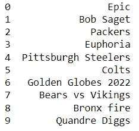
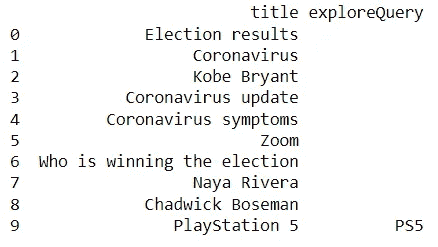
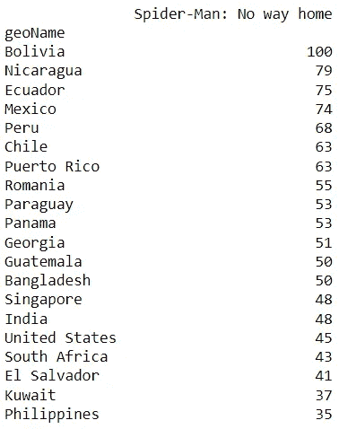
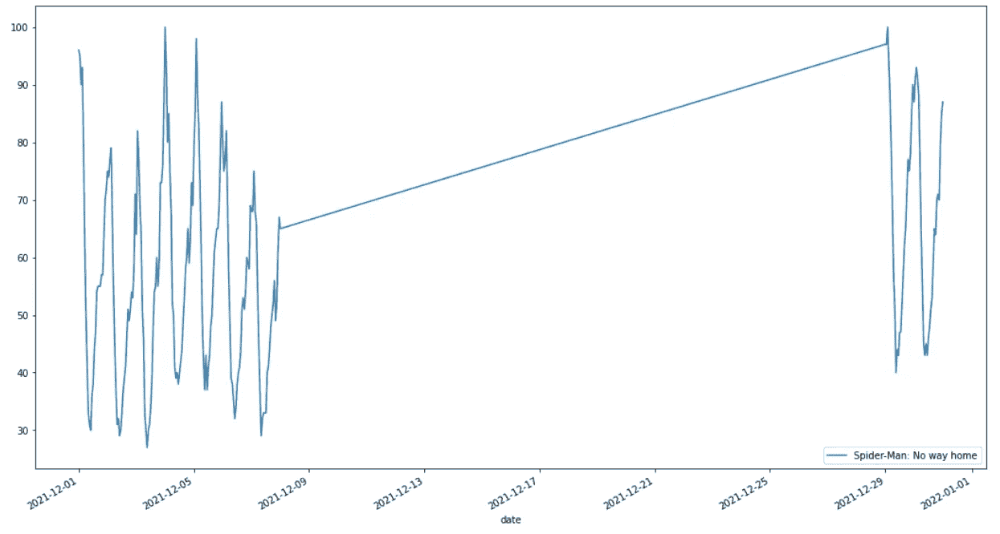
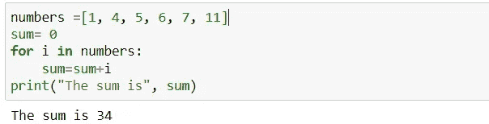
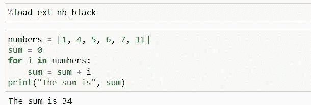

# 你可能错过的 5 个很酷的 Python 库(第 2 部分)

> 原文：<https://towardsdatascience.com/5-cool-libraries-in-python-you-might-have-missed-part-2-72e82a1f2c7c>

## 幸运的是，我找到了这些令人兴奋的库！


照片由[思想目录](https://unsplash.com/@thoughtcatalog?utm_source=medium&utm_medium=referral)在 [Unsplash](https://unsplash.com?utm_source=medium&utm_medium=referral) 上拍摄

# 介绍

我喜欢阅读新的 Python 包，每当我遇到任何有趣的东西，我都想写下来分享一下。我也曾经有一篇关于这个话题的文章分享，是[**你可能错过的 5 个有趣的 Python 库**](/5-interesting-python-libraries-that-you-might-have-missed-3ee7cb4f099e) 。

几天前，我继续发现了一些更酷的包，我相信这些包在很多情况下都会有帮助。这就是为什么我决定在今天的文章中继续讨论。

现在，让我们看看今天有什么。

# Pytrends

我相信你们中的许多人曾经听说过谷歌趋势。这是一个免费的公共平台，可以让你追踪对某个主题或搜索短语的兴趣。那么，我们如何将谷歌趋势整合到 Python 中呢？如何从手动搜索和复制谷歌趋势中节省时间？

好吧，让我们来看看 py Trends——Google Trends 的一个非官方 API，用于从 Google Trends 中提取数据。使用 Pytrends，您可以轻松获取每小时兴趣、地区兴趣、热门趋势搜索以及相关主题或查询的数据。更多信息可在本 [***文档***](https://pypi.org/project/pytrends/) 中找到。

下面是这个包的一些优秀的 API 方法。

## 寻找热门搜索

如果我们想知道个人在过去几天里对什么感兴趣，我们可以使用`pytrend.trending_searches.`简单地找出答案

美国十大热门搜索是:



图 1:美国热门搜索——作者图片

## 搜索热门历史图表

**例如**在另一种情况下，我们可以尝试用`top_charts`属性寻找 2020 年的 Google top chart。



图 2:排行榜—按作者分类的图片

在`top_charts`属性中，您可以确定您的母语`hl`、时区`tz`或地点`geo`来生成相应的排行榜。

## 发现主题的区域趋势

**例如**我挺好奇 ***《蜘蛛侠:无路可归》*** 过去 3 个月在各地区的走势。因此，我将借助`interest_by_region`来了解不同国家的人们的兴趣，如您在下面的代码中所见:



图 3:按地区划分的兴趣—按作者划分的图片

对于 Google Trends，值在 0 到 100 的范围内确定，100 表示最受欢迎的位置，趋势处于顶峰，0 表示所选术语的数据不足的位置。因此，很容易看出这部电影在玻利维亚达到了顶峰。

## 随着时间的推移寻找兴趣

**例如**我现在更感兴趣的是从 12 月初到月底跟踪 ***【蜘蛛侠：英雄无归】*** 的人气，看看电影什么时候受到的关注最大。我如何使用 Pytrend 查找数据？

用`get_historical_interest`很简单。在该组件中，您可以指定想要查看的特定时间范围。



图 4:随着时间推移的兴趣——作者图片

嗯，正如你在图 4 中看到的，电影高峰在 2021/12/29 和 2021/12/05。简单吧？

除了 Pytrend 中的这些搜索方法之外，您还可以深入研究更多方法:

*   [**历史小时兴趣**](https://github.com/GeneralMills/pytrends#historical-hourly-interest) **:** 给出 Google Trends 对搜索关键字的历史小时兴趣数据。
*   [**建议**](https://github.com/GeneralMills/pytrends#suggestions) **:** 为细化趋势搜索提供了一个额外的建议术语列表。
*   [**相关查询**](https://github.com/GeneralMills/pytrends#related-queries) **:** 查了你的短语的用户也查了这些术语。

# nb _ 黑色

如果你不确定 Python 的格式，nb_black 允许格式化你的代码。步骤很简单。你要做的就是:

*   安装软件包
*   在笔记本的开头加载软件包，并让软件包为您完成所有格式化工作

```
!pip install nb_black 
%load_ext nb_black
```

下面的图 5，6 显示了这个包如何自动纠正我的代码格式。



图 5:凌乱的格式——作者图片



图 6:格式正确的图片

# 数字计算器

该软件包有助于将自然语言数字转换成数字(整数和浮点数)。比如我想把 ***【二万零一百零五】*** 翻译成数字，`Numerizer`用法如下:

应用函数后的结果是 20105。又酷又轻松，对吧？

# 打开数据集

我们可以使用 **OpenDataSets** 直接下载一个 Kaggle 数据集。它将创建一个保存数据集的文件夹。数据集保存在解压后的文件下，方便使用。

我们所要做的就是安装软件包，并选择我们想要下载数据集的 URL。如图 7 所示，选择数据**“巧克力棒等级”**进行下载。运行代码后，解压缩后的数据集立即出现在保存我的笔记本的文件夹中。非常简单方便。

图 7:下载 Kaggle 数据集——作者 GIF

# **皮阿斯特罗**

最后，py astro——一个非常有趣的库来结束本文。如果你是一个对十二生肖感兴趣的人，这个库就是给你玩的。

它为每个星座提供了一个星座。你可以知道那天一个星座的预测，这个星座的幸运数字，幸运时间，幸运颜色，甚至星座的兼容性。

# 结论

我相信从成千上万的 PyPI 库中选择一个合适的库来执行可能很困难，这就是我写这篇文章的原因。我希望这篇文章和我之前的 [**5 个你可能错过的有趣的 Python 库**](/5-interesting-python-libraries-that-you-might-have-missed-3ee7cb4f099e) 能让你对一些可用的有趣的 Python 库以及如何执行它们有所了解。

我知道他们中的一些人目前似乎没有用，但我相信他们在未来会以某种方式支持你。

感谢您抽出时间阅读。

# 参考

[](https://predictivehacks.com/get-google-trends-using-python/)  [](https://pypi.org/project/nb-black/)  [](https://github.com/JovianML/opendatasets) 