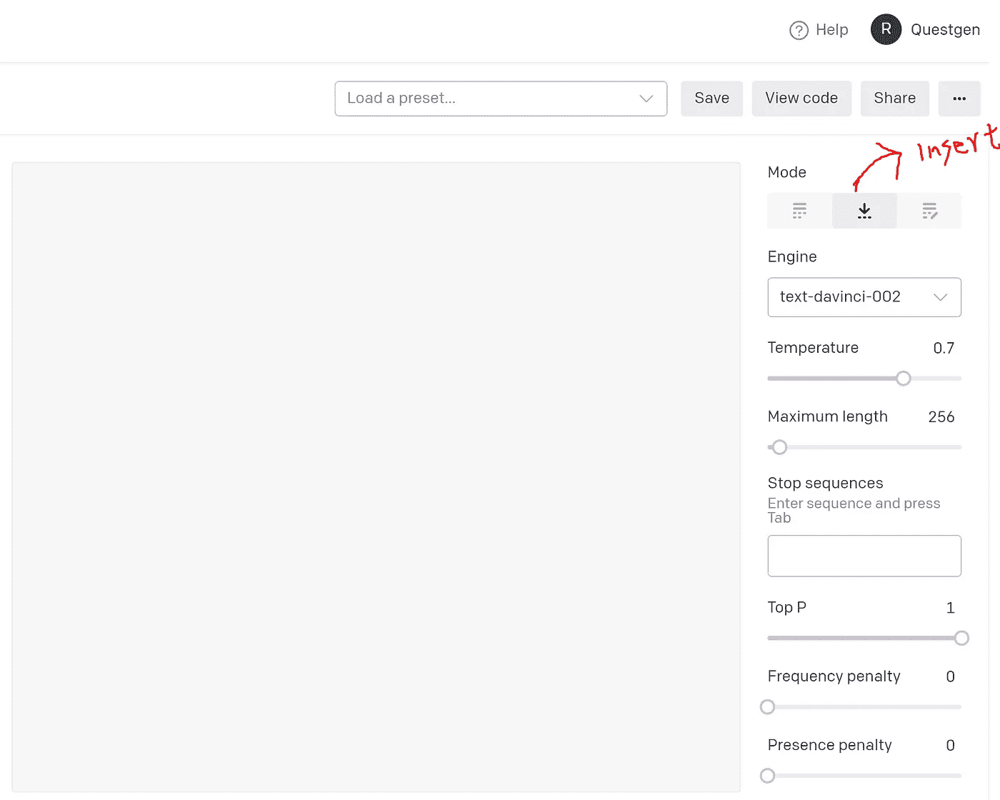
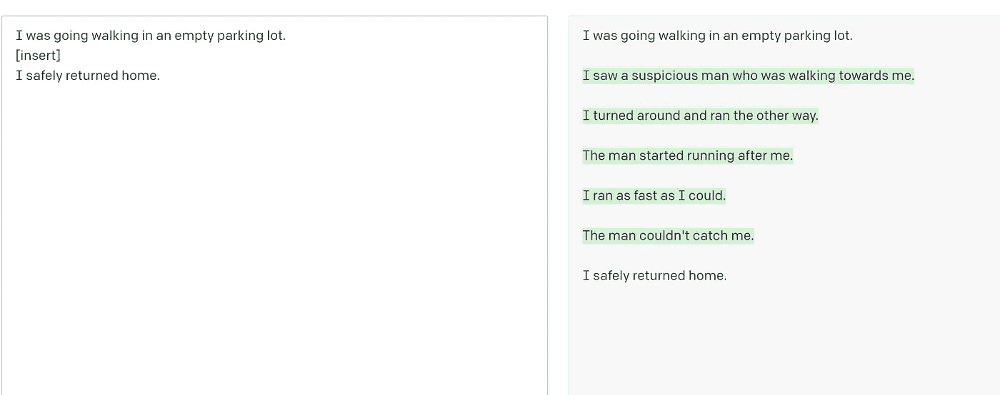
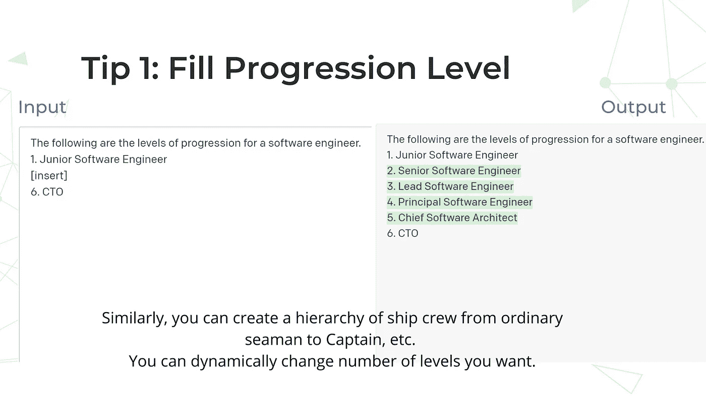
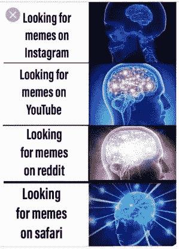
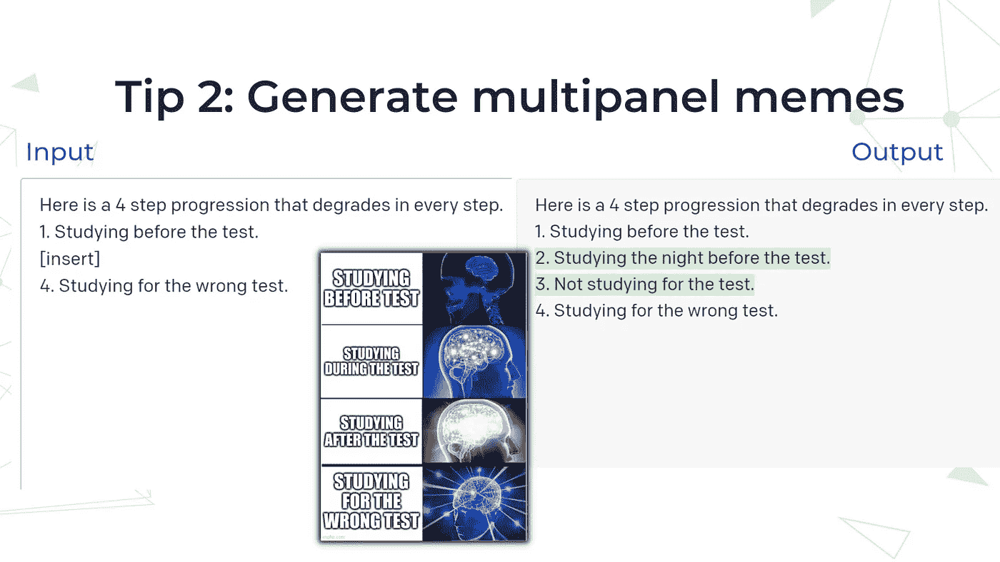
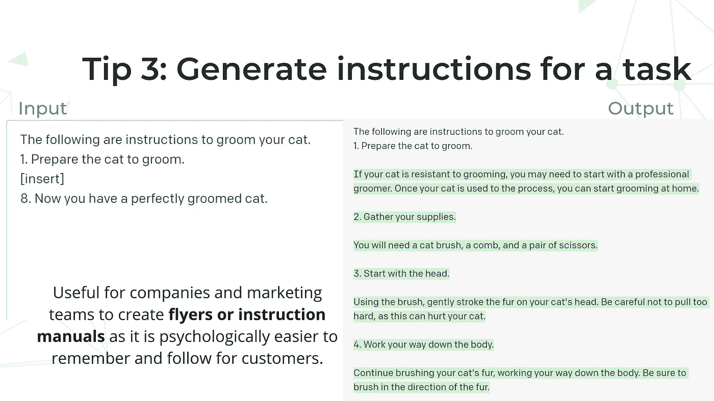
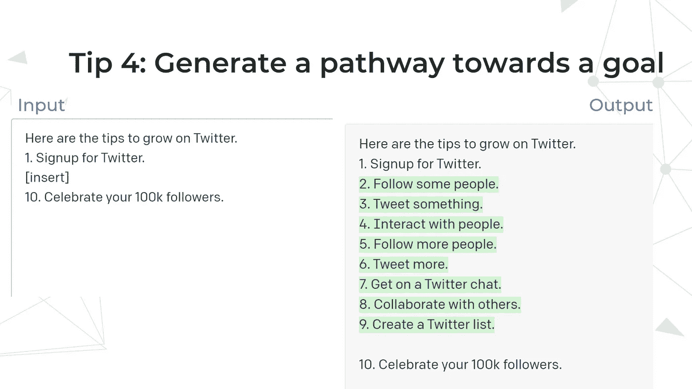
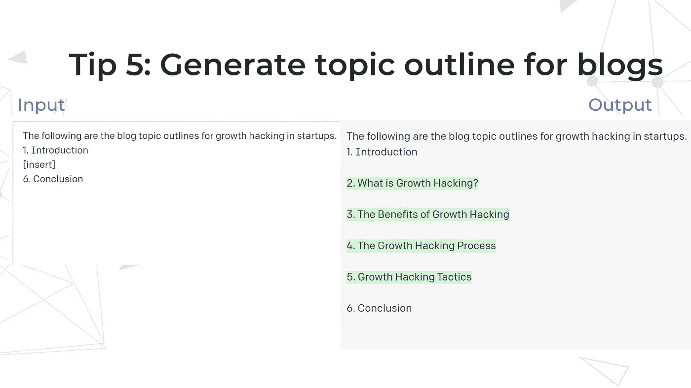

# 使用 OpenAI GPT-3 的插入文本模式的 5 种创造性方法

> 原文：<https://towardsdatascience.com/5-creative-ways-to-use-openai-gpt-3s-insert-text-mode-7a738088f20e>

## 了解 GPT-3 的插入模式的使用案例

作者图片

OpenAI 最近(2022 年 3 月 15 日)在 GPT-3 的文本生成中推出了**编辑和插入模式**。虽然 edit &插入模式仍处于测试阶段，但他们已经展示了令人印象深刻的文本填充和编辑功能。

在本教程中，我们将重点介绍 GPT-3 的**插入模式**以及使用它可以完成的一些创造性任务。简而言之，插入模式可以被视为一种**智能填空**模式。

# 如何进入 GPT 3 号游乐场的插入模式？

一旦你进入 [GPT-3 游戏场](https://beta.openai.com/playground)，在右侧面板上，点击**模式**下的中心向下箭头图标。它调出插入模式，将屏幕分成两列，输入和输出。

作者图片

# 如何在 GPT 三号游乐场使用插入模式？

要使用插入模式，您只需在左侧框中输入一些开始文本，添加**【插入】**，然后添加您的结束文本。然后 GPT-3 在右侧自动用它生成的相关输出上下文替换**【插入】**。在下图中，以绿色突出显示的文本是在**【插入】**处新生成的文本。

作者图片

虽然上面的用例对于生成给出故事开始和故事结束的情节非常有用，但是一旦我们利用列表格式，就会出现更多有趣的用例，我们将在下一节中看到。

# 1.填充进度级别

您可以输入任何职业发展的水平，例如下图中一名软件工程师从初级到 CTO 的发展。

GPT-3 将自动用相关标题填充元素列表。类似地，你可以生成从水手到船长的船员等级。

有趣的是，你可以动态地改变等级的数量，GPT-3 会相应地适应。您可以将 CTO 列为第 9 个列表点，它将生成从 2 到 8 的适当级别，从初级软件工程师开始。

图片由作者使用 GPT 3 游乐场

# 2.生成多面板迷因

另一个有趣的用例是生成多面板迷因。由于 GPT-3 文本插入可以被视为一个智能的填空系统，您可以给定第一个迷因行文本和最后一个迷因行文本，并要求它在两者之间扩展。

迷因取自[https://imgflip.com/](https://imgflip.com/)

上面的迷因也被称为**星系大脑**象征着右栏大脑的扩展，表明认知能力的提高，而讽刺的是，左栏文本在进化中退化，变得越来越差。

作者图片

在上面的例子中，你可以看到我们在左侧给出了一个提示，只显示了第一行和第四行的迷因文本，并要求智能地填充第二行和第三行的迷因文本。在右边，你可以看到类似于真实模因的输出。

我们正在建造[superme . AI](https://supermeme.ai/)，这是一个人工智能热图生成器，我们在这里用 GPT-3 进行实验，为如上所述的多面板迷因生成迷因文本。

# 3.为任务生成说明

以下用例类似于 OpenAI 文档中显示的生成烘焙指令的用例。

您可以为任何给定的任务生成指令，而无需了解手头任务的任何细节。在下面的例子中，我们正在生成训练一只猫的指令，你可以看到开始文本和结束文本非常普通，在它们之间有**【插入】**。尽管如此，GPT-3 模型能够为给定的任务生成完全相关的指令。

指令生成对于公司和营销团队创建传单或指令手册非常有用，因为它在心理上也更容易让客户记住和遵循。

作者图片

# 4.创造通向目标的途径

您可以使用 GPT-3 插入模型来生成通向给定目标的路径。例如，你可以提示 GPT-3 在 Twitter 上创建一条通往 10 万粉丝的途径，只需注册该平台即可。

您还可以尝试将最后一步从 10 万更改为 100 或 1000 名追随者，实现每个目标的途径和策略可能会略有不同，因此 GPT-3 将在大多数情况下相应地适应和产生。

作者图片

# 5.为博客生成主题大纲

另一个有趣的用例是生成博客主题大纲。同样，在没有真正了解主题的情况下，你可以给出一般性的开头和结尾文本，如**引言和结论**，并要求 GPT-3 为手头的主题生成相关的副标题。

作者图片

祝 NLP 探索愉快，如果你喜欢它的内容，请随时在 Twitter 上找到我。

如果你想以实用的方式学习 NLP，请查看我的课程[自然语言处理实用介绍](https://www.learnnlp.academy/practical-introduction-to-natural-language-processing)