# 面向数据科学家的 5 种数据分布

> 原文：<https://towardsdatascience.com/5-data-distributions-for-data-scientists-97d92d028190>

## 数据分布帮助我们更好地理解随机变量。这篇文章提供了关于 5 个重要数据分布的总结和资源，可以帮助你建立一些统计基础。


照片由 Chris Barbalis @unsplash.com 提供

统计学在塑造现代社会中发挥了巨大的作用，是帮助我们了解周围世界的主要工具之一。自古以来，统计学和数学是对推论和经典概率论做出贡献的两个学科。

来自统计世界的一个主要概念是**大多数随机变量被建模成一个可以用参数**描述的形状。这就是我们通常所说的*数据分布。*

数据分布是统计学的基石之一。假设检验和概率理论是从简单的概念发展而来的，即绘制随机变量的多次出现，可视化它的形状，并用它进行一些数学运算。

基本上，分布是随机变量呈现自身的一种方式，它帮助我们理解:

*   随机变量的期望平均值是多少？
*   随机变量的期望分布是多少？
*   值的范围是什么？

在我们开始之前，将连续分布和离散分布分开也很重要。

**离散分布**模拟可以取一定数量值的随机变量(如掷骰子、年龄等)。)是可数的——通常是整数。**连续分布**模拟随机变量，这些变量可以取无穷多个值，例如温度、人的体重等，通常用浮点数表示。

在数据科学和分析的背景下，了解要素和目标的数据分布将为您构建模型提供更好的假设(例如，何时线性模型合适或不合适)。此外，了解数据分布将有助于您建模和构建目标变量。

在本帖中，我们将探索一些最常见的数据分布，并使用 Python 模拟几个例子。

# 正态分布—连续分布

可以说，最著名的数据分布是正态分布。许多不同的现实世界现象都围绕着著名的钟形曲线，例如:

*   特定人群的身高；
*   出生体重；
*   学生的考试成绩；

这些例子真是五花八门。这就是为什么正态分布是一个如此令人印象深刻的概念——它能够模拟从经济学、生物学和社会学等不同研究领域的许多现实世界现象。

正态分布最重要的特征:

*   均值、中值、众数都差不多。
*   标准差决定了分布的扩散；
*   它大致是公制的。

让我用 Python 来举例说明。首先，让我加载几个库，它们将帮助我生成本文中的示例:

```
import numpy as np
import matplotlib.pyplot as plt
import seaborn as sns
```

让我们绘制一个由 7 个随机样本生成的正态分布图，我们将使用 seaborn 的密度图:

```
np.random.seed(42)
(
    sns.kdeplot(np.random.normal(loc = 100, scale = 3, size = 7))
    .set(title='Density Plot of Random Normal Distribution')
)
```

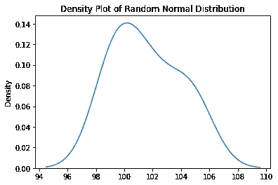

生成的随机“正态分布”—由作者生成的图像

请注意，我们的随机变量倾向于“钟形”曲线——我们有一个小样本，目前，形状仅近似于钟形。当我们处理较小的样本时，这是完全正常的-总体的基本分布可能具有真正的正态分布，但是因为您的样本如此之低，样本模式可能偏离完美的钟形曲线。

经历正态分布的特征:

*   均值——这是分布的峰值，也是大多数例子的落脚点——在我们来自`numpy.random`的`normal`函数中，这由`loc`参数表示。
*   标准差是分布在平均值周围的预期分布。较低的值意味着值变化较小。该参数由上面函数中的`scale`表示。

如果我们增加生成上述数据的样本数量，会发生什么情况？让我们绘制 10.000 均值样本的正态分布图，我们通过改变图中的`size`参数来改变这一点:

```
np.random.seed(42)
(
    sns.kdeplot(np.random.normal(loc = 100, scale = 3, size = 10000))
    .set(title='Density Plot of Random Normal Distribution')
)
```

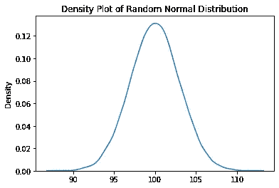

生成的随机“正态分布”—由作者生成的图像

酷！我们的随机变量现在是一个完美的钟形曲线。标准差设置了钟形的宽度-标准差越低的正态分布变量最终将具有越细的钟形曲线。

您将在典型数据科学项目的几个特征中找到正态分布:

*   对于线性模型，假设之一是我们的线性模型中的误差应该是正态分布的。如果不是，那么我们可能不应该使用线性模型(比如回归)，或者你需要更多的特性。
*   另一个例子是依靠 *p 值*测试来推断特征预测目标的能力的模型。P 值只不过是对正态分布效应的概率值的测试。
*   更常见的应用是检查特征的正态性，并应用某种标准偏差范围来排除训练表中的异常值。如果基础变量遵循近似钟形的曲线，那么使用一些统计数据来执行异常值检测可能是个好主意。

大多数正态分布没有很多偏斜，这意味着它们以平均值为中心。但是还有其他一些现象有很长的右尾巴——它太常见了，我们甚至给它起了个名字！让我们看看下一个话题。

如果你想探索正态分布背后的数学，那么[正态分布维基百科](https://en.wikipedia.org/wiki/Normal_distribution)页面非常好。

# 对数正态分布—连续分布

另一种连续概率分布，对数正态分布可能看起来与正态分布相似，但它有一些缺点:

*   它向右倾斜，意味着它有一个正的胖尾巴。
*   它只包含正值。

考虑对数正态分布的参数的一种方法是考虑均值*和方差*的*和*，*虽然不是底层值本身，而是底层变量的*对数*变换。*

举个例子，让我用 Python 来展示这个分布的形状，参数*均值* = 3，*标准差* = 1:

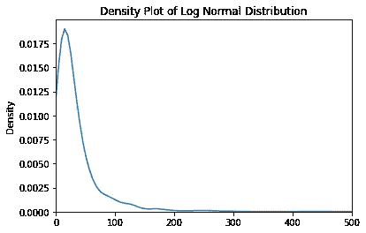

生成随机的“对数正态分布”—图片由作者生成

同样，我使用`numpy`来生成对数正态分布:

```
np.random.seed(42)
(
    sns.kdeplot(np.random.lognormal(mean  = 3, sigma = 1, size = 1000))
    .set(title='Density Plot of Log Normal Distribution')
)
plt.xlim([0,500])
```

现在，一件很酷的事情是，如果我对生成的数据应用对数(使用`np.log`),会发生一些有趣的事情:

```
np.random.seed(42)
(
    sns.kdeplot(np.log(np.random.lognormal(mean  = 3, sigma = 1, size = 1000)))
    .set(title='Density Plot of Transformed Log Normal Distribution')
)
```

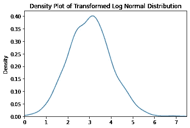

生成转换后的随机“对数正态分布”——图片由作者生成

认得这个吗？其实是正态分布！对数正态分布在现实生活中很常见:

*   大多数包含货币值的变量往往具有对数正态分布，例如顾客在商店的购买量；
*   收入分配；
*   成人体重有服从对数正态分布的趋势；

大多数情况下，不可能有负值的现象和我们可能找到极端正值的地方可以用这种分布来建模。

如果你的模型依赖于纯线性，用`log`变换来转换这些变量可能会提高它的性能和稳定性。

同样，如果你对对数正态分布背后的数学感兴趣，请访问这个维基百科页面。

# 伯努利分布——离散分布

伯努利分布是最简单的分布之一。但是不要混淆简单性和重要性——最终，对伯努利分布背后的价值建模可能是一项非常困难的任务。

它包括将一个单一的概率值附加到一个概率为 *p，*的事件上，只考虑一个单一的“试验”。这些事件有两种结果(*是*或*否*，1 或 0，基本上是二分值)。

让我们用 Python 来想象一下——想象我们对 100 名患者进行随机试验，并给他们一种特定的药物。治疗结果可以是治愈(1)或不治愈(0)。每种结果只能发生一次——没有人能被治愈两次。

当然，幸存者可以在以后接受新的治疗，但这超出了伯努利分布的范围——我们进行了实验，得出了以下值:

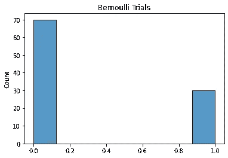

伯努利试验——治疗示例——图片由作者生成

不幸的是，我们的病人中有 70 人没有治愈，而 30 人治愈了。我们现在可以提取成功的概率:`30/(30+70)`，得出 **30%。**伯努利分布通常由这个概率 *p* 表示——称为成功概率——用 Python 模拟并使用`stat='probability'`:

```
bernoulli = np.array([0]*70+[1]*30)
sns.histplot(bernoulli, stat='probability').set_title('Bernoulli Trials')
```

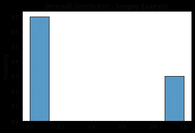

伯努利分布(1-p 对 p)-治疗示例-作者生成的图像

现在，这项研究中的多个个体的数量只是为了实验，它们并不包含分布本身。伯努利分布由一个单一的*p*(30%)*组成，我们将其附加到某种类型的结果上。这个*p*很难估计，需要进一步测试(特别是对于非确定性事件)。*

*在现实生活场景中很难得到这个值*p*——例如，在我们的例子中，我们假设 30%是药物治愈的真实概率，但这个数字可能只是偶然发生的。在现实生活中，情况通常是这样的——我们假设一个值 *p* ,这是对整个人口的真实值 *p* 的估计。*

*公平抛硬币的伯努利试验更容易理解，因为这些值是决定论的(正面和反面各有 50%的机会):*

*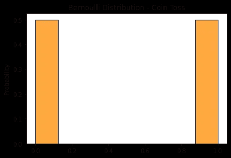*

*伯努利分布(1-p 对 p)-抛硬币-图片由作者生成*

*在某些情况下，您有兴趣估计真实生活场景中的这个 *p* :*

*   *手术成功的概率；*
*   *客户在贷款的前 90 天内拖欠债务的概率。*
*   *客户点击特定广告的概率。*

*伯努利分布的一个扩展叫做二项式分布——接下来让我们来看看！*

# *二项式分布—离散分布*

*请记住，我们假设 p*的值是 30%——这意味着在我们的伯努利试验中，我们的药物将治愈 100 名患者中的 30 名。二项分布是伯努利分布对于多次试验(或实验)的推广。**

***如果这是真的，并且我们最终做了 1000 次类似的试验，我们会期望我们的二项式分布看起来像下面这样:***

*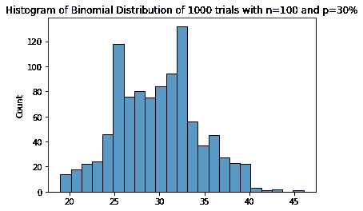*

*二项式分布—治疗示例—作者生成的图像*

```
*np.random.seed(42)
(
    sns.histplot(np.random.binomial(n = 100, p = 0.3, size = 1000))
    .set(title='Histogram of Binomial Distribution of 1000 trials with n=100 and p=30%')
)*
```

*`np.random`的`binomial`功能的参数为:*

*   *`n` —试验中的样本数量——在这种情况下，我们考虑一个“样本”一个单独的个体。*
*   *`p` —概率的基础值。对于`n=1`,我们正在讨论伯努利分布的`p`。*
*   *`size` —试验次数。*

*在某些试验中，我们最终治愈了 25、35 甚至 40 名患者— **这可能是我们挑战伯努利分布假设的一种方式，即我们的 *p* 为 30%。***

*但是..如果不是用 100 个人来做每个试验，而是用 1000 个人来做，会发生什么？*

*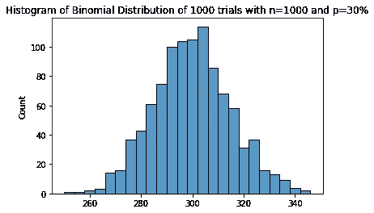*

*二项式分布—治疗示例—作者生成的图像*

*看那个！认得这个形状吗？一个正态分布！我们所见证的是[中心极限定理](https://en.wikipedia.org/wiki/Central_limit_theorem)的展示。*

*二项式分布是验证你为伯努利试验估算的真实 p 值的好方法。想象一下，对于我们的医学应用示例，真实的二项分布如下:*

*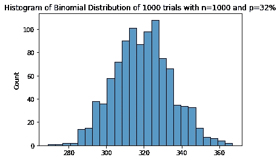*

*二项式分布—治疗示例—作者生成的图像*

***在这种情况下，平均值集中在 320/325 附近——这可能意味着，伯努利中的实际 *p* 可能是 32%或 32.5%。***

*查看[可汗学院的统计和概率](https://www.khanacademy.org/math/statistics-probability/random-variables-stats-library#binomial-random-variables)课程部分，获得更多关于二项式的直觉。*

# *泊松分布—离散分布*

*另一个著名的离散分布是泊松分布。*

*这种分布模拟了特定事件的发生，但我们不是看试验的次数，而是看时间段，我们没有“成功”的理论上限，即固定的个体。在二项式中，我们有固定的试验次数，而在泊松中，我们有固定的时间间隔。*

*例如，让我们想象一个叫做“A 队”的足球队。你检查了过去的 10 场比赛，“A 队”进了 25 个球。**您将使用一个简单的平均值来估计“A 队”的平均进球数，即 2.5 个进球。***

*你已经找到了泊松分布的*λ*参数。这个*λ*类似于伯努利分布中的 *p* 。*

*假设在接下来的 100 场比赛中，A 队平均进 2.5 个球，那么他们的预期进球分布是怎样的？*

*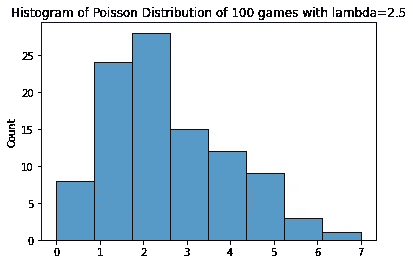*

*泊松分布-足球队示例-由作者生成的图像*

```
*np.random.seed(42)
(
    sns.histplot(np.random.poisson(lam = 2.5, size = 100))
    .set(title='Histogram of Poisson Distribution of 100 games with lambda=2.5')
)*
```

*有了这些数据，我们现在可以直观地看到一个球队在接下来的比赛中能够进任意数量的球的概率:*

*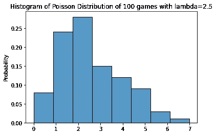*

*泊松分布—带有概率的足球队示例—图片由作者生成*

*酷吧？大致我们可以看到:*

*   *“A 队”在下场比赛中有~33%的几率进 0 或 1 球。*
*   *“A 队”在下一场比赛中有大约 27%的机会准确地打进 2 球。*
*   *“A 队”有~40%的几率在比赛中打进 2 个以上的进球。*

*。泊松分布包含一个参数:*

*   **λ*，该事件在该时间段内的预期发生次数，用`lam`表示。*

*在我们的例子中有一个小问题——对于使用泊松分布建模的流程，事件必须是独立于*的*。我们可以说，足球队的状态并非如此，因为一场比赛会影响下一场比赛的士气，进而影响预期目标。即便如此，已经多次测试表明，足球队在一个赛季中的进球往往遵循泊松分布。*

*倾向于遵循泊松分布的其他现实生活现象:*

*   *您所在城市每周的网络故障次数；*
*   *一小时内到达车站的列车数量；*
*   *商店每周销售的特定产品的数量；*

*查看泊松分布维基百科[页面](https://en.wikipedia.org/wiki/Poisson_distribution)了解更多详情。*

*我们完事了。感谢你花时间阅读这篇文章。我希望你喜欢这篇文章，我邀请你检查一下这些发行版背后的数学。看到大量现实生活中的现象都遵循其中一种分布也是非常有趣的。*

*作为一名数据科学家，您将来很有可能会处理这些分布中的一种，了解它们将有助于您改进统计游戏，并更熟悉生成要素和目标的过程。*

****我在***[***Udemy***](https://www.udemy.com/course/r-for-data-science-first-step-data-scientist/?referralCode=6D1757B5E619B89FA064)***建立了一个学习数据科学的训练营，在那里我向学生们介绍统计和算法！这门课程是为初学者量身定做的，我希望你能在我身边。****

**

*[数据科学训练营:你成为数据科学家的第一步](https://www.udemy.com/course/r-for-data-science-first-step-data-scientist/?referralCode=6D1757B5E619B89FA064) —作者图片*

*<https://ivopbernardo.medium.com/membership> *