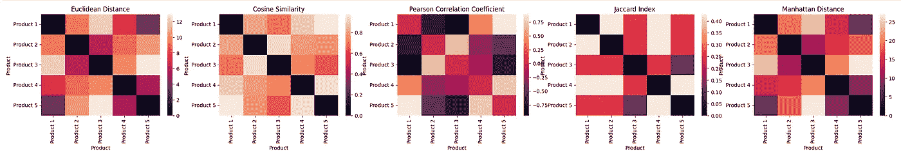
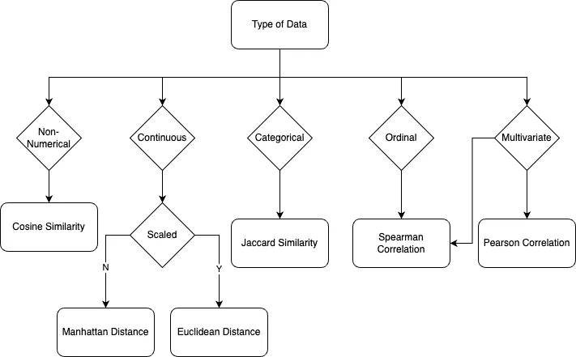

# 5 个数据相似性指标

> 原文：<https://towardsdatascience.com/5-data-similarity-metrics-f358a560855f>


亚历山大·格雷在 [Unsplash](https://unsplash.com?utm_source=medium&utm_medium=referral) 上拍摄的照片

## 理解数据分析和机器学习中的相似性度量:综合指南

*前言:本文给出了关于给定主题的信息摘要。它不应被视为原创研究。本文中包含的信息和代码可能受到我过去从各种在线文章、研究论文、书籍和开源代码中读到或看到的东西的影响。*

# 介绍

相似性度量是许多数据分析和机器学习任务中的重要工具，允许我们比较和评估不同数据之间的相似性。有许多不同的度量标准，每种都有优缺点，适合不同的数据类型和任务。

本文将探讨一些最常见的相似性度量标准，并比较它们的优缺点。通过了解这些指标的特点和局限性，我们可以选择最适合我们具体需求的指标，并确保我们结果的准确性和相关性。

*   **欧几里德距离**

此指标计算 n 维空间中两点之间的直线距离。它通常用于连续的数值数据，易于理解和实现。然而，它可能对异常值敏感，并且不考虑不同特征的相对重要性。

```
from scipy.spatial import distance

# Calculate Euclidean distance between two points
point1 = [1, 2, 3]
point2 = [4, 5, 6]

# Use the euclidean function from scipy's distance module to calculate the Euclidean distance
euclidean_distance = distance.euclidean(point1, point2)
```

*   **曼哈顿距离**

该指标通过考虑两点在每个维度上坐标的绝对差异并求和来计算两点之间的距离。与欧氏距离相比，它对异常值不太敏感，但在某些情况下，它可能无法准确反映点之间的实际距离。

```
from scipy.spatial import distance

# Calculate Manhattan distance between two points
point1 = [1, 2, 3]
point2 = [4, 5, 6]

# Use the cityblock function from scipy's distance module to calculate the Manhattan distance
manhattan_distance = distance.cityblock(point1, point2)

# Print the result
print("Manhattan Distance between the given two points: " + \
      str(manhattan_distance))
```

*   **余弦相似度**

该指标通过考虑两个向量的角度来计算它们之间的相似性。它通常用于文本数据，并且不受向量大小变化的影响。但是，它没有考虑不同特性的相对重要性。

```
from sklearn.metrics.pairwise import cosine_similarity

# Calculate cosine similarity between two vectors
vector1 = [1, 2, 3]
vector2 = [4, 5, 6]

# Use the cosine_similarity function from scikit-learn to calculate the similarity
cosine_sim = cosine_similarity([vector1], [vector2])[0][0]

# Print the result
print("Cosine Similarity between the given two vectors: " + \
      str(cosine_sim))Jaccard Similarity
```

*   雅克卡相似性

此度量通过考虑两个集合的交集和并集的大小来计算它们之间的相似性。它通常用于分类数据，并且不受集合大小变化的影响。但是，它不考虑元素集的顺序或频率。

```
def jaccard_similarity(list1, list2):
    """
    Calculates the Jaccard similarity between two lists.

    Parameters:
    list1 (list): The first list to compare.
    list2 (list): The second list to compare.

    Returns:
    float: The Jaccard similarity between the two lists.
    """
    # Convert the lists to sets for easier comparison
    s1 = set(list1)
    s2 = set(list2)

    # Calculate the Jaccard similarity by taking the length of the intersection of the sets
    # and dividing it by the length of the union of the sets
    return float(len(s1.intersection(s2)) / len(s1.union(s2)))

# Calculate Jaccard similarity between two sets
set1 = [1, 2, 3]
set2 = [2, 3, 4]
jaccard_sim = jaccard_similarity(set1, set2)

# Print the result
print("Jaccard Similarity between the given two sets: " + \
      str(jaccard_sim))
```

*   **皮尔逊相关系数**

此指标计算两个变量之间的线性相关性。它通常用于连续的数值数据，并考虑不同特征的相对重要性。然而，它可能无法准确反映非线性关系。

```
import numpy as np

# Calculate Pearson correlation coefficient between two variables
x = [1, 2, 3, 4]
y = [2, 3, 4, 5]

# Numpy corrcoef function to calculate the Pearson correlation coefficient and p-value
pearson_corr = np.corrcoef(x, y)[0][1]

# Print the result
print("Pearson Correlation between the given two variables: " + \
      str(pearson_corr))
```

现在，我们已经回顾了这些距离度量的基础，让我们考虑一个实际的场景，并应用它们来比较结果。

# 方案

假设我们有 5 个带有数字属性的商品，我们想要比较这些商品之间的相似性，以便于应用，比如聚类、分类或者推荐。

以下代码使用各种距离度量计算给定产品及其属性的相似性度量，然后在热图中绘制结果以供评估。

```
import numpy as np
import seaborn as sns
import random
import matplotlib.pyplot as plt
import pprint

def calculate_similarities(products):
    """Calculate the similarity measures between all pairs of products.

    Parameters
    ----------
    products : list
        A list of dictionaries containing the attributes of the products.

    Returns
    -------
    euclidean_similarities : numpy array
        An array containing the Euclidean distance between each pair of products.
    manhattan_distances : numpy array
        An array containing the Manhattan distance between each pair of products.
    cosine_similarities : numpy array
        An array containing the cosine similarity between each pair of products.
    jaccard_similarities : numpy array
        An array containing the Jaccard index between each pair of products.
    pearson_similarities : numpy array
        An array containing the Pearson correlation coefficient between each pair of products.
    """
    # Initialize arrays to store the similarity measures
    euclidean_similarities = np.zeros((len(products), len(products)))
    manhattan_distances = np.zeros((len(products), len(products)))
    cosine_similarities = np.zeros((len(products), len(products)))
    jaccard_similarities = np.zeros((len(products), len(products)))
    pearson_similarities = np.zeros((len(products), len(products)))

    # Calculate all the similarity measures in a single loop
    for i in range(len(products)):
        for j in range(i+1, len(products)):
            p1 = products[i]['attributes']
            p2 = products[j]['attributes']

            # Calculate Euclidean distance
            euclidean_similarities[i][j] = distance.euclidean(p1, p2)
            euclidean_similarities[j][i] = euclidean_similarities[i][j]

            # Calculate Manhattan distance
            manhattan_distances[i][j] = distance.cityblock(p1, p2)
            manhattan_distances[j][i] = manhattan_distances[i][j]

            # Calculate cosine similarity
            cosine_similarities[i][j] = cosine_similarity([p1], [p2])[0][0]
            cosine_similarities[j][i] = cosine_similarities[i][j]

            # Calculate Jaccard index
            jaccard_similarities[i][j] = jaccard_similarity(p1, p2)
            jaccard_similarities[j][i] = jaccard_similarities[i][j]

            # Calculate Pearson correlation coefficient
            pearson_similarities[i][j] = np.corrcoef(p1, p2)[0][1]
            pearson_similarities[j][i] = pearson_similarities[i][j]

    return euclidean_similarities, manhattan_distances, cosine_similarities, jaccard_similarities, pearson_similarities

def plot_similarities(similarities_list, labels, titles):
    """Plot the given similarities as heatmaps in subplots.

    Parameters
    ----------
    similarities_list : list of numpy arrays
        A list of arrays containing the similarities between the products.
    labels : list
        A list of strings containing the labels for the products.
    titles : list
        A list of strings containing the titles for each plot.

    Returns
    -------
    None
        This function does not return any values. It only plots the heatmaps.
    """
    # Set up the plot
    fig, ax = plt.subplots(nrows=1, 
                           ncols=len(similarities_list), figsize=(6*len(similarities_list), 6/1.680))

    for i, similarities in enumerate(similarities_list):
        # Plot the heatmap
        sns.heatmap(similarities, xticklabels=labels, yticklabels=labels, ax=ax[i])
        ax[i].set_title(titles[i])
        ax[i].set_xlabel("Product")
        ax[i].set_ylabel("Product")

    # Show the plot
    plt.show()

# Define the products and their attributes
products = [
    {'name': 'Product 1', 'attributes': random.sample(range(1, 11), 5)},
    {'name': 'Product 2', 'attributes': random.sample(range(1, 11), 5)},
    {'name': 'Product 3', 'attributes': random.sample(range(1, 11), 5)},
    {'name': 'Product 4', 'attributes': random.sample(range(1, 11), 5)},
    {'name': 'Product 5', 'attributes': random.sample(range(1, 11), 5)}
]

pprint.pprint(products)

euclidean_similarities, manhattan_distances, \
cosine_similarities, jaccard_similarities, \
pearson_similarities = calculate_similarities(products)

# Set the labels for the x-axis and y-axis
product_labels = [product['name'] for product in products]

# List of similarity measures and their titles
similarities_list = [euclidean_similarities, cosine_similarities, pearson_similarities, 
                     jaccard_similarities, manhattan_distances]
titles = ["Euclidean Distance", "Cosine Similarity", "Pearson Correlation Coefficient", 
          "Jaccard Index", "Manhattan Distance"]

# Plot the heatmaps
plot_similarities(similarities_list, product_labels, titles)
```



正如我们从图表中看到的，每个相似性指标都会生成一个热图，以不同的尺度表示产品之间的不同相似性。虽然每个相似性度量都可以用于根据度量值解释两个产品是否相似，但是在比较不同距离度量的结果时，很难确定相似性的真实度量。

**如何修正公制？**

在选择相似性度量时，没有单一的“正确”答案，因为不同的度量更适合不同类型的数据和不同的分析目标。但是，有一些因素可以帮助缩小适用于给定情况的可能指标的范围。选择相似性度量标准时要考虑的一些事项包括:

*   **数据类型**:一些指标更适合连续数据，而另一些则更适合分类或二进制数据。
*   **数据的特性**:不同的度量对数据的不同方面敏感，比如属性之间的差异大小或者属性之间的角度。考虑数据的哪些特征对您的分析最重要，并选择对这些特征敏感的相似性度量。
*   **您分析的目标**:不同的指标可以突出显示数据中不同的模式或关系，因此，请考虑您试图从分析中了解什么，并选择一个非常适合此目的的距离指标。

就我个人而言，在选择相似性度量时，我经常使用下面的图表作为起点。



同样，在选择相似性度量时，仔细考虑数据类型和特征以及分析的具体目标也很重要。

本文中使用的所有代码都可以在 [Jupyter 笔记本](https://github.com/kapadias/medium-articles/blob/master/general-data-science/similarities-measures/similarity-measures.ipynb)中找到。

*感谢阅读。如果你有任何反馈，欢迎评论这篇文章，给我发消息* [*LinkedIn*](https://www.linkedin.com/in/shashankkapadia/) *，或者给我发邮件*

如果你喜欢这篇文章，请阅读我的其他文章

</evaluate-topic-model-in-python-latent-dirichlet-allocation-lda-7d57484bb5d0>  </recommendation-system-in-python-lightfm-61c85010ce17> 