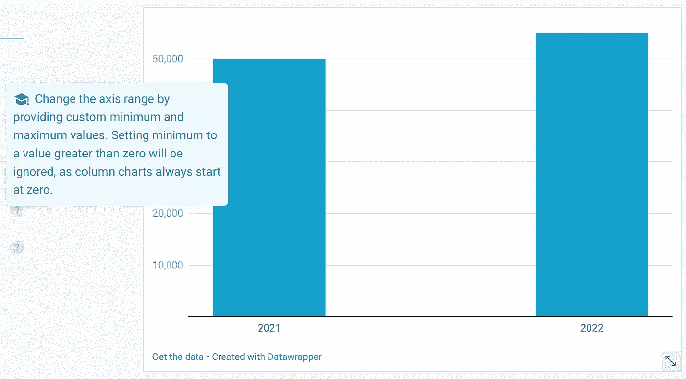

# 你的组织现在需要停止的 5 种数据 Viz 实践

> 原文：<https://towardsdatascience.com/5-data-viz-practices-your-org-needs-to-stop-now-6d8da8948a97>

## 意见

## 可视化数据时不要做什么

亚历山大·卡迪科夫在 [Unsplash](https://unsplash.com?utm_source=medium&utm_medium=referral) 上的照片

**数据可视化是数据专业最能接触到最广泛受众的领域**。我和我的一些同行可能喜欢阅读关于数据领域最新和最伟大的论文，但大多数人不会碰那些东西，谁能责怪他们呢！

这就是数据可视化发挥其易于理解的数据洞察力的地方。但这就是问题所在:**数据可视化必须让更广泛的受众容易理解。**

> 这就是数据可视化发挥其易于理解的数据洞察力的地方。

虽然这些科学论文中充斥的技术术语可能不是每个人都能理解的，但是**一个好的数据可视化几乎每个人都能理解！**数据专业人员的工作是确保他们生成高质量的数据可视化。为了做到这一点，**有一些数据即违规行为要像瘟疫一样避免**。

> 有一些数据，即违规，以避免像瘟疫。

# 但是首先，关于数据伦理的一个说明

这些糟糕的数据实践不仅是糟糕的，因为它们使数据洞察的消费变得困难，而且**数据伦理也必须被考虑**。当我们可视化数据时，我们**必须小心不要歪曲或曲解数据**。大型商业决策——通常伴随着大笔资金的分配——是基于数据专业人员产生的数据洞察而做出的。这是一项重大责任，不应该掉以轻心。

> 大型商业决策——通常伴随着大笔资金的分配——是基于数据专业人员产生的数据洞察而做出的。

# 数据伦理考虑

道德在数据分析中非常重要。分析数据有什么意义？难道不是为了向您的组织甚至更广泛的社区传达结果和见解吗？**这需要信任。信任您——数据专业人员，还有很多。**

照片由 [Cytonn 摄影](https://unsplash.com/@cytonn_photography?utm_source=medium&utm_medium=referral)在 [Unsplash](https://unsplash.com?utm_source=medium&utm_medium=referral) 上拍摄

你可能听说过这样一句话**“分析只和数据一样好”**。我想介绍一下我自己的一句更重要的话:**“分析师的能力取决于他们被信任的程度。”**好吧，也许不是最吸引人的台词。我可以努力。如果你能想到更吸引人的台词，请留下评论！

> "分析师的能力取决于他们被信任的程度."

基本上，没有良好的数据伦理，数据分析是没有价值的。**说到数据可视化的诚实，请给自己和你的公司一个高标准**。

好吧，让我们进入我的顶级数据 Viz 违规！

# 数据即违规

> 请注意，这绝对**不是一个详尽的数据清单**即违规，不应该被视为一个！有很多很棒的资源可以指导您在可视化数据时不要做什么。许多**资源甚至会提供一些心理学**来解释为什么一些可视化实践在交流数据见解时没有效果。很酷，对吧？

请继续阅读，收集我多年来遇到的最讨厌的事情和糟糕的数据实践。

请留下您对您所看到的任何不良数据做法的评论！

**> 1。从一个非零数字开始绘制图表** 这可能比任何数据违规都要多。我一直在政客们提供的数据中看到这一点。就是见不得光。

我觉得这很有趣。Datawrapper 甚至不让我从非零值开始绘制柱形图，以显示一个糟糕的可视化示例。不错！

当你这样做的时候，你通常是想让结果看起来比实际更好。通过放大，你希望音量的起伏看起来像一个巨大的飞跃。

**> 2。在饼图中包含太多类别** 我经常看到这种情况。人们很难从饼状图中收集信息。不要把大量的类别放在一个饼图中。在一个饼图中使用不超过七个类别是最佳实践。

不要在你的饼图中包含这么多类别！

考虑使用一个“其他”类别来分组一些更小的类别。如果可能的话，尽量使用视觉效果而不是饼状图！

**> 3。樱桃采摘时间表** 销量比去年增长 200%！是的，但是如果你着眼于一个更长的时间框架，销售额在 5 年内可能只增长了 20%。

如果你去掉数据，改为在 2020 年 1 月开始可视化，这个图表看起来不是很不一样吗？

如果你想的话，中间的大幅下跌可以大大增加你的数字，但你不能这样做。你在操纵你的观众，让他们认为结果比实际要好。

此外，不要在图表上显示一个比周围时间段趋势明显不同的更小的时间段。背景在分析中非常重要。不要这样！

**> 4。在一个视觉画面中包含太多的信息** 不要在一个视觉画面中包含太多的信息，因为信息过载会让你的观众不知所措。记住，质量重于数量。

数据可视化中的信息过载让我想起了过于复杂的停车标志。照片由[贡纳尔·本特松](https://unsplash.com/@onefunsite?utm_source=medium&utm_medium=referral)在 [Unsplash](https://unsplash.com?utm_source=medium&utm_medium=referral) 拍摄

你的观众应该能够很快理解你的视觉效果想要传达什么，最好是在最初的几秒钟。

**> 5。做出糟糕的颜色选择** 我在 LinkedIn 上发表了一篇关于数据违规的帖子，关于糟糕的颜色选择的最后一点是由一位数据分析师同事提出的！

颜色选择是数据可视化中的一个重要考虑因素。你应该尽量避免使用太多的颜色或者不搭配的颜色。如果你还没有这样做，你应该确保你选择的调色板是色盲友好的。

我不知道你怎么想，但这让我头晕。

虽然太多的颜色是一个问题，同时，不正确地使用单一的颜色渐变也是要避免的。单一颜色渐变很适合用于热图，但不适用于需要关键字的类别。"嗯……现在哪种蓝色与哪种类别相关联？"不行！

# 摘要

数据可视化是一种以易于使用的格式交流数据见解的好方法。也就是说，如果数据可视化做得好。

有许多糟糕的数据实践，但这些 **5 数据即违规从其他数据中脱颖而出:**从非零数字开始绘制图表，包括饼图中太多的类别，精选时间框架，包括视觉中太多的信息，以及做出糟糕的颜色选择。

请务必**确保您在分析和展示数据见解时牢记数据伦理**！一位非常聪明的人曾经说过**“分析师的能力取决于他们被信任的程度。”**

# 直到下一次…

喜欢这些内容吗？关注我在媒体上看到未来的职位！[成为中等会员](https://medium.com/@ChristianWritesData/membership)这样你就可以无限阅读文章了。相信我，值得！

如果你对数据专业人员的生活有任何疑问，请随时在 LinkedIn 或 T2 Twitter 上联系我！

 