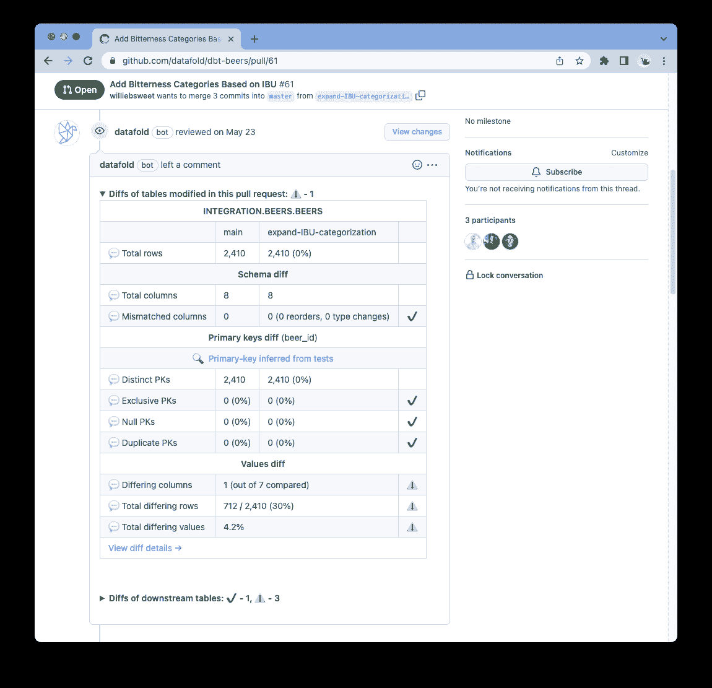
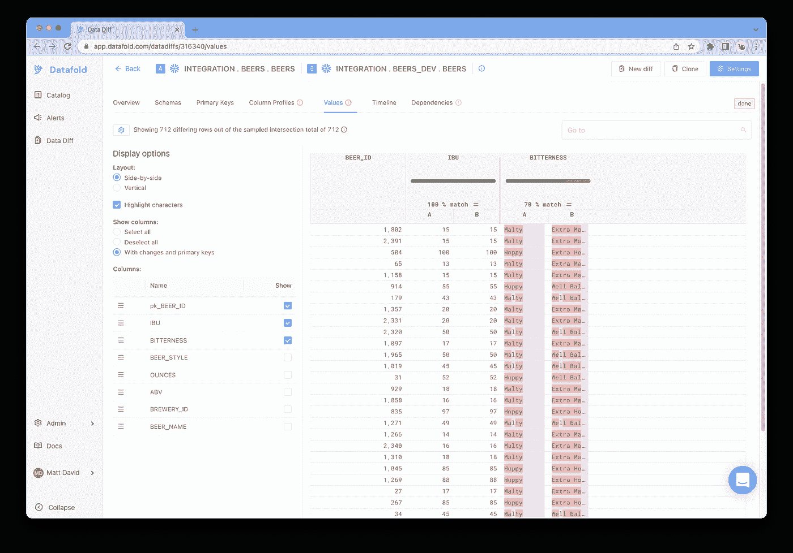
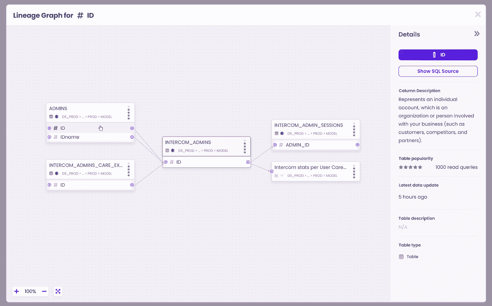

# 5 dbt 数据模型帮助您节省宝贵的时间

> 原文：<https://towardsdatascience.com/5-dbt-data-model-hacks-to-save-you-precious-time-b76f410db8c3>

## 添加到您的项目中的最佳开源和付费工具


Artem Maltsev 在 [Unsplash](https://unsplash.com/s/photos/time?utm_source=unsplash&utm_medium=referral&utm_content=creditCopyText) 上拍摄的照片

现在，我喜欢写数据模型，不要误解我。这是成为一名[分析工程师](/analytics-engineer-the-newest-data-career-role-b312a73d57d7)最有趣的部分之一。然而，写它们有很多繁琐的部分。这不仅仅是您使用 SQL 编码的业务逻辑。您还需要在构建模型之前清理数据，记录数据，验证数据，然后实现数据质量检查。

对于一个数据模型，这可能看起来不多，但当您有大量不同的数据源并继续构建更多的数据模型时，它最终会占用您的大部分时间。特别是，如果您像大多数数据团队一样，等到一切都接近完美时才实施所有这些基本工作。

幸运的是， [dbt](/what-is-dbt-a0d91109f7d0) 使得数据建模变得更加容易。而且，dbt 提供了许多有用的工具，它们可以直接与 dbt 集成，为您省去一些麻烦。如果您不熟悉 [dbt](/is-dbt-the-future-of-analytics-d6ff93cbb20c) (或数据构建工具)，它是一个数据转换工具，允许您编写模块化代码并遵循建模最佳实践。你可以在这里阅读更多关于它的[。](/what-is-dbt-a0d91109f7d0)

这里有一些工具，既有开源的(也有免费的)，也有付费的，我发现它们为我节省了很多时间和精力。不是所有的东西都要由你从头开始建造！外面有一大堆聪明人可能已经帮你做到了。利用这一点。

# re_data 数据清理宏

re_data 是我最喜欢的免费开源 dbt 包之一。它非常容易安装并集成到您已经存在的 dbt 项目中。虽然它们有许多令人惊叹的功能，如异常检测和警报，但它们也有预建的 dbt 宏来帮助您过滤和清理数据。

## 复制

它们有两个不同的过滤器来处理重复值， **filter_remove_duplicates** 和 **filter_get_duplicates。**你可以像使用任何其他 dbt 宏一样简单地使用它们，并从中进行选择。它们每个都有三个参数——模型名称、唯一列和记录排序所依据的列。 **filter_remove_duplicates** 返回一个没有副本的模型， **filter_get_duplicates** 只返回*模型中的副本*。

```
select
   user_id,
   name
from {{ re_data.filter_remove_duplicates(ref('users'), ['user_id']['created_at desc']) }} duplicates
```

这两种方法都可以节省您的时间，使您不必为了查找或删除重复项而对列进行聚合和分组。这也使得代码更加简洁。

## 格式化

re_data 还包含三个不同的数据格式化宏，可以用来清理数据-**clean _ additional _ white spaces**、 **clean_blacklist** 和**clean _ capital _ words**。

**clean _ additional _ white spaces**将您希望清理的列名作为参数，并删除任何空白。

```
select
    user_id,
    {{ re_data.clean_additional_whitespaces('name') }} as name
from {{ ref('users') }}
```

**clean _ capital _ words**还接受一个列名，并将字符串中每个单词的第一个字母大写。这是一个很好的选择，可以用在你的网站上显示的用户名甚至产品名上。

最后， **clean_blacklist** 用于屏蔽个人信息。如果您没有可用的屏蔽策略，这是对雪花的屏蔽策略的一个很好的替代。在这里，您指定希望屏蔽的列、要查找的单词列表或正则表达式，然后指定一个字符串来替换那些出现的内容。

# dbt 期望

dbt expectations 是另一个优秀的开源 dbt 包，可以在您的 dbt 项目中使用。它包括根据您的期望测试数据输出的宏，因此得名。在 dbt 项目中已经存在的 dbt 测试的基础上，向您的数据模型添加测试本质上是更高级的测试。

这些宏通常测试特定的用例，当您遇到这些用例时，您可以尝试自己编写。与其花几个小时自己编写这些宏，不如浏览库来找到满足您需要的宏。这里有几个我最喜欢用的。

## 期望 _ 列 _ 值 _ 目标 _ 类型

该测试允许您检查列的数据类型。当您想确保所有时间戳列都是同一类型，日期实际上是日期，并且您想在计算中使用的任何列都是整数或浮点数时，这就很方便了。

我在诸如 Google sheets 这样容易出现大量人为错误的混乱数据源中最常使用这个测试。这样，我在源头得到通知，而不是我的模型在下游失败。下面是它在我的`src.yml`文件中的样子:

```
columns:
   - name: campaign_launch_date
     description: "The date the campaign was launched"
     tests:
       - dbt_expectations.expect_column_values_to_be_of_type:
           column_type: date
```

## expect _ column _ values _ to _ be _ between

对于 id 引用映射表的列，这个测试非常有用。通常，我们有太多的值，无法在 dbt 的`accepted_values`测试中包含它们。这是一个很好的捷径，可以防止你因为大量的测试而变得不知所措。

我经常在`state_id`专栏中使用这个测试。我不想写出数字 1-50，所以我指定一个范围，如下所示:

```
columns:
   - name: state_id
     description: "The unique identifier of a state"
     tests:
       - dbt_expectations.expect_column_values_to_be_between:
           min_value: 1 # optional parameter
           max_value: 50 # optional parameter
           row_condition: "id is not null" # optional parameter
```

如果您想排除空值或任何其他类型的值，这个测试还可以选择行条件。

# 数据文件夹

Datafold 是一个强大的工具，可以在实际修改代码之前向您展示代码修改的结果。使用 Github，它运行您以前的代码以及您在 pull 请求中所做的更改，然后比较结果数据集。这允许您在合并代码更改之前看到数据将如何变化。

这对于在实际投入生产之前验证您的代码是否正确以及数据看起来是否符合预期非常有帮助。我们都知道当某样东西停产时会是多么可怕的一场噩梦。您需要返回并找到问题的根源，恢复到旧版本的代码，并重新部署它。当您可以首先使用 Datafold 这样的工具来帮助防止这种情况发生时，为什么还要担心这样做呢？

为了实现 Datafold，您需要三样东西:一个带有两个分支的 Github repo、一个您选择的数据仓库和一些 dbt 模型。这些都可以很容易地与工具集成，以便从中获益。你可以点击了解更多关于设置过程的细节。



作者图片

在这里，您还可以看到关键指标，如不匹配的列、不同的主键、空主键和总的差值。我们希望通过运行查询来手动检查的所有指标！

Datafold 节省了我们作为分析工程师的大量时间，因为它还告诉我们数据集中不匹配的确切行。



作者图片

它向我们显示了受代码更改影响的每个下游表的信息。如果整个表中的不同值是意料之中的，我们可以合并我们的代码而不用担心。不需要手动验证和一堆聚合查询。Datafold 以一种易于查看和深入研究的方式显示关键数据质量指标。

如果你正在寻找一个开源选项，他们也有一个免费的命令行工具和 python 库，名为 [data-diff](https://www.datafold.com/open-source-data-diff?exp_id=7) 。这将使用主键比较两个不同数据源中的数据行。它显示了哪些行出现在一个表中而没有出现在另一个表中，以及哪些行的值不匹配。尽管在数据复制发生之前，您无法做到这一点，但在某些用例中，它仍然是一个节省了我大量验证时间的工具。

# 小脚轮

[Castor](https://www.castordoc.com/) 是一个自动化的数据目录工具，它通过[文档](/data-documentation-best-practices-3e1a97cfeda6)和协作为你的数据栈的所有部分带来透明度。它有助于告诉您组织中的用户某些数据源的位置、它们的质量状态，以及在您有问题时应该联系谁。它与您的 dbt 文档集成，将您已经记录的所有内容直接填充到工具中。

我最喜欢的特性之一是自动填充已经定义的数据列。我无法告诉你我花了多少时间将相同的列定义从一个`src.yml`文件复制并粘贴到另一个文件。Castor 获取这些定义，并为相同列名的每个实例填充它们，消除了重复的手工工作。是啊！你真的不必跨多个模型定义`user_id` 50 个不同的时间！



从 dbt 到元数据库的列沿袭(作者图片)

Castor 还为整个现代数据栈中的 dbt 数据模型提供了列级沿袭。这意味着您可以看到从您的数据仓库到您的仪表板的每一列的数据源。这允许您更好地处理数据模型之间的依赖关系，并看到小代码更改的潜在下游影响。我亲自修改了我的基本模型中的列名，以为它不会影响任何东西，结果第二天发现它破坏了整个生产模型。有了列级谱系图，您不必担心这是一个问题。

# dbt 新鲜度测试

最后，dbt 有内置的测试，允许您检查源数据和数据模型的新鲜度。当数据集没有按预期更新时，刷新测试有助于提醒您。当在源位置完成时，这将有助于防止下游问题，例如陈旧的数据模型。积极主动地进行这些类型的数据质量检查将节省您调试和修复损坏管道的时间。

要向 dbt 项目添加一个新鲜度测试，只需在`src.yml`文件中的源代码或模型名称下添加一个`freshness`块。然后包括两个字段:`warn_after`和`error_after`。`warn_after`指的是一个源或模型在向你发出警告之前没有新数据的时间段。这个**不会让**测试失败。`error_after`指源或模型在失败前没有新数据的时间段。这个**会让**无法通过你的测试。

```
sources:
  - name: users
    freshness:
      warn_after:
        count: 3
        period: day
      error_after:
        count: 5
        period: day
```

请记住，您可以选择`minute`、`hour`或`day`作为您的时间段。就我个人而言，我的数据管道通常每天只运行一次，所以`day`时期对我来说最有意义。

# 结论

dbt 是一个强大的工具，可以无缝地进行数据转换。更好的是，它与其他强大的工具相集成，可以帮助您节省数据清理、验证代码更改、记录数据源和调试数据管道等任务的时间。总之，这套工具将帮助你成为一名高效而全面的[分析工程师](/analytics-engineer-the-newest-data-career-role-b312a73d57d7)来编写高质量的代码。

欲了解更多关于分析工程和现代数据堆栈工具的信息，请[订阅](https://madisonmae.substack.com/)我的每周简讯。

看看我的第一本电子书，[分析工程基础知识](https://madisonmae.gumroad.com/l/learnanalyticsengineering)，一本全方位的分析工程入门指南。