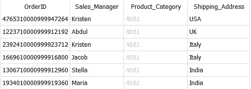
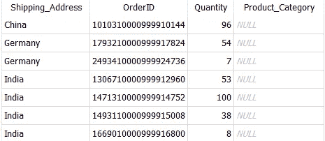
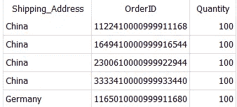
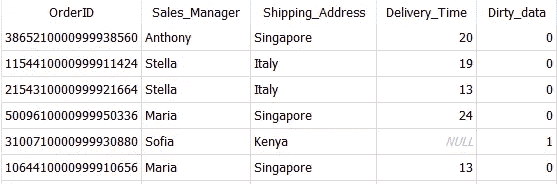
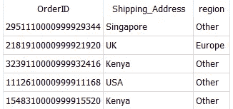
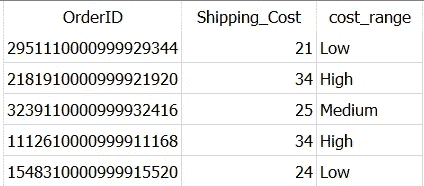
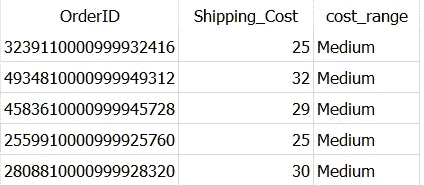
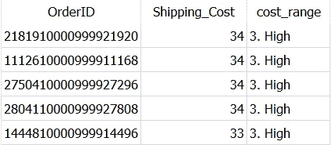
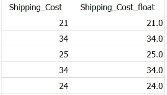

# 清理脏数据的 5 个简单 SQL 技巧

> 原文：<https://towardsdatascience.com/5-easy-sql-tricks-to-clean-dirty-data-dc423a0ab3e9>

## 数据科学

## 立即掌握它— SQL 查询清理数据并为分析做好准备


照片由[奥利弗·黑尔](https://unsplash.com/@4themorningshoot?utm_source=medium&utm_medium=referral)在 [Unsplash](https://unsplash.com?utm_source=medium&utm_medium=referral) 拍摄

> "没有数据是干净的，但大多数是有用的."
> 
> —迪安·阿博特

真实世界的数据几乎总是杂乱无章的。作为数据科学家或分析师，你需要发现数据的真相。要做到这一点，数据必须整洁，没有错误。因此，第一步是清理数据。✅

因此，我总结了 5 个技巧，你可以用来清理 SQL 中杂乱的数据。

这是一个快速阅读，你可以用你的咖啡来完成它，并掌握一些清理脏数据的有趣技巧。🏆

使用这个索引，您可以轻松地导航到您最喜欢的部分。

```
**·** [**Find Missing Values in Your Data**](#8ad1) **·** [**Flag Certain Records**](#6314) **·** [**Clean Up Messy Values**](#22de) **·** [**Bucket Values into Segments or Bins**](#fc62) **·** [**Correct Data Types**](#74b8)
```

> *📍注意:我使用的是 SQLite 和一个自己创建的*[*Dummy _ Sales _ Data*](https://github.com/17rsuraj/data-curious/blob/master/TowardsDataScience/Dummy_Sales_Data_v1.csv)*使用*[*Faker*](/faker-an-amazing-and-insanely-useful-python-library-b313a60bdabf)*创建的，你可以在我的*[***Github***](https://github.com/17rsuraj/data-curious/blob/master/TowardsDataScience/Dummy_Sales_Data_v1.csv)*repo 下免费获得*[*MIT license*](https://github.com/17rsuraj/data-curious/blob/master/LICENSE.md)*！！*

好的，我们开始吧…🚀

# 查找数据中缺失的值

缺失值的问题在许多现实生活的数据集中相当普遍。缺失值可能会使数据分析或机器学习模型的结果产生偏差，或者降低模型的准确性，或者只是使数据分析变得困难。

使用这些现成的查询来找出数据中缺少的值，并检查是否有任何模式与数据相关联。

*   **特定列中缺少数据**

例如，找出`Product_Category`丢失的`OrderIDs`。

```
SELECT OrderID,
       Sales_Manager,
       Product_Category,
       Shipping_Address
FROM Dummy_Sales_Data_v1
WHERE **Product_Category IS NULL**
```



按作者查找数据|图像中缺少的值

此外，当某些列有缺失值时，您可以发现数据集是否遵循任何趋势。

*   **与缺失数据相关的模式**

例如，在我们的例子中，当列`Product_Category`中的值丢失时，让我们尝试找出数据是否遵循任何特定的模式。

```
SELECT Shipping_Address,
       OrderID,
       Quantity,
       Product_Category
FROM Dummy_Sales_Data_v1
WHERE **Product_Category IS NULL**
GROUP BY Shipping_Address, OrderID, Quantity
```



与 SQL | Image 中缺失数据相关的模式(按作者)

这样，您可以检查，当`Product_Category`丢失时，数据是否遵循特定的模式。您可以在`WHERE`子句中传递任意数量的列，并获得与那些缺失值相关联的模式。

此外，当列有特定值时，您总是可以发现数据中的模式，而不是丢失值，如下所示。

```
SELECT Shipping_Address,
       OrderID,
       Quantity
FROM Dummy_Sales_Data_v1
WHERE **Product_Category LIKE 'Healthcare'**
GROUP BY Shipping_Address, OrderID, Quantity
ORDER BY Quantity DESC
```



数据模式|作者图片

在本例中，您找到了与`Healthcare`产品相关的数量和送货地址模式，并清楚地看到了订单`Quantity`的前 5 个送货地址。

# 标记某些记录

另一个最佳实践是创建一个简单的二进制列来标记一些记录。这可以在执行数据分析的后期阶段使用。

例如，假设您希望将所有记录标记为`Dirty_Data`，如果数据集中缺少`Delivery_Time`。

```
SELECT OrderID,
       Sales_Manager,
       Shipping_Address,
       Delivery_Time,
       **CASE WHEN Delivery_Time IS NULL THEN 1
            ELSE 0
       END AS Dirty_data**
FROM Dummy_Sales_Data_v1
```



按作者标记 SQL | Image 中的缺失值

一个新列`Dirty_Data`被添加到输出中，其值为`0`和`1`。当这个输出作为 excel 或任何编辑器输出时，它肯定会使进一步的任务变得容易，例如找出`Delivery_Time`丢失的订单。

这样，您可以包含尽可能多的不同条件来定义脏数据并对其进行标记。

接下来，让我们看看如何清理比需求粒度更大的数据。

# 清理混乱的价值观

清理粒度值的最好方法之一是将其标准化。✅

通常，列值的粒度比所需的更细。在这种情况下，在更高的层次上对它们进行标准化更有意义。

例如，中的`**shipping address**`列包含国家名称，这些名称可以标准化为地区名称，如欧洲、北美等，如下面的查询所示。

```
SELECT OrderID,
       Shipping_Address,
       **CASE WHEN Shipping_Address IN ('Germany','UK') THEN 'Europe'
            ELSE 'Other'
       END AS region**
FROM Dummy_Sales_Data_v1
```



使用 CASE-WHEN | Image by Author 标准化值

因此，国家级别的发货地址信息是细粒度的，所以您在地区级别对其进行了标准化。

为了简单起见，我在`CASE`中只使用了一个`WHEN`语句，然而，我们可以通过使用多个`WHEN`语句随时在`region`列中创建更多的值。

更进一步，让查询稍微复杂一点，您可以跨多个记录分析数据。

# 将值存储到段或箱中

这是 SQL 中`**CASE**`语句的经典用例。`CASE`语句是 SQL 处理 if-then 逻辑的方式。

你可以从我的最新文章——[**2022 年你应该知道的 5 个高级 SQL 概念**](/5-advanced-sql-concepts-you-should-know-in-2022-b50efe6c99#2f01) **中更深入地洞察`CASE`的说法。**

[](/5-advanced-sql-concepts-you-should-know-in-2022-b50efe6c99)  

让我们看看，如何使用它将值存储到存储箱中。

假设您想根据值将`Shipping_Cost`分为低*、中*和高*。*

```
*SELECT OrderID,
       Shipping_Cost,
 **CASE WHEN Shipping_Cost < 25 THEN 'Low'
            WHEN Shipping_Cost BETWEEN 25 AND 32 THEN 'Medium'
            WHEN Shipping_Cost > 32 THEN 'High'
       END AS cost_range**
FROM Dummy_Sales_Data_v1*
```

**

*将值存储到垃圾箱中 SQL |按作者分类的图像*

*结果，一个新的列`cost_range`被创建，根据列`shipping_cost`包含值*低、中、高*。*

*嗯，这些箱子是用来分类运输成本的。但是，如果您想按照`cost_range`按升序(*从低到高*)或降序(*从高到低*)对记录进行排序，这些箱子不起作用。见下文，*

```
*SELECT OrderID,
       Shipping_Cost,
       CASE WHEN Shipping_Cost < 25 THEN 'Low'
            WHEN Shipping_Cost BETWEEN 25 AND 32 THEN 'Medium'
            WHEN Shipping_Cost > 32 THEN 'High'
       END AS cost_range
FROM Dummy_Sales_Data_v1
**ORDER BY cost_range DESC***
```

**

*SQL | Image 中按作者降序排序的框*

*记录按`cost_range`降序排列，介质在最上面，这是不正确的。❌*

*正确的输出应该是顶部有高电平的行，后面是中电平和低电平的行。为了得到正确的结果，你需要聪明地命名你的箱子。✅*

*最简单的方法之一是，使用如下所示的数字。*

```
*SELECT OrderID,
  Shipping_Cost,
  CASE WHEN Shipping_Cost < 25 THEN **'1\. Low'**
       WHEN Shipping_Cost BETWEEN 25 AND 32 THEN **'2\. Medium'**
       WHEN Shipping_Cost > 32 THEN **'3\. High'**
  END AS cost_range
FROM Dummy_Sales_Data_v1
ORDER BY cost_range DESC*
```

**

*SQL | Image 中按作者降序排列的记录*

*现在，你答对了。这里，请注意使用 3，2，1 对值进行重新排序。🎯*

*接下来，不正确的列数据类型可能会成为数据提取和分析的一个重大障碍。让我们看看如何在 SQL 中处理它。*

# *正确的数据类型*

*在现实世界中，有时，列的数据类型没有准确地分配，或者最初分配的数据类型不再适用于您的任务。*

*例如，日期-时间列通常存储为文本列，或者具有浮点值的列被赋予数据类型 integer。*

*如果数据类型不正确，只提取数据类型可能不会有任何问题，但是，如果您希望连接两个表，并且两个表中公共列的数据类型不同，查询将返回错误。*

*❓那有什么解决办法..*

> *CAST 函数！！！*

*在 SQL 中，`**CAST**`函数用于显式地将给定的数据类型转换为 SQL 数据库中的不同数据类型。它有最简单的语法，*

```
*CAST(column_name AS new_data_type)*
```

*其中`column_name`是要更改其数据类型的列的名称。*

*关于`CAST`的一个有趣的事实是，它可以跨不同的数据库管理系统移植，比如微软 SQL Server、MySQL、Oracle，并且在每一个系统上都可以工作。💯*

*让我们快速浏览一个例子。*

*假设，您想要将`Shipment_Cost`转换为 float 值，该值最初存储为整数。*

```
*SELECT Shipping_Cost,
       **CAST(Shipping_Cost AS REAL)** AS Shipping_Cost_float
FROM Dummy_Sales_Data_v1*
```

**

*要浮动的整数|按作者排序的图像*

*很简单！*

*但是，它也有一些局限性。您不能简单地将列从一种数据类型转换为另一种数据类型。🚩*

*例如，日期列不能转换为浮点型。两种数据类型——现有的和新的——本质上应该是相似的。*

***微软**提供了一个有趣的图表，可以作为快速参考，了解哪些数据类型是相互兼容的，你可以从这里下载。*

> *[微软 SQL Server 数据类型转换图](https://www.microsoft.com/en-us/download/details.aspx?id=35834)*

*[](https://www.microsoft.com/en-us/download/details.aspx?id=35834)  

仅此而已！🏆* 

*希望你很快看完这篇文章，觉得耳目一新，很有用。*

*我使用 SQL 已经 3 年了，通过实践我发现了这些技巧。你可以随时让我知道，你还做了什么来清理数据。这些概念在实际项目中非常有用。*

> **对阅读介质上的无限故事感兴趣？？**

*💡考虑 [**成为媒体会员**](https://medium.com/@17.rsuraj/membership)**访问媒体上无限的**故事和每日有趣的媒体文摘。我会得到你的费用的一小部分，没有额外的费用给你。*

*💡请务必 [**注册我的电子邮件列表**](https://medium.com/subscribe/@17.rsuraj) 以免错过另一篇关于数据科学指南、技巧和提示、SQL 和 Python 的文章。*

***感谢您的阅读！***