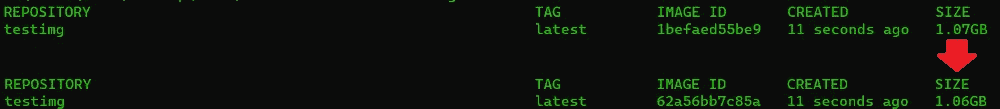
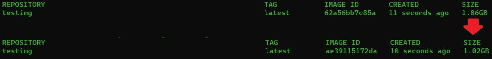
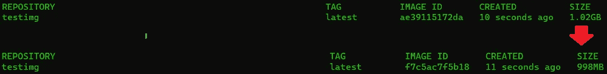

# 5 个易于实施的小技巧来缩小你的 Docker 图片尺寸

> 原文：<https://towardsdatascience.com/5-easy-to-implement-tricks-to-trim-down-your-docker-image-size-263978a6ed29>

## 最小化你的码头工人形象(外加一个加分)


这是一个非常小的建筑！(图片由 [unsplash](https://unsplash.com/photos/5EXvJvqqhEo) 上的 [edgeeffectmedia](https://unsplash.com/@edgeeffectmedia) 提供)

在这篇短文中，我们将介绍如何缩小 docker 图片尺寸的 5 个技巧(和一个好处)。通过这样做，我们更多地了解了 Docker 如何构建映像以及如何使用基本映像。我们来编码吧！

在我们开始之前:我们使用了很多终端命令。不熟悉的话可以看看 [**这篇文章**](https://mikehuls.medium.com/terminals-consoles-command-line-for-absolute-beginners-de7853c7f5e8) 。

# 1.捆绑层

Docker 图像的大小是其图层的总和。因为每一层都有一点点开销，所以我们可以通过减少层数来做一点点但非常容易的改进。

只是改变:

```
FROM python:3.9-slim
RUN apt-get update -y
RUN apt-get install some_package
RUN apt-get install some_other_package
```

收件人:

```
FROM python:3.9-slim
RUN apt-get update -y && apt install -y \
   package_one \
   package_two
```

我已经用一些用于构建的包对此进行了测试，并在下面列出了它们。正如你所看到的，我们通过捆绑层节省了大约 10MB。虽然这不是一个巨大的尺寸减少，但它非常令人印象深刻，因为它是这样一个小的努力。



捆绑这些层在下面的包列表中节省了大约 10MB(图片由作者提供)

```
# packages:
git, cmake, build-essential, jq, liblua5.2-dev, libboost-all-dev, libprotobuf-dev, libtbb-dev, libstxxl-dev, libbz2-d
```

# 2.避免安装不必要的软件包

如果你用 apt-get 安装软件包，添加`--no-install-recommends`标签。这避免了在您正在安装的软件包旁边安装*推荐*但*不需要*的软件包。看起来是这样的:

```
FROM python:3.9-slim
RUN apt-get update -y && apt install -y --no-install-recommends \
   package_one \
   package_two
```

通过添加这个标志，我们节省了大约 40MB。同样，这在整个计划中并不算多，但却非常重要，因为我们仅仅添加了一个标志。



通过添加一个简单的标志又减少了 40MB。让我们继续修剪这张图片(图片作者)


清理也会减少我们的图像尺寸(图片由[jeshoots.com](https://unsplash.com/@jeshoots)在 [unsplash](https://unsplash.com/photos/__ZMnefoI3k) 上提供)

# 3.安装后清理

安装包也有一些开销。我们可以通过将`rm -rf /var/lib/apt/lists*/**` 添加到来清理这个问题，就像这样:

```
FROM python:3.9-slim
RUN apt-get update -y && apt install -y --no-install-recommends \
    package_one \
    package_two \
    && rm -rf /var/lib/apt/lists*/**
```



用简单的一行代码又救了一个 **40MB** ！

# 4.小一点的图像怎么样？

这一点非常明显；用小一点的图像就好！正如您可能已经注意到的，在之前的代码片段中，我们已经使用了`python:3.9-slim`，这导致图像总大小几乎为 **1GB** ，增加了所有之前的优化。与`python:3.9`相比，这已经是一个很好的改进了(这将导致总大小为 **1.3GB** )。

一个改进是使用`python:3.9-alpine`。Alpine 集装箱是专门为在集装箱中运行而建造的，非常小，重量约为 49MB。这比我们使用`python:3.9`时要小 20 倍以上。那么为什么不一直用阿尔卑斯呢？有一些缺点:

*   **兼容性问题**:一些 Python 轮子是为 Debian 构建的，需要重新构建以兼容 Alpine。由于很难调试的兼容性问题，这可能会导致一些非常奇怪的错误。
*   **依赖关系** : Alpine 用`apk add`代替`apt-get install`安装依赖关系。此外，并非所有的封装都可用，或者与 alpine 兼容。

如果磁盘空间是一个主要问题，我只建议使用 alpine。还可以查看下一部分，了解如何通过将 alpine 与构建阶段相结合来减轻其缺点。

# 5.使用. dockerignore

如果您创建了一个新的 Docker 映像，那么 Docker 需要访问您想要从中创建映像的文件。这些文件被称为构建上下文。每次构建图像时都会发送它们，因此最好尽量保持较小的规模。

此外，添加一个 dockerignore 是一个非常好的想法，以防止机密的暴露。如果您使用`ADD`或`COPY`将文件复制到您的映像中，您可能会无意中复制到您不想烘焙到映像中的文件或文件夹(如`.git`)。

# 奖励:多阶段构建

有时候你需要像`curl`、`git`或`make`这样的工具来建立你的形象。完成后，你就不再需要这些包了。他们现在所做的只是让我们的形象更大。解决这个问题的一个好方法是使用多阶段构建。下面我们将看一个简单的例子，它使用`curl`作为我们构建映像所需的包之一，但是一旦我们的映像构建完成，它就变得多余了:

1.  拍一个像`ubuntu`的图像
2.  安装卷曲
3.  将数据文件卷曲成图像(例如分类器)
4.  现在我们再拍一张像`python:3.9-slim`一样的照片
5.  将卷曲的文件从`ubuntu`复制到`python:3.9-slim`阶段
6.  其余的(例如，用 pip 安装包等。)

当这样做的时候，我们在我们的最终图像*中有了我们的分类器文件，而没有*我们的图像被卷曲*弄得臃肿。*另一个优势是，我们可以使用更丰富的映像来执行我们的安装(例如`python:3.9`，然后将所有生成的文件复制到一个非常小的映像中(例如`python:3.9-alpine`)。

这个解决方案的想法很简单，但是执行起来有点棘手。查看这篇文章 获得一个不错的演练。

# 结论

在这篇文章中，我们讨论了 5 个快速简单的方法来缩小你的 Docker 图片尺寸。一路上，我们对 Docker 构建图像的方式有了更多的了解。这篇文章主要集中在清理上，但是减少图像尺寸的最好方法是把构建层一起留下。这样我们甚至可以使用更小的图像，因为我们已经完成了所有复杂的任务。查看本文 了解更多关于这些所谓的多阶段构建的信息。

我希望这篇文章是清楚的，但如果你有建议/澄清，请评论，以便我可以做出改进。与此同时，请查看我的关于各种编程相关主题的其他文章:

*   [适合绝对初学者的 Docker](https://mikehuls.medium.com/docker-for-absolute-beginners-what-is-docker-and-how-to-use-it-examples-3d3b11efd830)
*   面向绝对初学者的 Docker 作曲
*   将你的代码变成一个真正的程序:使用 Docker 打包、运行和分发脚本
*   [Python 为什么慢，如何加速](https://mikehuls.medium.com/why-is-python-so-slow-and-how-to-speed-it-up-485b5a84154e)
*   [Python 中的高级多任务处理:应用线程池和进程池并进行基准测试](https://mikehuls.medium.com/advanced-multi-tasking-in-python-applying-and-benchmarking-threadpools-and-processpools-90452e0f7d40)
*   [编写自己的 C 扩展来加速 Python x100](https://mikehuls.medium.com/write-your-own-c-extension-to-speed-up-python-x100-626bb9d166e7)
*   【Cython 入门:如何用 Python 执行>每秒 17 亿次计算
*   [用 FastAPI 用 5 行代码创建一个快速自动归档、可维护且易于使用的 Python API](https://mikehuls.medium.com/create-a-fast-auto-documented-maintainable-and-easy-to-use-python-api-in-5-lines-of-code-with-4e574c00f70e)

编码快乐！

—迈克

页（page 的缩写）学生:比如我正在做的事情？[跟我来](https://mikehuls.medium.com/membership)！

[](https://mikehuls.medium.com/membership) 