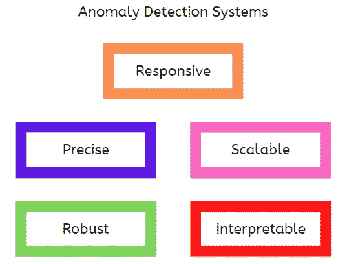

# 异常检测系统的 5 个基本品质

> 原文：<https://towardsdatascience.com/5-essential-qualities-of-anomaly-detection-systems-fcd1ec5ee9d5>

## 确保您的业务具有前瞻性和抗风险性。

威尔·梅尔斯在 [Unsplash](https://unsplash.com?utm_source=medium&utm_medium=referral) 上拍照

## 介绍

本文涵盖了作为数据从业者应该了解的异常检测系统的五个基本特性。

异常检测是数据科学的一个关键应用，在保护企业和主动应对威胁方面具有卓越的价值。它还可以通过状态监控帮助检测复杂机器(如风力涡轮机)的故障开始。

异常检测解决方案的范围从基于领域知识设置简单的统计阈值到为实时案例构建复杂的机器学习系统。例如，当数据呈正态分布时，偏离平均值 2 到 3 个标准偏差的数据点可以作为异常提取出来，以供进一步研究。

当然，在构建异常检测系统的不同方法中存在权衡，并且不是所有的方法都提供相同的解决方案质量。

## 异常检测系统的 5 个基本品质

异常检测系统的基本素质(图片由作者提供)

现在，让我们讨论一个优秀的异常检测系统的五个主要属性。

1.  **响应能力**

当构建异常检测解决方案用于关键领域(如电力和运输系统)的威胁检测时，它们必须能够快速采取行动以防止严重损害。

> 在许多现实世界的应用中，异常检测结果在损害发生之前是最有用的。

许多关于异常检测模型的实现和教程都是基于静态或历史数据，没有考虑响应的复杂性。然而，在现实世界的应用中，它可能会决定或影响项目的成功。

例如，异常检测系统的快速响应将使企业对平台故障的响应时间最短，从而全面提高客户满意度。

*有用提示:*并行化建模任务有助于在实时应用中加快系统的响应速度，尤其是在需要在线机器学习的情况下。此外，离线学习还可以帮助减少推理过程中的计算时间。

**2。精度**

短时间内过多的错误警报只会让利益相关者忽略您系统的警报，这使得该解决方案对任何实际应用都毫无用处。

> 愚弄我一次，你负责，但是如果你愚弄我两次，我负责。

因此，异常检测系统需要具有很高的精度，同时具有令人满意的[灵敏度](https://deepchecks.com/glossary/sensitivity-and-specificity-of-machine-learning/#:~:text=Sensitivity%20in%20Machine%20Learning%20can,positives%20of%20each%20available%20category.)。

异常通常是罕见的，模型可能会在训练过程中对此进行过度补偿。例如，当模型对异常过于敏感时，可能会产生错误警报。因此，将正常的操作数据分类为过程中的异常。

*有用提示:*在分类任务中，这个问题可以在训练期间通过选择解决精确度问题的适当度量来解决，例如 F1 分数和受试者操作特征(ROC)曲线下的面积。对于回归任务，可以通过提高检测阈值来提高精确度，从而仅向利益相关者警告最严重的异常。

**3。可扩展性**

每个企业的目标都是成长。因此，像异常检测这样的集成系统必须是可伸缩的，以满足业务目标。此外，如果在设计阶段没有考虑到这一点，系统的响应能力可能会受到大规模影响。在大规模部署时，计算成本也可能显著上升，使得该解决方案不切实际。

例如，较简单且不太准确的解决方案可能优于较复杂且不太准确的解决方案，后者的可扩展性较差，无法处理更多数据。

*有用提示:*在可能的情况下，计算开销可以通过代码重新格式化和并行化来解决。此外，复杂的技术可以用计算效率更高但同样精确的方法来代替。

**4。鲁棒性**

一个健壮的异常检测系统必须能够处理数据质量问题，例如缺失值，特别是在实时应用中。该系统还应该能够处理可能在训练期间使模型产生偏差的坏例子。

例如，一些特性在推理时可能不可用。一个健壮的异常检测系统需要能够处理这样的情况。

*有用的提示:*健壮性问题可以在数据管道中解决，以正确捕获不同的数据质量问题。此外，可以使用一些对缺失值和异常值具有鲁棒性的算法(例如随机森林)。

**5。可解释性**

为了让利益相关者主动采取行动，异常检测结果需要是可解释的。这是构建更具弹性的业务流程的关键。此外，可解释的结果有助于工程师进行[根本原因分析](https://asq.org/quality-resources/root-cause-analysis)。

一个常见的机器学习困境可能会出现，其中更复杂和更准确的模型更难解释，而更简单和更不准确的模型给出了更好的解释结果。

例如，当使用诸如主成分分析(PCA)之类的技术来降低数据维度时，在特征工程期间可能会失去可解释性。

*有用提示:*可以开发复杂和简单的 ML 解决方案，其中前者用于准确检测异常，后者用于提供必要的解释。替换降低结果可解释性的方法也可能是有帮助的。

## 结论

在本文中，我们讨论了异常检测系统的基本特性:响应性、精确性、可伸缩性、健壮性和可解释性。在设计阶段必须考虑这些属性，以便从您的数据科学项目中获得最佳价值。

我希望你喜欢这篇文章，直到下次。干杯！

## 参考

1.  [在 Pinterest 建立时间序列实时异常检测系统](https://medium.com/pinterest-engineering/building-a-real-time-anomaly-detection-system-for-time-series-at-pinterest-a833e6856ddd)

2.[机器学习的敏感性和特异性](https://deepchecks.com/glossary/sensitivity-and-specificity-of-machine-learning/)

你可以通过下面我的推荐链接订阅 Medium 来获得更多我和其他作者的启发性文章，这也支持我的写作。谢谢大家！

 [## 通过我的推荐链接加入媒体

### 阅读 Abiodun Olaoye(以及媒体上成千上万的其他作家)的每一个故事。您的会员费直接支持…

aolaoye.medium.com](https://aolaoye.medium.com/membership)