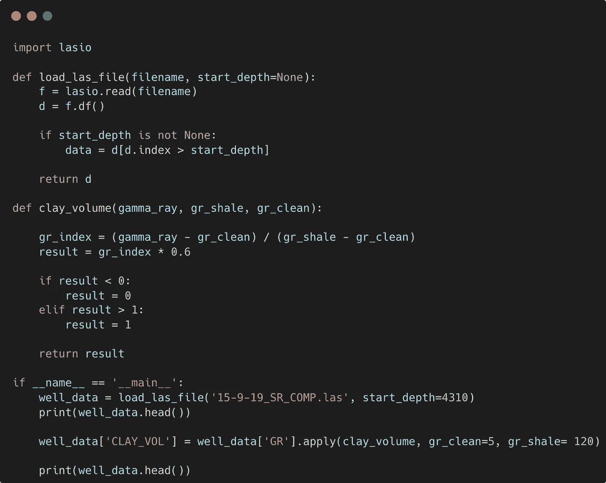
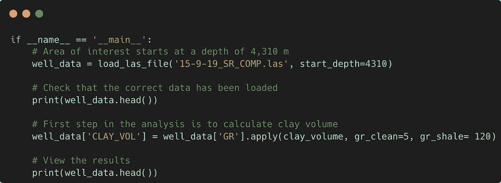
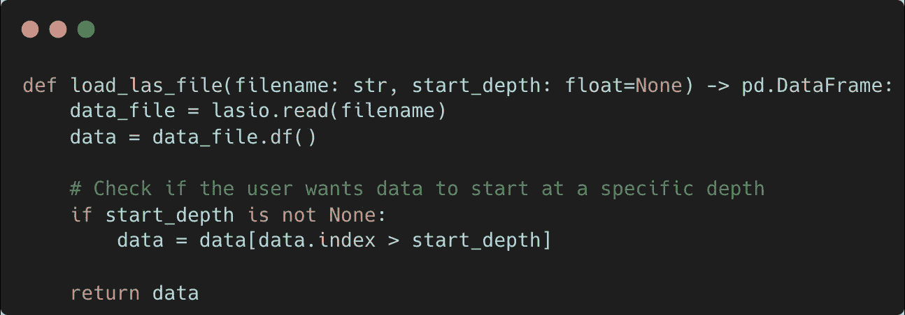
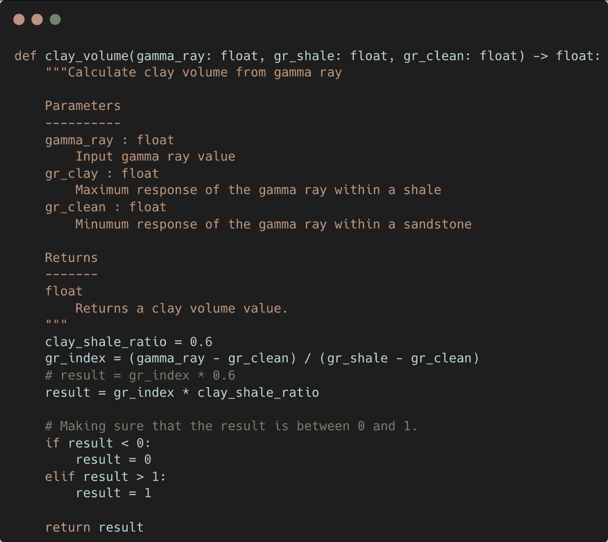
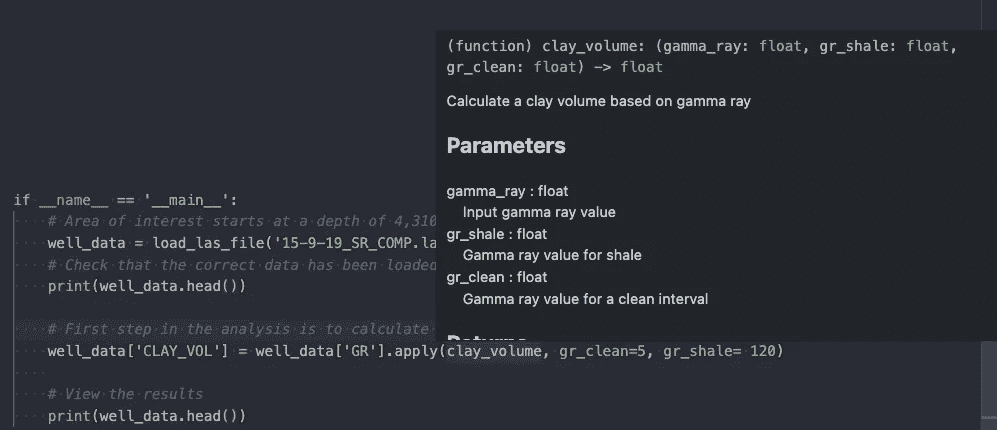
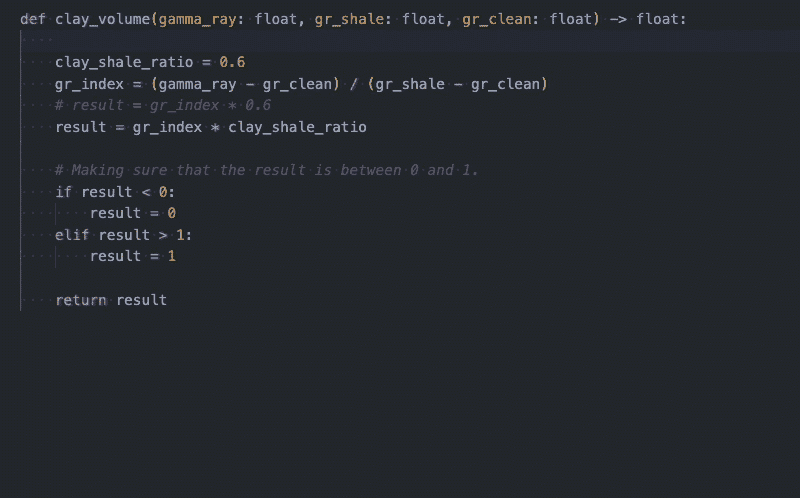
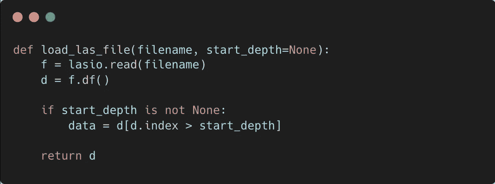
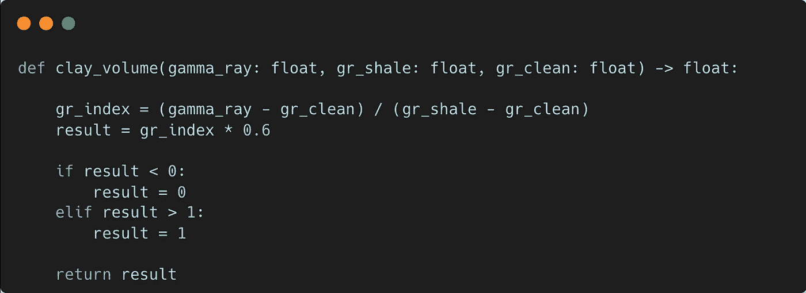
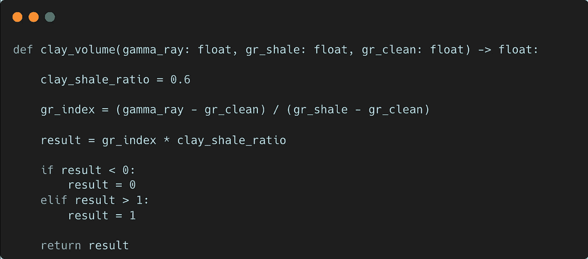
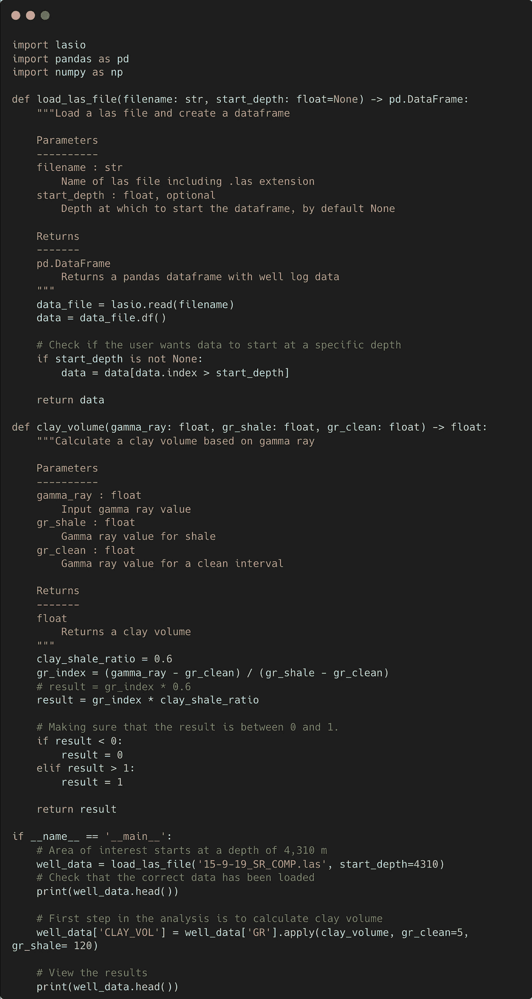

# 提高 Python 代码可读性的 5 个基本技巧

> 原文：<https://towardsdatascience.com/5-essential-tips-to-improve-the-readability-of-your-python-code-a1d5e62a4bf0>

## 通过文档、类型提示和正确的变量名改进您的 Python 代码


照片由 [Unsplash](https://unsplash.com?utm_source=medium&utm_medium=referral) 上的 [Clément Hélardot](https://unsplash.com/@clemhlrdt?utm_source=medium&utm_medium=referral) 拍摄

你是否经常回头看你 6 个月前写的一些代码，挠头想知道这些乱七八糟的东西是什么？或者你有没有被别人接过一个项目，却苦于不知道从哪里开始？如果是这样，你并不孤单。

Python 中有很多方法可以帮助你理解代码的内部工作方式，所以当你回到代码中时，从你离开的地方继续下去会容易得多。

作为一个例子，我们最终得到的代码看起来很像下图中的代码。然而，这还不是最糟糕的，还有一些事情我们需要详细说明，例如:

*   load_las_file 函数中 f 和 d 分别代表什么？
*   为什么我们要检查粘土函数的结果？
*   这些函数在寻找什么类型？彩车？数据框架？



在这篇文章中，我将介绍五个基本技巧，告诉你如何通过文档、提示输入和正确的变量名来提高应用程序/脚本的可读性。

## 本教程的视频版本

我最近上传了这篇文章的视频到我的 YouTube 频道。下面来看看吧。

如果你喜欢这些内容，请考虑点击[这里](https://www.youtube.com/channel/UCn1O_4_ApzbYwrsUdRoMmOg?sub_confirmation=1)订阅频道。

# 1.评论

为了让我们有一个好的开始，我们可以对代码做的第一件事是向一些行添加注释，但是，要注意避免做过头。注释应该告诉你为什么代码会工作，或者为什么某件事情会以某种方式完成，但是不能告诉你它是如何工作的。

Python 中的注释通常是通过使用 hashtag 符号(#)来完成的，可以跨越一行或多行。

```
# Comment using the hashtag
# Another comment using the hashtag
```

对于多行注释，我们也可以使用双引号。

```
"""
This is an example of
a multi-line comment
"""
```

在下面的示例中，代码中添加了一些注释，以解释一些代码行背后的工作流和推理



向 Python 代码添加注释。图片由作者提供。

# 2.显式打字

Python 语言是动态类型的，这意味着只在运行时检查变量类型。此外，变量可以在代码执行期间改变类型。

另一方面，静态类型涉及到显式声明变量是什么类型，并且在代码执行期间不能改变。

2014 年， [PEP 484](https://peps.python.org/pep-0484/) 引入了类型提示的思想，后来在[Python 3.5 版本](https://docs.python.org/3.5/whatsnew/3.5.html)中引入。这些允许你明确地声明变量应该是什么类型。

通过添加类型提示，可以显著提高代码的可读性。在下面的例子中我们可以看出:

*   需要两个参数
*   `filename`参数的类型应该是[字符串](https://docs.python.org/3/library/string.html)
*   `start_depth`参数应该是类型[浮点型](https://www.w3schools.com/python/ref_func_float.asp)，默认值为`[None](https://www.w3schools.com/python/ref_keyword_none.asp)`
*   该函数将返回一个 [pandas DataFrame](https://pandas.pydata.org/docs/reference/api/pandas.DataFrame.html) 对象



向 Python 函数添加类型提示。图片由作者提供。

我们马上就可以根据类型提示准确地知道函数需要什么以及它将返回什么。

# 3.文档字符串(文档字符串)

[文档字符串](https://peps.python.org/pep-0257/)是紧跟在函数或类定义之后的字符串。 [Docstrings](https://peps.python.org/pep-0257/) 是一种很好的方式，可以详细解释你的函数做什么，它需要什么参数，它将引发的任何异常，它将返回什么，等等。

此外，如果您正在使用类似于 [Sphinx](https://www.sphinx-doc.org/en/master/) 的东西来为您的代码创建在线文档，那么文档字符串将被自动提取并转换成适当的文档。

以下示例显示了名为 clay_volume 的函数的 docstring。

这里我们可以指定每个参数是什么。这比基本的类型提示更进了一步。你也可以包括更多关于函数背后的方法论的信息，比如学术参考或方程式。



Python 中的 docstring 示例。图片由作者提供。

当您从代码中的其他地方调用函数时，拥有文档字符串也很有帮助。例如，使用 Visual Studio 代码，您可以将鼠标悬停在函数调用上，并看到该函数的功能及其要求的弹出窗口。



使用 docstrings 时的浮动提示示例可以提供关于函数的额外信息。图片由作者提供。

如果您使用 [Visual Studio Code (VSCode)](https://code.visualstudio.com/) 来编辑您的 Python 代码，那么您可以使用像 [autoDocstring](https://marketplace.visualstudio.com/items?itemName=njpwerner.autodocstring) 这样的扩展来使创建 Docstring 的过程变得更加容易。这允许您键入三个双引号，并自动为您填充模板的其余部分。你只需要填写细节。



在 VSCode 中使用自动文档字符串的动画 gif。图片由作者提供。

*提示:如果您已经在参数中声明了类型，那么它们将被自动选取。*

# 4.可读的变量名

有时候当你写代码的时候，你不会太在意一个变量的名字，尤其是当你决定让代码运行起来而时间又不多的时候。然而，如果你回到代码中，发现一系列名为`x1`或`var123`的变量，乍一看你可能无法理解它们代表什么。

使用下面的例子，我们有两个变量`f`和`d`。我们可以通过查看代码的其他部分来猜测它们的意思，但是这需要时间，尤其是如果代码很长的话。



命名不当的 Python 变量示例。图片由作者提供。

如果我们给这些变量赋予适当的名称，我们将能够知道其中一个是由`lasio.read()`调用读取的`data_file`，并且很可能是原始数据。`data`变量告诉我们这是我们正在处理的实际数据。


Python 中正确变量名的例子。图片由作者提供。

# 5.避免幻数

幻数是代码中的值，其背后有无法解释的含义，可以代表常数。在代码中使用这些可能会导致歧义，特别是对于那些不熟悉使用该数字的任何计算的人。

此外，如果我们在多个地方有相同的幻数，我们需要更新它，我们将不得不更新它的每个实例。然而，如果这个数字被分配给一个正确命名的变量，这个过程就会容易得多。

[它还打破了最古老的编程规则数据之一，可追溯到 20 世纪 60 年代。](https://en.wikipedia.org/wiki/Magic_number_(programming))

在下面的例子中，我们有一个函数，它计算一个名为 result 的值，并将其乘以 0.6。这是什么意思？是换算系数吗？标量？



行 result = gr_index * 0.6 中的幻数示例。图片由作者提供。

如果我们声明一个变量并给它赋值，那么我们就有更好的机会知道它是什么。在这种情况下，粘土与页岩的比率用于将伽马射线指数转换为粘土体积。



在为幻数 clay_shale_ratio 声明一个变量后，我们可以更容易地阅读代码，并在将来更新它。图片由作者提供。

# 最终代码

应用上面的技巧后，我们的最终代码现在看起来更好，也更容易理解。



# 摘要

通过注释和 docstrings 向代码中添加文档可以帮助您和其他人理解您的代码在做什么。开始时，这可能感觉像是一件苦差事，但是随着工具的使用和经常的练习，它会变成你的第二天性。

*感谢阅读。在你走之前，你一定要订阅我的内容，把我的文章放到你的收件箱里。* [***你可以在这里做！***](https://andymcdonaldgeo.medium.com/subscribe)

其次，通过注册会员，你可以获得完整的媒介体验，并支持我自己和成千上万的其他作家。它每个月只花你 5 美元，你可以完全接触到所有令人惊叹的媒体文章，也有机会用你的写作赚钱。如果你用 [***我的链接***](https://andymcdonaldgeo.medium.com/membership) ***，*** *报名，你直接用你的一部分费用支持我，不会多花你多少钱。如果你这样做了，非常感谢你的支持！*