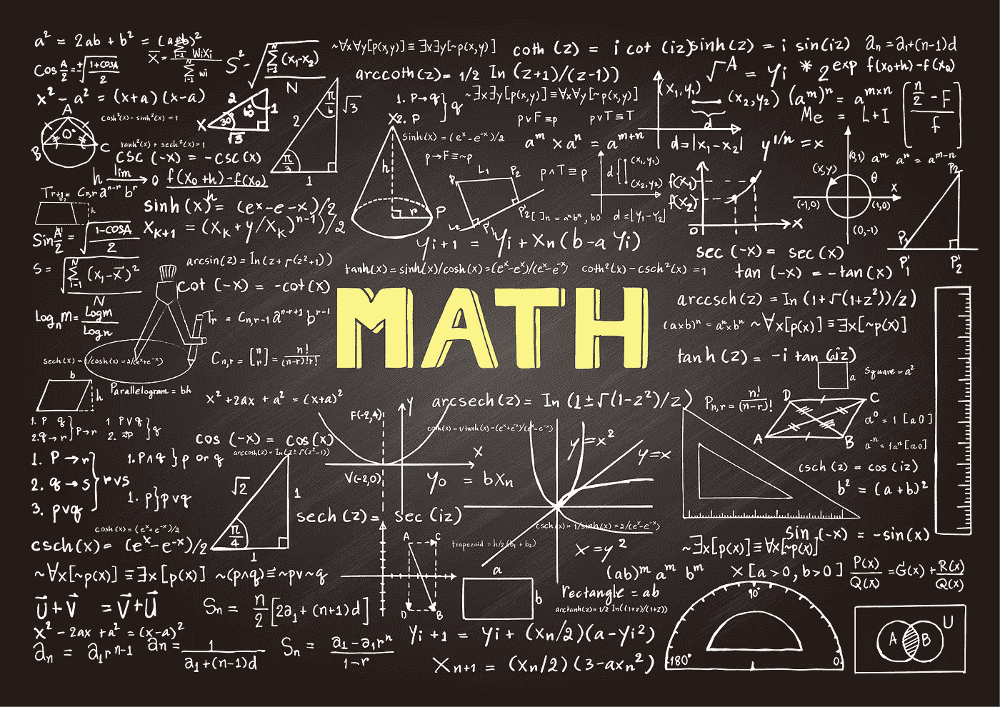

# 学习数据科学数学的 5 个免费资源

> 原文：<https://towardsdatascience.com/5-free-resources-to-learn-math-for-data-science-4cbf4fc43673>

## 想学数据科学，又没有数学背景，从这里开始。

图片由 [Freepik](https://www.freepik.com/vectors/chalk-drawing)

我从数据科学有志者那里收到的最常见的问题之一是“*对于机器学习*，我需要知道多少数学知识？”

当我第一次开始自学数据科学时，我不知道我需要学习多少数学才能完全胜任入门级数据科学职位。

我花了很多时间学习本科水平的微积分、线性代数和统计学。

在我找到第一份数据科学工作后，我意识到在这个行业工作所需的数学量远远低于我的预期。

大多数公司倾向于建立机器学习模型来解决非常相似的业务问题。由于这一点，你一般不需要重新发明轮子，从零开始构建算法。您通常可以使用现有的解决方案来适应您当前的使用情形。

然而，至少对这些算法背后的工作有一个直观的理解总是更好的。

例如，梯度下降用于在线性回归模型中寻找最佳斜率值。这是**微积分**的一个应用，理解最佳拟合线是如何计算的总是有好处的。

类似地，**线性代数**在建模的数据准备中具有应用，并且在实施维度减少解决方案中被广泛使用。如果你想扩展你的深度学习知识，你将需要学习矩阵操作技术。

最后，**统计学**是成为数据科学家需要学习的最重要的数学分支。在野外工作时，您需要分析数据趋势，构建假设，并将观察结果转化为有意义的见解。这些都是统计学的应用，如果你想找一份数据科学的工作，这些都是必须要学的。

当我学习上述概念时，我最初花了很多时间进行手工计算。我学会了微分、积分和解线性方程。然而，这并不是学习数据科学的先决条件。

我们有计算机程序来为我们执行这些计算，我们真正需要的是对这些数学概念有一个高层次的、直观的理解。

同样，上述建议只适用于你试图学习数据科学以便在该行业找到工作的情况。如果你想成为一名机器学习研究人员或进入学术界，那么你需要学习的数学量将显著增加，因为你将从头开始构建新的解决方案。

在这篇文章中，我将为您提供 6 种学习机器学习数学的资源。我将包括免费的在线材料(YouTube 视频、在线课程、教科书)，你可以用它们来获得足够的数学能力，成为一名数据科学家。

## 1. [3Blue1Brown 的线性代数系列](https://www.youtube.com/watch?v=kjBOesZCoqc&list=PL0-GT3co4r2y2YErbmuJw2L5tW4Ew2O5B)

3Blue1Brown 是一个受欢迎的 YouTube 频道，它采用可视化方法来分解高度复杂的数学概念。

他们的线性代数系列将带您了解核心的线性代数概念，如向量、线性组合、线性变换、矩阵乘法、特征值和特征向量。

他们不太深入数学计算。相反，本系列的重点是为您提供对线性代数的直观理解。你将会得到一个解释，而不是简单地记住公式，解释它们为什么有效，以及你如何自己推导出它们。

## 2. [3Blue1Brown 的微积分系列](https://www.youtube.com/watch?v=WUvTyaaNkzM)

这是由 3Blue1Brown 创建的该列表中的第二个资源。他们的微积分系列也很直观，容易理解。

他们将带你了解导数、链式法则和隐式微分等概念，所有这些概念在实现梯度下降算法中都有直接的应用。

## 3. [3Blue1Brown 的深度学习系列](https://www.youtube.com/watch?v=aircAruvnKk&list=PLZHQObOWTQDNU6R1_67000Dx_ZCJB-3pi&index=1)

虽然他们的微积分系列更加通用，并且迎合了任何想要增强数学知识的人，但 3Blue1Brown 的深度学习系列是专门为对人工智能感兴趣的学生创建的。

深度学习系列将带你了解神经网络的内部工作原理，以及它们是如何学习的。

您将获得反向传播算法及其工作原理的深入解释，以及其背后的微积分概念。

## 4.[统计学习简介](https://www.statlearning.com/)

这是作为机器学习爱好者可以阅读的最好的统计学入门教材之一。它在网上可以买到，也可以免费下载。

如果您过去已经实现了线性回归、逻辑回归和决策树等算法，但不了解这些模型背后的工作原理或何时使用它们，这本书是一个很好的起点。

您将对线性模型、基于树的算法和无监督技术的工作原理有一个直观的理解。提供了关于在创建不同的统计模型时如何应对过度拟合的解释。

这本书的每一章还包括一个 R 语言的实验练习，你可以跟着练习编码，这样你不仅可以从理论上理解这个主题，还可以将学到的概念应用到实践中。

## 5.[哈佛大学统计 110](https://www.youtube.com/watch?v=KbB0FjPg0mw)

这个列表中的最后一个资源是 YouTube 上的一个系列，名为 statistics 110，由哈佛大学向公众开放。

这是我在网上找到的关于统计和概率的最好的系列讲座之一。它几乎涵盖了你在本科统计课上通常会看到的所有统计概念——概率公理、分布类型、蒙蒂霍尔问题、协方差、相关性、卡方检验、T 检验、马尔可夫链等等。

讲座从入门水平开始，即使你没有统计学和概率的背景，你也可以毫不费力地跟上。

上面的资源是让你接触机器学习的数学世界的好方法。它们为您提供了对数学概念的直观理解，这将增强您对每天构建的模型背后的工作的了解。

如果您没有时间浏览这个列表中的所有资源，那么我建议您至少阅读《统计学习入门》,因为这本教材中解释的概念可以直接应用到您作为数据科学家的日常工作流程中。

感谢阅读！本文最初发表于[这里](https://www.natasshaselvaraj.com/5-free-resources-to-learn-math-for-data-science/)。