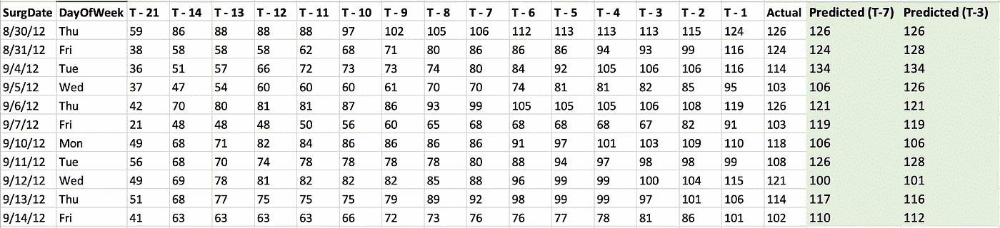
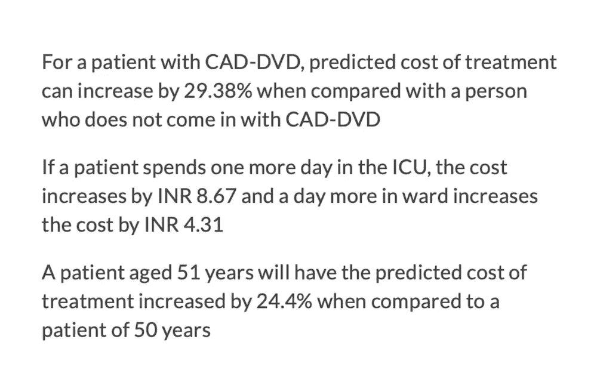
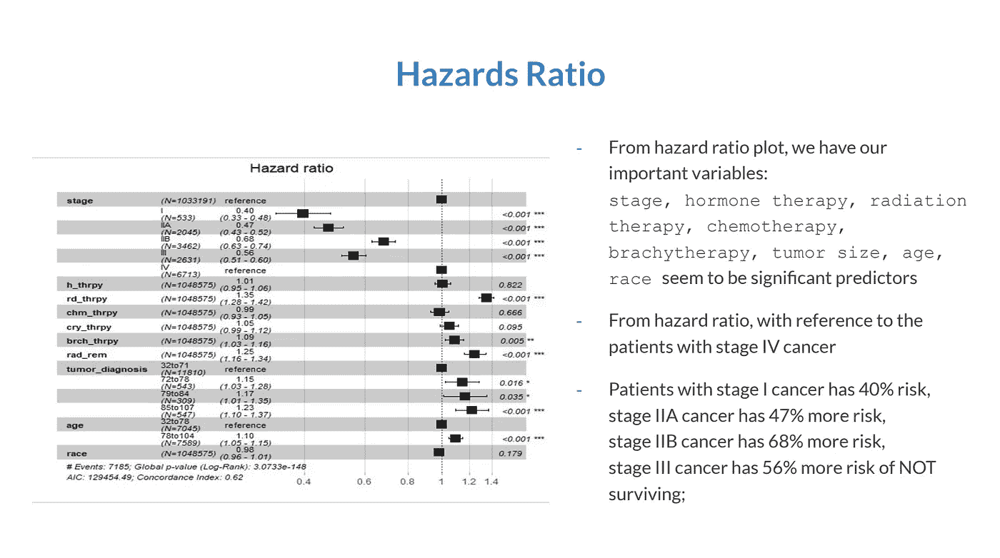

# 2022 年将开展 5 个医疗保健数据分析项目

> 原文：<https://towardsdatascience.com/5-healthcare-data-analytics-projects-to-take-up-in-2022-68e2dc820f3b>

克里斯·利维拉尼在 [Unsplash](https://unsplash.com/s/photos/healthcare?utm_source=unsplash&utm_medium=referral&utm_content=creditCopyText) 上的照片

在当今不断发展的技术世界中，数据推动了业务的发展。
未来的职业生涯涉及各个行业的数据分析——医疗保健、金融、体育、零售&电子商务、流媒体、航空、约会、营销、天气、教育、政府、旅游，以及天底下的一切。

企业依靠数据来保持竞争力、灵活性并做出更明智的决策。医疗保健行业也不例外。在医疗保健行业工作了将近一年，我意识到医疗保健行业在技术采用方面是出了名的保守。我们使用的是 40 年前建立的遗留系统，这些年来根据需要进行了一些小的改造。现在是医疗保健数字化革命的时候了。

如果你正在寻找一份与数据相关的工作或学习数据科学以实现职业转换，或者对在朝九晚五之后从事数据项目感兴趣，我建议考虑医疗保健这一常青树领域。

在一个错误可能意味着生死之别的行业，项目只能如此有趣。

## 但是，您如何确定合适的项目呢？

我通常根据你的目标和工作带宽考虑三个因素:

1.  **项目长度**
    可以在一周而不是一个月内完成的项目(组合项目)
2.  **问题陈述类型** 聚类、回归、情感分析、预测建模
3.  **结果的表示**
    数据模型、Tableau 或 PowerBI 可视化、表格或图形

***注*** *:以下项目是为了启发类似项目。用于项目的数据可能是开源的，也可能不是。*

# 1.短期项目

**预测医疗中心的手术量**

**数据** : [范德比尔特大学医学中心择期手术时间表](https://github.com/rashidesai24/Vanderbilt-University-Medical-Center-Elective-Surgery-Schedule/blob/main/Vanderbilt%20Univ%20Case%20Dataset.xlsx)

**问题陈述:**预测医疗中心的每日需求，以有效利用 55 个手术室

**方法**:根据 48 周手术日程的历史数据，预测手术例数需求。您可以识别独立变量，移除相关变量，并创建多个回归模型，以使手术量预测的误差最小

**输出格式:**表格

输出:基于多个预测模型的手术前 7 天和 3 天的手术量图片来源:作者

# 2.作品集项目

**分析推特上关于新冠肺炎疫苗接种的趋势**

**论文发表于:**[https://infodemiology.jmir.org/2022/1/e33909](https://infodemiology.jmir.org/2022/1/e33909)

**数据**:从推特上提取的推文

**目标(更多项目详情在我的**[**GitHub**](https://github.com/rashidesai24/Analyzing-Twitter-Trends-On-COVID-19-Vaccinations)**):**

*   从与 COVID 疫苗相关的时间范围内的推文中提取信息，其中观点高度非结构化、异质，或正面或负面或中性，并确定情绪变化的驱动因素
*   利用时间线中突破性事件支持的主题建模和文本分析，探索对话并提取收集的推文中出现的“主题”
*   可视化 Twitter 用户的情绪趋势以及与所发现的主题相关联的流行度

## **方法**

1.  **数据收集:**2021 年 1 月至 4 月间收集了 274 万条推文
2.  **数据预处理:**数据清理和使用词袋将个人推文与组织和机器人推文分离
3.  **数据建模:**

*   无监督的 LDA——理解隐藏在推文中的抽象主题
*   情绪分析——使用 VADER(用于情绪推理的效价感知词典)检查疫苗对疫情期间用户态度的影响
*   相关性解释(CorEx) —将主题建模转向由无监督 LDA 识别的主题。使用的标准化主题相关性(NTC)表示由特定主题解释的单个文档内的相关性

4.**数据可视化:**使用 Excel 的图形、图表和热图&表格

# 3.预测分析项目

**在医院通过套餐定价评估治疗计划**

**套餐定价:**根据临床定义的护理事件的预期费用，在入院时为患者提供治疗费用

此外还有**传统定价:**价格是通过综合处理或后处理设施中使用的服务来计算的

**数据:** [教会医院套餐定价](https://github.com/rashidesai24/Package-Pricing-at-Mission-Hospital/blob/main/Package%20Pricing%20at%20Mission%20Hospital%20-%20Data%20Supplement.xlsx)

**问题陈述:**建立预测模型，根据入院时的临床因素估计治疗价格

**方法**:处理数据变量的相关性，处理空值，对重要变量进行特征工程，运行统计测试以了解因变量对目标变量的影响，并创建最佳多元回归模型以估计治疗价格

**输出**:治疗费用最高的数据变量

输出表明因变量和目标变量(治疗费用)之间的影响关系图片来源:作者

# 4.现成的项目

**诊断为前列腺癌患者的生存分析**

生存分析是回归的一个分支，允许量化一组预测因子对生存的影响。当我们需要分析某个事件发生之前的预期持续时间时，比如死亡或机器故障，就需要用到这个模型。

**数据:** PHI(受保护健康信息)——数据不公开

**问题陈述:**确定前列腺癌患者的 7 年生存率

**方法:**数据清理和特征工程识别诊断一年后未存活患者的症状。对诊断为前列腺癌的患者进行生存分析。

**输出**:识别重要的生存风险因素

输出是患者出现症状或接受最高风险因素治疗时的风险百分比图片来源:作者

# 5.可视化项目

用数据讲故事是现在和未来，并且会一直持续下去。

数据可视化是传达您的故事和从未见过的数据的潜在洞察力的最有效方式之一。任何包含医疗保健数据点的数据集都可以用几个问题语句来可视化。比如说—

*   [在一个城市住院的时间长度](https://public.tableau.com/app/profile/lovelytics/viz/Healthcare-LengthofStay/LengthofStayReport)
*   [美国医疗支出](https://public.tableau.com/app/profile/healthdataviz/viz/USHealthcareExpendituresCMSData/HealthExpenditures)
*   [急诊室入院分析](https://public.tableau.com/app/profile/olushola.olojo/viz/HealthDashboardHospitalEmergencyRoom/EmergencyHospital)

# 小努力大有作为！

1.  商业头脑就是一切
2.  理解你的问题陈述，就像给企业增加价值一样
3.  如果你花 80%的时间清理数据，那你就做对了
4.  在每个步骤记录你的项目，并在 GitHub、Tableau Public 和 Public 平台上分享

这就是我的博客的结尾。感谢您的阅读！请在评论中告诉我你感兴趣的项目，你的数据之旅，以及 2022 年你想要什么！

如果你喜欢看这样的故事，可以考虑从这个 [**链接**](https://rashidesai2424.medium.com/membership) **注册成为一名中等会员！**

数据帐篷快乐！

*Rashi 是一名来自芝加哥的数据奇才，他喜欢将数据可视化，并创造富有洞察力的故事来传达商业见解。她是一名全职的医疗保健数据分析师，周末喝一杯好咖啡，写关于数据的博客……*