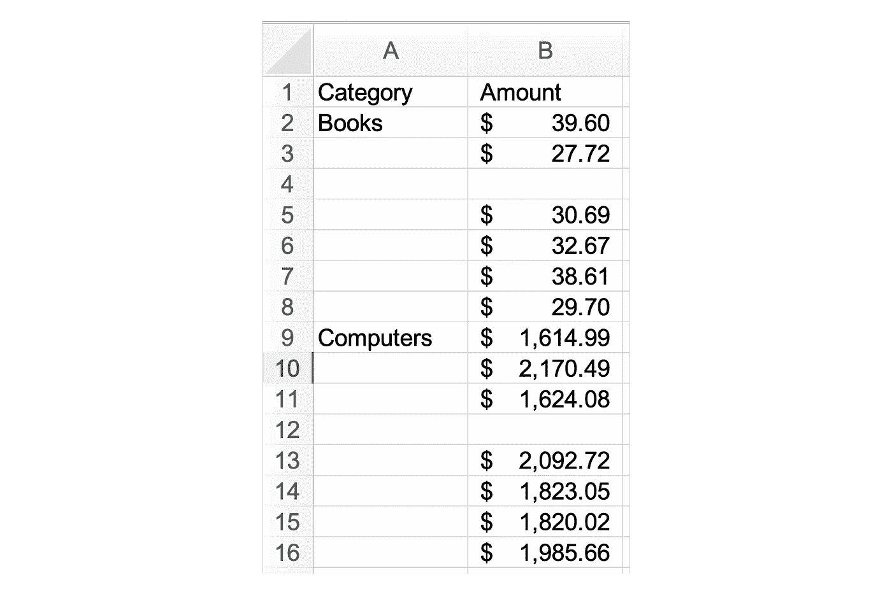

# 熊猫的 5 个隐藏秘密改善你的工作流程

> 原文：<https://towardsdatascience.com/5-hidden-secrets-of-pandas-to-improve-your-workflow-9f2bbebe584a>

## 探索熊猫图书馆中隐藏的珍宝

Joshua Reddekopp 在 Unsplash 上拍摄的照片

Pandas 是 Python 中数据分析的精华库！该库使复杂的数据分析变得非常简单。然而，图书馆里有许多隐藏的宝石被藏了起来。在这篇文章中，你将学习五个顶级的功能和方法来改善你的熊猫工作流程。

本教程结束时，您将学会:

1.  如何提高阅读 Excel 文件的能力
2.  如何掌握缺失数据
3.  如何使用分类数据节省空间和改进功能
4.  如何将连续变量转换为分类变量
5.  如何使用逗号分隔的调查数据

我们开始吧！

# 像冠军一样阅读 Excel 文件

在许多情况下，您将从读取 Excel 文件开始分析。与读取整个文件、删除列、转换数据类型和处理缺失值不同，您可以一次性完成所有这些工作！

在许多情况下，积极主动地了解如何读取数据可以提高代码的性能，并使其更易于阅读。让我们来看一个有一些怪癖的数据集:

要使用的 Excel 报表

在上面的报告中，我们可以注意到一些事情:

1.  数据直到第 3 行才开始
2.  有一个随机列不包含任何数据
3.  我们有并不真正丢失的丢失数据，只是简单地标记为`MISSING`
4.  我们有多种数据类型

让我们看看如何使用强大的`pd.read_excel()`函数一次性处理所有这些。接下来，[可以在这里随意下载虚构的数据集](https://github.com/datagy/mediumdata/raw/master/PandasTips.xlsx)(来源:作者创建)。

让我们来分解一下我们的代码做了什么:

*   `skiprows=`指示熊猫跳过规定的行数
*   `usecols=`允许我们传入想要阅读的列。在这种情况下，我们使用 Excel 范围！
*   `na_values=`指定哪些值代表缺失值。这也可以是一个值列表。
*   `dtype=`接受一个`column:datatype`键值对的字典。这里有一点预览，用于将数据作为分类读取！

在下一节中，您将了解如何更优雅地处理丢失的数据。

# 改进缺失数据的处理

Pandas 为处理缺失数据提供了一个有用的缺失方法，即`.fillna()`方法。从表面上看，这个方法似乎很简单——事实也的确如此。也就是说，该方法还提供了相当多有用的功能，尤其是在与其他方法结合使用时。

看看下面的数据集:

含有大量缺失数据的数据集(来源:Nik Piepenbreier)

在上面的数据集中，我们有两列，每列都有缺失的数据:

1.  `Category`栏缺少可以填写的类别
2.  `Amount`列缺少数据。在这种情况下，考虑到每个类别中值的差异，用单个值填充可能没有意义。

让我们先处理一下`Category`列:`.fillna()`方法有一个可选参数，它提供了向前填充数据的选项。我们可以通过在函数中传递`method='ffill'`来做到这一点。

`Amount`列稍微复杂一点:我们可能不想用任何给定值填充它。由于书籍和计算机的金额相差很大，简单地使用该列的平均值是不合适的。**不过，我们可以用各组的平均值来填补缺失值。**

让我们看看如何在熊猫身上处理这两种操作:

在上面的代码中，我们能够使用`.groupby()`方法和`.fillna()`方法来填充每组数据的平均值。

# 使用分类数据节省空间

在这一节中，我们将深入分类数据的奇妙世界！虽然这听起来可能不令人兴奋，但分类数据提供了很多很多好处。这些优势中有两个关键优势:

1.  节省了大量空间，而且
2.  向数据中添加自定义排序顺序

让我们先看看如何创建分类数据及其节省空间的属性。在第一部分中，我们在读取 Excel 文件时分配了数据类型。虽然这是最聪明的处理方式，但是让我们稍后转换一个列，看看这样可以节省多少空间。

从上面的代码中我们可以看到，即使在一个小的数据集中，将数据转换成分类数据**也节省了将近 1/3 的空间**！

在下一节中，您将学习如何使用分类数据通过逻辑类别对数据进行排序！

# 创建有序类别

基于您在上一节中学到的分类数据，我们甚至可以创建有序分类数据。当您有逻辑分类数据(如质量等级或衬衫尺寸)时，这很有帮助。

让我们看看如何在熊猫身上做到这一点:

让我们来分解一下上面的代码实现了什么:

1.  我们创建了一个包含两列的数据框架
2.  我们创建了一个分类数据类型，它按照逻辑顺序对我们的类别进行排序
3.  然后，我们将列转换为这种新的数据类型

在那里，我们通过以下方式演示这种有序分类数据类型的功能:

*   按衬衫尺寸排序——数据不是按字母顺序排序，而是按我们之前提供的顺序排序
*   我们使用一个类别过滤我们的数据框架，并计算总销售额

# 展开您的调查数据

在最后一节中，我们将了解如何更好地处理调查数据，或者更确切地说，如何处理列中逗号分隔的值。

在许多情况下，从测量工具中提取的数据将在一个单元格中包含一个选项列表，用逗号分隔。这通常不是很好的工作，但谢天谢地熊猫来救援了！

我们可以看到，在我们的数据帧中，`Sports`列并不是特别有用。我们可以通过使用`.explode()`方法将这个列转换成更有用的东西，如下所示:

我们可以看到，通过分解我们的`Sports`列，我们创建了该列的非透视版本，在那里我们可以随心所欲地过滤！

# 结论

在本教程中，我们探索了熊猫图书馆的五个隐藏的瑰宝。该库充满了惊人的功能，让您以多种不同的方式探索和操作您的数据。