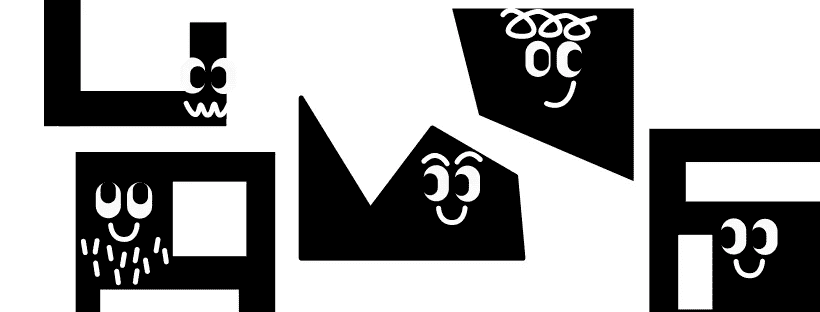
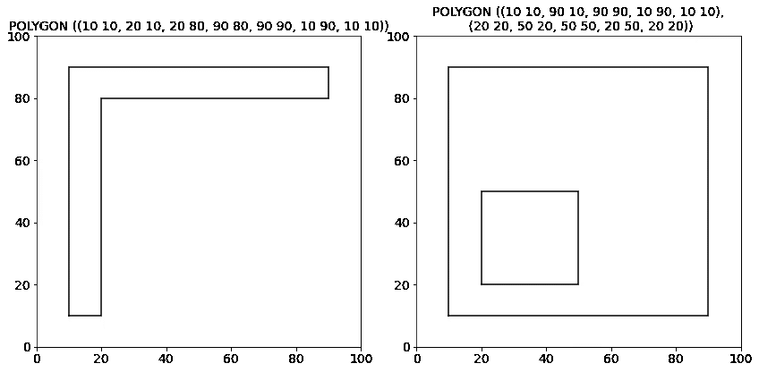
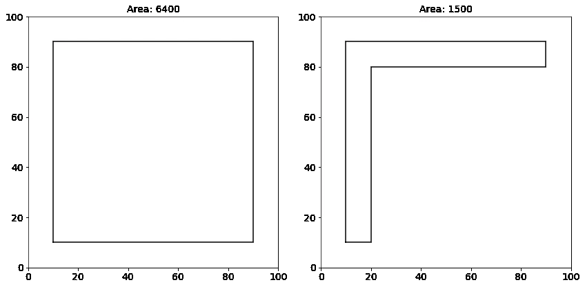
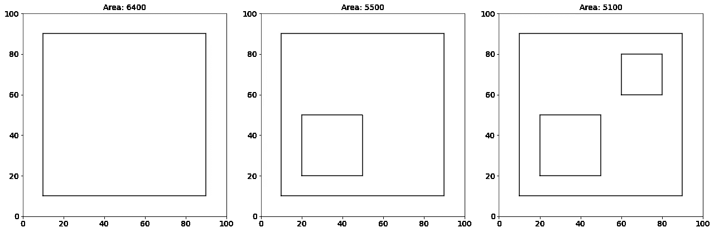
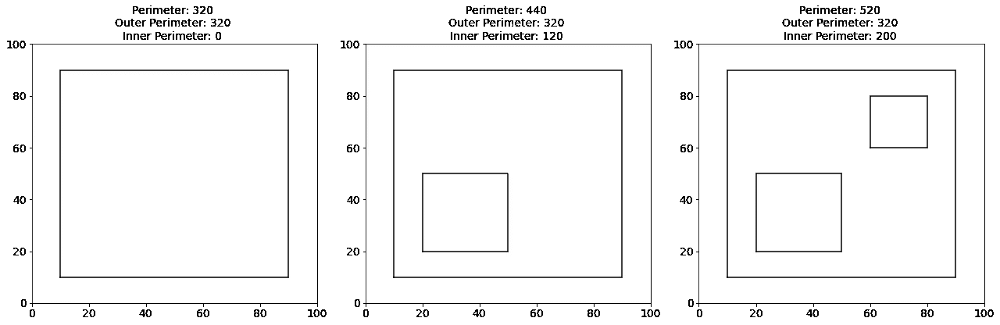
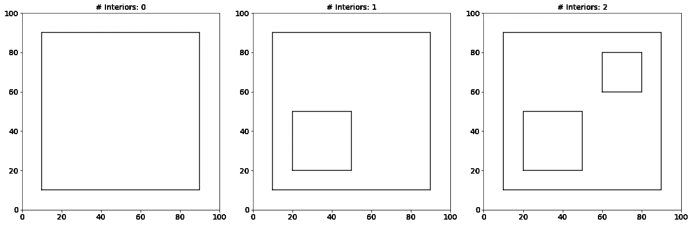
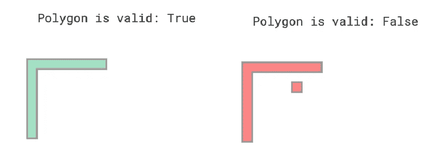
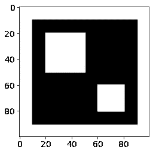

# 从多边形创建新要素的 5 个想法

> 原文：<https://towardsdatascience.com/5-ideas-to-create-new-features-from-polygons-f8f902f5ad8f>

## 如何从带有 Shapely 的 WKT 字符串中获取面积和其他特征



作者图片

多边形数据在数据科学的各种应用中非常有用。例如，在 [2022 数据科学中的女性数据马拉松第二阶段挑战](https://www.kaggle.com/competitions/phase-ii-widsdatathon2022)中，其中一个数据集包含建筑物平面图的多边形数据，以确定其能源使用情况。

这些多边形可以用**公知文本(WKT)格式**来表示。WKT 格式是一种表示几何 2D 和 3D 对象(如点、线、多边形等)的标记语言。在 WKT 格式中，多边形由多边形中每个点的坐标表示。以下是几个 WKT 格式的面描述示例:

*   `"POLYGON ((10 10, 90 10, 90 90, 10 90, 10 10))"`
*   `"POLYGON ((10 10, 90 10, 90 90, 10 90, 10 10), (20 20, 50 20, 50 50, 20 50, 20 20))"`

虽然您可以解析来自 WKT 字符串的多边形坐标，并自己编写函数来计算多边形的面积或周长等特性，但 **Shapely 软件包** [1]会开箱即用地为您完成所有这些工作。您可以简单地将面的 WKT 字符串加载到形状良好的面中，如下所示:

```
import shapely.wkt
from shapely.geometry import Polygonwkt_string = "POLYGON ((10 10, 20 10, 20 80, 90 80, 90 90, 10 90, 10 10))"
polygon = shapely.wkt.loads(wkt_string)
```

在本文中，我们将首先看看如何用 Shapely 包或 Matplotlib 库可视化一个多边形。然后，我们将从 WKT 格式的多边形中学习五个特征工程思想。

如果您想尝试本文中描述的技术，您可以从我的相关 [Kaggle 笔记本](https://www.kaggle.com/code/iamleonie/5-ideas-to-create-new-features-from-polygons)中下载或派生本文的代码。

# 如何可视化一个多边形

你可能想对多边形做的第一件事是将它可视化，以便对它有更好的直觉。您可以通过 Shapely 包直接绘制多边形，也可以使用 Matplotlib 库通过其坐标绘制多边形。

## 通过造型包装实现可视化

为了直观显示多边形的形状，可以在加载后显示形状良好的多边形。

```
wkt_string = "POLYGON ((10 10, 20 10, 20 80, 90 80, 90 90, 10 90, 10 10))"
polygon = shapely.wkt.loads(wkt_string)
polygon
```


用 Shapely 可视化 WKT 字符串的多边形(图片由作者从 [Kaggle](https://www.kaggle.com/code/iamleonie/5-ideas-to-create-new-features-from-polygons) 获得)

```
wkt_string = "POLYGON ((10 10, 90 10, 90 90, 10 90, 10 10), (20 20, 50 20, 50 50, 20 50, 20 20))"
polygon = shapely.wkt.loads(wkt_string)
polygon
```


用 Shapely 可视化 WKT 字符串的多边形(图片由作者从 [Kaggle](https://www.kaggle.com/code/iamleonie/5-ideas-to-create-new-features-from-polygons) 获得)

虽然这是一个快捷的选择，但它的缺点是你无法获得关于坐标的直觉。

## 通过 Matplotlib 库实现可视化

要通过坐标可视化多边形，除了 Shapely 包之外，还可以使用 Matplotlib 库。

```
import matplotlib.pyplot as plt
```

从形状良好的多边形中，您可以从外部(`polygon.exterior.xy`)和内部(`polygon.interiors[i].xy`)的`xy`属性中检索多边形的 x 和 y 坐标。“外部”是多边形的外部形状。此外，一个多边形可以没有，一个或多个“内部”，这是外部较小的多边形。您可以根据其`xy`属性绘制多边形的外部和内部，如下所示:

```
def plot_polygon(wkt_string, ax=None):
    polygon = shapely.wkt.loads(wkt_string)

    # Retrieve and plot x and y coordinates of exterior
    x, y = polygon.exterior.xy
    ax.plot(x, y, color = 'black')

    # Retrieve and plot x and y coordinates of interior
    for interior in polygon.interiors:
        x, y = interior.xy
        ax.plot(x, y, color = 'black')

    ax.set_title(wkt_string.replace("),", "),\n"), fontsize=14)
    ax.set_xlim([0,100])
    ax.set_ylim([0,100])
```



来自 WKT 字符串的多边形用 Matplotlib 可视化(图片由作者来自 [Kaggle](https://www.kaggle.com/code/iamleonie/5-ideas-to-create-new-features-from-polygons) )

# 1.求多边形的面积

将多边形可视化后，您可能想知道如何根据给定的坐标计算多边形的面积。不用编写自己的函数来计算它，您可以简单地从 Shapely 多边形的属性`area`中检索多边形的面积。

让我们绘制几个多边形并验证它们的面积。在左侧下方，您可以看到一个边长为 80 个单位的二次多边形。Shapely 多边形的`area`属性返回值 6400，相当于 80 乘以 80。因此是正确的。

```
area = polygon.area
```



多边形的面积(图片来自作者从 [Kaggle](https://www.kaggle.com/code/iamleonie/5-ideas-to-create-new-features-from-polygons)

然而，并不是所有的多边形都是封闭的形状。有时，多边形可以有“洞”，这在 Shapely 包中被称为内部。如果我们绘制并验证它们的面积，我们可以看到有内部的多边形的面积小于没有任何内部的多边形的面积，因为内部的面积是从外部的面积中减去的。



多边形的面积(图片由作者从 [Kaggle](https://www.kaggle.com/code/iamleonie/5-ideas-to-create-new-features-from-polygons) 获得)

# 2.求多边形的周长

接下来，您可能想知道如何根据给定的坐标计算多边形的周长。

让我们再次绘制几个多边形并验证它们的周长。下面，你可以再一次看到上一个例子中的边长为 80 个单位的二次多边形。Shapely 多边形的`length`属性返回值 320，相当于 80 的四倍。因此是正确的。

同样，一些多边形有内部。如果我们检索具有内部的多边形的周长，周长会增加，因为内部的周长增加了。您可以为外周和内周创建新要素，如下所示:

```
perimeter = polygon.length
outer_perimeter = polygon.exterior.length
inner_perimeter = perimeter - outer_perimeter
```



多边形的周长(图片作者来自 [Kaggle](https://www.kaggle.com/code/iamleonie/5-ideas-to-create-new-features-from-polygons)

# 3.获取多边形内部的数量

正如你已经看到的，多边形可以有所谓的内部。这些是外部多边形中的洞。Shapely 包提供了一个内饰数组`polygon.interiors`，从中您可以获得内饰的数量:

```
num_interiors = len(list(polygon.interiors))
```



多边形内部的数量(图片由作者从 [Kaggle](https://www.kaggle.com/code/iamleonie/5-ideas-to-create-new-features-from-polygons) 获得)

# 4.检查多边形是否无效

当多边形的内部与外部相交或者内部位于外部之外时，多边形可能无效。当您绘制一个形状良好的多边形时，该包通过多边形的颜色来指示该多边形是有效还是无效。有效的多边形以绿色填充，而无效的多边形以红色显示。可以根据面的有效性创建新要素。为此，您可以使用布尔属性`is_valid`。

```
validity = polygon.is_valid
```



多边形的有效性(作者图片来自 [Kaggle](https://www.kaggle.com/code/iamleonie/5-ideas-to-create-new-features-from-polygons)

# 5.创建多边形的遮罩

除了根据面的属性创建新要素之外，如果想要对面应用一些计算机视觉模型，还可以根据面的坐标创建掩膜。

上面的函数以 NumPy 数组的形式返回多边形遮罩。

```
array([[0, 0, 0, ..., 0, 0, 0],
       [0, 0, 0, ..., 0, 0, 0],
       [0, 0, 0, ..., 0, 0, 0],
       ...,
       [0, 0, 0, ..., 0, 0, 0],
       [0, 0, 0, ..., 0, 0, 0],
       [0, 0, 0, ..., 0, 0, 0]], dtype=uint8)
```

如果我们绘制 NumPy 数组，掩码如下所示:



多边形的遮罩(图片由作者来自 [Kaggle](https://www.kaggle.com/code/iamleonie/5-ideas-to-create-new-features-from-polygons) )

# 结论

WKT 格式是描述多边形的一种简单方式。借助 Shapely 包，您可以将 WKT 字符串转换为 Shapely 多边形对象，并利用其属性。在本文中，您已经学习了如何使用 Matplotlib 和/或 Shapely 可视化多边形。此外，我们还讨论了从面创建新要素的五种方法:

1.  多边形的面积
2.  多边形的周长
3.  多边形内部的数目
4.  多边形的有效性
5.  多边形的遮罩

如果您想尝试本文中描述的技术，您可以从我的相关 [Kaggle 笔记本](https://www.kaggle.com/code/iamleonie/5-ideas-to-create-new-features-from-polygons)中下载或派生本文的代码。

# 喜欢这个故事吗？

*要阅读更多来自我和其他作家的故事，请在 Medium 上注册。报名时可以使用我的* [*推荐链接*](https://medium.com/@iamleonie/membership) *支持我。我将收取佣金，不需要你额外付费。*

[](https://medium.com/@iamleonie/membership) [## 通过我的推荐链接加入 Medium—Leonie Monigatti

### 阅读 Leonie Monigatti(以及媒体上成千上万的其他作家)的每一个故事。您的会员费直接…

medium.com](https://medium.com/@iamleonie/membership) 

*在*[*LinkedIn*](https://www.linkedin.com/in/804250ab/)*和*[*ka ggle*](https://www.kaggle.com/iamleonie)*！*

# 参考

[1] S. Gillies，“匀称的用户手册。”https://shapely.readthedocs.io/en/stable/manual.html(2022 年 6 月 20 日访问)