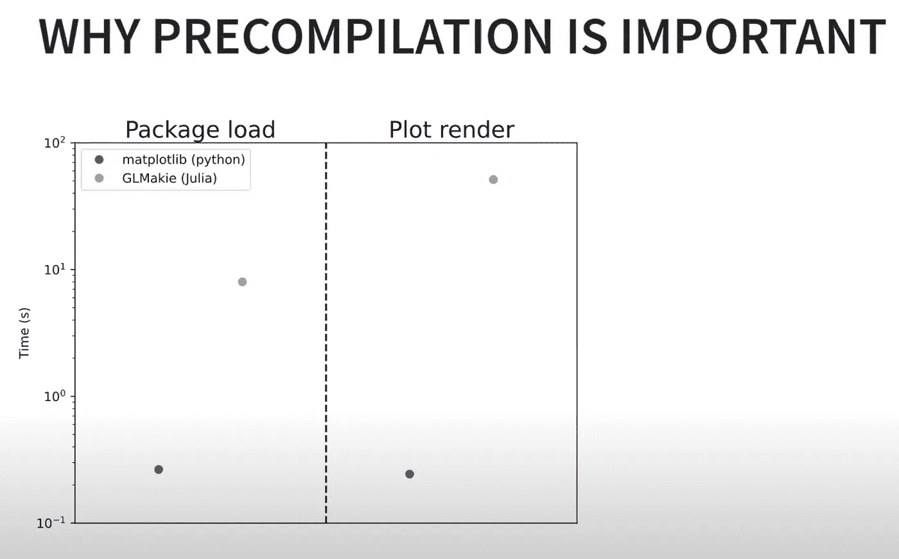

# 2022 年朱利安节上你可能错过的 5 个重要演讲

> 原文：<https://towardsdatascience.com/5-important-talks-you-might-have-missed-at-juliacon-2022-7d9601b5dfa5>

作者图片

7 月 30 日星期六，JuliaCon 2022 以一年一度的虚拟黑客马拉松结束。作为会议组织者之一，在 JuliaCon 期间的现场会议日通常是灭火和确保一切顺利进行。以至于我往往会错过很多精彩的演讲，不得不在会议结束后回去努力赶上进度。2022 年也不例外，所以这里有 5 个我错过的演讲，你可能也错过了！

# VS 代码中的 Julia 新功能🆕

VS Code 是 Julia 编程社区官方支持的 IDE。每年在 JuliaCon，从事 IDE 扩展的核心团队都会聚在一起，分享去年的成果。今年的演讲突出了

1.  新的探查器用户界面
2.  新表格查看器用户界面
3.  改进的绘图库
4.  云索引基础设施
5.  与 JuliaFormatter 整合。
6.  新的测试资源管理器 UI 集成。

还有更多！如果 VS 代码是你的 Julia 开发的日常驱动，你会想看看这个。

编辑:我和我的合著者很高兴地告诉大家，我们的新书《朱丽亚速成教程》已经开始预售了:

 [## 朱莉娅速成班(电子书预购)

### Julia 速成课程是使用 Julia 编程语言的实践指南，是为初学者编写的。我们接受…

logankilpatrick.gumroad.com](https://logankilpatrick.gumroad.com/l/juliacrashcourse) 

# 是什么让编程语言成功？(和杰瑞米·霍华德一起)🤔

2022 年 JuliaCon 的主题演讲人之一是 fast.ai 的联合创始人杰瑞米·霍华德。在这次演讲中，杰里米强调了编程语言生态系统需要做些什么才能取得长期成功。Jeremy 还提供了关于一些功能的具体反馈，这些功能将使他更有可能在日常生活中使用 Julia。其中一个让我印象深刻的想法是，Julia 需要能够支持可以在任何操作系统上运行的小的可执行文件。现在，有 PackageCompiler.jl，但它还没有达到通用阶段。

点击此处查看杰里米的完整演讲:

# 《朱丽亚的状态》( 2022 年)与杰夫·贝赞森🎤

一年一度的 JuliaCon 传统的一部分是让核心的 Julia 开发团队展示他们在过去一年中所做的工作，以及在不久的将来的期望。今年，杰夫·贝赞森(朱丽亚的联合创作者)发表了《朱丽亚的状态》。实际上，他在演讲接近一半时提到，Jeremy 的主题演讲非常及时，因为有许多正在进行的工作可以使使用 Julia 创建可执行文件的能力更简单，占用空间也更小。

Jeff 还讲述了其他重要话题，如:

*   编译器的主要更新
*   Julia 中的线程路线图
*   发布时间表概述

以及许多其他有趣的(和编译器相关的)主题。查看下面的完整对话:

# Makie.jl 的交互式数据可视化👀

Makie.jl 毫无疑问是生态系统中最受欢迎的 Julia 包之一，因为你可以使用它创建令人惊叹的交互式视觉效果。接下来的这个演讲实际上是一个两个半小时的研讨会，由西蒙·达尼什和朱利叶斯·克鲁格主持。他们以 Makie 生态系统的一些令人兴奋的更新开始，包括:

*   Makie 正在过渡到它自己的 GitHub 组织
*   Makie 正在向 NumFOCUS 申请成为官方项目
*   新的 Makie 网站！

Simon 还深入分析了 Makie 项目多年来的融资情况，这突出表明(至少对我来说)Makie 需要继续成熟，这样才能以更可持续的方式吸引资金。在那之后，Simon 和 Julius 给了 Makie 一个非常棒的介绍，以及如何做所有你想做的交互式可视化的事情。

你可以亲自去看看，也可以去参观一下即将成为 https://beautiful.makie.org 的[https://lazarusa.github.io/BeautifulMakie/](https://lazarusa.github.io/BeautifulMakie/):

# 包预编译的改进📈

没有一个 JuliaCon 会是成功的，没有一个亮点，尽管在 2021 年做了令人难以置信的工作，Julia 开发者仍然以某种方式找到了如何在 2022 年更快地在 Julia 中制作不同的东西。在今年的补充中，核心开发人员 Tim Holy 和 Valentin Churvay (JuliaCon 联合主席)首先对他们所做的工作进行了激励，为什么 Julia 现在这么快，以及哪里可以改进。

Tim 随后快速演示了 Julia 1.8 中的包预编译改进，并展示了它们如何在整个生态系统中显著减少预编译时间。对于 Julia 生态系统中的人来说，包预编译一直是一件痛苦的事情，所以这些进步是朝着正确方向迈出的一大步。

图片来自下面的链接视频

有趣的是,《时代》杂志显示，对于包加载，Python 仍然比 Julia 快一个数量级，而对于情节渲染，它快 2 个数量级。这是一件大事，也是人们一直说的让他们不愿意转投朱莉娅的原因。要了解蒂姆和瓦伦丁对这些问题的解决方案，请查看完整的谈话:

# 简而言之，朱利安 2022🐿

今年的 JuliaCon 是社区包的又一个惊人进步，有这么多精彩的演讲(如你所见，很难将这篇文章限制在 5 篇)。你可能也会对组委会今年发布的 JuliaCon 2022 亮点帖子感兴趣，该帖子分享了该活动的许多重要指标:[https://Julia lang . org/blog/2022/08/Julia con-highlights-2022/](https://julialang.org/blog/2022/08/juliacon-highlights-2022/)

你也可以在这里找到完整的 JuliaCon talk 播放列表(超过 290 个视频):[https://www.youtube.com/playlist?list = PLP 8 IP y9 HNA 6 trg 6 qjablj-frmi 9 CP 7 gsx](https://www.youtube.com/playlist?list=PLP8iPy9hna6TRg6qJaBLJ-FRMi9Cp7gSX)

最后一个小提示，如果你喜欢使用 Julia，并且想帮助宣传这种语言，可以看看我关于“如何成为一个有效的 Julia 宣传者”的演讲:

2023 年 JuliaCon 大会上见！