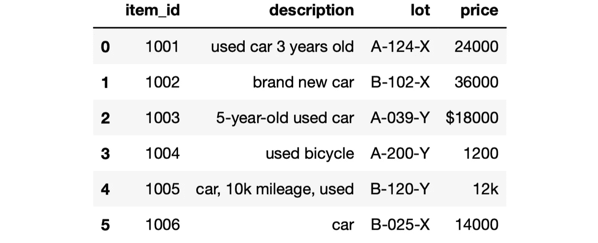
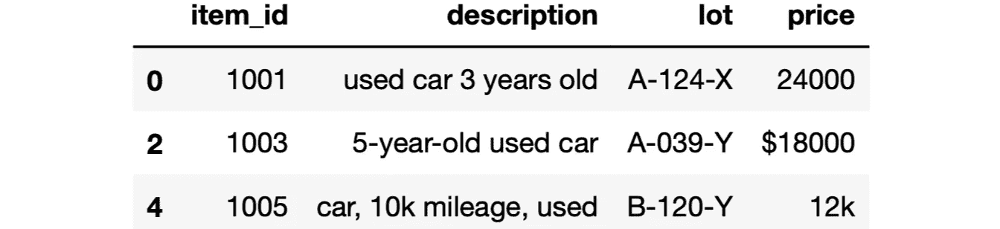
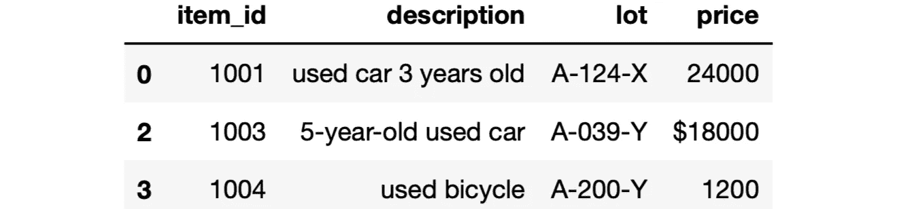
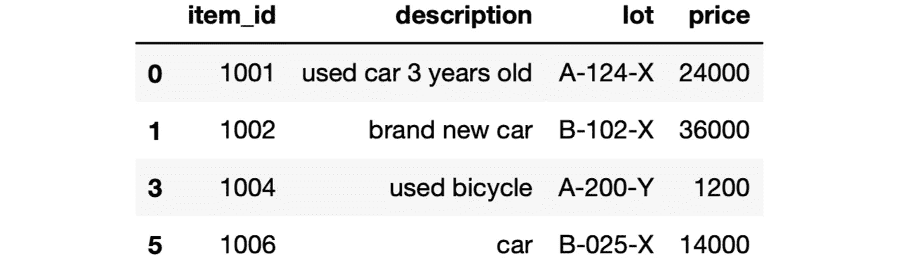

# Python 熊猫过滤字符串的 5 种方法

> 原文：<https://towardsdatascience.com/5-methods-for-filtering-strings-with-python-pandas-ebe4746dcc74>

## 举例说明


(照片由 [Neven Krcmarek](https://unsplash.com/@nevenkrcmarek?utm_source=unsplash&utm_medium=referral&utm_content=creditCopyText) 在 [Unsplash](https://unsplash.com/s/photos/hand-writing?utm_source=unsplash&utm_medium=referral&utm_content=creditCopyText) 上拍摄)

我们经常处理文本数据，这比数字数据需要更多的清理。为了从文本数据中提取有用的信息，我们通常需要执行几个预处理和过滤步骤。

Pandas 库有许多函数和方法，使得处理文本数据变得容易和简单。在本文中，我们将学习 5 种不同的方法，可用于过滤文本数据(即字符串):

1.  包含一系列字符
2.  字符串的长度
3.  以特定的字符序列开始或结束
4.  数字或字母数字字符
5.  特定字符序列出现的次数

让我们从从 csv 文件创建数据帧开始。

```
import pandas as pddf = pd.read_csv("example.csv")df
```



df(作者图片)

数据帧包含 6 行和 4 列。我们将使用不同的方法来过滤该数据帧中的行。这些方法可以通过 Pandas 的 str 访问器获得。

我们要做的第一个过滤操作是检查字符串是否包含特定的单词或字符序列。我们可以使用 contains 方法来完成这项任务。以下代码行查找描述字段包含“二手车”的行。

```
df[df["description"].str.contains("used car")]
```


(图片由作者提供)

二手车实际上有另一行，但描述中不包含“二手车”表达式。为了找到这个数据框架中的所有二手车，我们可以分别查找单词“used”和“car”。

```
df[df["description"].str.contains("used") &
   df["description"].str.contains("car")]
```



(图片由作者提供)

最后一行包含“汽车”和“二手”，但不在一起。

我们也可以根据字符串的长度进行过滤。假设我们只对长度超过 15 个字符的描述感兴趣。我们可以通过使用内置的 len 函数来执行此操作，如下所示:

```
df[df["description"].apply(lambda x: len(x) > 15)]
```

我们编写一个 lambda 表达式，其中包括用 len 函数检查长度，并将其应用于 description 列中的每一行。更实际、更有效的方法是通过 str 访问器使用 len 方法。

```
df[df["description"].str.len() > 15]
```

输出将是相同的:


(图片由作者提供)

我们可以分别使用 startswith 和 endswith 方法基于字符串的第一个或最后一个字母进行过滤。

```
df[df["lot"].str.startswith("A")]
```



(图片由作者提供)

这些方法也能够检查前 n 个字符。例如，我们可以选择批次值以“A-0”开头的行:

```
df[df["lot"].str.startswith("A-0")]
```


(图片由作者提供)

Python 有一些内置的字符串函数，可以用来过滤熊猫数据帧中的字符串值。例如，在 price 列中，有一些非数字字符，比如$和 k。

```
df[df["price"].apply(lambda x: x.isnumeric()==True)]
```



(图片由作者提供)

如果我们正在寻找字母数字字符(即只有字母和数字)，我们可以使用 isalphanum 函数。

count 方法计算单个字符或一系列字符出现的次数。在某些情况下，这对于过滤可能会很方便。例如，您可能正在查找不多次包含一个字符序列的字符串。

我们可以将描述栏中的“已用”一词统计如下:

```
df["description"].str.count("used")**# output**
0    1
1    0
2    1
3    1
4    1
5    0
Name: description, dtype: int64
```

如果您想使用它进行过滤，只需将它与如下值进行比较:

```
df[df["description"].str.count("used") < 1]
```

我们已经介绍了基于字符串值的熊猫数据帧的 5 种不同方式。我们倾向于更加重视数字数据，但是文本数据也同样重要，它承载了大量有价值的信息。因此，能够清理和预处理文本数据对于数据分析和建模至关重要。

*你可以成为* [*媒介会员*](https://sonery.medium.com/membership) *解锁我的全部写作权限，外加其余媒介。如果你已经是了，别忘了订阅*<https://sonery.medium.com/subscribe>**如果你想在我发表新文章时收到电子邮件。**

*感谢您的阅读。如果您有任何反馈，请告诉我。*