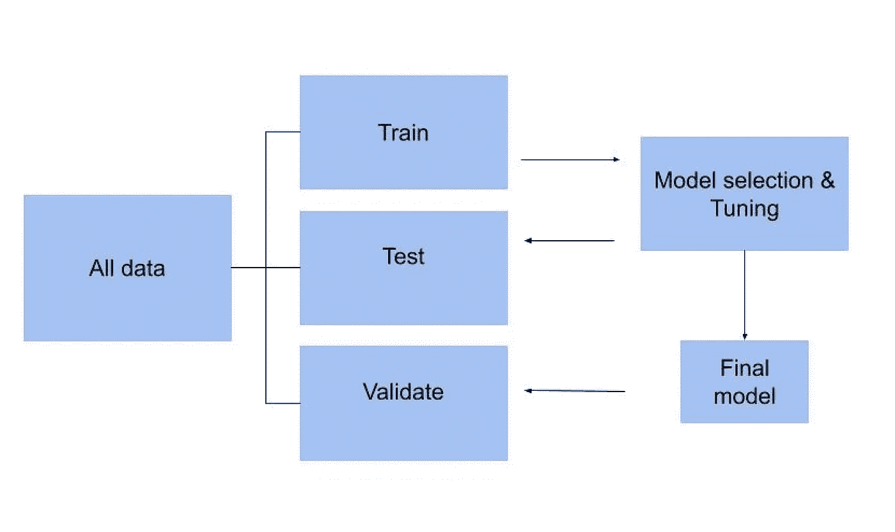
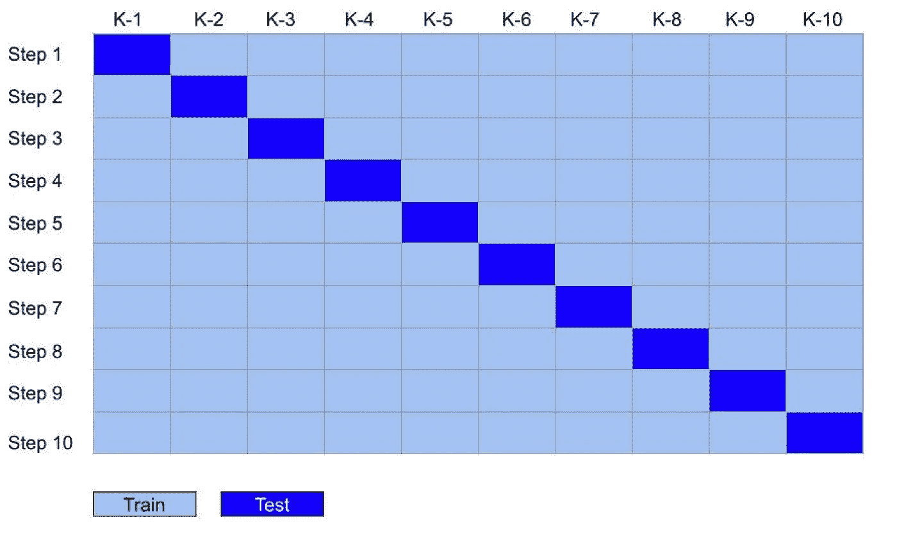
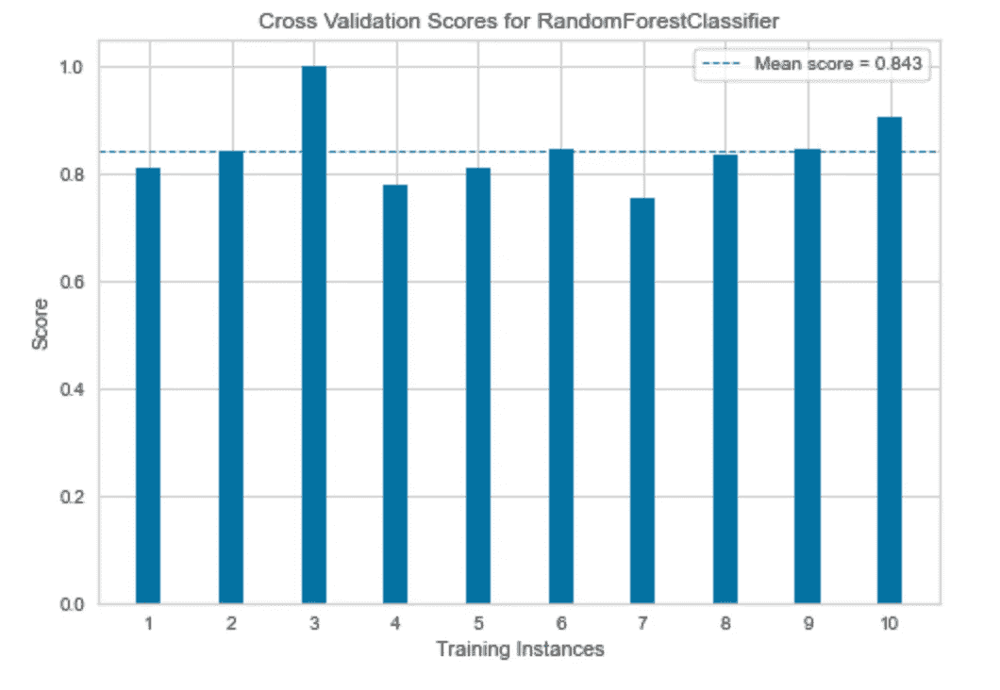
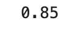

# 交叉验证的 5 分钟指南

> 原文：<https://towardsdatascience.com/5-minute-guide-to-cross-validation-be3c5b0ae693>

## 有哪些策略？你应该如何以及何时使用它们？

保留交叉验证。作者图片

机器学习模型的目标是从具体的例子中学习的一般模式。在现实生活中，所有数据都包含一定程度的随机变化和噪声。为了学习数据集中的一般潜在模式并对新数据进行良好预测，重要的是机器学习模型能够区分信号和噪声。

> 机器学习模型的目标是从**具体的**例子中学习**一般的**模式。

当机器学习模型学习了太多的噪声，并且无法对以前看不见的例子进行归纳和做出良好的预测时，这被称为过度拟合。如果出现过度拟合，则很有可能存在一个模型，该模型在训练时表现出高度的准确性，但在部署到现实世界中时表现很差。

检查并防止过度拟合是开发机器学习模型的关键步骤。发现过度拟合的一般技术称为交叉验证。交叉验证包括保留训练数据的样本，稍后您可以在这些样本上测试您的模型，以检查它是否能够很好地概括。

有几种技术可以执行交叉验证，在这篇文章的剩余部分，我将给出一个最常用方法的初学者指南。这将包括代码示例、每种技术的优缺点以及何时使用每种方法的正确时间的总结。

# 坚持方法

最简单的交叉验证技术被称为保留法。这种技术包括将数据分成三部分。训练集和测试集用于迭代地执行模型选择和超参数调整。例如，在训练样本上训练特定算法，然后用测试集评估性能。

一旦选择了最佳算法和参数，验证集将用作优化模型性能的最终评估。这里的假设是，如果模型在测试集上过度拟合，这将在最终验证集的较低分数中显示出来。

维持交叉验证。作者图片

下面的代码使用了 Scikit-learn `train_test_split`函数两次。首先将整个数据集分为训练集和测试集，然后再次将训练集分为训练集和验证集。

**优点**

保持交叉验证的计算开销很小，因此即使在非常大的数据集上也可以快速返回结果。

**缺点**

与接下来讨论的技术相比，它的鲁棒性要差得多。

拒绝验证尤其不适合非常小的数据集，因为一般来说，将数据集分成三部分会留下太少的样本来训练。

# k 倍

K-fold 交叉验证是一种更稳健的模型评估方法。利用这种技术，可用的训练数据被随机打乱并分成选定数量的样本(k)。k 的值可以是任何合理的数，通常选择 10。单个观测值只包含在一个折叠中，因此折叠之间没有重叠。

k-fold 算法迭代地使用每个折叠作为测试集，同时使用剩余的数据进行训练。然后评估每个 k 样本的模型性能。通常，在对所有折叠进行训练和评估后，计算模型得分的平均值。

k 倍交叉验证。作者图片

下面显示的代码使用 Scit-kit Learn `KFold`函数将训练数据分成 10 份。然后在每个折叠上迭代训练随机森林分类器，最后使用 Yellowbrick 库来显示模型分数的视觉摘要。

分数 K 倍交叉验证。作者图片

**优点**

比维持交叉验证健壮得多。

可用于小型数据集。

**缺点**

计算开销很大。

# 留一个出来

留一法是另一种交叉验证技术。该方法首先从单个观察值创建一个测试集，其余的观察值形成训练集。使用该训练集拟合模型，并在单次观察的基础上评估其性能。对整个数据集中的每个观测重复这个过程。类似于 k-fold，然后计算评估度量的平均值。

下面的代码使用 Scikit-Learn 的`LeaveOneOut`方法分割数据集，并 n 次拟合一个随机森林分类器。然后打印平均分数。

平均准确度分数。作者图片

**优点**

特别适合非常小的数据集。

**缺点**

计算开销很大。通常，这种技术不适合大型数据集。

在本文中，我讨论了最流行的交叉验证策略。这里描述的所有技术都用于评估模型的性能，特别强调检查过度拟合。

所涉及的方法各有利弊，这意味着它们更适合某些任务、数据集和问题陈述。前一段时间，我发现了一个关于栈交换的极好的总结，它给出了使用每种技术的正确情况的建议。我在下面总结了这一点，但这要归功于用户等密度振荡——本文底部的完整引用。

**保留交叉验证:**如果您的数据集大于 1，000，000 个示例，则应使用保留交叉验证，除非您拥有强大的计算能力，在这种情况下，可以使用 k = 5 的 k-fold。对于 20 到 100 个示例之间的较小数据集，可以使用较大的 k。

**K-fold 交叉验证:**如果您的数据集在 100 到 1，000，000 个示例之间，请使用 k = 5。如果计算能力有限，并且您的数据集为> 10，000 行，则应考虑保留交叉验证。

**留一交叉验证:**用于非常小的数据集，通常少于 20 个例子。

感谢阅读！

## 承认

*等密度振荡(https://stats . stack exchange . com/users/25029/Isopycnal-Oscillation)，保留验证与交叉验证，URL(版本:2021–09–07):*[*https://stats.stackexchange.com/q/307849*](https://stats.stackexchange.com/q/307849)