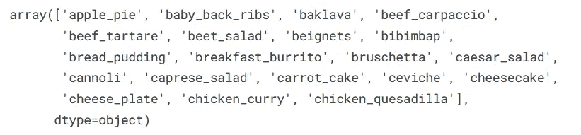
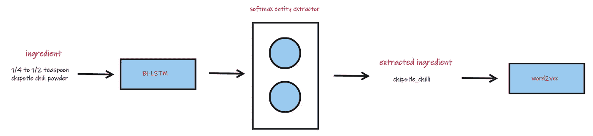
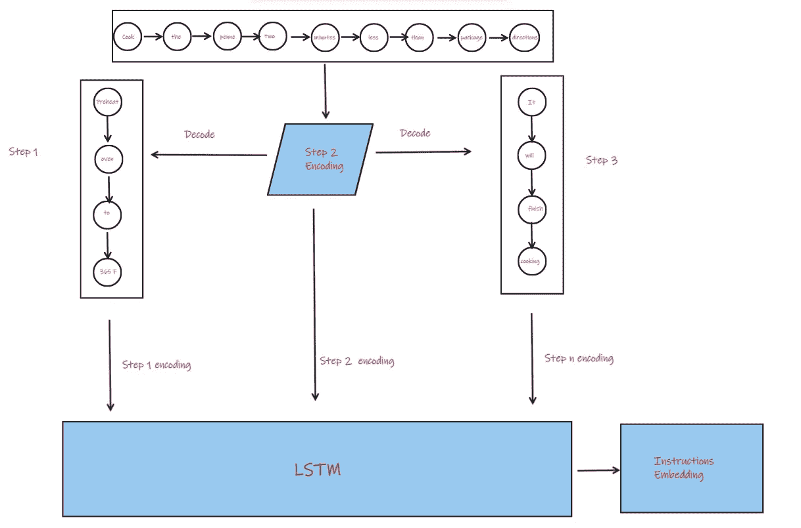
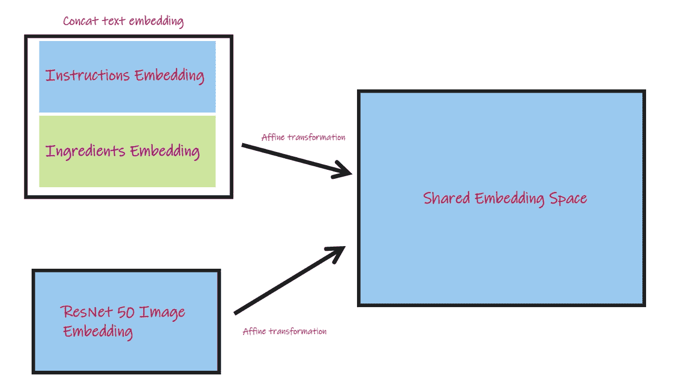
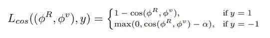
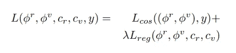
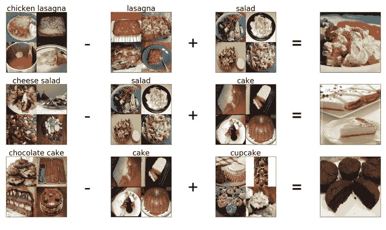
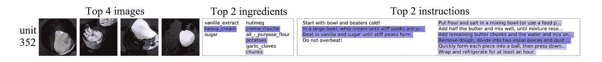

# 5 分钟书面解释:食品人工智能第一部分

> 原文：<https://towardsdatascience.com/5-minute-paper-explanations-food-ai-part-i-9276b61873c1>

## im2recipe 论文“学习烹饪食谱和食物图像的跨模态嵌入”的直观深入分析

乍得·蒙塔诺在 [Unsplash](https://unsplash.com?utm_source=medium&utm_medium=referral) 上的照片

# 问题简介

欢迎来到我的新系列论文讲解！你可能会问那里有什么不同？好吧，我不会涵盖流行或著名的论文，而是选择机器学习研究中的子(子)领域，并通过这些文章绘制他们的研究进展。

让我们开始吧——今天，我们将了解一下[的论文](https://arxiv.org/abs/1905.01273)(发表于 2018 年)，该论文介绍了用于食品中机器学习研究的庞大数据集，并介绍了 *im2recipe* 检索问题。

**问题陈述:**给定一幅食物的图像(想象一下你最喜欢的食物！)，检索制作该食物的食谱。为了能够做到这一点，使模型学习相应的图像和配方嵌入，将这些嵌入转换到共享的联合嵌入空间，并在给定图像的情况下最小化测量配方检索性能的损失。很简单，对吧？

对于不知道什么是跨通道的人来说:通道是我们输入模型的一种信息源。它可以是视频、图像、文本、音频等。在 *im2recipe* 中，我们有图像和文本。所以，我们用两种模态工作，从一种到另一种，因此是跨模态的。

# 领域背景和改进

以前有过将食物与人工智能或机器学习交叉的研究。大型数据集的一个突出例子是 Food-101 和介绍它的[论文](https://link.springer.com/chapter/10.1007/978-3-319-10599-4_29)。这是一个关于食物图像的分类问题。相比之下， *im2recipe* 论文介绍了一个**检索问题**和一个更丰富的数据集。

Food-101 数据集类的一些示例(图片由作者提供)

如果我们看到 Food-101 数据集中的类，它只包含关于食物名称的信息。在名为 *Recipe1M，*的 *im2recipe* 数据集中，我们不仅有更多的数据点，而且这些数据点包括食物图片、标题(名称)、制作说明和配料。

这种丰富数据的一个优势是，我们现在能够通过它的说明和成分对食谱的状态有一种逐步的信息。我们可以知道一种配料是生的、烤的、炸的等等。并且理论上能够用一个好的模型在这些阶段学习相应的不同图像。

# 资料组

庞大的 *Recipe1M* 数据集包含 100 万份食谱食材和说明，以及那些从烹饪网站上提取和下载的准备好的食谱的 80 万张相应图像，并组织成 JSON 格式文件。

在文本情态中，我们有一个标题、一份配料清单和一系列准备菜肴的说明。在第二种模式中，我们有 RGB/JPEG 格式的与配方相关联的任何图像。

配方的文本数据示例。id 映射到相应配方的图像(作者的图像)

作者对收集的数据集进行了一些分析:

1.  数据集中的平均食谱由九种成分组成，它们在十个指令的过程中被转化。
2.  配方图像对的精确副本已被删除
3.  16，000 种成分中的 4，000 种占数据中成分出现次数的 95%

# 体系结构

如前所述，有两种形式和四种类型的数据:标题、成分、说明和图像。我们以不同的方式嵌入它们。

如下所示，首先使用双向 LSTM 从数据的成分列表中提取成分，然后编码成 word2vec 表示。

学习成分嵌入(作者图片)

使用 word2vec 中使用的*跳过方法*对每个指令元素进行编码，其中每个指令以其之前和之后的指令为目标，并且编码被优化以改善这些相邻指令的预测。这里所做的修改是也引入了开始和结束指令标记。接下来，这些单独的指令编码通过 LSTM 来产生指令嵌入。

学习指导嵌入(作者图片)

接下来，这些指令和成分嵌入通过仿射变换(具有学习的权重和偏差的线性变换)连接和变换到共享嵌入空间。对于作为从预训练的 ResNet-50 / VGG-16 提取的特征的图像嵌入也是如此。

学习共享嵌入(作者图片)

**语义规则化**

除了上述主要架构之外，作者还通过使联合嵌入模型(具有共享权重)学习将任何食谱图像或文本信息分类到 Food-101 类之一来执行正则化。直观上，这确保了模型已经粗略地知道了一些嵌入聚类(就这些类而言),并且它不会试图为每个图像-配方对创建一个聚类，因此不会过度拟合。因为权重在两个模态之间共享，所以这也确保了所学习的图像-食谱对嵌入彼此对齐(我们不会得到同一道菜的图像和文本信息的单独聚类)。

然而，该论文的作者发现，Food-101 类只覆盖了 *Recipe1M* 数据集的 13%，因此，他们用来自 *Recipe1M* 训练集(清理后)的食谱标题中的 946 个最常见的二元模型来扩充它。通过这样做，他们实现了 50%的覆盖率

# 损失函数

余弦相似度与利润损失(图片来自论文，作者)

所使用的损失函数是具有边际损失的余弦相似性。训练是以成对的方式进行的，类似于如何训练三重损失函数——用正和负图像配方对。这种训练方法和上述损失函数确保了正对( *y=1* )的图像配方嵌入更靠近在一起(差值更接近于 0)，而负对被推得更远，其间有固定的余量 **α** 。

**增加语义正则化**

组合余弦和正则化损失(图片来自论文，作者)

通过添加正则化损失以获得组合，我们可以直观地看到学习过程将正对的图像配方嵌入集合在一起，将负对的图像配方嵌入推得更远，同时始终通过共享权重和分类保持图像配方对嵌入彼此对齐。具体地，如果 cᵣ和 cᵥ(分别用于图像和配方嵌入的分类预测)不同，则正则化损失将增加，否则将减少。

# 实验和结果

这是报告结果的方式:在从测试集中随机选择的 1000 个配方图像对的子集上。我们重复实验 10 次并记录平均结果。我们报告了所有检索实验的中值排序(MedR)和顶部 K 的召回率(R@K)。

如果我为每个图像检索 100 个食谱，那么中值等级就是每个实验中每对正确食谱出现的位置的中值。类似地，im2recipe 任务中的 R@5 表示在前 5 名中检索到相应配方的所有图像查询的百分比，因此越高越好。

基线结果是使用 CCA 的结果。顺便说一下，CCA 是一种很像 PCA 的技术，但是用于多组变量。典型相关分析确定了一组典型变量，即每组内变量的正交线性组合，它们最好地解释了组内和组间的可变性。详细的结果和消融研究可以在论文中看到，并且是不言自明的

我想在这里重点关注的是对嵌入的分析。作者使用向量算法提出，模型学习的嵌入具有语义意义。下面是一个例子。

word2vec 类型向量算法显示了学习嵌入的语义(图片来自论文，作者)

作者还使用给定神经元的顶部激活图像、成分列表和烹饪说明来提取和可视化局部单元激活，并专注于对这些单元的激活贡献最大的特定图像和文本区域。结果如下

学习特定的单元检测器。单元 352 学习检测图像和指令文本中的奶油，这也示出了模型跨模态对齐(图像来自论文，由作者)

这是我开始的一个新系列的一部分，关于直觉的论文解释。我将在行业中挑选一个子域，并浏览该域中的论文。如果你喜欢我写的东西，可以考虑订阅或者关注我[这里](https://www.medium.com/@kunjmehta10)或者在 [Linkedin](http://www.linkedin.com/in/kunjmehta) 或者 [Twitter](https://www.twitter.com/@kunjmehta10) 上与我联系！关于我之前文章的代码，请访问我的 [GitHub](https://github.com/kunjmehta/Medium-Article-Codes)