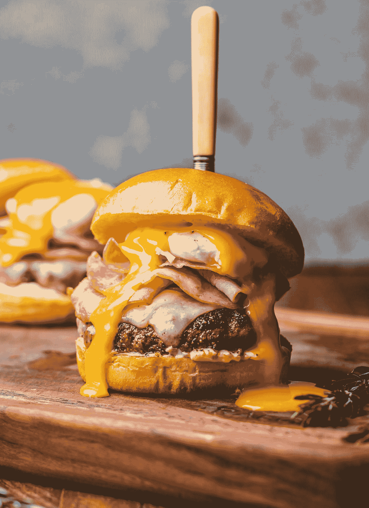
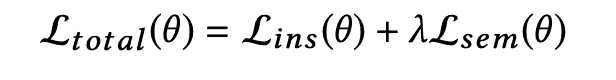
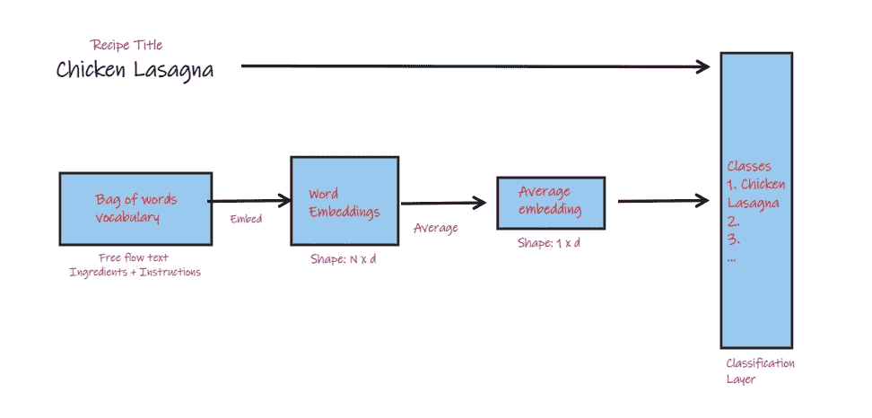
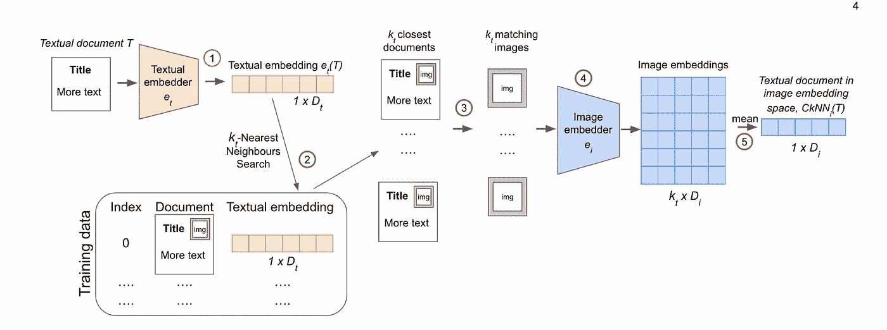
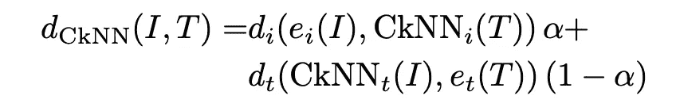
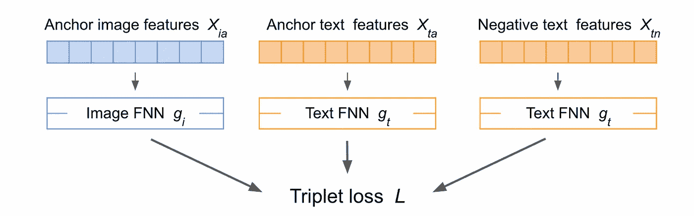

# 5 分钟的书面解释:食品人工智能第二部分

> 原文：<https://towardsdatascience.com/5-minute-paper-explanations-food-ai-part-ii-c085b2789bd1>

## im2recipe 相关论文“分而治之跨模态配方检索:从最近邻基线到 SoTA”的直观深入探讨

乍得·蒙塔诺在 [Unsplash](https://unsplash.com?utm_source=medium&utm_medium=referral) 上的照片

# 问题简介

欢迎来到人工智能食品系列论文的第二部分！[上周](/5-minute-paper-explanations-food-ai-part-i-9276b61873c1)，我写了一篇文章，解释了开创性的 im2recipe 论文，该论文将跨通道技术引入到处理与食品应用相关的机器学习中，例如使用照片搜索正确的食谱，自动确定一道菜的卡路里数，或者提高各种食谱推荐和排名系统的性能。我建议读者参考那篇文章，了解问题的介绍和动机，以及关于 Recipe1M 数据集和评估指标的详细信息。

正如上一篇文章中提到的，这些解释旨在绘制机器学习特定领域的研究进展。所以，今天，我们将关注 2019 年发表的题为“分而治之跨模态配方检索:从最近邻居基线到 SoTA”的论文[。本文进一步研究了此处](https://arxiv.org/abs/1911.12763)[引入的](http://pic2recipe.csail.mit.edu/im2recipe.pdf)和此处解释的[的 im2recipe 问题，通过**定义一个不同的和更好的基线来比较手头的检索任务**。该基线旨在取代原始文件中的共同国家评估基线。](/5-minute-paper-explanations-food-ai-part-i-9276b61873c1)

# 相关工作和改进

提高基线的原因是: **1)** “在 1000 个食谱的测试集上，召回@1 的 CCA 基线是 14.0。这一结果在两年内被超越，翻了两番，达到 51.8。”作者认为，这更多地与“错误指定的基线”有关，而不是检索方法的真正改进。 **2)** **在最初的 im2recipe 论文中，模型是端到端训练的**，因此很难理解模型的每个元素是如何单独执行的(这些元素是图像编码器、文本编码器等)。这可以通过建立一个概念简单且可解释的模型作为问题的基线来解决。

具体来说，模型中的检索功能是 kNN 算法的跨模式适应，称为 **CkNN** “应用于预先计算的图像-文本嵌入之上，其中图像和文本编码器**不是使用 CkNN 进行端到端训练，而是独立使用自我监督**这使得测试和分析它们在分离中的性能变得容易。

最后，作者扩展了这种方法，以获得关于该问题的一个新的最先进的性能。

论文引用的一些重要相关工作(除了 im2recipe 论文):

AdaMine Double Triplet Loss(图片由作者提供，来自论文)

1.  [AdaMine](https://arxiv.org/pdf/1804.11146.pdf) -对准模块采用“双三重损失”作为损失函数进行改进。简单地说，这是应用于两组三元组的三元组损失:一组表示单个图像对实例，并帮助模型学习将来自单个配方的不同模态的嵌入映射在一起，另一组表示图像对实例的类别，其通过类别信息帮助模型学习哪些配方彼此相似。后者类似于 im2recipe 论文中的语义正则化。
2.  R2GAN——使用 GANs 帮助学习更好的图像和文本嵌入
3.  ACME -这是 CkNN 论文发表时的最先进水平，并使用了“GANs +跨模态三重损失一起+使用对抗学习策略的模态对齐+跨模态翻译一致性损失”。不去探究它是如何工作的细节(那可能是另一篇文章)，但重点是 CkNN 可以实现对 ACME 真正有竞争力的结果，我们很快就会看到。

# 体系结构

## **编码器**

**文本编码器(平均单词嵌入):**平均单词嵌入是一种非常基本的文本编码方式。如下图所示。对于一个文档(可以是一个句子或一个段落或任何其他东西)，文档的嵌入是通过计算文档中单词嵌入的平均值来生成的。单词嵌入本身可以以多种方式生成。

在论文中，这样做的方式是:“说明和配料被视为文档，而类标签是配方标题中包含的最常见的单字和双字(类生成类似于 im2recipe)”。单词嵌入大小是 *d=300* ，并且当它被随机初始化时，训练使用 **softmax 激活，在文档中单词嵌入的平均值上具有二进制交叉熵损失**来学习单词嵌入。

文本形态的平均单词嵌入架构(图片由作者提供)

**图像编码器:**使用 ResNet-50 的分类层之前的最后一层来获得图像嵌入，再次使用二进制交叉熵对使用来自配方标题的相同技术生成的一组类别标签进行正则化。

这里注意，为文本编码器和图像编码器生成的标签集是不同的(准确地说，文本是 3453，图像是 5036)。这样做的原因是，由于编码器是独立训练的，我们不局限于只使用图像-文本对作为数据，而是我们可以使用只包括文本或只包括图像的食谱数据。因此，对于文本和图像，我们有不同数量的数据点和不同的类。

## 交叉模态神经网络

CkNN 和 kNN 一样，是一个非参数模型。它充当图像-文本嵌入对准模块，并且如同该提议的系统中的其他组件一样，它被独立地应用。首先，编码器被训练以获得图像和文本嵌入，然后 CkNN 被应用于它们之上。这不同于 im2recipe 论文，在 im2 recipe 论文中，系统被端到端地训练，并且我们进行了转换以将嵌入带到共享空间。

CkNN(图片由作者提供，来自论文)

CkNN 有两个部分:一个在文本嵌入空间工作，另一个在图像嵌入空间工作。让我们看看它在文本嵌入空间是如何工作的(按照图像中的数字):[1]

1.  使用文本编码器 *e(T)* 对一个**候选文本文档**(即食谱说明和配料) *T* 进行编码
2.  使用文本嵌入空间中的余弦相似性，基于**文本嵌入**找到 *k* ₜ最近邻居，由 *Rₜ* 表示。
3.  利用 Recipe1M 数据集提取与 *Rₜ* 相关联的**组图像** *Iₜ*
4.  使用图像编码器 *e(I)对**图像嵌入空间**中的每个 *I ∈ Iₜ* 进行编码。*
5.  返回获得的**图像嵌入**的平均值作为结果

图像嵌入空间的相应算法是:

1.  使用图像编码器 *e(I)* 对**候选图像 *I*** 进行编码
2.  使用图像嵌入空间中的余弦相似性，基于**图像嵌入**找到 *k* ᵢ最近邻，用 *R* ᵢ表示。
3.  利用 Recipe1M 数据集提取与 *Rᵢ* 关联的**文本集** *Tᵢ*
4.  使用文本编码器 *e(T)对**文本嵌入空间**中的每个 *T∈ Tᵢ* 进行编码。*
5.  返回获得的**文本嵌入**的平均值作为结果

让我们把图像空间中的组件称为 *Mᵢ* ，把文本空间中的组件称为 *Mₜ.*

# 损失函数

CkNN 损失函数(图片由作者提供，来自论文)

损失函数基本上是在 1)图像嵌入空间和 2)文本嵌入空间中获得的图像和文本嵌入之间的距离的线性组合。轻松点。

# 实验和结果

我不把重点放在论文表格中可以看到的确切结果上，而是把重点放在他们的分析上。简而言之，对于新的基线 CkNN 和用于比较的其他方法，结果显示了以与原始 im2recipe 论文中相同的方式(加上也具有 10，000 的样本大小)测量的检索性能。

为了证明单独训练编码器然后将 CkNN 应用于它与在 ACME(当时的最先进技术)中端到端训练系统一样有效，使用来自相关作品的预训练图像和文本编码器的不同组合来生成嵌入，然后在其上使用 CkNN 来测量检索性能。结果表明，端到端召回率@1 为 20.6，而 CkNN 为 17.9，具有竞争力。该分析还表明，编码器的质量，而不是跨模态对齐，是改善先前研究结果背后的主要驱动力。

**扩展到 SoTA**

最后，受上述与 ACME 的竞争结果的鼓舞，作者在 CkNN 之上添加了他们自己的对齐模块，使用三元组损失来创建图像和文本的联合嵌入空间。

“具有一个隐藏层、丢失和批量标准化的两个前馈神经网络用带余量的三重丢失来训练:一个用于图像( *gᵢ* )特征，另一个用于文本( *gₜ* )特征。”

校准模块(作者图片，来自论文)

# 个人想法

看了这篇论文让我觉得深度学习并不是唯一可走的路。当然，这里使用的图像编码器很深奥，但是 ResNet 已经统治这个领域有一段时间了。实际发生的比对是一个简单的 kNN。添加一个 MLP，让你得到一个国家的最先进的性能！这是一篇聪明的论文，它采用了 im2recipe 论文中引入的跨通道概念，而不是改善结果(正如大多数论文一样)，而是从另一方面提出了问题:如果基线太低怎么办？这给了你一个理智的检查。

总之，本文重新定义了 im2recipe 任务的基线。新基线是使用非常简单的架构创建的，该架构不是端到端训练的，这简化了模型探索和模型比较。在下一篇文章中，我们将看看如何在另一篇论文中使用这个新的基线来再次提高 SoTA 性能。敬请期待！

这是我开始的一个新系列的第二部分，关于直觉的论文解释。我正在挑选行业中的一个子域，并浏览该域中的论文。如果你喜欢我写的东西，可以考虑订阅或者关注我[这里](https://www.medium.com/@kunjmehta10)或者在 [Linkedin](http://www.linkedin.com/in/kunjmehta) 或者 [Twitter](https://www.twitter.com/@kunjmehta10) 上与我联系！关于我之前文章的代码，请访问我的 [GitHub](https://github.com/kunjmehta/Medium-Article-Codes)

**论文引用**

[1] Mikhail Fain、Andrey Ponikar、Ryan Fox 和 Danushka Bollegala，“划分和征服跨模态配方检索:从最近邻居基线到 SoTA”。2019 年更正