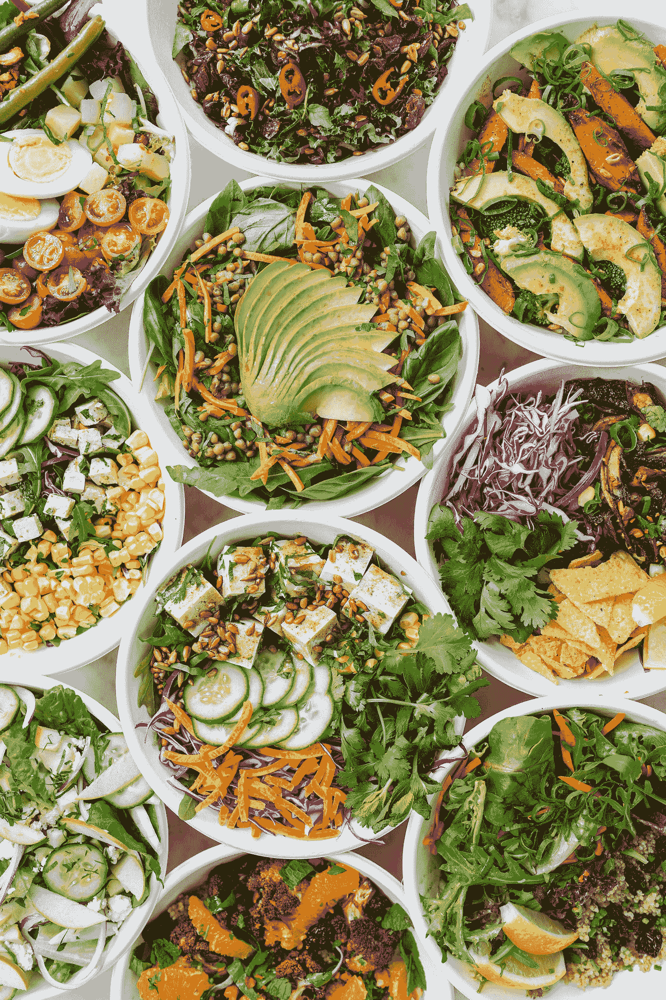
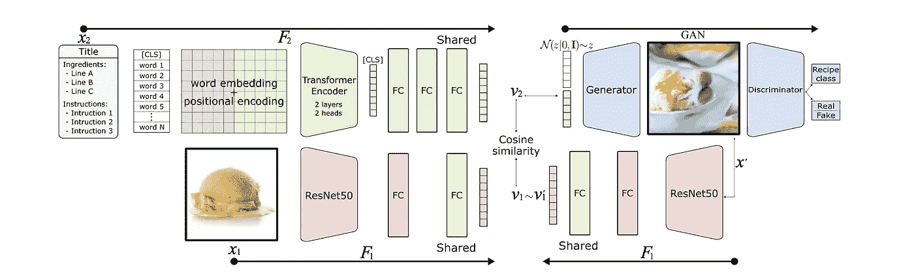
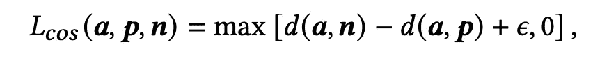
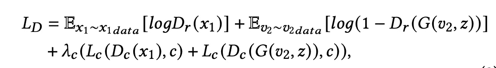
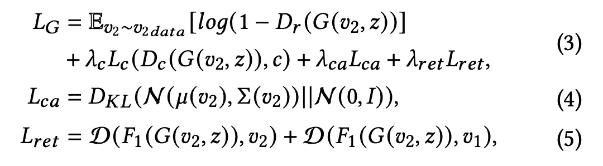
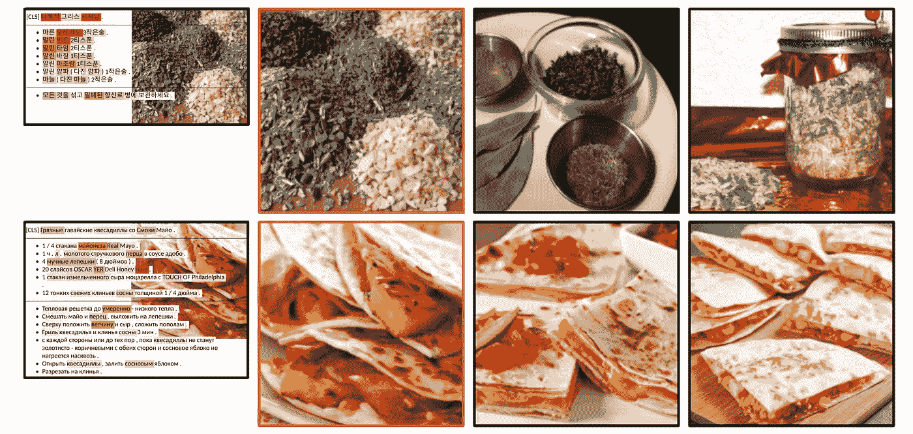
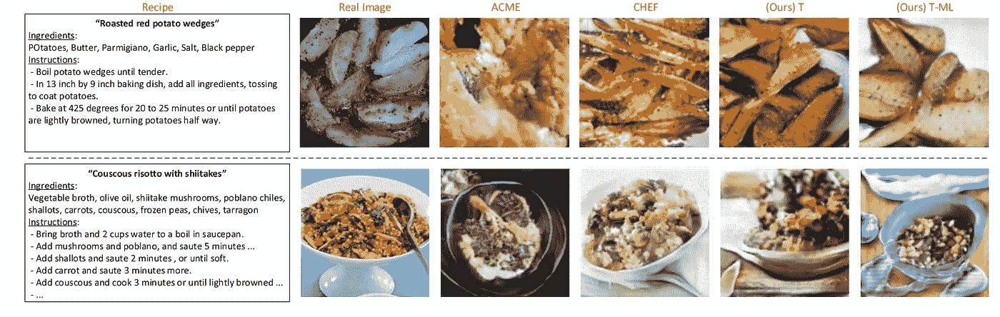
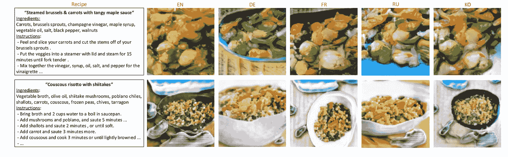

# 5 分钟的书面解释:食品人工智能第三部分

> 原文：<https://towardsdatascience.com/5-minute-paper-explanations-food-ai-part-iii-bd7256473c4d>

## im2recipe 相关论文“跨通道检索和合成(X-MRS):缩小共享表征学习中的通道差距”的直观深度探讨

在 [Unsplash](https://unsplash.com?utm_source=medium&utm_medium=referral) 上由 [Luisa Brimble](https://unsplash.com/@luisabrimble?utm_source=medium&utm_medium=referral) 拍摄的照片

# 问题简介

欢迎来到人工智能食品系列论文的第三部分！

[第一部分](/5-minute-paper-explanations-food-ai-part-i-9276b61873c1):“学习烹饪食谱和食物图像的跨模态嵌入”

[第二部分](/5-minute-paper-explanations-food-ai-part-ii-c085b2789bd1):“分而治之的跨模态配方检索:从最近邻基线到 SoTA”

正如在以前的文章中提到的，这些解释旨在绘制机器学习的特定领域的研究进展。因此，今天，我们将关注 2020 年发表的题为“跨模态检索和合成(X-MRS):弥合共享表征学习中的模态差距”的[论文](https://arxiv.org/abs/2012.01345)。本文通过使用基于文本编码器**的**而不是原文中的 LSTM，以及本文[中的平均单词嵌入](https://arxiv.org/abs/1911.12763)(在[第二部分](/5-minute-paper-explanations-food-ai-part-ii-c085b2789bd1)中解释)，对本文[中介绍的](http://pic2recipe.csail.mit.edu/im2recipe.pdf)和本系列第一部分中解释的[中的 im2recipe 问题进行了进一步研究。此外，X-MRS 的作者使用**多语言翻译来规范模型**，同时添加多语言功能，并通过生成食物图像的生成模型来显示学习嵌入的**力量。**](/5-minute-paper-explanations-food-ai-part-i-9276b61873c1)

# 相关工作和改进

正如我们在本系列的前几部分中所看到的，以前在跨模态菜谱任务上的工作要么是端到端训练的模型，要么是预训练的编码器，这些编码器根据菜谱数据进行微调，在这些数据之上应用了跨模态对齐模块。在后一种情况下，也有对每个文本组件进行编码的方法(即标题、成分和说明)，然后连接各个嵌入物。

以前的工作还使用了一个正则化模块，主要使用一些外部数据来建立对学习到的表示的分类或聚类任务。其他一些我们没有看到的论文使用 GANs 来正则化模型。你可能会问，这是如何实现的？嗯，基于 GAN 的性能，即它生成真实食物图像的能力，正在学习的表示将被修改。在这里，gan 有效地充当解码器(从嵌入到实际图像)，并且“在高维空间中学习解码器是一项复杂的任务，这可能导致次优表示。”

作者与前述作者的方法不同之处在于:1)他们没有独立地处理和编码文本数据的不同部分；2)他们的模型是端到端训练的，不是预训练的；3)他们不使用 GANs 或设置分类任务来正则化所学习的表征。相反，他们使用多语言编码和反向翻译。

这为关注将 im2recipe 应用程序应用于世界各地不同语言的真实用例提供了机会。回译是一个概念，例如，将一个句子从英语翻译成法语，然后再翻译回英语。然后，实际上是彼此释义的原始英语句子和“回译”英语句子可以被比较并用于调整

旁白:目前世界上许多著名的超大型生成式图像模型都是文本诱导的条件图像合成模型。这意味着这些模型被训练成基于给它们的一些文本描述的编码来生成图像。这些当前的模型可以接受描述图像和合成图像的长描述，但是 X-MRS 论文的作者参考了论文，并且参考了这种类型的模型的文本描述必须很短才能使它们工作的时代。此外，没有一个文本描述像配方成分和说明那样，具有随时间而被修改的固有顺序。这是作者在从学习到的嵌入构建他们自己的图像合成模型时所做的改进。

# 体系结构

模型架构(作者图片，来自论文)

## 编码器

为了对图像进行编码，使用 ResNet-50。“ResNet-50 的最后一个全连接层由 2，1024 维全连接层代替，最后一个层与文本编码器共享”。

每个组件的文本数据不会单独处理。相反，标题、说明和成分被视为一个长文本描述，使用[单词块](https://huggingface.co/docs/transformers/tokenizer_summary#wordpiece)标记器进行标记，嵌入到 768 的维度大小中，并通过 2 层 2 头变压器编码器(重点:只是变压器的编码器)。注意，这里记号赋予器的输出还包括一个[【CLS】(分类)记号](https://stackoverflow.com/questions/62705268/why-bert-transformer-uses-cls-token-for-classification-instead-of-average-over)，它们都被修剪成只有 512 个记号来控制模型的内存占用。

那些使用过变形金刚的人会知道,[CLS]记号可以被认为是一个集合序列表示，这也是作者们所做的。[CLS]令牌的输出“在最终的 1024 维 FC 层将文本编码投影到共享表示空间之前，通过两个 1024 维 FC 层”。

## GAN 合成模块

使用 GAN 背后的逻辑是双重的:1)如果学习的表示足够好，则 GAN 应该能够生成图像，除了图像是真实的之外，该图像实际上显示图像中的配方成分；2)只要在独立应用程序中使用经过训练的 GAN，如果提供了配料和说明，即使训练数据中没有，我们也能够生成给定配方的真实图像。

GAN 模块基于 StackGAN，其中“中间分辨率图像被丢弃”。GAN 的鉴别器也有一个 recipe 分类器，类似于第 1 部分中看到的利用从 Recipe1M 和其他数据集构造的类信息的分类器。接下来，如前所述，GAN 必须以文本为条件来生成图像。因此，在该模块中，配方编码通过“条件增强子网络”传递以创建条件代码，该条件代码被传递给解码器(与噪声一起)以生成图像。然后，鉴别器试图区分真假，并将图像归入正确的食谱类别。

# 损失函数

注意:为了更好地理解下面的内容，添加了一些符号。有关所有符号，请参考纸张。

## 编码器

编码损失函数(图片由作者提供，来自论文)

为了学习表示，编码器使用简单的具有余量损失的三元组，其中使用余弦相似性函数计算锚、阳性和阴性之间的相似性。该锚可以是图像或文本编码，正面将是来自相同配方的相应文本或图像编码，而反面将是来自不同配方的图像或文本编码。

锚、阳性和阴性遵循的采样策略是硬阴性挖掘。在这种情况下，被选择的否定是不同的类别，但是它与所有其他否定中的锚具有最高的相似性。

## 开始

鉴别器训练损失(图片由作者提供，来自论文)

如前所述，鉴别器试图区分真假，并将图像分类到正确的食谱类别中。将对应于这两个任务的损耗相加，得到最终的鉴频器损耗。损失是简单的交叉熵损失。

***x* ₁** 是实际的图像编码， ***G(v₂，z)*** 是生成的图像其中 ***z*** 是高斯噪声。***【e(x₁~ x₁data】***表示数据来自图像编码器。***【e(v₂~ v₂data)***表示数据来自文本编码器，然后传递给生成器。 ***Dᵣ*** 和 ***D𝒸*** 是鉴别器内部的子网络，分别代表对真假和配方类别进行分类的网络。

发电机培训损失(图片由作者提供，来自论文)

发电机损耗基本上等于 1 减去鉴别器损耗加上来自条件扩充(CA)子网络的正则项和监控项 ***ret。*后半部分非常简单明了。**

# 实验和结果

实验在 Recipe1M 数据集上进行。“R1M 英语(EN)食谱通过反向翻译从德语(EN- DE-EN)和俄语(EN-RU-EN)扩充而来。使用来自 [fairseq](https://fairseq.readthedocs.io/en/latest/) 神经翻译工具箱的预训练模型获得德语、俄语和法语之间的翻译。

检索结果使用与第二部分相同的指标进行报告。对于 GAN 合成模型，除了报告对合成食品图像的检索性能外，还计算了 Fretchet 初始距离(FID)分数，该分数用于测量真实和合成图像分布之间的相似性 FID 值越低表示性能越好。

在训练和评估期间，作者进行的一些增强是:

**图像增强:** 1)具有一个以上样品配方的随机输入图像。2)随机选择，填充(在零、边缘复制或图像反射之间随机选择)为正方形，并调整大小为 256，或调整大小为 256。3)随机旋转 10♀4)随机裁剪到 224。5)随机水平翻转。

**配方扩充:** 1)在原始 en 表示和 EN-DE-EN 或 EN-RU-EN 中的反向翻译之间随机选择。2)在先前的 en 选项和 KO、DE、RU 或 FR 之间随机选择。

一如既往，准确的结果可以从论文中引用。在这里，我们重点分析结果。一个非常重要的结果是，带有基于 transformer 的文本编码器的 X-MRS 模型无法超越我们在本系列第二部分中走过的基线。

受关注的图像到配方定性前 3 名检索结果。最左边的图像是带有相应配方的查询图像。在这两种语言中，我们可以看到文本注意力图集中在最能描述图像的事物上。(图片由作者提供，来自论文)

作者还进行了消融研究，使用不同的文本数据成分测试检索性能。据观察，使用所有的信息导致最佳性能(咄！)，其次是说明+成分。这使得标题信息最少。还是那句话，不奇怪！很早的食物分类研究就已经开始仅仅使用标题，并没有取得很大进展。**这里一个有趣的事情是使用数据集中的完整成分文本，而不仅仅是提取的成分名称会导致更好的检索性能。**

还显示了不同语言的检索结果。这里应该注意的是，该论文的总体性能最好的检索模型也优于 CkNN 基线，它是在多语言数据上训练的，并使用英语进行检索。而且论文中也没有提到，到底是如何进行多语种培训的。

对于合成模块，测试生成图像的真实性和给定合成图像的配方的检索性能。据观察，有一些模型在生成更真实的食物图像方面做得更好，但是在多语言数据上训练的所提出的模型在检索方面最好。另外，使用合成图像的检索比使用真实图像的检索更好。

图像合成的例子。(图片由作者提供，来自论文)

因为生成器被训练为基于完整的食谱嵌入来生成食物图像，这意味着它也具有相应的文本信息，所以它比使用原始图像(不包含文本信息)时更容易具有更高的召回率。因此，为了测试图像-文本学习表示的纯度，作者进行了一项实验，他们训练生成器根据图像嵌入(而不是文本嵌入)来生成图像。他们发现生成图像的真实性没有下降，但检索性能却下降了。这是有意义的，因为现在生成的图像不包含文本信息，这表明文本和图像嵌入是独立的，但是在共享空间中足够接近，不会影响生成的图像的真实性。

使用不同语言的文本数据进行图像合成(图片由作者提供，来自论文)

# 个人想法

没有多语言培训的 X-MRS 模型无法超越第二部分中的 CkNN 基线，这一事实继续显示了强大的理论上合理的管道的力量，无论它使用传统方法还是现代“酷”的深层网络。也就是说，转换器的使用已经在管道中适当地完成了，在多语言数据和反向翻译的帮助下增加和规范化的想法是一个很酷的想法，也是可行的。

这是一篇更多依赖实验分析而不是理论直觉的论文。对生成的食谱图像的分析为如何分析学习到的嵌入提供了不同的视角，它甚至表明，如果学习得当，图像编码和文本编码可以互换，就像它应该的那样。

这是我开始的一个新系列的第三部分，关于直觉的论文解释。我正在挑选行业中的一个子域，并浏览该域中的论文。如果你喜欢我写的东西，可以考虑订阅或者关注我[这里](https://www.medium.com/@kunjmehta10)或者在 [Linkedin](http://www.linkedin.com/in/kunjmehta) 或者 [Twitter](https://www.twitter.com/@kunjmehta10) 上与我联系！关于我以前文章的代码，请访问我的 [GitHub](https://github.com/kunjmehta/Medium-Article-Codes)

**论文引用**

[1] Ricardo Guerrero，Hai Xuan Pham 和 Vladimir Pavlovic，“跨模态检索和合成{(X-MRS ):在共享子空间中关闭模态
间隙”。2020 年更正