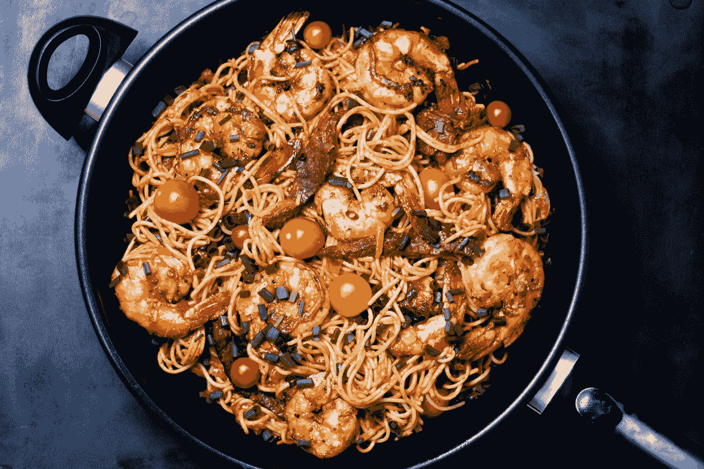
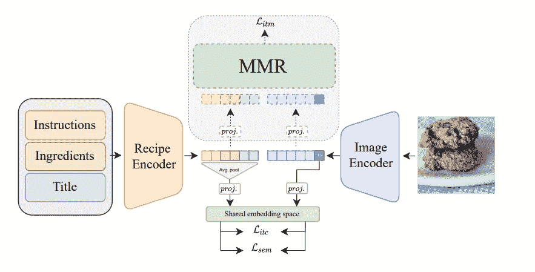
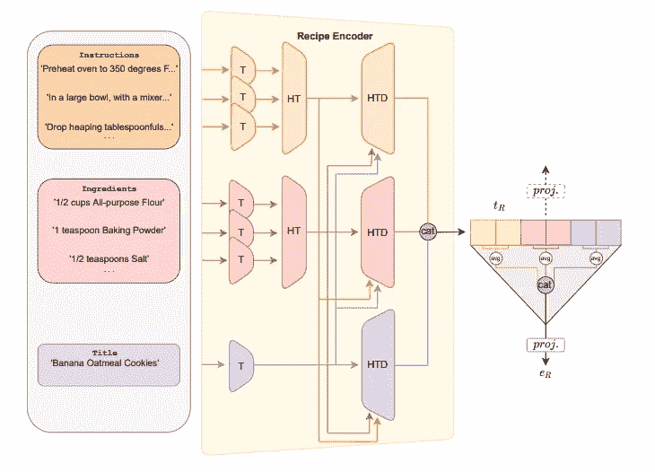
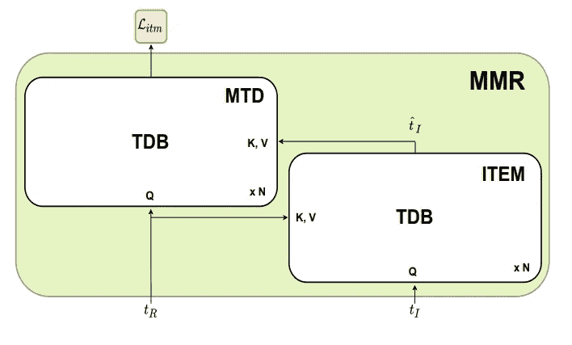
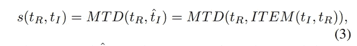
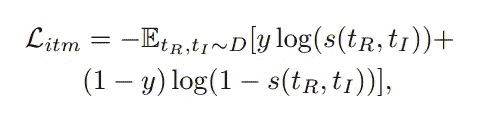
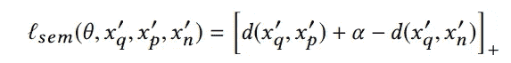
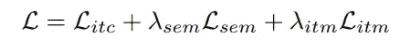

# 5 分钟的书面解释:食品人工智能第四部分

> 原文：<https://towardsdatascience.com/5-minute-paper-explanations-food-ai-part-iv-902e5131fd8d>

## im2recipe 相关论文“用于跨模式食品检索的多模式正则化变压器解码器”的直观深入探讨

奥拉因卡·巴巴罗拉在 [Unsplash](https://unsplash.com?utm_source=medium&utm_medium=referral) 上的照片

# 问题简介

欢迎来到食品人工智能系列论文的第四部分，也是最后一部分！

[第一部分](/5-minute-paper-explanations-food-ai-part-i-9276b61873c1):“学习烹饪食谱和食物图像的跨模态嵌入”

[第二部分](/5-minute-paper-explanations-food-ai-part-ii-c085b2789bd1):“分而治之的跨模态配方检索:从最近邻基线到 SoTA”

[第三部分](https://medium.com/towards-data-science/5-minute-paper-explanations-food-ai-part-iii-bd7256473c4d):“跨通道检索和合成(X-MRS):缩小共享表征学习中的通道差距”

正如在以前的文章中提到的，这些解释旨在绘制机器学习的特定领域的研究进展。因此，今天，我们将关注 2022 年发表的名为“用于跨模态食品检索的多模态正则化变压器解码器”的论文[。本文进一步研究了此处](https://arxiv.org/abs/2204.09730)[介绍的](http://pic2recipe.csail.mit.edu/im2recipe.pdf)和本系列第一部分解释的[中的 im2recipe 问题，主要是 1) **使用跨模态普通变压器和注意力**，即注意力集中在*图像和文本编码*上，而不是像第三部分那样只关注*文本*；2)使用非常强大的**视觉和语言预训练(VLP)模型剪辑**；3) **使用模拟课程训练的动态三重损失**；4) **使用多模态正则化技术**，而不是通过第一部分中的分类任务和第三部分中的生成来正则化。](/5-minute-paper-explanations-food-ai-part-i-9276b61873c1)

这里有一个题外话:VLP 的目标是从一个庞大的图像-文本对数据集学习多模态表示。在对 Recipe1M 数据集进行微调后，这个预训练的模型可以用于下游视觉语言任务，如本例。VLP 模型采用 CNN-Transformer 架构，用 CNN 嵌入图像，然后用 Transformer 对齐图像和文本。此处对 VLP 车型进行了很好的概述

# 相关工作和改进

**一:**在以前的论文中，我们看到文本编码可以为每个组件(成分、说明、标题)单独编码，也可以一起编码。本文所做的改进是对文本编码进行独立和共同的编码。作者首先使用分层转换器模块对组件进行单独编码，并使用这些输出来获得最终的文本编码。

**第二:**图像编码器不再仅仅是一个卷积神经网络，而是一个经过 VLP 任务预训练的视觉转换器。这确保了在学习图像编码的同时充分利用 transformer 的能力，而不仅仅是像以前那样学习文本编码。

**三:**以前，我们有一个单独的正则化模块，要么通过分类(合并 Food-101 或其他分类数据集信息)，要么通过图像生成(使生成的图像分布与实际图像分布相似)。这里，我们又有一个正则化子，但这个更复杂。它使用普通的变形器和图像和文本编码之间的交叉注意，使它们尽可能地相似，用于相同的食谱。更重要的是，这个模块只在训练时使用，在测试和推理时移除。

**四:**引入动态三重损失，其作用类似于课程训练

# 建筑:食物

整体架构(来自论文，作者)

整体架构可以在上面看到，与我们到目前为止看到的所有其他架构非常相似。我们有一个图像和一个图像编码器，相应的文本和文本编码器。然后，编码被投影到共享空间。应用一些损失，同时这些编码也被传递到“MMR”模块。该模块既作为对齐模块又作为正则化模块，从而分别通过分类来补充三元组丢失和替换 GANs /语义正则化。

**图像编码器:**如前所述，图像编码器是一个视觉转换器(特别是微调剪辑 ViT B/16)，确保我们也能获得图像编码转换器的好处。和以前一样，对于变形金刚，我们使用[CLS]令牌的输出作为图像的编码。

详细的文本编码器(来自论文，作者)

**文本编码器:**文本编码器是分层的。和第二部分一样，我们有单独的变形金刚 ***T*** 编码标题、指令和成分。在这里，说明书和配料一次编码一种配料或说明书。接下来，我们有单独的变压器 ***HT*** 对指令序列和成分编码进行编码。现在，显然单独编码每个组件会导致模型不知道它们是如何相互关联的。所以，作者使用变压器解码器 ***、HTD*** 来实现这一点。

这些解码器的工作方式是针对每个解码器，查询 Q 是相应 ***HT*** 的输出，而密钥 K 和值 V 是另外两个 ***HT 的输出的串联。*** 例如，对于成分解码器来说，查询是成分，而键和值是标题和指令的串联。这意味着我们交叉关注标题和说明上的成分。这基本上实现了不同数据格式如何编码的完全独立性，同时还能够学习它们之间的关系。

注意，对于文本，我们处理转换器的整个输出，而不仅仅是[CLS]令牌。通过对*HTD 的所有输出令牌的值进行平均，将所有*的平均输出连接起来，并投影到共享空间，从而获得最终的配方编码。**

****

**多模态正则化+对齐模块(来自论文，作者)**

****多模态正则化:**请注意，该模块仅在训练期间使用，它取代了之前为对齐文本和图像编码而进行的在共享空间上的简单投影以及随后的对比(三元组)损失。相反，我们有一个使用交叉注意的变换器解码器，其中查询 Q 来自一个模态，而键和值 K、V(它们是相同的)来自另一个模态。**

**在本模块中，我们有两个子模块。图像标记增强模块(ITEM)是一个“将图像标记作为查询，将文本标记作为键和值的转换器解码器”。这“通过关注文本元素来丰富图像表征”。多模态转换器解码器(MTD)是实际上对配方令牌和增强图像令牌应用交叉关注的子模块。测量图像和文本标记之间对齐程度的匹配分数如下图所示获得。匹配分数不是以前论文中的余弦相似度，而是解码器直接输出的[0，1]范围内的分数。**

****

**MTD 匹配分数方程(图片由作者提供，来自论文)**

**因此，总的来说，我们有一个用于编码图像的 VLP 预训练视觉转换器，一个用于编码文本的分层转换器模块(首先用于单个组件，然后通过这些组件之间的交叉注意)。然后，图像和文本编码都被投影到一个共享空间，其中:1)图像编码通过处理文本元素的编码增强器项传递；2)增强的图像编码和文本编码通过用于计算匹配或对准分数的多模态变换器解码器。**

# **损失函数**

****图像-文本匹配损失:** ITM 是 BCE 损失，它跟踪图像-文本对是否匹配。计算这一损失所遵循的取样过程是硬负采矿法。我们在下面看到，这个等式与实际的 BCE 损失函数非常相似。 *y* 对于匹配的图文对是 1，否则是 0， *s* 是解码器输出的分数。然后计算这两者之间的交叉熵。**

****

**ITM 损失(图片由作者提供，来自论文)**

****三重损失/增加余量损失:**建议的三重损失是具有自适应余量的正常三重损失。裕度保持在可接受的范围内，当开始时裕度较小(因此更容易优化),并且逐渐变大。**

**现在，作者还通过对三元组使用自适应加权策略来适应动态三元组损失(称为 IncMargin ),如在 [Adamine 论文](https://arxiv.org/abs/1804.11146)中所述。通常，三重态损失的工作原理是，通过平均小批量中每个三重态的梯度来获得每个小批量的更新。问题是在许多代之后，一些三元组已经收敛，并且损失的梯度为零。使用一些数学魔法(这里不打算详述)，自适应加权策略设法给尚未收敛的三元组更多的权重。**

****语义损失:**作者还使用另一种三元组类型损失，其捕获给定查询图像和与查询相似的食谱图像的语义。例如，任何两个比萨饼应该比一个比萨饼和任何其他类别的另一个项目(如沙拉)更接近潜在空间。这种优化与其他优化一起直接在潜在空间中完成。这与第一部分中使用单独的分类正则化模块形成对比**

****

**语义三元组类型丢失(图片由作者提供，来自 Adamine 论文)**

**这里， *xq* 是查询， *xₚ* 属于与查询相同的语义类， *xₙ* 属于与查询不同的语义类。**

****

**全损(图片由作者提供，来自论文)**

# **实验和结果**

**实验中使用的不同型号:作为图像编码器的 ViT-B/16 和 CLIP-ViT-B/16；对于配方编码器，变压器编码器有 2 层 4 头，用于分级变压器*和 ***HT*** 。 ***HTD*** 使用 2 层 4 头变压器解码器(无屏蔽)。隐藏层维度被保存 512 在配方编码器中。利用输出维度 1024 的不同线性层来获得图像和配方嵌入。然后，在进入 ***MMR*** 模块之前，使用 1024 的相同输出尺寸的不同线性层来投影图像和配方标记。 ***项*** 模块由一个只有 1 层的 4 头隐藏尺寸为 1024 的变压器解码器组成。 ***MTD*** 由一个 4 层 4 头隐维 1024 的变压器解码器组成。***

**撇开实际数字不谈，我们可以从论文中的结果看出，使用从剪辑权重初始化的 CLIP-ViT 在这种架构中工作得最好。另一个值得注意的观察是，随着测试样本大小从 10k 开始增加，TFood 与其他产品之间的性能差异也在增加，这意味着 TFood 更具可伸缩性。**

**从消融研究中，验证了以下几点:1) ***HTD*** 导致更好的对准，因此证明配方成分是纠缠的，并且不应该单独编码；2) ***MTD*** 带来了额外的改进，表明多模态变压器是解决此类问题的好模块。此外，自适应三重态损耗和 ViT 也带来了显著的额外改进。**

# **个人想法**

**这篇论文看起来很难理解，但实际上非常简单，因为它只使用了变压器。我认为，视觉变形金刚的发现让它受益匪浅。到处使用变压器的想法似乎也奏效了。这篇论文也更令人满意，因为作者已经能够使用 transformer 解码器来分离每个编码的学习，以及这些编码之间的关系。然而，本文方法的一个问题是计算和所需资源方面的复杂性。**

**这是我在直觉论文解释系列中开始的食品人工智能系列的最后一部分。我正在挑选行业中的一个子域，并浏览该域中的论文。我要写的下一个系列将是关于 VLP 模特的。如果你喜欢我写的东西，可以考虑订阅或者关注我[这里](https://www.medium.com/@kunjmehta10)或者在 [Linkedin](http://www.linkedin.com/in/kunjmehta) 或者 [Twitter](https://www.twitter.com/@kunjmehta10) 上与我联系！有关我以前的媒体文章的代码，请访问我的 [GitHub](https://github.com/kunjmehta/Medium-Article-Codes) 。**

****论文引用****

**[1] Shukor，Mustafa 和 Couairon，Guillaume 和 Grechka，Asya 和 Cord，Matthieu，“用于跨模式食品检索的具有多模式调整的变压器解码器”。2022**