# 5 种流行的 CNN 架构得到清晰的解释和可视化

> 原文：<https://towardsdatascience.com/5-most-well-known-cnn-architectures-visualized-af76f1f0065e>

## 深度学习

## 为什么盗梦空间看起来像三叉戟？！

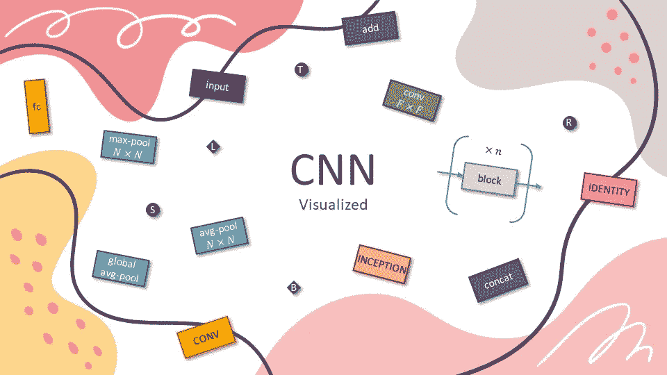

图片作者[作者](http://dwiuzila.medium.com/membership)

```
**Table of Contents****·** [**Fully Connected Layer and Activation Function**](#c7c5)**·** [**Convolution and Pooling Layer**](#60dd)**·** [**Normalization Layer**](#b55c)
  ∘ [Local Response Normalization](#0f76)
  ∘ [Batch Normalization](#182a)**·** [**5 Most Well-Known CNN Architectures Visualized**](#8f20)
  ∘ [LeNet-5](#7ebd)
  ∘ [AlexNet](#c691)
  ∘ [VGG-16](#8ab0)
  ∘ [Inception-v1](#21f4)
  ∘ [ResNet-50](#6702)**·** [**Wrapping Up**](#87a2)
```

Yann LeCun 在 1990 年提出的 **LeNet** 激发了深度神经网络在实践中的可能性。然而，有限的计算能力和存储容量使得该算法直到 2010 年才得以实现。

虽然 LeNet 开启了卷积神经网络(CNN)的时代，但 Alex Krizhevsky 等人在 2012 年发明的 **AlexNet** 开启了 CNN 用于图像网络分类的时代。

AlexNet 是 CNN 能够在这个历史复杂的 ImageNet 数据集上表现良好的第一个证据，它表现得如此之好，以至于社会陷入了一场开发 CNN 的竞争:从 **VGG** 、**盗梦空间**、 **ResNet** ，到**高效网络**。

这些架构中的大多数遵循相同的配方:组合**卷积层**和**汇集层**后接**全连接层**，一些层具有**激活功能**和/或**归一化**步骤。你将首先学习所有这些晦涩难懂的东西，这样以后所有的架构都很容易理解。

> 注意:如果你想要这个故事中解释的架构的可编辑版本，请访问下面我的 [**gumroad**](https://dwiuzila.gumroad.com/l/cnn-architectures-visualized) 页面。
> 
> 有了这个模板，你可能想要编辑现有的架构，用于自己的演示、教育或研究目的，或者你可能想要使用我们美丽的传说来构建其他令人惊叹的深度学习架构，但不想从头开始。**免费(或者想付多少就付多少)！**

[](https://dwiuzila.gumroad.com/l/cnn-architectures-visualized) [## 5 个最著名的 CNN 架构可视化(可编辑)

### 这是我在媒体上的一个故事的附加材料:5 个最著名的 CNN 架构的可视化。

dwiuzila.gumroad.com](https://dwiuzila.gumroad.com/l/cnn-architectures-visualized) 

# 全连接层和激活功能

让我们回到过去。1958 年，[弗兰克·罗森布拉特](https://en.wikipedia.org/wiki/Frank_Rosenblatt)推出了第一台 ***感知器*** ，这是一种根据生物原理构造的电子设备，表现出一种学习的能力。感知器是一台机器，而不是一个程序，它的第一个实现是为图像识别而设计的。

这台机器非常像现代的感知机。在现代意义上，感知器是一种学习二元分类器的算法，如下所示。感知器利用依赖于数据的加权和的阶跃函数给出两个类之间的线性判定边界。

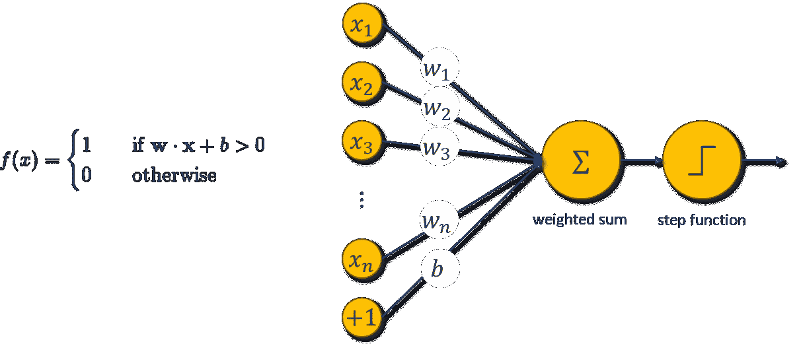

一个感知器|图片作者[作者](http://dwiuzila.medium.com/membership)

感知器中的阶跃函数是 ***激活函数*** 的一个例子；它激活感知器的状态是开(1)还是关(0)。现在有很多种激活函数，其中大部分都可以用来给感知器引入非线性。除步进功能外，一些常见的激活功能有:

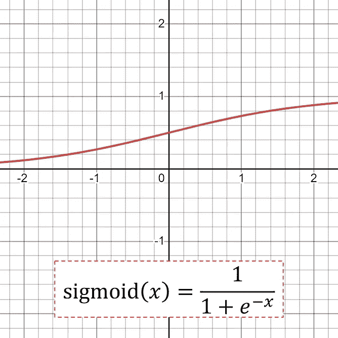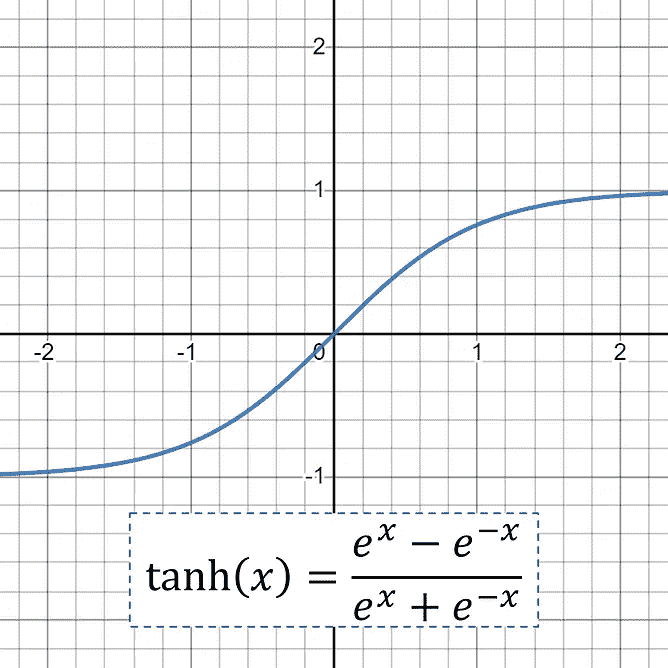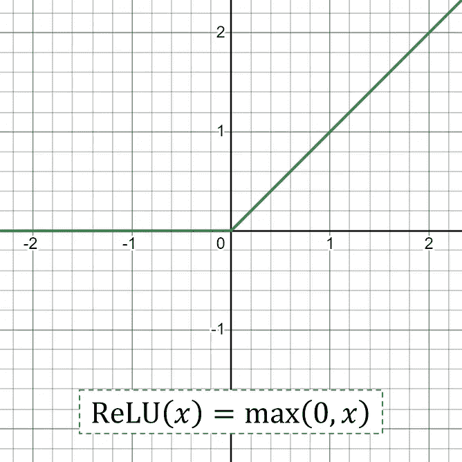

激活函数示例|图片作者[作者](http://dwiuzila.medium.com/membership)

如果激活函数是 sigmoid，感知器被称为 ***逻辑回归模型*** 。

还有另一个值得一提的激活函数，在处理多类分类任务时使用: *softmax* 。考虑具有 K 个类的任务，则 softmax 表示为

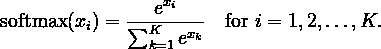

Softmax 给出了模型选择类别 *i* 的预测概率。具有 softmax 激活函数的模型将挑选具有最高概率的类作为最终预测。

考虑具有任意激活函数 *g* 的感知器。您可以将任意数量的感知机堆叠成一层，并且可以将一层的输出连接到另一层。其结果就是我们所说的 ***多层感知器*** (MLP)。

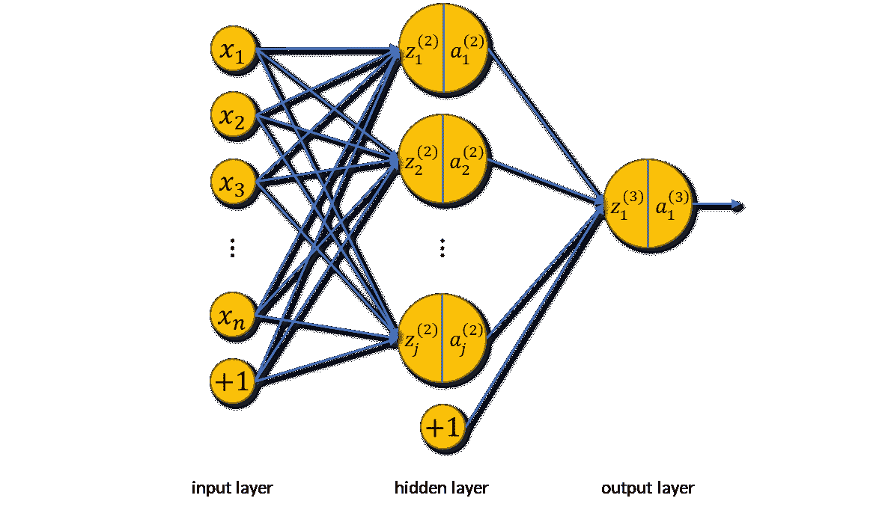

*具有一个隐藏层的多层感知器* |图片由[作者](http://dwiuzila.medium.com/membership)

在矢量化公式中，具有 *L* 层的 MLP 表示如下。

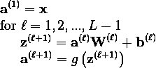

MLP 也被称为 ***密集神经网络*** ，因为它类似于大脑的工作方式。上图最后一幅图中的每个单位圆称为一个 ***神经元*** 。在神经网络的世界中，MLP 层也被称为 ***全连接层*** ，因为一层中的每个神经元都连接到下一层中的所有神经元。

# 卷积和汇集层

当很难找到一种有意义的方法从数据(例如表格数据)中提取要素时，完全连接的图层非常有用。说到图像数据，CNN 可以说是最著名的神经网络家族。对于图像数据，神经网络使用图像的 RGB 通道进行处理。

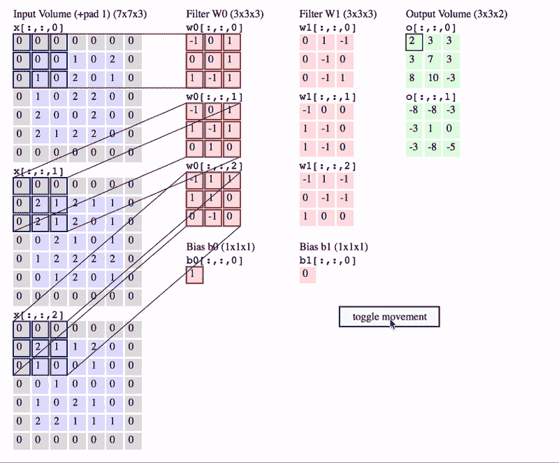

卷积如何与两个滤波器一起工作，每个滤波器的空间范围 F = 3，步长 S = 2，填充 P = 1 | [源](http://cs231n.github.io/convolutional-networks/)

CNN 允许神经网络在图像的不同空间位置重复使用参数。各种选择的过滤器(也称为内核)可以实现不同的图像操作:身份，边缘检测，模糊，锐化等。CNN 的思想是通过引入随机矩阵作为卷积算子来发现图像的一些有趣特征。

在图像与内核卷积之后，你就剩下了一个被称为 ***的特征图*** 。您可以一次又一次地卷积您的特征地图来提取特征，然而，这被证明是非常昂贵的计算。相反，您可以使用 ***池图层*** 来缩小要素地图的大小。

池图层通过单个像素表示要素地图的小区域。可以考虑一些不同的策略:

*   max-pooling(从特征图的 N×N 个小块中选择最高值)，

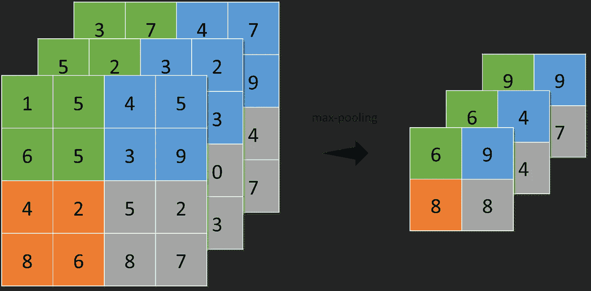

在 3 个大小为 4×4 的滤镜上应用 2×2 补丁的最大池|图片由[作者](http://dwiuzila.medium.com/membership)

*   平均池化(对前一层的 N×N 个特征图进行求和，并选择平均值)，以及

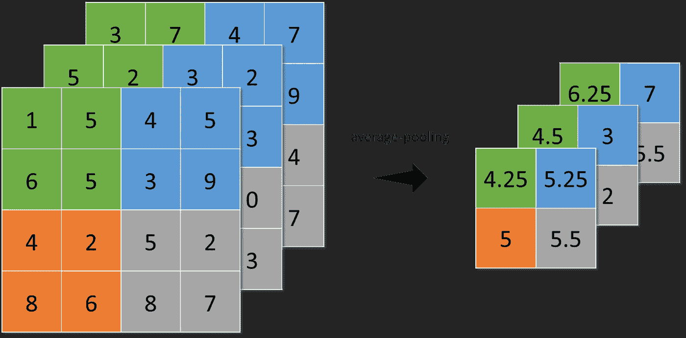

在 3 个大小为 4×4 的滤镜上应用 2×2 补丁的平均池|图片由[作者](http://dwiuzila.medium.com/membership)

*   全局平均池(类似于平均池，但不是使用 N×N 个特征图的补丁，而是一次使用所有特征图区域)。

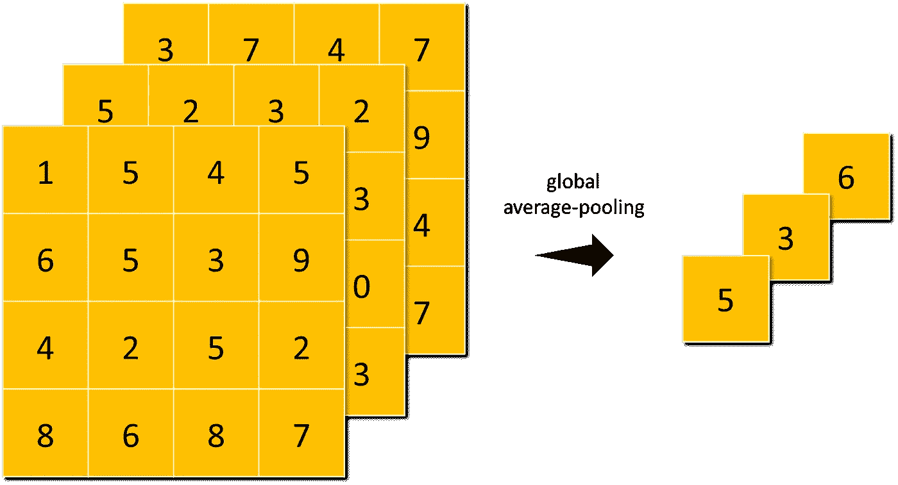

全局平均池应用于 3 个大小为 4×4 的过滤器|图片由[作者](http://dwiuzila.medium.com/membership)

池化使神经网络对输入图像中的小变换、扭曲和平移不变。输入中的微小失真不会改变汇集的结果，因为您在局部邻域中取最大值/平均值。

# 标准化层

## 局部响应标准化

Alex Krizhevsky 和其他人在他的 AlexNet 论文中介绍了 ***局部响应归一化*** (LRN)，这是一种帮助 AlexNet 泛化能力的方案。

LRN 实现了 ***侧抑制*** 的想法，这是神经生物学中的一个概念，指的是一个兴奋的神经元抑制其邻居的现象:这导致了一个局部最大值形式的峰值，在该区域产生了对比，增加了感官知觉。

给定通过应用核 *i* 然后应用激活函数计算的神经元的活动 *aᵢ* ，响应标准化活动 *bᵢ* 由以下表达式给出

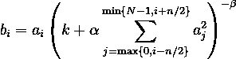

其中总和超过在相同空间位置的 *n 个*“相邻”内核映射，并且 *N* 是该层中内核的总数。常数 *k* 、 *n* 、 *α* 和 *β* 是超参数。

具体来说，让( *k* ， *n* ， *α* ， *β* ) = (0，2，1，1)。应用到 LRN 后，我们将计算左上角像素的值(下面是最浅的绿色)。

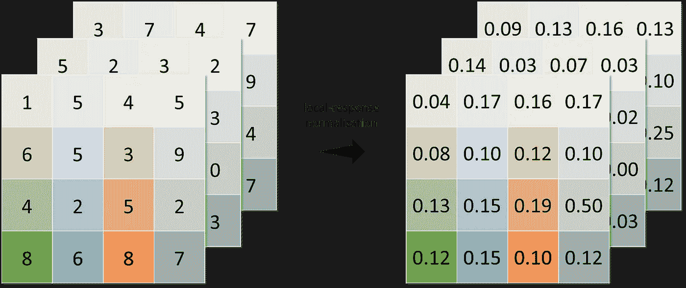

*用(k，n，α，β) = (0，2，1，1)进行局部响应归一化* |图片由[作者提供](http://dwiuzila.medium.com/membership)

计算如下。

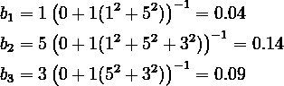

## 批量标准化

深度神经网络优化的另一个突破是 ***批量归一化*** (BN)。它解决的问题叫做 ***内部协变移位*** :

> 前几层神经网络参数的变化改变了当前层的输入/协变量。这种变化可能是巨大的，因为它可能会改变投入的分布。如果一个层输入发生变化，那么这个层就几乎没有用了。

设 *m* 为训练时的批量。对于每一批产品，BN 都正式遵循以下步骤:

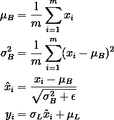

在哪里

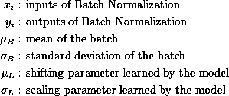

这样，BN 有助于加速深度神经网络训练。网络收敛更快，在训练时表现出更好的正则化，对整体精度有影响。

# 5 个最著名的 CNN 架构被可视化

您已经了解了以下内容:

*   卷积层
*   汇集层
*   标准化层
*   全连接层
*   激活功能

现在，我们准备介绍和设想 5 种 CNN 架构:

1.  [LeNet-5](#7ebd)
2.  [AlexNet](#c691)
3.  [VGG-16](#8ab0)
4.  [盗梦空间-v1](#21f4)
5.  [ResNet-50](#6702)

它们将建立在您所学的层和功能之上。因此，为了简化事情，我们将删除一些信息，如过滤器的数量，步幅，填充和正则化的下降。你将使用下面的图例来帮助你。

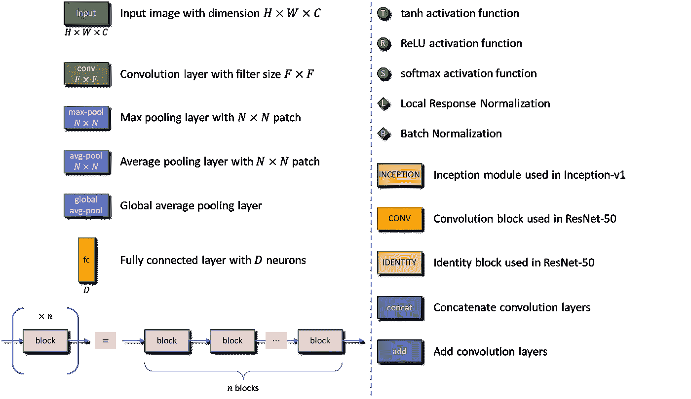

本故事中使用的图例|图片由[作者](http://dwiuzila.medium.com/membership)提供

> 注意:故事的这一部分很大程度上是受莱米·卡里姆的以下故事的启发。一定要去看看！

[](/illustrated-10-cnn-architectures-95d78ace614d) [## 插图:10 个 CNN 架构

### 普通卷积神经网络的编译可视化

towardsdatascience.com](/illustrated-10-cnn-architectures-95d78ace614d) 

我们开始吧，好吗？

## [LeNet-5](http://yann.lecun.com/exdb/publis/pdf/lecun-98.pdf)

这是一切的开始。不包括池化，LeNet-5 由 5 层组成:

*   内核大小为 5×5 的 2 个卷积层，然后是
*   3 个完全连接的层。

每个卷积层之后是一个 2×2 的平均池，除了最后一层(它有 softmax)之外，每一层都有 tanh 激活函数。

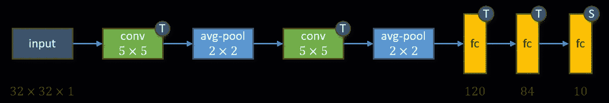

LeNet-5 建筑|图片由[作者](http://dwiuzila.medium.com/membership)

LeNet-5 拥有**60000 个**参数。该网络在灰度 32×32 数字图像上被训练，并试图将它们识别为十个数字(0 到 9)中的一个。

## [AlexNet](https://papers.nips.cc/paper/2012/file/c399862d3b9d6b76c8436e924a68c45b-Paper.pdf)

AlexNet 引入了 ReLU 激活功能和 LRN。ReLU 变得如此流行，以至于几乎所有在 AlexNet 之后开发的 CNN 架构都在它们的隐藏层中使用 ReLU，放弃了 LeNet-5 中 tanh 激活函数的使用。

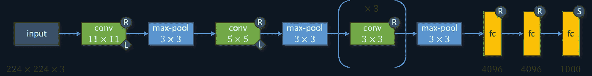

AlexNet 架构|图片作者[作者](http://dwiuzila.medium.com/membership)

网络由 8 层组成:

*   内核大小不增加的 5 个卷积层，然后是
*   3 个完全连接的层。

最后一层用 softmax 激活函数，其他都用 ReLU。应用 ReLU 后，LRN 将应用于第一个和第二个卷积层。第一、第二和第五卷积层之后是一个最大 3×3 的池。

随着现代硬件的进步，AlexNet 可以用庞大的**6000 万**参数进行训练，并成为 2012 年 ImageNet 比赛的获胜者。ImageNet 已经成为开发 CNN 架构的基准数据集，并且它的子集(ILSVRC)由具有 1000 个类的各种图像组成。默认 AlexNet 接受尺寸为 224×224 的彩色图像。

## [VGG-16](https://arxiv.org/pdf/1409.1556.pdf)

研究人员调查了 CNN 深度对其在大规模图像识别设置中的准确性的影响。通过将深度推进到 11-19 层，VGG 家族诞生了:VGG 11 层，VGG 13 层，VGG 16 层，VGG 19 层。一个版本的 VGG-11 与 LRN 也进行了调查，但 LRN 没有提高性能。因此，所有其他 vgg 都是在没有 LRN 的情况下实现的。

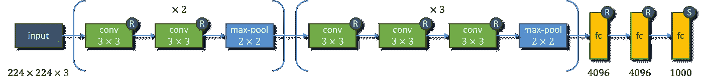

VGG-16 建筑|图片作者[作者](http://dwiuzila.medium.com/membership)

这个故事聚焦于 VGG-16，一个有 16 层的深度 CNN 架构:

*   内核大小为 3×3 的 13 个卷积层，接着是
*   3 个完全连接的层。

VGG-16 是拥有**1.38 亿**个参数的最大网络之一。就像 AlexNet 一样，最后一层配备了 softmax 激活功能，其他都配备了 ReLU。第 2、第 4、第 7、第 10 和第 13 卷积层之后是 2×2 最大池。默认的 VGG 16 接受尺寸为 224×224 的彩色图像，并输出 1000 个类别中的一个。

## [盗梦空间-v1](https://arxiv.org/pdf/1409.4842.pdf)

往深了说有个告诫: ***爆炸/消失渐变*** :

1.  当大的误差梯度累积并导致训练期间不稳定的权重更新时，爆炸梯度是一个问题。
2.  当损失函数的偏导数接近于零并且网络不能训练时，消失梯度是一个问题。


盗梦空间-v1 架构|图片作者[作者](http://dwiuzila.medium.com/membership)

Inception-v1 通过添加两个连接到中间层的辅助分类器来解决这个问题，希望增加传播回来的梯度信号。在训练期间，他们的损失以 0.3 的折扣权重被添加到网络的总损失中。在推理时，这些辅助网络被丢弃。

Inception-v1 引入了 ***inception 模块*** ，四个系列的一个或两个卷积和 max-pool 层并行堆叠，并在最后级联。初始模块旨在通过允许使用多种类型的核大小来近似 CNN 中的最佳局部稀疏结构，而不是局限于单个核大小。

《盗梦空间-v1》的参数比 AlexNet 和 VGG-16 少，只有 700 万美元，尽管它有 22 层:

*   内核大小为 7×7、1×1 和 3×3 的 3 个卷积层，然后是
*   18 层，由 9 个初始模块组成，每个模块有 2 层卷积/最大池，然后是
*   1 全连接层。

主分类器的最后一层和两个辅助分类器配备有 softmax 激活功能，并且所有其他分类器配备有 ReLU。第一和第三卷积层以及第二和第七初始模块之后是 3×3 最大池。最后一个初始模块之后是 7×7 平均池。LRN 是适用于第一次最大池和第三卷积层。

辅助分类器在第 3 和第 6 初始模块之后分支，每个从 5×5 平均池开始，然后是 3 层:

*   1 个具有 1×1 内核大小的卷积层，以及
*   2 个完全连接的层。

默认的 Inception-v1 接受尺寸为 224×224 的彩色图像，并输出 1000 个类中的一个。

## [ResNet-50](https://arxiv.org/pdf/1512.03385.pdf)

当更深的网络可以开始收敛时，一个 ***退化问题*** 已经暴露出来:随着网络深度的增加，精度达到饱和，然后迅速退化。

出乎意料的是，这种退化不是由过拟合引起的(通常由较低的训练误差和较高的测试误差表示)，因为向适当深度的网络添加更多层会导致较高的*训练误差*。

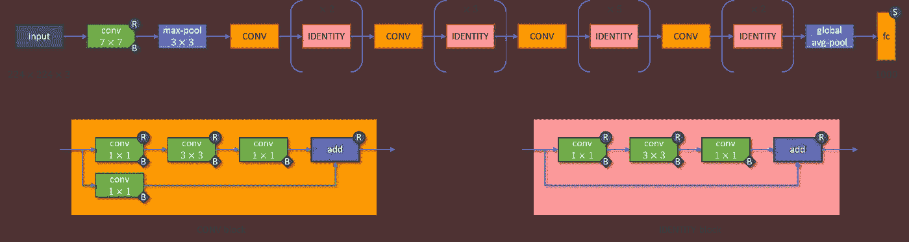

ResNet-50 架构|图片作者[作者](http://dwiuzila.medium.com/membership)

通过引入 ***瓶颈剩余块*** 来解决退化问题。有两种残余块:

1.  Identity block:由 3 个卷积层组成，核大小分别为 1×1、3×3 和 1×1，所有卷积层都配有 BN。ReLU 激活函数应用于前两层，而身份块的输入在应用 ReLU 之前添加到最后一层。
2.  卷积块:与恒等块相同，但卷积块的输入首先通过一个具有 1×1 核大小和 BN 的卷积层，然后添加到主序列的最后一个卷积层。

请注意，两个残差块都有 3 层。ResNet-50 总共有**2600 万**个参数和 50 层:

*   1 卷积层，然后应用 ReLU，接着
*   9 层，由 1 个卷积块和 2 个单位块组成，然后是
*   12 层，由 1 个卷积块和 3 个单位块组成，然后是
*   18 层，由 1 个卷积块和 5 个单位块组成，然后是
*   9 层，由 1 个卷积块和 2 个单位块组成，然后是
*   1 个带 softmax 的全连接层。

第一卷积层之后是 3×3 最大池，最后一个标识块之后是全局平均池。默认的 ResNet-50 接受尺寸为 224×224 的彩色图像，并输出 1000 个类别中的一个。

这里是所有架构的总结。


所有架构摘要|图片由[作者](http://dwiuzila.medium.com/membership)提供

# 包扎


由 [Markus Spiske](https://unsplash.com/@markusspiske?utm_source=medium&utm_medium=referral) 在 [Unsplash](https://unsplash.com?utm_source=medium&utm_medium=referral) 上拍摄的照片

在这个故事中，你已经了解到许多 CNN 架构是由**卷积层**和**汇集层**后跟**全连接层**的组合构建的，其中一些层具有**激活功能**和**规范化**步骤。重要的是，你知道这句话是什么意思。

你还从零开始构建了 5 个最著名的 CNN 架构。你会看到，更深的网络导致更好的性能，直到某个点它遭受 ***爆炸/消失梯度*** 或 ***退化问题*** 。为了解决这些问题，您使用了一些技巧，例如辅助分类器和瓶颈剩余块，分别在 Inception-v1 和 ResNet-50 中找到。

恭喜你！


🔥你好！如果你喜欢这个故事，想支持我这个作家，可以考虑 [***成为会员***](https://dwiuzila.medium.com/membership) *。每月只需 5 美元，你就可以无限制地阅读媒体上的所有报道。如果你注册使用我的链接，我会赚一小笔佣金。*

🔖*想了解更多关于经典机器学习模型如何工作以及如何优化其参数的信息？或者 MLOps 大型项目的例子？有史以来最优秀的文章呢？继续阅读:*


艾伯斯·乌兹拉

## 从零开始的机器学习

[View list](https://dwiuzila.medium.com/list/machine-learning-from-scratch-b35db8650093?source=post_page-----af76f1f0065e--------------------------------)8 stories

[艾伯斯·乌兹拉](https://dwiuzila.medium.com/?source=post_page-----af76f1f0065e--------------------------------)

## 高级优化方法

[View list](https://dwiuzila.medium.com/list/advanced-optimization-methods-26e264a361e4?source=post_page-----af76f1f0065e--------------------------------)7 stories

[艾伯斯·乌兹拉](https://dwiuzila.medium.com/?source=post_page-----af76f1f0065e--------------------------------)

## MLOps 大型项目

[View list](https://dwiuzila.medium.com/list/mlops-megaproject-6a3bf86e45e4?source=post_page-----af76f1f0065e--------------------------------)6 stories

[艾伯斯·乌兹拉](https://dwiuzila.medium.com/?source=post_page-----af76f1f0065e--------------------------------)

## 我最好的故事

[View list](https://dwiuzila.medium.com/list/my-best-stories-d8243ae80aa0?source=post_page-----af76f1f0065e--------------------------------)24 stories

[艾伯斯·乌兹拉](https://dwiuzila.medium.com/?source=post_page-----af76f1f0065e--------------------------------)

## R 中的数据科学

[View list](https://dwiuzila.medium.com/list/data-science-in-r-0a8179814b50?source=post_page-----af76f1f0065e--------------------------------)7 stories

[1]王、、拉杰、比丘(2017): *关于深度学习的起源*。[https://arxiv.org/abs/1702.07800v4](https://arxiv.org/abs/1702.07800v4)