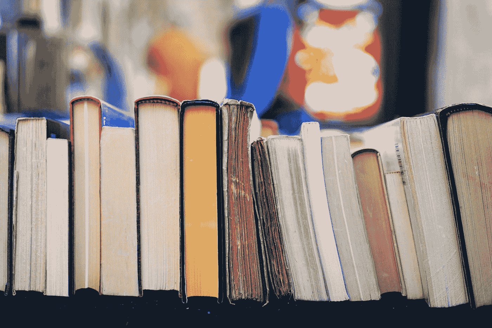
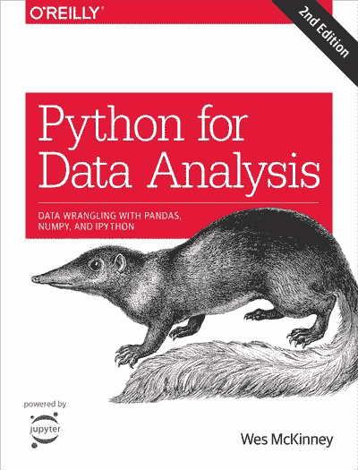
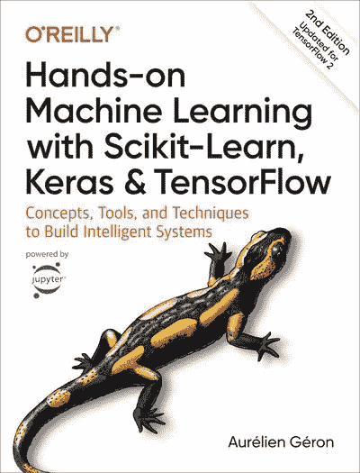
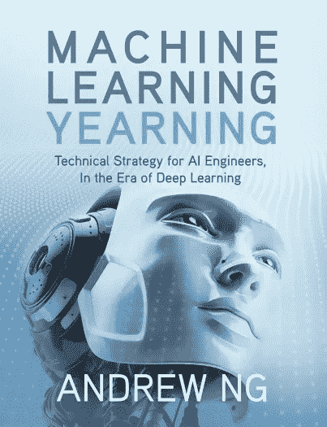
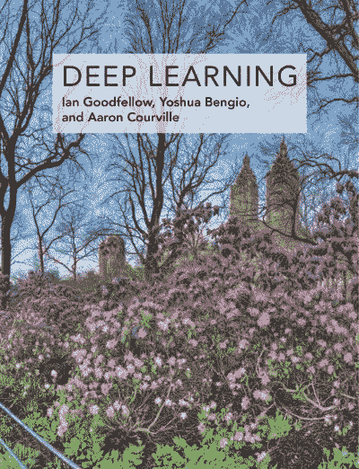

# 2022 年必备的 5 本机器学习书籍

> 原文：<https://towardsdatascience.com/5-must-have-machine-learning-books-in-2022-7ce91d06dfc8>

## 使用这些专家推荐的书籍，启动并增强您的机器学习职业生涯

汤姆·赫曼斯在 [Unsplash](https://unsplash.com?utm_source=medium&utm_medium=referral) 上的照片

**为什么书值得？**

要成为机器学习的专家，你首先需要在三个方面打好基础:**编码**、**机器学习**理论和**数学**。有大量的资源和课程致力于教授这些技能。好书给个人提供了按照自己的进度学习的机会，而且不像在线课程那样更详细。它们也是很好的参考。机器学习是一个非常广阔的领域，拥有一本好书意味着你可以从一个简洁和详细的来源快速浏览几章来快速复习！

考虑到这一点，我想推荐几本**帮助我获得第一份机器学习工作的书**。我相信这些书绝对是必备的，对于初学者以及希望补充他们的发展和持续进步的更有经验的从业者来说都是极好的。当然，就像在线学习一样，为了充分利用这些书籍，值得自己实现代码示例和练习。

如果我要从头开始机器学习，这些建议是按照我浏览材料的顺序组织的。从 Python 的介绍开始，逐步走向动手机器学习，最后更深入地解决机器学习问题(自上而下的学习方法)。

这份列表中的每本书(除了最后一本基于理论的)都是围绕 **Python** 编程语言编写的。Python 是机器学习和数据科学的一个很好的工具，因为它是开源的，并且附带了大量强大的库— **NumPy、Pandas、TensorFlow 和 Keras** 等等。

> *这篇文章可能包含附属链接，当你点击链接时，我可能会赚取一小笔佣金，而无需额外付费。*

所以…废话不多说…

# 用于数据分析的 Python:与 Pandas、NumPy 和 IPython 的数据争论，第 2 版

[**作者韦斯·麦金尼**](https://amzn.to/3M7kPVJ)

[用于数据分析的 Python | O ' Reilly 2017](https://amzn.to/3JOAhVf)

这个列表中的第一本书并没有深入研究机器学习。然而，对于初学者来说，它是对 Python 的一个很好的介绍，对于有编码经验的人来说，它是一个很好的复习工具。这样做的一个关键原因是，这本书探索了数据科学和机器学习的核心 Python 库——NumPy、Pandas 和 Matplotlib。在整本书中，你将获得必要的技能来操作、清理和可视化数据。最后，您甚至可以获得关于时间序列数据的可靠介绍——这通常很难找到好的参考资料。

虽然这本书不会让你成为机器学习工程师，但如果你对这个主题很认真，那么你将从这本书中获得的**基本 Python 技能**将是无价的。很容易深入这个列表中的其他机器学习书籍。然而，我想你会发现他们的 Python 摘要章节是不够的，在你知道之前，你会迷失在所有的代码中。即使先决条件并不总是给出这一点。

# 使用 Scikit-Learn 进行机器实践学习，Keras & TensorFlow，第二版

[**作者奥雷连恩·盖伦**](https://amzn.to/36jF57e)

[使用 Scikit-Learn、Keras 进行动手机器学习& TensorFlow | O'Reilly 2019](https://amzn.to/36jF57e)

这是这份名单中我最喜欢的书！我真的不能推荐它。Géron 出色地完成了他的**简明而详细的**介绍，涉及广泛的机器学习主题，包括**监督学习、非监督学习、深度学习甚至强化学习**。

本书中的解释很清楚，并附有大量的**动手示例**，允许您练习和发展实用的机器学习技能。这本书从一个有趣的加州房价项目开始，从头到尾都完成了——让读者马上参与进来，而不会陷入大量的理论和数学中。然而，读者仍然带着丰富的理论知识和对主题的理解离开。

通过使用最流行的 Python 机器学习库(Sciki-Learn、Tensorflow 和 Keras ),读者一定会学到有价值且受欢迎的技能。作者还就如何处理和微调不同的现实世界问题给出了大量指导。最后，对于更高级的主题，作者给出了读者可能有兴趣进一步研究的前沿技术的建议。

我将这本书作为第二本书添加到我的列表中，因为我认为它确实需要预先的 Python 知识，即使没有严格的编码先决条件。

这本书的**第三版**也在路上——计划 2022 年 10 月出版！

# 机器学习向往

**作者吴恩达**

机器学习向往

> *这本书包含了如此多的知识、经验和指导，而且可以在一天之内读完，这一事实使它成为必读之书！*

谈到机器学习的在线学习，吴恩达可能是领军人物。他是斯坦福大学的教授，是 Coursera、deeplearning.ai 和 Google Head 的联合创始人——所以你知道你从他那里获得的内容是值得你花时间的！在他的短篇书《机器学习的渴望》中，吴恩达传授了他关于如何构建机器学习项目的智慧。它为读者提供了**最佳实践**和潜在陷阱的警告。在你有了一些做自己项目的经验后，这本书可能更有价值，但是它的前半部分对初学者同样有价值！事实上，这本书是如此丰富的知识，经验和指导，但可以在一天内阅读，使其成为必读！

# Python 深度学习，第二版

[**弗朗索瓦·乔莱**](https://amzn.to/36jmE2u)

[用 Python 进行深度学习| Manning 2021](https://amzn.to/36jmE2u)

这本书的作者弗朗索瓦·乔莱(Franç ois Chollet)是 **Keras** 的创始人——这是一个被谷歌采用的运行在 TensorFlow 之上的深度学习库。这本书最棒的一点是，Chollet 以一种非常直观的方式解释了复杂的概念——没有纠缠于所有的数学问题。如果你之前纠结于深度学习，这本书真的会帮到你。不仅如此，每一章都充满了大量的**实践例子**和详细的代码解释。如果你读了这本书，你一定会在理论理解和实践深度学习经验方面提升你的机器学习专业知识。

如果你对 Python 和机器学习有很好的理解，想要更深入地研究深度学习，并且更喜欢用 Python 代码而不是数学方程来解释概念——这本书就是为你准备的！

如果你想掌握实用的深度学习技能和 Keras 库——这本书就是为你准备的！

# 深度学习

[**作者伊恩·古德菲勒、约舒阿·本吉奥和亚伦·库维尔**](https://amzn.to/3JQhSaC)

[深度学习|麻省理工出版社 2017](https://amzn.to/3JQhSaC)

> 由该领域的三位专家撰写，*深度学习*是唯一一本关于该主题的综合性书籍。
> 
> ——埃隆·马斯克

由三位专家撰写，这本全面的书将提升你对深度学习的理解。这本书深入介绍了**数学概念和深度学习技术**，适合所有人——学生、研究人员和软件工程师。

虽然这本书非常全面，但它排在了名单的最后，因为我相信所有这些信息对初学者来说可能是非常难以接受的。我个人发现自上而下的学习方式(先动手技能)更适合机器学习。从编码开始，这样你就可以很快看到自己是否觉得这是一件有趣的事情。然后，如果需要的话，深入研究不同算法背后的数学和理论，以改进解决方案并更好地理解主题。当然，其他人可能更喜欢自下而上的方法——对于你们中的一些人来说，这可能是一本好书。

# 结论

机器学习是一个快速发展的领域，大量的工具有时会让人不知所措。然而，本文中的书籍集应该作为您旅途中的一个很好的基础。总是记住如何解决不同的机器学习问题并不容易，从自然语言处理到计算机视觉和时间序列预测。希望这里推荐的书籍不仅能帮助你学习这门学科的高级技能，还能作为未来持续的参考。享受阅读吧！