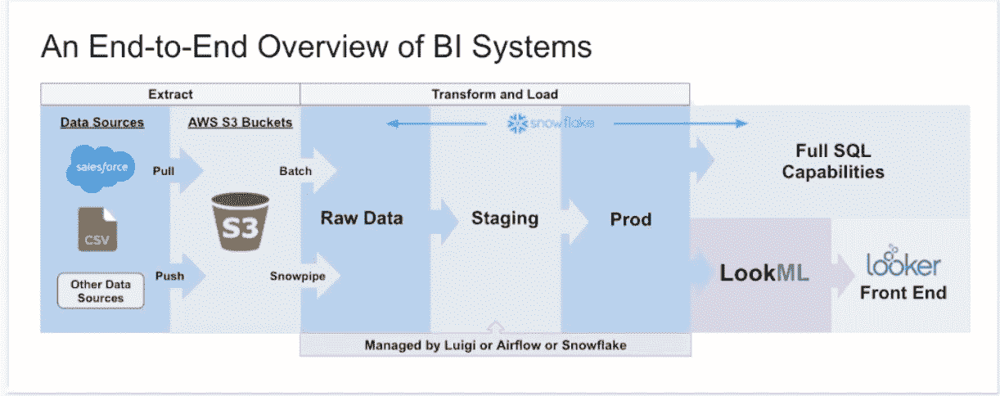

# 构建数据平台时要考虑的 5 件不明显的事情

> 原文：<https://towardsdatascience.com/5-non-obvious-things-to-consider-when-building-your-data-platform-fd8e74e8cd66>

## *迁移到梦想中的自助服务数据平台时，需要回答以下 5 个重要问题*

图片由[克里斯汀·威尔森](https://unsplash.com/photos/z3htkdHUh5w)在 [Unsplash](http://www.unsplash.com) 上提供。

[**构建数据平台**](https://www.montecarlodata.com/the-quick-and-dirty-guide-to-building-your-data-platform/)**——即您公司所有数据的中央存储库，支持数据的获取、存储、交付和治理，同时维护数据生命周期的安全性——已成为当今数据团队的必经之路。数据平台在现代组织中至关重要，因为它们允许领导者更容易地从数据中收集可操作的见解，从而帮助优化运营。**

**然而，在这个勇敢的新的数据驱动的世界中，确保您在构建数据平台时有一个良好的开端是一项挑战。构建时的一些考虑是显而易见的:例如，您将需要的工具、您将服务的用户、您将利用的数据源以及平台的最终用途。但是有几个组织和文化方面的考虑，即使是最有意图的数据团队也可能会在急于构建时忽略。**

**我们采访了 Toast 公司的 Noah Abramson 和 Angie Delatorre，这是一家领先的餐厅销售点提供商，也是最近的独角兽，了解他们构建高性能现代数据平台的方法。**

**在我们的交谈中，我们了解到在构建您的数据平台时有五个重要的考虑因素。让我们开始吧。**

# **考虑 1:你将如何获得利益相关者的认同？**

**只有当数据平台的用户(即企业中的利益相关者)对它开放并熟悉它时，它才有用。在创建数据平台之前，让所有可能利用该平台的团队参与进来是非常重要的。**

**在 Toast，这非常简单。**

**“Toast 是一家超级数据驱动的公司，”诺亚说。“老实说，我认为这对我们的[数据]团队非常有益。我们的数据工程团队总监做得非常好，他让我们尽可能地为公司的其他人提供有价值的服务，让拥有这些数据洞察力的人能够获得决策支持，然后衡量这些决策和结果。”**

**组织中每个部门的员工都应该了解数据平台最终将如何为他们提供价值。这是数据团队的初始工作:解释和展示这种价值，并建立一种衡量成功的方法，即使公司在扩大。Toast 数据团队首先了解影响他们同事的业务问题，然后将数据团队定位为潜在解决方案的提供者。**

**“我们的主管让我们的团队尽早介入这些问题，并帮助我们了解我们将如何解决这些问题，我们将如何衡量我们是否正确解决了这些问题，以及我们将如何开始跟踪这些数据——不仅是现在，还有未来，”Noah 说。**

**随着时间的推移，Toast 开发了一个系统，通过构建自助分析模型来消除瓶颈，从而为更广泛的公司服务并消除瓶颈。**

**“我们的流程最初是超级集中的，我们拥有整个堆栈，”Noah 解释道。“随着公司开始发展，它变得势不可挡。我们转向了自助服务模式，我们成为了您在构建这些仪表板和拥有数据时可以咨询的团队。”**

# **考虑 2:谁拥有数据堆栈中的什么？**

**为了得到最有效的利用，数据应该被视为**整个组织的共享资源**。不同的团队在公司数据生命周期的不同阶段拥有公司数据的所有权:例如，数据工程团队可能拥有原始数据，然后将数据交给分析工程团队进行分析和洞察，然后由商业智能团队进行解析和应用。**

**端到端数据堆栈由支持每个团队的多种工具和技术组成。Toast 从包括 Salesforce、NetSuite、Workday 和 Toast 本身在内的来源获取数据。这些数据流入团队的数据湖 S3，然后被复制到云数据仓库雪花。该团队使用 Looker 作为其前端工具，所有工作都通过气流进行编排。**

****

**图片由 Toast 网站的 Noah Abramson 提供。**

**在 Toast，数据平台团队拥有公司面向外部的数据洞察和分析。**

> **“我们的一个大价值广告(作为一个组织)是给我们的客户提供商业见解:餐馆，”诺亚说。“他们在一段时间内表现如何？他们昨天的销售额是多少？谁是他们的顶级客户？与我们的餐厅客户互动是数据平台团队的工作。”**

**相比之下，诺亚的团队主要是内部的。**

**“我们说我们的顾客都是烤面包的员工，”他说。“我们试图为所有人提供尽可能多的数据。我们的团队为所有内部数据请求提供服务，从产品到上市，从客户支持到硬件运营。”因此，Noah 团队的工作是将数据流构建到总体系统中，并帮助整个组织的利益相关者从包括 Snowflake 和 Looker 在内的工具中获得洞察力。**

# **考虑 3:你将如何衡量成功？**

**如果您无法衡量，您就无法管理—这一真理适用于评估数据对业务的影响。在构建数据平台时，衡量利益相关者如何利用数据来支持业务需求以及确定数据团队绩效的质量和效率都很重要。**

> **关于他的团队如何考虑衡量与数据相关的 KPI，Noah 说:“我们真的倾听企业的需求。“在最高层，他们提出了几个不同的目标:例如，增加客户、增加收入、在某些支出领域削减成本。”**

**然后，Noah 和他的团队采用这些高级业务目标，并使用它们来构建目标和关键结果(okr)。**

**“我们可以用几种方法做到这一点，”诺亚说。“例如，如果你考虑扩大客户群，我们会问，‘我们如何让拥有数据的人做出更多决策？’如果有人有一个新产品的想法，我们如何发挥它，让他们把它放在那里，然后衡量它？"**

**此外，团队关注于测量其过程的可伸缩性。Angie 说:“我们不仅倾听业务需求并明确支持它们，而且还关注内部并解决可扩展性问题。”。“如果一项工作过去需要一个小时，现在需要三个小时，我们总是需要回去看看那些实例，这样也可以塑造我们的 okr。”**

# **考虑 4:你会集中还是分散你的组织结构？**

**每个数据团队都是不一样的，每个团队的需求都会随着时间而变化。您的公司是否应该为您的数据团队寻求一种集中的组织结构？集权会带来太多的瓶颈吗？分散的方法会导致重复和复杂吗？在构建数据平台时，了解每个选项的情况并选择在给定时间点最适合您业务的模型是一个重要的考虑因素。**

**多年来，Toast 自身的结构经历了各种变化:从集中到分散再到混合。**

**最初，所有请求都流经数据团队。“这很有效，”诺亚说。"但随着公司开始成长，它变得势不可挡."**

**Toast 转向了一个分散的模型，强调分析师的自助服务，并将数据团队定位于一个更具咨询性的角色。这种变化是由快速增长的几个痕迹引起的，包括大量的传入数据、越来越多的人依赖这些数据，以及不断增长的数据工程团队的资源有限。**

**随着 Toast 的增长，该公司知道需要以新的方式利用数据来支持增长。**

> **Noah 说:“我们需要考虑如何让所有这些新的业务线拥有与我们的上市团队相同的洞察力。“我们对数据使用有着很高的期望，我们希望让[整个组织]的所有人都能获得与我们为走向市场和销售所构建的访问权限相同的访问权限。”**

**这给带宽有限、捉襟见肘的数据工程团队带来了优先级问题。“我们团队的最新发展确实解决了这些类型的(业务)需求，”Noah 说。“在我们目前的设置中，我们生活在一个超级新的范式中，它是数据工程、分析工程，然后是可视化。我们现在可以有效地将数据导入雪花，并利用我们所有的不同来源。”**

**反过来，分析工程团队专注于创建一个数据模型，该模型可以服务于不同 Toast 成员对数据和业务的各种思考方式。**

**“我认为新的 [**分析工程**](https://about.gitlab.com/job-families/finance/analytics-engineer/) 团队——我们对此感到非常兴奋——将会缩小一点，了解所有的问题，看看我们如何建立一个数据模型来服务于此，”诺亚说。Toast 当前的混合组织结构最适合其当前的需求——如果需求和环境发生变化，团队总是愿意重新评估和调整。**

# **考虑 5:你将如何处理数据的可靠性和信任？**

**随着数据量随着各个业务部门利用数据的意愿而持续增长，数据可靠性(即组织在整个数据生命周期中提供高数据可用性和健康状况的能力)变得越来越重要。无论您选择构建自己的数据可靠性工具还是购买一个，它都将成为功能性数据平台的必要组成部分。**

**随着 Toast 团队开始处理不断增长的数据量，确保数据可靠性变得至关重要。**

> **“有很多移动的部分，”数据栈的诺亚说。“中转区有很多逻辑，会发生很多事情。这就引出了一个问题，我们如何观察所有这些数据？我们如何确保当数据进入生产阶段时，看起来是我们想要的，它是准确的，及时的，以及所有我们真正关心的有趣的事情？”**

**最初，诺亚和另外两名工程师花了一天时间构建了一个他们称之为 Breadbox 的数据刷新工具。该工具可以执行基本的数据可观察性任务，包括存储原始计数、存储百分比空值、确保数据在需要时到达数据湖，等等。**

**“这真的很酷，”诺亚说，“但是随着数据的增长，我们跟不上了。随着所有这些新来源的出现，并要求不同类型的观察，我们花时间将集成构建到工具中，而不是花同样多的时间为该工具构建新的测试。”**

**一旦团队达到关键的增长水平，就应该考虑投资于数据可观察性，而不是投入时间和资源来完善他们自己的解决方案。**

**安吉说，对于任何一家公司来说，正确的选择都是不同的。**

**“我认为我们的建筑就其本来面目而言非常好，”她说。“但当你谈到可扩展性时，我们发展得如此之快，而且正在招人，教他们如何使用这一工具将会很困难。如果有什么东西坏了，就很难(修复)。”**

**她说，从长远来看，“我希望我们的团队专注于丰富数据和支持 Toast。如果有一款同类最佳的工具可以做到这一点，我们非常愿意为此付费，让我们的专业知识能够发挥我们的最大优势，让企业用户能够利用数据开展工作。”**

**自从实现了数据可观测性，Toast 的数据工程团队就可以做到这一点。此外，这种新方法为公司提供了定制工具无法提供的额外价值。**

> **Angie 说:“我认为[关于数据可观察性]有几件事非常有价值。“机器学习，能够进去说‘这是意料之中的’，或者‘这是固定的’。”另一件事是事件的记录以及它们是如何发生的。我认为能够回到过去并拥有那个记录是非常有价值的。"**

**她认为，数据的可观察性也有助于团队避免警觉疲劳。**

**“这只是减少了时间，”她说。"你被准确地导向问题所在，然后从那里开始，你可以展开."**

# **为您的团队提供最佳数据平台**

**每家公司的每个数据平台看起来都会有点不同，这是应该的。当谈到为您的团队和组织创建最佳数据平台时，重要的是要问自己一些关于您公司的文化、业务目标、结构等微妙的问题。**

****有兴趣了解有关如何构建可靠数据平台的更多信息吗？联系巴尔和蒙特卡洛** **的** [**团队！**](https://www.montecarlodata.com/request-a-demo/)**

***本文由* [*周浩宇*](https://www.linkedin.com/in/alexandra-chou/) *共同撰写。***