# 5 只熊猫按你在 Python 中应该知道的技巧分组

> 原文：<https://towardsdatascience.com/5-pandas-group-by-tricks-you-should-know-in-python-f53246c92c94>

## 数据科学

## 所有你需要知道的关于熊猫的数据框架组，以便有效地使用它


[斯蒂夫·约翰森](https://unsplash.com/@steve_j?utm_source=unsplash&utm_medium=referral&utm_content=creditCopyText)在 [Unsplash](https://unsplash.com/?utm_source=unsplash&utm_medium=referral&utm_content=creditCopyText) 上拍照

**熊猫力量！**🔋

Pandas 是广泛用于数据分析项目的 Python 库。然而，分析数据并不容易，因为要从中获得有价值的见解是很难的。为了更好地理解数据，您需要对其进行转换和聚合。这时`**groupby**`出现了。

在 Pandas 中，`**groupby**`本质上是将数据集中的所有记录分成不同的类别或组，并为您提供按这些组分析数据的灵活性。

这是非常有效的，必须知道在数据分析功能，这给你几秒钟内有趣的见解。这也是为什么在数据科学工作面试中经常会被问到这个问题。所以，掌握它很重要。💯

在本文中，我将举例说明 5 个简单的熊猫`groupby`技巧，你必须知道这些技巧才能高效地进行数据分析，也才能在数据科学面试中胜出。

虽然这篇文章很短，但你可以通过这个索引自由地导航到你最喜欢的部分，并下载整个笔记本，最后还有例子！

```
 **∘** [**How exactly group by works on pandas DataFrame?**](#41fa) **·** [**Number of Groups**](#782f) **·** [**Group Sizes**](#06fd) **·** [**Get First and Last**](#c09b) **·** [**Get Groups**](#461c) **·** [**Aggregate Multiple Columns with Different Aggregate Functions**](#ae8f)
```

> 📍注意:我使用的是自己创建的[虚拟销售数据](https://github.com/17rsuraj/data-curious/blob/master/TowardsDataScience/Dummy_Sales_Data_v1.csv)，你可以在我的 [**Github**](https://github.com/17rsuraj/data-curious/blob/master/TowardsDataScience/Dummy_Sales_Data_v1.csv) repo 上免费获得 [**麻省理工学院许可**](https://github.com/17rsuraj/data-curious/blob/master/LICENSE.md) **！**！

让我们将数据集导入熊猫数据框架— `**df**`

```
import pandas as pd
df = pd.read_csv("Dummy_Sales_Data_v1.csv")
df.head()
```

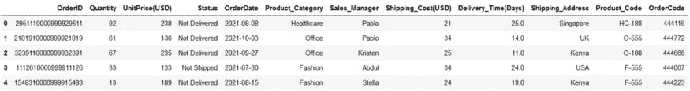

虚拟销售数据|作者图片

这是一个简单的 9999 x 12 的数据集，我用 Python 中的[**Faker**](/faker-an-amazing-and-insanely-useful-python-library-b313a60bdabf)**创建的📚**

**在继续之前，让我们快速了解一下—**

## **“分组”到底是如何在熊猫数据框架上工作的？**

**当您对 DataFrame 的任何分类列使用`.groupby()`函数时，它会返回一个`**GroupBy**`对象。然后，您可以对该对象使用不同的方法，甚至聚合其他列来获得数据集的汇总视图。**

**例如，您使用下面`df`中*产品类别*列的`.groupby()`函数来获取`GroupBy`对象。**

```
df_group = df.groupby("Product_Category")
type(df_group)# Output
**pandas.core.groupby.generic.DataFrameGroupBy**
```

**返回的`**GroupBy**`对象只是一个字典，其中*键是唯一的组*，其中记录被拆分，值是每个组的列，这些列在`groupby`中没有提到。**

**当然，`GroupBy` object 保存整个数据帧的内容，但以更结构化的形式保存。就像字典一样，有几种方法可以有效地获取所需的数据。✅**

**让我们先从简单的事情开始，看看你的数据现在被分成多少个不同的组。**

# **组数**

**一旦您将数据分成不同的类别，了解您的数据现在被分成多少个不同的组是很有趣的。**

**简单而常见的答案是在任何列上使用`nunique()`函数，这实际上给出了该列中唯一值的数量。因此，由于列中有许多唯一值，数据将被分成许多组。**

**例如，您可以查看使用产品类别可以形成多少个独特的组。**

```
df.Product_Category.nunique()-- Output
**5**
```

**然而，当你已经有一个`GroupBy`对象时，你可以直接使用它的
方法`**ngroups**`，它会给出你想要的答案。这是你如何使用它。**

```
df_group = df.groupby("Product_Category") **df_group.ngroups**-- Output
**5**
```

**一旦你知道了组的数量，你仍然不知道每个组的大小。下一个方法让你知道每个组有多大或多小。**

# **组大小**

**使用函数**可以很容易地获得每组`GroupBy`对象中的行数。大小()。****

**例如，您想要查看每组产品类别中有多少不同的行。这可以简单地如下获得—**

```
**df.groupby("Product_Category").size()**
```

**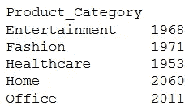**

**熊猫按大小分组|作者图片**

**它只是计算每个组中的行数。这里有人会说，使用聚合函数`count()`可以获得相同的结果。让我们试一试，**

```
**df.groupby("Product_Category").count()**
```

**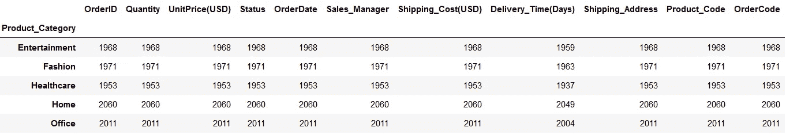**

**熊猫按数量分组|图片按作者**

**你可以看到两个结果之间的相似之处——数字是相同的。然而，它们的计算方式有很大的不同。**

**根据[**熊猫**](https://pandas.pydata.org/docs/reference/api/pandas.core.groupby.DataFrameGroupBy.count.html) ，聚合函数`.count()`只计算每一列的*非空值* s，而`.size()`只是返回每一组中可用的行 s 的*号，而不管有无值。***

**因此，在使用这两个函数之前，您必须对它们之间的差异有深刻的理解。简而言之，如果想知道每组的每一列中有多少非空值，就使用`.count()`，否则就使用`.size()` ✅**

**一旦你得到每个组的大小，你可能想看看第一个，最后一个或记录在数据中的任何随机位置。在这种情况下，下一个方法可能很方便。**

# **获得第一和最后一名**

**在数据被分成不同的组后，这些函数返回第一条和最后一条记录。它不是引用 index，而是给出所有组中出现的第一行或最后一行。**

**例如，您可以看到每个组中的第一条记录，如下所示:**

```
**df.groupby("Product_Category").first()**
```

**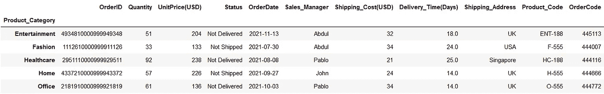**

**查看熊猫分组的第一行|作者图片**

**没错，用类似的方法，你可以看看每组的最后一行。**

```
**df.groupby("Product_Category").last()**
```

**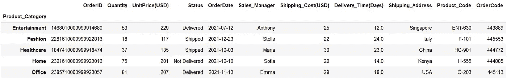**

**查看熊猫分组的最后一行|作者图片**

**一旦所有行都被分组到每个*产品类别*下，它就返回第一行和最后一行。**

**此外，您还可以在任何其他位置提取行。例如，也可以使用函数`**.nth()**`提取每组中的第 4 行**

```
**df.groupby("Product_Category").nth(3)**
```

**记住，Python 中的索引是从零开始的，因此当你说`.nth(3)`时，你实际上是在访问第 4 行。**

**从逻辑上讲，您甚至可以使用`.nth()`函数获得第一行和最后一行。例如，您可以使用`.nth(0)`和`.first()`获得每组的第一行，或者使用`.nth(-1)`和`.last()`获得最后一行。**

> **那为什么这些不同的功能会存在呢？？ *🚩***

**虽然可以使用`.first()`和`.nth(0)`来获取第一行，但是在处理`**NaN**`或缺失值时有所不同。`.first()`给出每一列的第一个非空值，而`.nth(0)`返回组的第一行，不管这些值是什么。`.last()`的情况也是如此**

**因此，我推荐使用`.nth()`而不是其他两个函数来从一个组中获取所需的行，除非您专门寻找非空记录。💯**

**但是假设，不是只从组中检索第一行或最后一行，您可能很想知道特定组的内容。下一个方法会很快给出这些信息。**

# **获取组**

**pandas `GroupBy`方法`**get_group()**`用于从`GroupBy`对象中选择或提取一个组。**

**例如，假设您想查看*“医疗保健”*组的内容。这可以用下面最简单的方法来完成。**

```
**df_group.get_group('Healthcare')**
```

**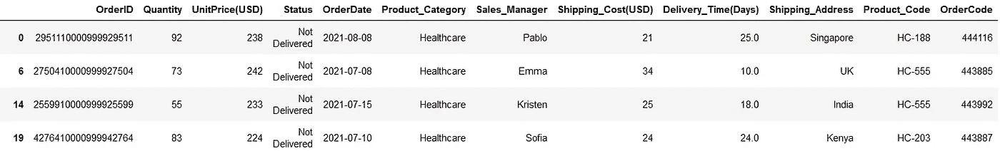**

**熊猫按 get_group() |图片按作者分组**

**如您所见，数据集的结构没有变化，您仍然可以获得产品类别为' *Healthcare'* '的所有记录。**

**对于这种方法，我有一个有趣的用例— **分割数据帧****

**假设您想要选择产品类别为*【家庭】*的所有行。一种简单且广泛使用的方法是使用如下的括号符号`**[ ]**`，**

```
df[df["Product_Category"]=='Home']
```

**这没什么不对的。但是使用下面的方法`.get_group()`可以得到完全相同的结果，**

```
df_group = df.groupby("Product_Category")
df_group.get_group('Home')
```

**更进一步，当您比较这两种方法的性能并分别运行 1000 次时，当然`.get_group()`是省时的。✅**

> **切片用。groupby()比逻辑比较快 4 倍！！**

**这是通过在`.get_group()`方法中指定组名来一次只获取一个组。但是，如果您想一次浏览所有组的内容，该怎么办呢？？**

> ****你还记得—** `**GroupBy**` **对象是字典吗！！** *🚩***

**因此，您可以像使用 dictionary 一样直接遍历它——使用键和值参数。💯**

**以下是你可以先睹为快每个组的内容。**

```
**for name_of_group, contents_of_group in df_group:**
    print(name_of_group)
    print(contents_of_group)
```

**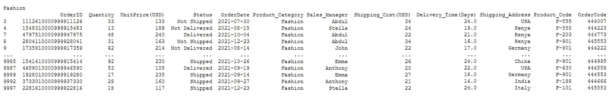**

**遍历每组熊猫分组依据|图片依据作者**

**它将列出每个组的名称和内容，如上所示。在图片中只能看到一个组的内容，但是在笔记本中，你可以看到一个接一个列出的所有组的相同模式。**

**它基本上显示了每组中的第一行和最后五行，就像 pandas DataFrame 的`.head()`和`.tail()`方法一样。**

**接下来，如果不汇总数据，熊猫`groupby`的使用是不完整的。在这最后一部分中，让我们探索如何在不同的列上使用不同的聚合函数。**

# **用不同的聚合函数聚合多个列**

**对每个组中的列应用聚合函数是一种广泛使用的做法，以获得汇总结构，用于进一步的统计分析。**

**根据 IBM<https://www.ibm.com/docs/da/tnpm/1.4.2?topic=data-aggregation>**，****

> ****您可以分析汇总的数据，以获得关于特定资源或资源组的见解****

****这就是拥有聚合功能的熊猫`groupby`非常有用的地方。使用`groupby`，您可以根据单个列或多个列将数据集分成不同的组。然后对剩余的数字列应用聚合函数。****

****让我们继续同一个例子。将数据按*产品类别*分组后，假设您想查看每个产品类别的平均*单价*和*数量*是多少。****

****您所需要做的就是使用方括号引用`GroupBy`对象中的这些列，并对它们应用聚合函数`.mean()`，如下所示****

```
**#Create a groupby object
**df_group = df.groupby("Product_Category")**#Select only required columns
**df_columns = df_group[["UnitPrice(USD)","Quantity"]]**#Apply aggregate function
**df_columns.mean()****
```

****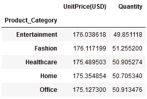****

****熊猫分组依据聚合函数|图片依据作者****

****这样你可以得到每组的平均单价和数量。您可以根据需要添加更多列，并应用其他聚合函数，如`.min()`、`.max()`、`.count()`、`.median()`、`.std()`等。****

> ****🚩请注意，代码被分成 3 行只是为了便于理解，在任何情况下，只需如下一行代码就可以获得相同的输出。****

```
****df.groupby("Product_Category")[["UnitPrice(USD)","Quantity"]].mean()****
```

****尽管像上面这样写一行程序看起来很容易，也很有趣，但是你应该始终记住 PEP-8 关于一行中字符数的准则。你可以在下面的文章中读到更多。****

****</5-most-powerful-one-liners-you-should-know-in-python-programming-c9d49a89b7f3>  

接下来，您可以使用`GroupBy`方法`**.aggregate()**`在同一列上应用多个聚合函数。只需提供要在列上应用的函数名列表。

举个例子，假设你想得到每个产品类别中*数量*的最大值、最小值、相加值和平均值。所以集合函数是`min`、`max`、`sum`和`mean` &你可以这样应用它们。

```
df.groupby("Product_Category")**[["Quantity"]].aggregate([min,
                                                        max,
                                                        sum,
                                                        'mean'])**
```

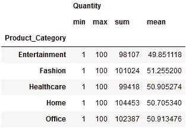

熊猫分组按同一列多重聚合|图片按作者

您将获得关于每组中*数量*的所有所需统计数据。

但是等等，你注意到你在`.aggregate()`中提供的函数列表中的一些东西了吗？？

sum、min、max 等所有函数都是直接编写的，但函数 mean 是以字符串形式编写的，即在单引号中，就像这样`**‘mean’**`

> **但为什么写得像一串呢？？** *🚩*

根据 [pandas](https://pandas.pydata.org/docs/reference/api/pandas.core.groupby.DataFrameGroupBy.aggregate.html) ，传递给`.aggregate()`的函数必须是传递给数据帧或传递给`DataFrame.apply()`时起作用的函数。

简而言之，当你提到`**‘mean’**` ( *加引号*)，`.aggregate()`搜索一个属于`pd.Series`即`**pd.Series.mean()**`的函数`mean`。

然而，如果您提到`**mean**` ( *不带引号*)，`.aggregate()`将在默认 Python 中搜索名为`mean`的函数，该函数不可用，并将抛出`NameError`异常。

此外，使用`.groupby()`您可以在不同的列上应用不同的聚合函数。在这种情况下，您需要向`.aggregate()`传递一个字典，其中*键将是列名*，而*值将是您想要应用的聚合函数*。

例如，假设您想获得每个产品类别的*总订单*和*平均数量*。因此，您将传递给`.aggregate(`的字典将是— `**{‘OrderID’:’count’, ’Quantity’:’mean’}**`

您可以通过简单地如下传递这个字典来获得想要的输出，

```
**function_dictionary =** **{'OrderID':'count','Quantity':'mean'}**
df.groupby("Product_Category")**.aggregate(function_dictionary)**
```

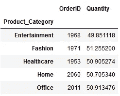

多重聚合|作者图片

这样，您可以根据需要在多个列上应用多个函数。

熊猫`**.groupby()**`和它的`**GroupBy**`对象更加灵活。有一种方法可以通过单个函数`**describe()**`获得按每个组拆分的基本统计摘要。您需要指定一个必需的列，并在其上应用`.describe()`,如下所示

```
df.groupby("Product_Category")[["Quantity"]]**.describe()**
```

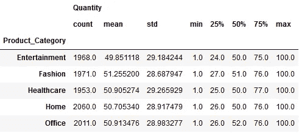

每组的描述性统计|按作者分类的图片

这样，您可以获得每个产品类别中数量的完整描述性统计汇总。如你所见，它包含了单个函数的结果，如`count`、`mean`、`std`、`min`、`max`和`median`。

就是这样！🏆**** 

****我希望你从这篇文章中获得关于熊猫`.groupby()` 及其灵活性的有价值的见解。****

****在现实世界中，您通常会处理大量数据，并需要对不同组的数据进行类似的操作。熊猫`.groupby()`在所有这些场景中都非常灵活和方便。****

> *****有兴趣在媒体上阅读更多故事？？*****

****💡考虑 [**成为**](https://medium.com/@17.rsuraj/membership)**媒体会员，可以无限制的获取**媒体上的故事和每日有趣的媒体文摘。我会得到你的费用的一小部分，没有额外的费用给你。****

****💡请务必 [**注册我的电子邮件列表**](https://medium.com/subscribe/@17.rsuraj) 以免错过另一篇关于数据科学指南、技巧和提示、SQL 和 Python 的文章。****

****💡这里有一个完整的 [**笔记本**](https://github.com/17rsuraj/data-curious/blob/master/TowardsDataScience/pandas_groupby_deep_dive.ipynb) 里面有所有的例子。****

******感谢您的阅读！******